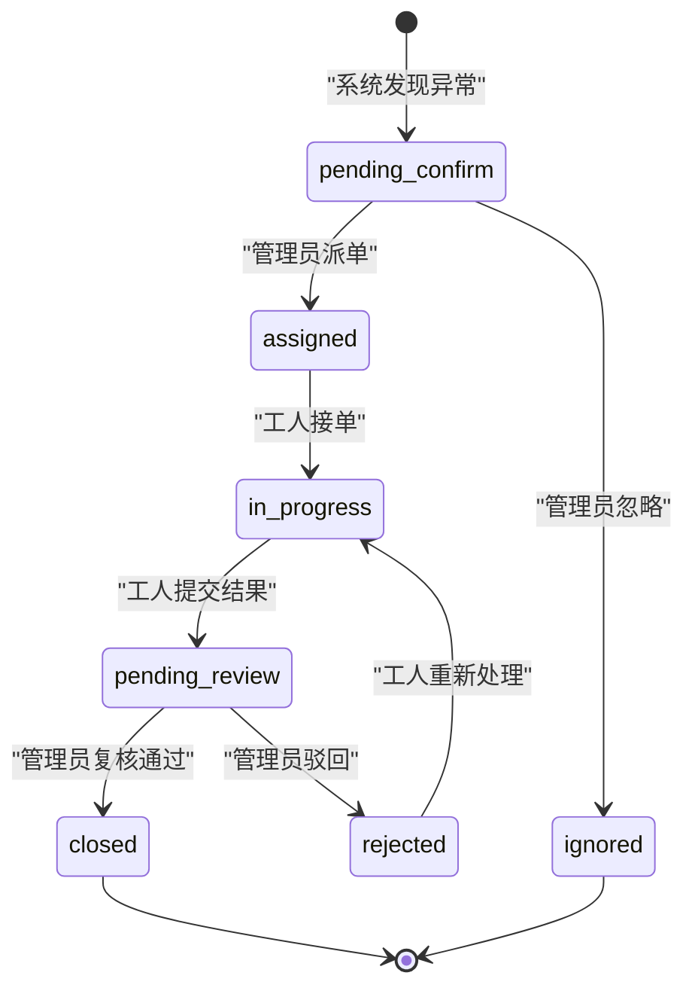

# 业务逻辑闭环开发迭代计划

## 1. 文档目的

当前系统已经具备建筑能耗数据展示、查询统计、异常分析、工单生成、智能问答、运营报告和 MCP 接入能力，但整体体验仍偏向“监测数据看板”。为了支撑 8 分钟系统演示，并让项目更像一个真实业务系统，本计划将后续开发目标明确为：

> 建筑能源异常运维闭环系统：从异常发现、AI 诊断、管理员派单、工人处置、管理员复核到运营报告归档。

本计划用于后续开发排期、团队分工、答辩说明和最终演示脚本整理。

## 2. 当前问题与改造方向

### 2.1 当前系统已有能力

- 能展示建筑、楼层、设备和能耗指标。
- 能查询原始监测数据。
- 能进行时段汇总、COP 计算、异常识别和异常原因统计。
- 能基于异常生成工单。
- 能通过知识库和外部 LLM 辅助问答。
- 能生成运营日报和节能建议。
- 能通过 REST API 和 MCP Server 暴露数据查询与分析能力。

### 2.2 当前业务感不足的原因

- 系统主对象仍是“监测记录”，不是“异常事件”或“运维任务”。
- 工单更像静态记录，缺少清晰的状态流转。
- 用户角色没有区分，管理员和工人看到的内容差异不明显。
- 缺少“谁做了什么、下一步由谁处理”的时间线。
- 运营日报和知识库没有充分承接已关闭工单，闭环归档感不足。

### 2.3 改造方向

将系统主线从：

```text
传感器数据 -> 图表展示 -> 异常列表 -> 工单
```

升级为：

```text
异常发现 -> AI 诊断 -> 管理员确认 -> 派单 -> 工人处理 -> 管理员复核 -> 关闭归档 -> 运营报告
```

## 3. 目标业务闭环


业务闭环的核心价值：

- 让异常不只停留在图表上，而是进入可追踪任务。
- 让不同角色各自承担明确职责。
- 让每个异常从发现到关闭都有记录。
- 让系统最终能输出管理层可阅读的运营报告。

## 4. 角色设计

本项目建议保留两个真实登录角色，另将系统/AI 作为自动能力参与业务流程。

| 角色 | 登录身份 | 核心职责 | 可见范围 |
| --- | --- | --- | --- |
| 管理员 | `admin` | 查看全局风险、确认异常、派单、复核、关闭工单、生成报告 | 全部建筑、全部工单、全部报表 |
| 运维工人 | `worker_ahu`、`worker_chiller` 等 | 查看自己的工单、现场处理、提交结果 | 仅本人被分配的工单 |
| 系统/AI | 非登录角色 | 异常识别、诊断建议、知识库检索、报告生成 | 作为服务能力被页面、REST API、MCP Tools 调用 |

## 5. 核心业务对象

### 5.1 用户 User

建议字段：

| 字段 | 类型 | 说明 |
| --- | --- | --- |
| `user_id` | string | 用户唯一标识 |
| `username` | string | 登录账号 |
| `display_name` | string | 页面展示名 |
| `role` | string | `admin` 或 `worker` |
| `specialty` | string | 工种，如 AHU、CH、CT、FCU，可选 |
| `enabled` | bool | 是否启用 |

### 5.2 异常事件 Anomaly Event

异常事件可从现有异常记录派生，不一定立即落库，但建议在前端和接口层把它作为业务对象展示。

| 字段 | 类型 | 说明 |
| --- | --- | --- |
| `event_id` | string | 异常事件编号，可直接使用 `record_id` |
| `record_id` | string | 关联原始数据记录 |
| `building_id` | string | 建筑编号 |
| `building_name` | string | 建筑名称 |
| `floor_label` | string | 楼层 |
| `zone_name` | string | 区域 |
| `equipment_id` | string | 设备编号 |
| `equipment_type` | string | 设备类型 |
| `timestamp` | string | 异常发生时间 |
| `anomaly_reason` | string | 异常原因 |
| `severity` | string | 风险等级 |
| `diagnosis` | string | AI/规则诊断结论 |
| `recommended_action` | string | 推荐处理动作 |
| `linked_work_order_id` | string | 关联工单编号 |

### 5.3 工单 Work Order

建议在现有工单基础上扩展字段。

| 字段 | 类型 | 说明 |
| --- | --- | --- |
| `work_order_id` | string | 工单编号 |
| `source_record_id` | string | 来源异常记录 |
| `status` | string | 工单状态 |
| `priority` | string | 优先级 |
| `building_name` | string | 建筑 |
| `floor_label` | string | 楼层 |
| `zone_name` | string | 区域 |
| `equipment_id` | string | 设备 |
| `equipment_type` | string | 设备类型 |
| `anomaly_reason` | string | 异常原因 |
| `possible_cause` | string | 可能原因 |
| `recommended_action` | string | 推荐动作 |
| `assignee_id` | string | 被分派工人 |
| `assignee_name` | string | 被分派工人姓名 |
| `created_by` | string | 创建人 |
| `reviewed_by` | string | 复核人 |
| `resolution_note` | string | 工人处理结果 |
| `actual_cause` | string | 工人填写的实际原因 |
| `recovery_confirmed` | bool | 工人是否确认恢复 |
| `review_note` | string | 管理员复核意见 |
| `created_at` | string | 创建时间 |
| `updated_at` | string | 更新时间 |
| `closed_at` | string | 关闭时间 |
| `timeline` | array | 操作时间线 |

### 5.4 时间线 Timeline Event

| 字段 | 类型 | 说明 |
| --- | --- | --- |
| `event_id` | string | 时间线事件编号 |
| `action` | string | 操作类型 |
| `from_status` | string | 原状态 |
| `to_status` | string | 新状态 |
| `operator_id` | string | 操作人 |
| `operator_name` | string | 操作人名称 |
| `note` | string | 操作说明 |
| `created_at` | string | 操作时间 |

## 6. 工单状态机

建议状态如下：

| 状态 | 说明 | 操作人 | 下一步 |
| --- | --- | --- | --- |
| `pending_confirm` 待确认 | 系统识别异常后，等待管理员确认是否派单 | 管理员 | 派单或忽略 |
| `assigned` 已派单 | 管理员已指定工人，但工人尚未接单 | 工人 | 接单 |
| `in_progress` 处理中 | 工人已接单，正在处理 | 工人 | 提交复核 |
| `pending_review` 待复核 | 工人已提交处理结果，等待管理员确认 | 管理员 | 关闭或驳回 |
| `rejected` 已驳回 | 管理员认为处理不充分，退回工人继续处理 | 工人 | 重新处理 |
| `closed` 已关闭 | 管理员确认问题处理完成并归档 | 系统/管理员 | 进入日报和历史案例 |
| `ignored` 已忽略 | 管理员判断无需派单 | 管理员 | 归档为忽略异常 |

状态流转：



## 7. 迭代总览

| 迭代 | 名称 | 核心目标 | 优先级 |
| --- | --- | --- | --- |
| 0 | 准备与基线确认 | 确认当前接口、工单存储和演示主线 | 高 |
| 1 | 登录与角色权限 | 建立管理员/工人视角差异 | 高 |
| 2 | 工单状态机 | 让工单具备完整流转 | 高 |
| 3 | 工人工作台 | 让工人能处理自己的任务 | 高 |
| 4 | 异常事件详情 | 串联异常、AI 诊断和工单 | 高 |
| 5 | 管理员驾驶舱 | 强化全局待办和复核能力 | 中 |
| 6 | 报告归档与问答增强 | 让闭环结果进入日报和知识沉淀 | 中 |
| 7 | 演示打磨与文档更新 | 为 8 分钟演示准备稳定路径 | 高 |

## 8. 迭代 0：准备与基线确认

### 目标

明确当前系统可以复用的能力，避免重复开发。

### 主要任务

- 复核当前 `work_order_store.py` 的字段和持久化方式。
- 复核现有异常分析接口：
  - `/api/v1/analytics/anomalies`
  - `/api/v1/analytics/anomaly-explanations/{record_id}`
  - `/api/v1/analytics/work-orders`
- 确认前端当前工单中心、统计分析页、决策报告页的数据来源。
- 选定演示用的典型异常记录，例如最新或风险较高的 `record_id`。

### 交付物

- 一条固定演示异常记录。
- 一份字段改造清单。
- 一份不破坏原有功能的接口兼容策略。

### 验收标准

- 现有后端测试全部通过。
- 前端构建通过。
- 明确哪些字段需要新增，哪些字段保持兼容。

## 9. 迭代 1：登录与角色权限

### 目标

让系统具备“不同身份看到不同内容”的业务感。

### 推荐演示账号

| 账号 | 密码 | 角色 | 说明 |
| --- | --- | --- | --- |
| `admin` | `admin123` | 管理员 | 全局运营负责人 |
| `worker_ahu` | `worker123` | 运维工人 | 空调机组巡检工 |
| `worker_chiller` | `worker123` | 运维工人 | 制冷机房值班工 |

### 后端任务

- 新增 `backend/app/api/routes/auth.py`。
- 新增简单用户配置，可以先用代码常量或 JSON 文件，不必立即接数据库。
- 新增接口：
  - `POST /api/v1/auth/login`
  - `GET /api/v1/auth/me`
- 登录返回：
  - `access_token` 或演示用 session token
  - `user_id`
  - `display_name`
  - `role`
  - `specialty`
- 为后续工单接口预留当前用户参数。

### 前端任务

- 新增登录页。
- 登录成功后保存当前用户。
- 顶部显示当前用户、角色和退出按钮。
- 根据角色控制默认首页：
  - 管理员进入总览/驾驶舱。
  - 工人进入“我的工单”。
- 根据角色隐藏操作按钮：
  - 工人不能创建、分派、关闭工单。
  - 管理员不能填写工人的现场处理表单。

### 测试任务

- 管理员登录成功。
- 工人登录成功。
- 错误密码返回失败。
- 未登录时不能进入主页面。

### 验收标准

- 两类角色登录后看到不同导航或默认页面。
- 工人无法看到全局管理类操作。
- 管理员能看到全部业务模块。

## 10. 迭代 2：工单状态机

### 目标

让工单从“静态任务”升级为可流转、可追踪、可复核的业务流程。

### 后端任务

- 扩展工单数据模型。
- 新增或调整接口：
  - `POST /api/v1/work-orders`
  - `PATCH /api/v1/work-orders/{work_order_id}/assign`
  - `PATCH /api/v1/work-orders/{work_order_id}/accept`
  - `PATCH /api/v1/work-orders/{work_order_id}/submit`
  - `PATCH /api/v1/work-orders/{work_order_id}/review`
  - `PATCH /api/v1/work-orders/{work_order_id}/ignore`
- 每次状态变化写入 `timeline`。
- 保留旧工单字段，避免前端已有页面直接崩溃。

### 前端任务

- 工单中心按状态分栏或筛选：
  - 待确认
  - 已派单
  - 处理中
  - 待复核
  - 已关闭
- 工单卡片显示：
  - 状态
  - 优先级
  - 设备位置
  - 当前处理人
  - 下一步操作
- 管理员可以：
  - 创建工单
  - 指派工人
  - 驳回
  - 关闭
  - 忽略
- 工人可以：
  - 接单
  - 提交处理结果

### 测试任务

- 从异常创建工单后状态为 `pending_confirm` 或直接进入 `assigned`。
- 管理员派单后状态为 `assigned`。
- 工人接单后状态为 `in_progress`。
- 工人提交后状态为 `pending_review`。
- 管理员通过后状态为 `closed`。
- 管理员驳回后状态为 `rejected`。
- 时间线记录完整。

### 验收标准

- 一条工单可以完整流转到关闭。
- 每次操作都有时间线记录。
- 错误角色不能执行不属于自己的操作。

## 11. 迭代 3：工人工作台

### 目标

让运维工人的视角成立，使其只关注“我需要处理什么”。

### 页面设计

工人首页建议包含：

- 我的待接单工单。
- 我的处理中工单。
- 我的待复核工单。
- 今日完成数量。
- 高优先级提醒。

### 工单详情中工人需要看到

- 设备位置：建筑、楼层、区域、设备编号。
- 异常原因。
- AI 推荐处理动作。
- 关联指标：电耗、COP、设备状态。
- 管理员备注。
- 处理表单。

### 工人处理表单

字段建议：

- `actual_cause`：现场确认原因。
- `resolution_note`：处理措施。
- `recovery_confirmed`：是否确认恢复。
- `parts_used`：是否更换部件，可选。
- `safety_note`：安全备注，可选。

### 验收标准

- 工人只能看到分配给自己的工单。
- 工人提交处理结果后，工单进入 `pending_review`。
- 管理员能看到工人的处理记录。

## 12. 迭代 4：异常事件详情页

### 目标

把“异常记录、AI 解释、设备信息、工单、处理时间线”集中到一个业务页面中。

### 页面入口

- 统计分析页异常列表。
- 总览页风险楼层。
- 工单中心。
- 智能问答引用的异常记录。

### 页面内容

- 异常基础信息。
- 触发规则。
- 指标对比：
  - 当前电耗
  - 建筑均值
  - 楼层均值
  - 动态阈值
  - 平均 COP
- AI/规则诊断结论。
- 推荐处置动作。
- 关联工单。
- 时间线。

### 后端任务

- 可以先复用 `build_anomaly_explanation`。
- 新增聚合接口可选：
  - `GET /api/v1/anomaly-events/{record_id}`
- 返回异常解释、设备摘要、关联工单和时间线。

### 验收标准

- 任何一条异常都能打开详情。
- 管理员能从详情页生成或查看工单。
- 工人能从工单回看异常原因。

## 13. 迭代 5：管理员驾驶舱

### 目标

让管理员像真实能源运营负责人一样，一登录就知道今天要处理什么。

### 推荐指标

- 今日新增异常数。
- 待确认异常数。
- 已派单工单数。
- 处理中工单数。
- 待复核工单数。
- 已关闭工单数。
- 超时工单数。
- 高风险建筑。

### 推荐组件

- 管理员待办卡片。
- 工单状态漏斗。
- 高风险建筑排行。
- 待复核列表。
- 超时任务提醒。

### 后端任务

- 新增管理员工作台接口可选：
  - `GET /api/v1/admin/dashboard`
- 也可以前端组合现有接口先实现。

### 验收标准

- 管理员能从首页直接进入待处理事项。
- 待复核、高优先级和超时工单明显突出。
- 演示时能自然从“风险发现”进入“派单复核”。

## 14. 迭代 6：报告归档与问答增强

### 目标

让业务闭环产生可汇报的结果。

### 报告增强内容

运营日报中加入：

- 今日新增异常。
- 今日派单数量。
- 今日关闭工单数量。
- 待复核工单。
- 未关闭高风险项。
- 典型处置案例。
- 节能优化建议。
- 明日重点巡检建议。

### 历史案例沉淀

已关闭工单可作为历史案例：

- 设备类型。
- 异常原因。
- 实际原因。
- 处理措施。
- 处理耗时。
- 是否恢复。

### 智能问答增强问题

系统应能回答：

- 今天还有哪些工单没处理？
- 哪个建筑待复核工单最多？
- 最近一次 AHU 异常是怎么处理的？
- 哪些异常已经关闭？
- 哪些工人当前任务最多？

### MCP 对应增强

可扩展 MCP Tools：

- `get_my_work_orders`
- `get_work_order_timeline`
- `get_admin_dashboard`
- `get_closed_case_summary`

### 验收标准

- 已关闭工单能进入运营日报。
- 智能问答能引用工单状态和历史处理结果。
- MCP 能调用新的闭环数据工具。

## 15. 迭代 7：演示打磨与文档更新

### 目标

围绕 8 分钟演示形成稳定、连贯、可复现的业务故事。

### 演示主线

```text
管理员登录
-> 总览发现图书信息楼高风险
-> 下钻查看异常设备
-> AI 给出异常原因和处置建议
-> 管理员生成工单并派给工人
-> 工人登录，查看自己的工单
-> 工人填写处理结果并提交复核
-> 管理员复核并关闭工单
-> 系统生成今日运营报告
```

### 8 分钟节奏建议

| 时间 | 内容 | 重点 |
| --- | --- | --- |
| 0:00-0:40 | 项目背景 | 建筑能源运维痛点 |
| 0:40-1:30 | 管理员登录和总览 | 角色视角、全局风险 |
| 1:30-2:30 | 异常下钻 | 从建筑到楼层到设备 |
| 2:30-3:20 | AI 诊断 | 规则解释、原因、建议 |
| 3:20-4:20 | 管理员派单 | 工单生成、指派工人 |
| 4:20-5:20 | 工人处理 | 我的工单、提交结果 |
| 5:20-6:20 | 管理员复核 | 驳回或关闭 |
| 6:20-7:20 | 报告归档 | 日报、闭环成果 |
| 7:20-8:00 | MCP 与总结 | REST + MCP 双接口，后续扩展 |

### 文档更新范围

- `docs/01-requirements.md`
- `docs/02-technical-solution.md`
- `docs/03-user-manual.md`
- `docs/05-demo-script.md`
- `docs/06-api-contract.md`
- `docs/08-integration-checklist.md`
- `docs/09-testing-plan.md`
- `docs/15-project-acceptance-report.md`
- `docs/16-mcp-integration.md`

### 验收标准

- 演示路径可以在 8 分钟内走完。
- 文档中的角色、状态、接口和页面与实际系统一致。
- 后端测试、前端构建和 MCP 测试全部通过。

## 16. 推荐最小可交付版本

如果开发时间有限，建议先实现最小闭环，而不是一次做完所有增强。

### 必做

1. 登录与角色视图。
2. 工单状态流转。
3. 工人“我的工单”。
4. 工单时间线。
5. 管理员复核关闭。
6. 运营日报显示关闭工单和未完成风险。

### 可后置

1. 完整异常事件详情页。
2. 复杂权限校验。
3. 超时工单规则。
4. 历史案例库。
5. MCP 新增工单闭环工具。
6. 更细的工人绩效统计。

## 17. 风险与控制

| 风险 | 影响 | 控制措施 |
| --- | --- | --- |
| 登录权限做得过重 | 开发时间被基础设施消耗 | 采用演示级账号和简单 token，不接复杂认证 |
| 工单状态改动破坏现有页面 | 影响演示稳定性 | 保留旧字段，新增字段向后兼容 |
| 前端页面过多导致演示分散 | 8 分钟讲不完 | 坚持一条异常闭环主线 |
| AI 调用不稳定 | 演示中断 | 保留本地规则诊断和知识库引用 |
| 工单数据污染演示 | 状态不一致 | 准备演示前置数据或重置脚本 |
| 权限校验不足 | 业务可信度不足 | 至少在前端视图和后端关键接口上校验角色 |

## 18. 建议开发顺序

推荐按以下顺序实施：

1. 扩展工单字段和状态机。
2. 增加演示账号与登录页。
3. 增加工人工作台。
4. 增加工单详情时间线。
5. 增加管理员复核操作。
6. 将运营日报接入工单闭环结果。
7. 补异常事件详情页。
8. 更新 MCP、API 和用户手册文档。
9. 固化 8 分钟演示数据和脚本。

## 19. 最终验收标准

完成上述核心迭代后，系统应满足以下验收点：

- 管理员和工人能分别登录。
- 不同角色看到的页面和操作不同。
- 管理员能从异常生成工单并派发。
- 工人能看到自己的工单并提交处理结果。
- 管理员能复核并关闭工单。
- 工单详情能展示完整时间线。
- 运营日报能统计异常、工单和闭环结果。
- 智能问答能解释异常并引用知识库或工单信息。
- MCP Server 能继续提供数据查询和分析能力，并可按需要扩展工单闭环工具。
- 8 分钟演示能围绕一条异常完成完整业务故事。

## 20. 结论

后续开发的重点不应再单纯增加图表，而应围绕“异常事件”和“工单状态流转”建立业务生命周期。只要实现管理员与工人两个角色、工单状态机、时间线和报告归档，当前系统就能从监测看板升级为具备真实业务逻辑的建筑能源异常运维闭环系统。
