# 软件需求规格说明书

Software Requirements Specification

项目名称：基于大模型的建筑能源智能管理与运维优化系统

版本：v3.0（严格参考“大型电信运营商智慧合同管理系统-SRS”结构重构版）

编写日期：2026年6月

更新说明（v3.0）：

- 参考 `final_docs/ref/SRS/大型电信运营商智慧合同管理系统-SRS.pdf` 的 9 章制结构重构本文档。
- 将原功能需求表重构为“4.0 系统用例图 + 分组用例规约”的形式。
- 将涉众分析、MoSCoW 优先级、外部接口、非功能需求、数据实体、追踪矩阵和附录改为与参考 SRS 对齐的章节顺序。
- 将数据需求改为“数据实体、完整性约束、数据量预估”的组织方式。
- 将追踪矩阵改为“需求与用例及设计实现追踪、题目要求对应、系统创新点”的组织方式。

## 目录

1. 引言
2. 综合描述
3. 需求获取与分析方法
4. 功能需求
5. 外部接口需求
6. 非功能需求
7. 数据需求
8. 需求追踪矩阵
9. 附录

---

## 1. 引言

### 1.1 编写目的

本软件需求规格说明书（Software Requirements Specification，SRS）旨在明确“基于大模型的建筑能源智能管理与运维优化系统”的功能需求、性能需求、数据需求、接口需求和约束条件，为后续系统设计、开发、测试、答辩演示和验收评审提供依据。

本文档参考 IEEE 830-1998 的 SRS 编写思路，并严格参考 `final_docs/ref/SRS/大型电信运营商智慧合同管理系统-SRS.pdf` 的内容结构安排。预期读者包括：

- 项目开发团队成员
- 项目管理和答辩人员
- 课程指导教师
- 项目评审人员
- 后续维护人员

### 1.2 项目背景

#### 1.2.1 项目来源

本项目为软件工程课程项目。系统已形成可运行代码，覆盖 FastAPI 后端、Vue 前端、MCP Server、样例能耗数据、知识库、工单闭环、时间沙盘、预算管理、ROI 分析和智能问答等模块。

#### 1.2.2 领域背景

建筑能源管理涉及电耗、水耗、暖通设备、制冷量、楼层空间、人员流动和运行状态等多类数据。传统能源管理通常依赖静态报表或人工巡检，难以及时定位异常设备、量化损失、协调现场处置并评估处置后的长期收益。

本项目聚焦校园或园区建筑能源运营场景，围绕以下对象展开：

- 建筑能耗记录：电耗、水耗、暖通电耗、制冷量、环境温度、人员数量等。
- 设备运行状态：空调机组、制冷机组、末端设备等源设备与派生运维设备。
- 异常事件：COP 偏低、夜间负荷偏高、设备状态异常、电耗高于基线等。
- 运维工单：管理员派单、工人接单、现场处置、管理员复核、设备级修复。
- 经济决策：异常浪费、预算执行、ROI 改造、运营报告。
- 智能接入：本地知识库问答、外部大模型增强、MCP 工具调用。

#### 1.2.3 系统定位与业务视角

本系统以建筑能源运营方作为核心使用方。系统不是单纯的数据看板，而是面向能源运营闭环的管理平台：它从样例能耗数据出发，识别异常、解释原因、生成工单、推动现场处理、复核关闭、登记维修干预，并将处置结果反馈到预算、ROI 和运营报告中。

系统业务视角强调三点：

1. 管理员需要知道“哪里异常、为什么异常、损失多少、该先处理什么”。
2. 现场工人需要知道“我负责哪张工单、如何处理、何时提交复核”。
3. AI 客户端和智能问答需要基于真实业务上下文回答，而不是脱离数据生成泛化文本。

#### 1.2.4 行业痛点

1. 能源数据多维但割裂，建筑、楼层、设备和时间维度难以统一分析。
2. 异常识别容易停留在数值告警，缺少可解释原因、风险等级和经济损失。
3. 现场运维与管理看板脱节，派单、接单、处理、复核无法形成可追溯闭环。
4. 预算和改造决策缺少与真实异常、工单结果联动的依据。
5. 智能问答容易出现事实漂移，难以保证回答来自真实数据、知识库和工单上下文。
6. 课程演示需要稳定可复现的业务场景，普通实时系统难以展示“处理影响未来”的因果链路。

#### 1.2.5 项目目标

开发一套面向建筑能源运营的智能管理与运维优化系统，重点实现：

- 能源数据统一加载、筛选、分析和导出。
- 异常识别、风险评分、原因解释和经济损失量化。
- 管理员与工人分权的工单闭环。
- 时间沙盘和反事实分析，用于展示处理行为对未来异常的影响。
- 预算执行、年度 KPI、ROI 改造和运营报告。
- 基于本地知识库、实时业务上下文和可选外部大模型的可信问答。
- MCP Server 对外暴露数据、分析、工单、报告和问答工具。

#### 1.2.6 项目范围与排除

纳入范围：

1. 样例建筑能耗 CSV 数据、数据字典和数据质量约束。
2. Web 端管理员、工人和 AI 助手相关页面。
3. FastAPI REST 接口和 MCP Server 工具。
4. 异常分析、风险评分、经济损失估算、优化建议。
5. 工单创建、派单、接单、提交、复核、忽略和归档。
6. 时间沙盘、定时故障、维修干预和反事实比较。
7. 预算管理、ROI 改造分析和运营报告。
8. 可选 MySQL 持久化和默认 CSV/JSON 离线模式。

排除范围：

1. 真实电表、楼宇自控系统、BACnet/Modbus 网关或传感器接入。
2. 真实企业级身份认证、组织审批、短信邮件通知和生产审计。
3. 真实财务支付、能源结算和法定审计用途。
4. 大规模机器学习模型训练、在线学习或生产级预测平台。
5. 移动端 App、多租户 SaaS 和生产级高可用集群。

### 1.3 术语定义和缩略语

#### 1.3.1 通用软件术语

| 术语/缩略语 | 定义 |
| --- | --- |
| SRS | Software Requirements Specification，软件需求规格说明书。 |
| REST | Representational State Transfer，本系统后端主要 HTTP API 风格。 |
| MCP | Model Context Protocol，用于向 AI 客户端暴露工具和资源。 |
| RBAC | Role-Based Access Control，基于角色的访问控制。 |
| LLM | Large Language Model，大语言模型。 |
| RAG | Retrieval-Augmented Generation，检索增强生成。 |
| JSON | JavaScript Object Notation，本系统默认运行期状态存储格式之一。 |
| CSV | Comma-Separated Values，本系统样例能耗数据默认格式。 |

#### 1.3.2 建筑能源与运维专业术语

| 术语/缩略语 | 定义 | 应用场景 |
| --- | --- | --- |
| HVAC | Heating, Ventilation and Air Conditioning，暖通空调系统。 | 能耗统计、异常诊断 |
| COP | Coefficient of Performance，制冷性能系数。 | 设备效率评价 |
| SLA | Service Level Agreement，服务响应时限。 | 工单优先级和风险分级 |
| 工单闭环 | 从异常发现到派单、处理、复核、关闭和反馈的完整流程。 | 运维管理 |
| 时间沙盘 | 以业务日期推进方式模拟未来数据可见性和维修干预效果。 | 演示与因果验证 |
| ROI | Return on Investment，投资回报率。 | 设备改造分析 |
| NPV | Net Present Value，净现值。 | ROI 经济评价 |
| IRR | Internal Rate of Return，内部收益率。 | ROI 经济评价 |
| EAA | Equivalent Annual Annuity，等额年金。 | 多方案比较 |
| kgCO2 | 千克二氧化碳排放量。 | 碳排估算 |

#### 1.3.3 系统业务术语

| 术语 | 定义 |
| --- | --- |
| 能源记录 | 某建筑在某时间点的能耗、水耗、冷量、环境和人员数据记录。 |
| 异常事件 | 由异常检测规则识别出的高风险记录或设备问题。 |
| 维修干预 | 工单复核关闭后登记的设备级修复事件。 |
| 业务日期 | 时间沙盘中用于控制数据可见范围的日期。 |
| 可信问答 | 基于真实业务数据、知识库引用和事实校验的问答能力。 |
| MCP Tool | MCP Server 暴露给 AI 客户端的可调用工具。 |

### 1.4 参考资料

#### 1.4.1 课程相关文档

1. 课程项目题目与原始需求材料：`docs/00-original-project-description.pdf`
2. 项目需求文档：`docs/01-requirements.md`
3. 技术方案文档：`docs/02-technical-solution.md`
4. API 契约文档：`docs/06-api-contract.md`
5. 系统设计说明：`docs/18-SDS-software-design-description.md`
6. 业务闭环验收：`docs/23-business-logic-closure-acceptance.md`
7. 时间沙盘与因果升级：`docs/24-time-machine-and-causal-upgrade.md`
8. 数据质量验收规范：`docs/29-data-quality-acceptance-spec.md`
9. 期末报告参考：`docs/30-system-reference-for-final-reports.md`

#### 1.4.2 标准与方法参考

1. IEEE 830-1998: IEEE Recommended Practice for Software Requirements Specifications
2. GB/T 9385-2008: 软件工程 软件生存周期过程
3. MoSCoW 需求优先级划分方法
4. 用例驱动需求分析方法

#### 1.4.3 技术参考资料

1. FastAPI 后端项目结构：`backend/app/`
2. Vue 前端项目结构：`frontend/src/`
3. MCP Server 实现：`backend/app/mcp_server.py`
4. 样例数据与数据字典：`data/samples/`、`data/dictionaries/`
5. 本地知识库：`knowledge_base/`

---

## 2. 综合描述

### 2.1 产品概述

本系统是一个面向建筑能源管理和运维优化的课程级智能平台。系统通过统一数据服务、异常分析服务、工单服务、沙盘服务、预算和 ROI 服务、问答服务以及 MCP 服务，将建筑能源运营中的“看见问题、解释问题、处理问题、验证结果、辅助决策”串联起来。

#### 2.1.1 核心设计理念

| 设计理念 | 说明 |
| --- | --- |
| 数据作为事实基线 | 以 CSV 样例数据和运行期状态作为所有分析、问答和报告的事实基础。 |
| 异常必须可解释 | 异常不仅给出告警，还必须给出触发规则、指标证据、原因、建议和损失。 |
| 运维必须闭环 | 管理员和工人的职责分离，保证派单、处理、复核和关闭可追溯。 |
| 演示必须可复现 | 通过时间沙盘和重置机制保证答辩演示稳定。 |
| AI 必须接地 | 智能问答必须引用知识库或实时业务上下文，并在外部模型失败时回退。 |

#### 2.1.2 核心价值主张

| 价值主张 | 对应能力 |
| --- | --- |
| 提高异常定位效率 | 总览、统计分析、三维楼层风险、设备摘要。 |
| 提高运维执行效率 | 自动队列、资源约束派单、工单状态机。 |
| 提高决策可信度 | 风险评分、损失估算、预算执行、ROI 分析。 |
| 提高演示说服力 | 时间沙盘、反事实比较、运营报告。 |
| 提高智能体可接入性 | MCP Tools、MCP Resources、可信问答。 |

### 2.2 产品功能架构

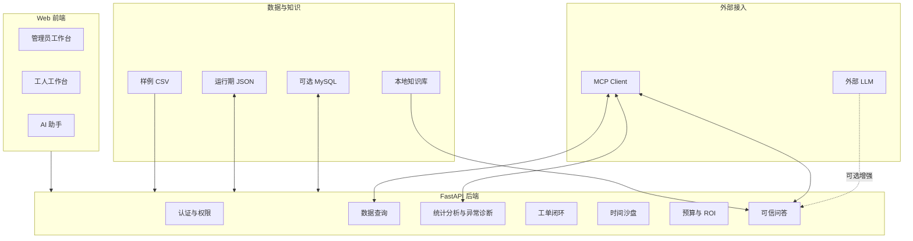

| 功能域 | 主要能力 |
| --- | --- |
| 基础设施与组织管理 | 登录、角色权限、演示账号、数据配置、重置演示。 |
| 建筑能源运维生命周期管理 | 总览、查询、异常诊断、派单、处理、复核、沙盘验证。 |
| 智能决策与接入功能 | 预算、ROI、运营报告、可信问答、MCP 工具调用。 |
| 支撑功能 | 项目检查、启动脚本、测试基线、配置管理。 |

#### 2.2.1 分层功能拆解

参考文档在产品功能架构中采用“层级 + 子模块 + 操作项”的树状描述方式。本文档将本系统拆分为数据与知识层、核心业务逻辑层、智能接入层和前端展示层，各层功能如下。

1. 数据与知识层

| 子模块 | 具体功能点 |
| --- | --- |
| 样例能耗数据管理 | 加载 CSV；校验字段；统计记录数、建筑数和时间范围；按建筑、楼层、时间过滤；导出筛选 CSV。 |
| 数据字典管理 | 维护字段名、类型、单位、示例值和说明；支撑数据需求和接口字段解释。 |
| 运行期状态管理 | 保存工单、工单时间线、预算、沙盘状态和维修干预；支持演示重置。 |
| 可选 MySQL 持久化 | 在配置 `DATABASE_URL` 时持久化能耗读数、工单、预算和沙盘状态；未配置时回退 CSV/JSON。 |
| 本地知识库 | 管理 FAQ、术语、手册和项目知识；支撑可信问答引用。 |

2. 核心业务逻辑层

| 子模块 | 具体功能点 |
| --- | --- |
| 认证与权限服务 | 登录；token 校验；当前用户查询；用户列表；管理员/工人权限分离；工单归属校验。 |
| 数据服务 | 总览 KPI；建筑列表；数据元信息；记录查询；CSV 导出；沙盘业务日期过滤。 |
| 统计分析服务 | 时间汇总；建筑对比；COP 排名；异常识别；异常原因分布；楼层汇总；楼层台账；设备摘要；优化建议。 |
| 风险与经济量化 | 风险分计算；严重度和 SLA 判定；浪费电量、费用、碳排和可回收金额估算。 |
| 工单闭环服务 | 创建工单；自动确认队列；派单；重新派单；接单；提交复核；复核关闭；驳回；忽略；时间线记录；设备级去重；工人忙闲锁。 |
| 时间沙盘服务 | 启动沙盘；推进业务日期；重置沙盘；隐藏未来数据；应用定时故障；登记维修干预；反事实对照。 |
| 预算服务 | 生成月度预算；保存预算；计算执行率、预测执行率、预算风险和年度 KPI；汇总闭环改善。 |
| ROI 与决策服务 | 设备能效审计；ROI 分析；NPV/IRR/EAA/动态回收期计算；多方案比较；派单优先级；资源约束派单；运营报告。 |

3. 智能接入层

| 子模块 | 具体功能点 |
| --- | --- |
| 可信问答服务 | 意图识别；实时业务上下文注入；知识库检索；引用生成；后续问题建议；事实校验回退。 |
| 外部大模型适配 | 读取模型供应商配置；调用 OpenAI-compatible API；处理超时和失败；隐藏 API Key。 |
| MCP Tools | 暴露数据元信息、建筑清单、记录查询、总览、统计分析、异常解释、工单、报告和问答工具。 |
| MCP Resources | 暴露数据集元信息、建筑清单、运营报告和知识库入口。 |

4. 前端展示层

| 子模块 | 具体功能点 |
| --- | --- |
| 登录与导航 | 演示账号登录；角色化导航；错误提示；退出登录。 |
| 管理员工作台 | 总览 KPI；沙盘控制；三维楼层风险；统计分析；工单中心；预算管理；ROI 分析；决策报告。 |
| 工人工作台 | 本人工单列表；工单详情；接单；现场原因填写；处理结果填写；附件上传；提交复核。 |
| AI 助手面板 | 问题输入；回答展示；引用来源；来源标签；后续问题；外部模型增强状态。 |
| 演示与验收入口 | 一键重置演示；项目检查提示；关键演示路径支撑。 |

### 2.3 运维闭环流程设计原则

#### 2.3.1 流程模板与规则引擎模式

系统采用“异常规则 + 角色权限 + 工单状态机”的流程模式。异常分析服务负责识别异常和风险，工单服务负责执行状态流转，权限服务负责限制管理员与工人的操作边界，沙盘服务负责登记维修干预并反馈未来数据。

#### 2.3.2 流程选择与优先级逻辑

系统根据风险分、经济损失、SLA、设备类型和工人专业方向生成派单建议：

1. 风险分越高，派单优先级越高。
2. 高风险异常优先进入自动确认队列。
3. 同一设备未关闭工单只保留一张，避免重复派单。
4. 工人处于已派单或处理中状态时视为忙碌，不再分配新工单。
5. 设备类型与工人专业方向应匹配，如空调、制冷和末端设备分别对应不同工人账号。

#### 2.3.3 预设流程模板

| 模板 | 适用场景 | 默认处理链路 |
| --- | --- | --- |
| 高风险设备异常流程 | 风险分大于等于 70 或 SLA 8h。 | 管理员立即派单 -> 工人接单处理 -> 管理员复核关闭 -> 沙盘登记干预。 |
| 中风险能效异常流程 | 风险分 45 至 69 或 COP 明显偏低。 | 管理员确认 -> 资源约束派单 -> 工人处理 -> 复核。 |
| 低风险观察流程 | 风险分低于 45 或需继续观察。 | 管理员忽略或暂缓 -> 报告记录 -> 后续统计复查。 |
| 经济改造评估流程 | 设备反复异常或预算风险较高。 | 生成 ROI 候选 -> 分析 NPV/IRR/EAA -> 输出决策报告。 |

#### 2.3.4 流程标准化的必要性

标准化流程可以保证课程演示中每次操作都能触发一致结果，也能保证异常、工单、预算、ROI 和问答使用同一套事实口径。没有标准化状态机时，工单关闭无法可靠反馈到沙盘和预算；没有标准化权限时，管理员和工人的职责边界容易混乱；没有标准化数据口径时，AI 问答会缺少事实约束。

### 2.4 典型应用场景

#### 2.4.1 场景一：高风险空调设备异常快速派单

管理员登录系统后进入总览页，发现某建筑某楼层风险颜色升高。管理员点击三维楼层风险视图进入统计分析，查看异常解释，确认该异常由设备状态异常和 COP 偏低共同触发。系统估算浪费电量、费用和碳排，并推荐对口空调工人。管理员创建工单并派单，工人登录“我的工单”处理后提交复核，管理员复核关闭。

#### 2.4.2 场景二：关闭工单后时间沙盘验证未来改善

管理员启动时间沙盘，业务日期定位到样例数据中后期。系统只展示当前日期及以前数据。管理员关闭某设备工单后推进业务日期，系统根据维修干预抑制该设备未来异常，未维修设备仍按定时故障和原始数据演化。该场景用于展示“处理会改变未来”的业务因果。

#### 2.4.3 场景三：预算超支与 ROI 改造辅助决策

管理员在预算管理中查看某建筑月度预算执行率和年度 KPI，发现预算风险偏高。系统结合已关闭工单的预计节省和反复异常设备生成 ROI 候选。管理员选择设备改造方案后，系统输出 NPV、IRR、EAA、动态回收期和方案比较，并在运营报告和 AI 助手中解释建议依据。

### 2.5 用户特征

| 用户类型 | 典型账号 | 技术背景 | 主要关注点 |
| --- | --- | --- | --- |
| 能源运营管理员 | `admin` | 熟悉能源运营和数据看板。 | 风险态势、派单决策、预算和报告。 |
| 空调工人 | `worker_ahu` | 熟悉空调设备现场处置。 | 本人任务、设备位置、处理建议。 |
| 制冷工人 | `worker_chiller` | 熟悉制冷机组和冷量系统。 | 制冷设备异常与处理记录。 |
| 末端工人 | `worker_fcu` | 熟悉末端设备和楼层现场。 | 末端设备任务和复核反馈。 |
| AI 客户端用户 | MCP Client | 熟悉智能体或工具调用。 | 通过 MCP 获取数据、异常、工单和报告。 |
| 维护人员 | 无固定账号 | 熟悉项目代码和配置。 | 数据、知识库、环境变量和测试基线。 |

### 2.6 运行环境

#### 2.6.1 客户端环境

| 环境项 | 要求 |
| --- | --- |
| Web 浏览器 | 支持现代 JavaScript 和 WebGL 的浏览器。 |
| 分辨率 | 桌面演示优先，页面应支持常见笔记本屏幕。 |
| AI 客户端 | 支持 MCP stdio 或 streamable-http 的客户端。 |

#### 2.6.2 服务端环境

| 环境项 | 要求 |
| --- | --- |
| 后端运行时 | Python 虚拟环境，运行 FastAPI 服务。 |
| 前端运行时 | Node.js 与 Vite 构建环境。 |
| 默认数据 | `data/samples/energy_records.csv` 和 `data/dictionaries/`。 |
| 默认持久化 | JSON 运行期文件。 |
| 可选持久化 | MySQL，配置 `DATABASE_URL` 后启用。 |
| 可选模型 | OpenAI-compatible 外部 LLM，配置环境变量后启用。 |

### 2.7 设计和实现约束

1. 系统必须在未配置外部 LLM、MySQL 和真实 `.env` 的情况下仍可运行。
2. 前后端和 MCP 应复用同一套服务层逻辑，避免业务规则分叉。
3. 样例数据、知识库和运行期状态必须保持可重置，不能污染源码提交。
4. 工单状态流转必须由后端校验，前端禁用按钮不能替代权限检查。
5. 外部模型不可作为事实来源，回答必须经过业务上下文约束和回退机制。
6. 课程演示优先于生产部署，不要求生产级高可用和真实传感器接入。

### 2.8 假设和依赖

#### 2.8.1 假设

1. 当前样例 CSV 数据可代表课程演示所需的建筑能源业务场景。
2. 管理员和工人演示账号足以覆盖角色权限验收。
3. 时间沙盘的业务日期可用于模拟未来可见性和维修干预效果。
4. 经济参数采用项目文档中定义的课程演示口径，不用于真实财务结算。

#### 2.8.2 依赖

1. 后端依赖 Python、FastAPI、pandas、pytest 等运行与测试能力。
2. 前端依赖 Vue、Vite、图表组件和三维渲染组件。
3. MCP 能力依赖 `backend/app/mcp_server.py` 和启动脚本。
4. 可选外部 LLM 依赖环境变量和网络可用性。
5. 可选 MySQL 持久化依赖数据库连接和表结构初始化。

---

## 3. 需求获取与分析方法

### 3.1 需求获取方法

#### 3.1.1 文档分析法

通过分析课程题目、项目 README、`docs/` 目录下的需求、设计、接口、经济评价、业务闭环、时间沙盘、ROI、数据质量和答辩材料，提取系统功能范围、业务规则和验收口径。

关键输入包括：

| 文档类型 | 代表文件 | 提取内容 |
| --- | --- | --- |
| 项目需求 | `docs/01-requirements.md` | 核心业务目标和功能范围。 |
| 技术方案 | `docs/02-technical-solution.md` | 架构、模块和运行方式。 |
| API 契约 | `docs/06-api-contract.md` | REST 接口和数据结构。 |
| 系统设计 | `docs/18-SDS-software-design-description.md` | 服务层、数据层和前端结构。 |
| 闭环验收 | `docs/23-business-logic-closure-acceptance.md` | 工单闭环、角色边界和验收链路。 |
| 沙盘与 ROI | `docs/24-time-machine-and-causal-upgrade.md`、`docs/28-roi-retrofit-methodology-redesign.md` | 沙盘因果、预算和经济评价口径。 |

需求溯源映射如下：

| 题目/文档关键要求 | 来源 | 需求ID | 需求陈述 |
| --- | --- | --- | --- |
| 系统应围绕建筑能源管理提供数据采集、展示和分析能力。 | 课程题目、`docs/01-requirements.md` | FR-001、BR-120 | 系统应支持能耗数据加载、建筑/楼层/时间筛选、总览 KPI、记录查询和 CSV 导出。 |
| 系统应识别能耗异常并给出可解释分析。 | `docs/01-requirements.md`、`docs/29-data-quality-acceptance-spec.md` | FR-002、BR-130 | 系统应生成异常列表、异常原因、触发规则、风险分、损失估算和优化建议。 |
| 系统应体现运维闭环，而不是仅展示告警。 | `docs/23-business-logic-closure-acceptance.md` | FR-003、BR-140 至 BR-163 | 系统应支持管理员派单、工人处理、管理员复核、设备级去重、工人忙闲锁和工单时间线。 |
| 系统应展示处理动作对未来运行状态的影响。 | `docs/24-time-machine-and-causal-upgrade.md` | FR-004、BR-170 至 BR-173 | 系统应提供时间沙盘、业务日期推进、未来数据隐藏、维修干预和反事实分析。 |
| 系统应提供预算、ROI 和运营决策支持。 | `docs/19-SEE-software-economic-evaluation.md`、`docs/28-roi-retrofit-methodology-redesign.md` | FR-005、BR-180 至 BR-193 | 系统应计算预算执行、年度 KPI、ROI 指标、多方案比较和运营报告。 |
| 系统应利用大模型或智能问答提升能源管理能力。 | 课程题目、`docs/30-system-reference-for-final-reports.md` | FR-006、BR-200 至 BR-203 | 系统应基于本地知识库、实时业务上下文和可选外部 LLM 提供可信问答。 |
| 系统应能被 AI 客户端或智能体调用。 | `docs/16-mcp-integration.md`、`backend/app/mcp_server.py` | FR-007、BR-210 至 BR-213 | 系统应通过 MCP 暴露数据、分析、工单、报告和问答工具。 |
| 项目应可运行、可检查、可验收。 | `README.md`、`scripts/`、`backend/tests/` | FR-008、BR-220 至 BR-223 | 系统应提供启动脚本、检查脚本、测试基线、前端构建和密钥提交约束。 |

本文档编号约定：

- `FR` 表示功能需求，描述系统必须提供的能力。
- `BR` 表示业务规则，描述功能需求下更细的业务约束和判定规则。
- 第 4 章用例规约中的 `BR-*` 是对应 `FR-*` 的细化规则；第 8 章追踪矩阵同时追踪 `FR` 与核心 `BR`，以体现功能能力和业务规则的双重溯源。

#### 3.1.2 领域建模法

围绕“建筑-楼层-设备-异常-工单-维修干预-预算/ROI-报告/问答”建立领域对象和业务流程模型，识别核心实体、状态流转和数据一致性约束。

建模结果用于：

- 划分用户角色和参与者。
- 形成系统用例图和用例规约。
- 抽取业务规则编号。
- 设计数据实体和完整性约束。
- 构建需求追踪矩阵。

### 3.2 涉众分析

| 涉众 | 利益诉求 | 影响程度 | 优先级 |
| --- | --- | --- | --- |
| 能源运营管理员 | 快速发现异常、量化损失、合理派单、形成报告。 | 高 | 高 |
| 现场工人 | 清楚获得本人任务、处理建议、提交复核材料。 | 高 | 高 |
| 课程指导教师/评审人员 | 看到完整需求、可运行系统、可追踪实现和稳定演示。 | 高 | 高 |
| AI 客户端/智能体 | 通过标准协议访问数据、分析、工单、报告和问答能力。 | 中 | 高 |
| 项目维护人员 | 配置清晰、数据可重置、测试可运行、文档可追踪。 | 中 | 中 |
| 外部大模型服务 | 提供可选语言生成增强，不承担事实来源职责。 | 中 | 中 |
| 数据/数据库维护者 | 保证样例数据、字典、运行期 JSON 和可选 MySQL 一致。 | 中 | 中 |

### 3.3 需求优先级划分

采用 MoSCoW 方法划分需求优先级：

| 优先级 | 含义 | 功能数量 | 示例 |
| --- | --- | --- | --- |
| Must Have（P0） | 必须实现 | 约 24 项 | 数据加载、登录权限、异常诊断、工单状态机、后端健康检查、基本问答回退。 |
| Should Have（P1） | 应该实现 | 约 18 项 | 三维楼层风险、时间沙盘、预算、ROI、MCP 工具、外部 LLM 增强。 |
| Could Have（P2） | 可以实现 | 约 8 项 | 前端细节优化、更多图表、批量导入、向量化知识库。 |
| Won't Have（P3） | 暂不实现 | - | 真实传感器接入、移动 App、生产级审计、真实支付结算。 |

---

## 4. 功能需求

### 4.0 系统用例图

系统用例图展示了建筑能源智能管理与运维优化系统的所有主要用例及其参与者关系。

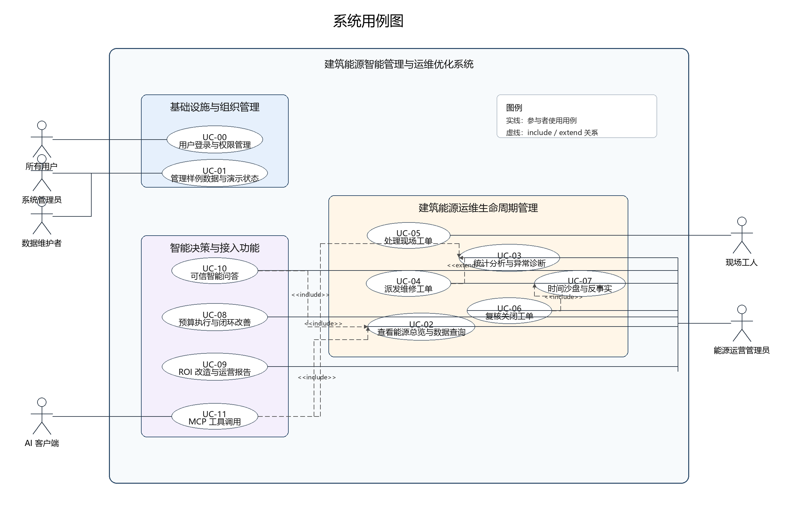

用例图说明：

1. 参与者（Actors）

| 参与者 | 说明 |
| --- | --- |
| 系统管理员 | 负责演示状态、项目检查、配置和基础维护。 |
| 能源运营管理员 | 负责能源总览、异常诊断、派单、复核、预算、ROI 和报告。 |
| 现场工人 | 负责查看本人任务、接单、现场处理和提交复核。 |
| 数据维护者 | 负责样例数据、数据字典、知识库和运行期状态维护。 |
| AI 客户端 | 通过 MCP 调用数据、分析、工单、报告和问答工具。 |
| 所有用户 | 使用登录和权限管理能力。 |

2. 用例分组

| 分组 | 用例 |
| --- | --- |
| 基础设施与组织管理 | UC-00、UC-01 |
| 建筑能源运维生命周期管理 | UC-02 至 UC-07 |
| 智能决策与接入功能 | UC-08 至 UC-11 |
| 支撑功能 | UC-12 |

3. 用例关系

| 关系 | 说明 |
| --- | --- |
| include | 表示一个用例必须包含另一个用例的行为，如 MCP 工具调用必须复用数据查询或异常诊断服务。 |
| extend | 表示一个用例可在特定条件下扩展另一个用例，如派发工单扩展异常诊断结果。 |

4. 次要参与者（Secondary Actors）

| 次要参与者 | 说明 | 典型关联用例 |
| --- | --- | --- |
| 认证与权限服务 | 校验登录态、角色权限和工单归属。 | UC-00、UC-04、UC-05、UC-06 |
| 数据加载与查询服务 | 读取 CSV/数据库、生成元信息、执行筛选和导出。 | UC-01、UC-02、UC-03 |
| 异常分析引擎 | 执行基线计算、异常识别、原因解释和风险评分。 | UC-03、UC-04、UC-09、UC-10、UC-11 |
| 工单状态机引擎 | 校验工单流转、记录时间线、处理设备级去重和工人忙闲锁。 | UC-04、UC-05、UC-06 |
| 沙盘服务引擎 | 控制业务日期、隐藏未来数据、应用维修干预和反事实计算。 | UC-02、UC-07、UC-09 |
| 预算与 ROI 决策引擎 | 计算预算执行、KPI、ROI 指标、派单优先级和运营报告。 | UC-08、UC-09 |
| 可信问答引擎 | 执行意图识别、上下文注入、知识库检索、引用生成和事实校验。 | UC-10、UC-11 |
| MCP Server | 将后端业务能力封装为 AI 客户端可调用的 Tools 和 Resources。 | UC-11 |
| 外部大模型服务 | 在启用时提供语言生成增强，但不作为事实来源。 | UC-10 |
| 持久化存储 | 保存运行期工单、预算、沙盘状态；可为 JSON 或 MySQL。 | UC-01、UC-04、UC-06、UC-08 |
| 项目检查脚本 | 串联语法检查、后端测试和前端构建。 | UC-12 |

### 4.1 基础设施与组织管理

#### 4.1.1 用例 UC-00：用户登录与权限管理

用例标识：UC-00

用例名称：用户登录与权限管理

主要参与者：所有用户、系统管理员

次要参与者：认证与权限服务、前端路由守卫

前置条件：

- 后端服务已启动。
- 演示账号已配置。

基本流程：

1. 用户打开系统登录页。
2. 用户输入账号和密码。
3. 系统校验账号、密码和角色。
4. 系统返回 token 和当前用户信息。
5. 前端根据角色显示对应导航和页面。

活动图：

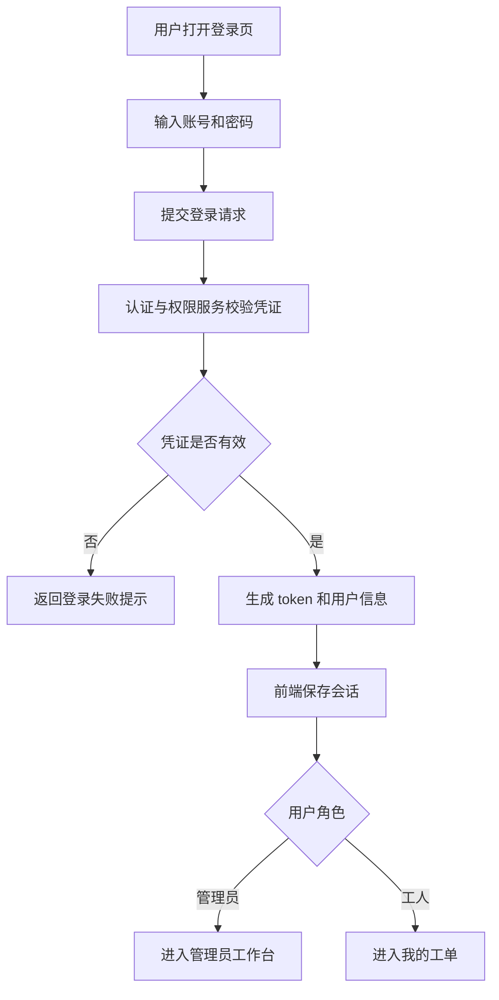

业务规则：

- BR-100：管理员账号可访问总览、数据浏览、统计分析、工单中心、预算、ROI、报告和 AI 助手。
- BR-101：工人账号只能访问“我的工单”和 AI 助手。
- BR-102：后端必须校验权限，不能仅依赖前端隐藏菜单。
- BR-103：用户列表接口不得返回密码。

扩展流程：

- E1：账号或密码错误时，系统返回登录失败提示。
- E2：token 失效时，用户需要重新登录。
- E3：工人访问非本人工单或管理员接口时，系统返回权限错误。

后置条件：

- 用户进入对应工作台。
- 后续接口调用携带有效身份上下文。

#### 4.1.2 用例 UC-01：管理样例数据与演示状态

用例标识：UC-01

用例名称：管理样例数据与演示状态

主要参与者：系统管理员、数据维护者

次要参与者：数据加载与查询服务、持久化存储、可信问答引擎

前置条件：

- 项目数据目录和知识库目录存在。
- 运行期 JSON 或可选数据库可访问。

基本流程：

1. 系统读取样例 CSV 和数据字典。
2. 系统加载知识库和运行期状态。
3. 管理员可执行演示重置。
4. 系统清空或恢复工单、预算、沙盘状态。
5. 系统重新提供稳定演示基线。

活动图：

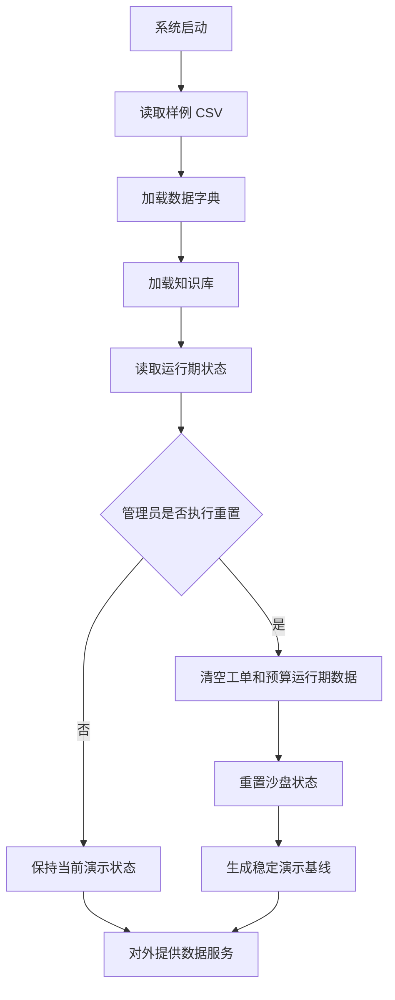

业务规则：

- BR-110：默认数据文件为 `data/samples/energy_records.csv`。
- BR-111：当前 CSV 基线为 4,864 条记录，覆盖 2026-01-01 00:00 至 2026-06-01 21:00。
- BR-112：运行期状态不得提交到源码仓库。
- BR-113：可选 MySQL 不可破坏默认 CSV/JSON 离线运行模式。

扩展流程：

- E1：数据文件缺失时，系统应给出明确错误。
- E2：知识库不可用时，问答服务应降级但不影响核心数据功能。

后置条件：

- 系统数据、工单、预算和沙盘状态处于可演示基线。

### 4.2 建筑能源运维生命周期管理

#### 4.2.1 用例 UC-02：查看能源总览与数据查询

用例标识：UC-02

用例名称：查看能源总览与数据查询

主要参与者：能源运营管理员、AI 客户端

次要参与者：数据加载与查询服务、沙盘服务引擎、MCP Server

前置条件：

- 用户已登录或 MCP 客户端已连接。
- 样例能耗数据已加载。

基本流程：

1. 管理员进入总览或数据浏览页面。
2. 系统展示总记录数、建筑数、平均 COP、异常数量和总电耗。
3. 管理员按建筑、楼层、时间范围和返回条数筛选记录。
4. 系统返回记录列表和派生展示字段。
5. 管理员可导出当前筛选结果为 CSV。

活动图：

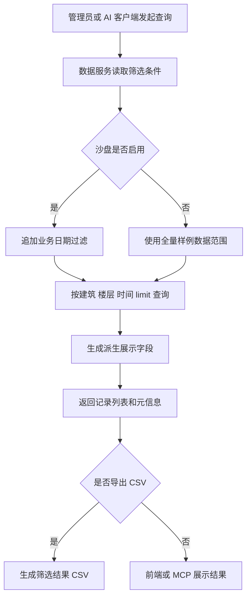

业务规则：

- BR-120：记录查询必须支持建筑、楼层、开始时间、结束时间和 limit。
- BR-121：查询结果应包含原始字段和楼层、区域、设备类型等派生字段。
- BR-122：沙盘启动后，查询不得返回业务日期之后的数据。
- BR-123：CSV 导出必须与当前筛选条件一致。

扩展流程：

- E1：筛选结果为空时，系统显示空状态而不是报错。
- E2：筛选时间超出数据范围时，系统返回可理解提示或空结果。

后置条件：

- 管理员或 AI 客户端获得可用于后续分析的能源数据。

#### 4.2.2 用例 UC-03：统计分析与异常诊断

用例标识：UC-03

用例名称：统计分析与异常诊断

主要参与者：能源运营管理员、AI 客户端

次要参与者：异常分析引擎、数据加载与查询服务、沙盘服务引擎

前置条件：

- 能耗记录已加载。
- 异常检测规则已配置。

基本流程：

1. 管理员打开统计分析页面。
2. 系统生成小时、日、周、月时间汇总。
3. 系统生成建筑对比、COP 排名、楼层汇总和设备摘要。
4. 系统识别异常记录。
5. 管理员选择异常记录查看解释。
6. 系统返回触发规则、指标证据、可能原因、建议动作、浪费估算和风险分。

活动图：

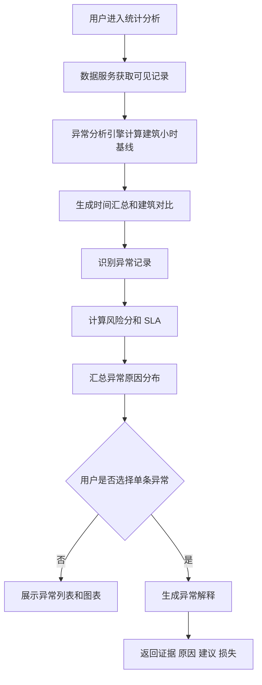

业务规则：

- BR-130：异常检测采用“建筑 × 小时时段”基线，阈值为均值 + 2σ，并结合设备状态与 COP 阈值。
- BR-131：COP 低于目标值、夜间负荷偏高、设备状态异常、电耗高于基线均可触发异常原因。
- BR-132：风险分满分 100，并应给出严重度和 SLA。
- BR-133：浪费费用和碳排估算必须与报告、预算和问答使用同一口径。

扩展流程：

- E1：无异常楼层应显示健康提示。
- E2：单条记录无法解释时，应返回原因而不是空白页面。

后置条件：

- 异常事件可进入派单、报告、预算和问答链路。

#### 4.2.3 用例 UC-04：派发维修工单

用例标识：UC-04

用例名称：派发维修工单

主要参与者：能源运营管理员

次要参与者：异常分析引擎、工单状态机引擎、认证与权限服务、持久化存储

前置条件：

- 管理员已登录。
- 系统存在异常记录或自动确认队列。

基本流程：

1. 管理员查看异常列表或派单建议。
2. 系统展示风险分、经济损失、设备类型和推荐工人。
3. 管理员选择异常并创建工单。
4. 系统检查同设备是否已有未关闭工单。
5. 系统检查目标工人是否忙碌。
6. 系统保存工单并写入时间线。

活动图：

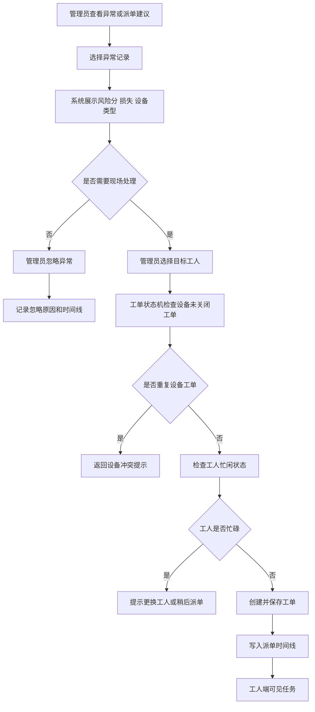

交互时序图：

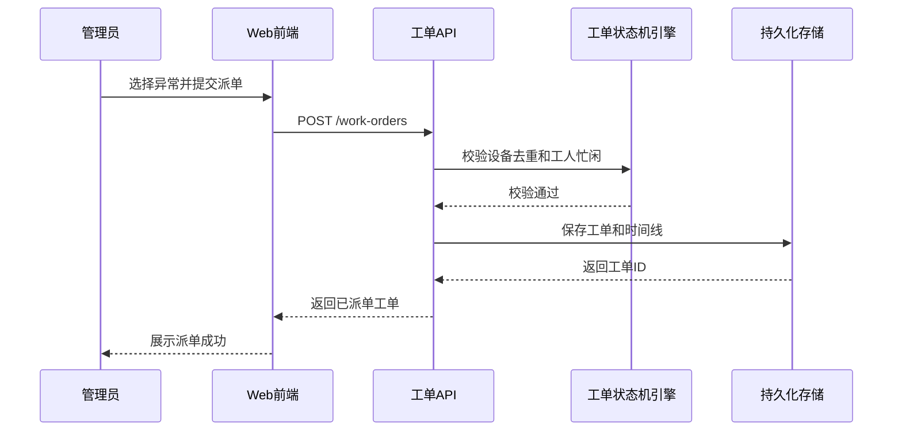

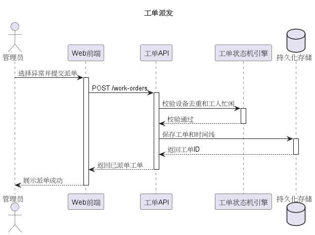

业务规则：

- BR-140：同一设备同一时刻只允许存在一张未关闭工单。
- BR-141：工人存在已派单或处理中工单时视为忙碌。
- BR-142：管理员可以派单、重新派单或忽略异常。
- BR-143：工单必须保留创建、派单、接单、提交、复核、关闭、驳回或忽略等时间线。

扩展流程：

- E1：设备已有未关闭工单时，系统返回冲突提示。
- E2：工人忙碌时，系统要求更换工人或稍后派单。
- E3：管理员忽略异常时，系统记录忽略原因，不触发维修干预。

后置条件：

- 工单进入已派单、待确认或已忽略状态。
- 工人端可见本人任务。

#### 4.2.4 用例 UC-05：处理现场工单

用例标识：UC-05

用例名称：处理现场工单

主要参与者：现场工人

次要参与者：认证与权限服务、工单状态机引擎、持久化存储

前置条件：

- 工人已登录。
- 工单已分配给该工人。

基本流程：

1. 工人打开“我的工单”。
2. 系统显示任务设备、风险、SLA 和处置建议。
3. 工人接单。
4. 工人现场排查设备。
5. 工人填写实际原因、处理结果、恢复确认、备件、安全备注和附件。
6. 工人提交复核。

活动图：

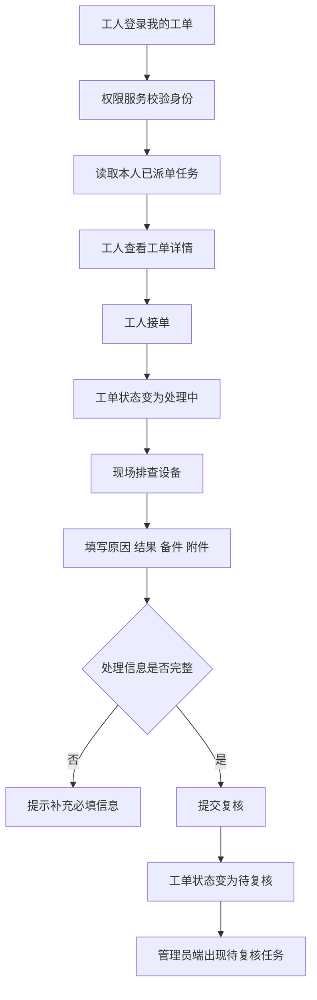

业务规则：

- BR-150：工人只能查看和处理分配给自己的工单。
- BR-151：工人不能创建、派发、复核或关闭工单。
- BR-152：现场处理信息必须保存并可供管理员复核。
- BR-153：附件信息应能在管理员端查看。

扩展流程：

- E1：工人访问他人工单时，系统拒绝。
- E2：提交信息不完整时，系统返回校验错误。
- E3：管理员驳回后，工单回到处理中。

后置条件：

- 工单进入待复核状态。
- 管理员端可查看现场处理结果。

#### 4.2.5 用例 UC-06：复核关闭工单

用例标识：UC-06

用例名称：复核关闭工单

主要参与者：能源运营管理员

次要参与者：工单状态机引擎、沙盘服务引擎、预算与 ROI 决策引擎、持久化存储

前置条件：

- 工单处于待复核状态。
- 工人已提交现场处理结果。

基本流程：

1. 管理员查看待复核工单。
2. 管理员核对现场原因、处理结果和附件。
3. 管理员选择复核通过或驳回。
4. 若通过，系统关闭工单并登记维修干预。
5. 若驳回，系统记录驳回原因并回到处理中。

活动图：

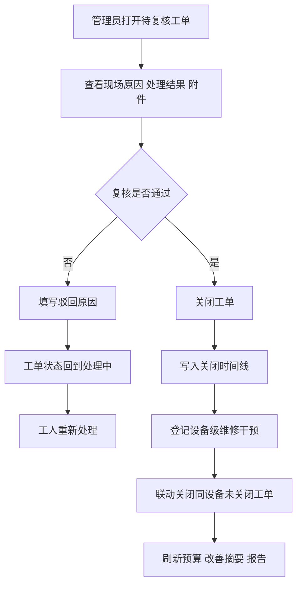

交互时序图：

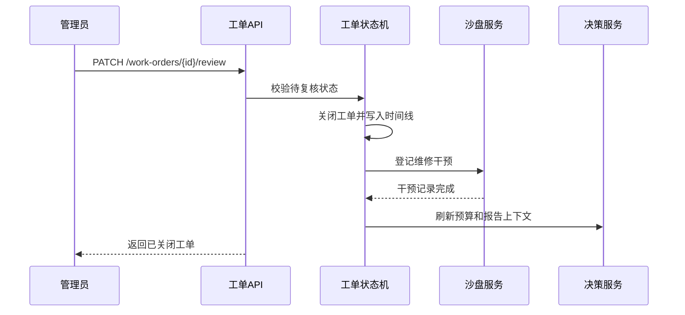

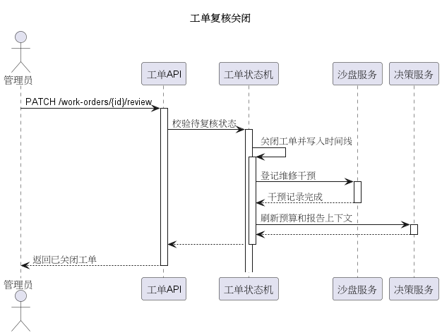

业务规则：

- BR-160：只有管理员可以复核关闭工单。
- BR-161：关闭工单应按设备级修复口径处理。
- BR-162：关闭同一设备其他未关闭工单时必须记录联动原因。
- BR-163：复核结果应反馈到预算、报告和沙盘。

扩展流程：

- E1：复核资料不足时，管理员可驳回复工。
- E2：工单已关闭或已忽略时，不允许重复复核。

后置条件：

- 工单归档。
- 设备维修干预写入沙盘状态。

#### 4.2.6 用例 UC-07：时间沙盘与反事实

用例标识：UC-07

用例名称：时间沙盘与反事实

主要参与者：能源运营管理员

次要参与者：沙盘服务引擎、异常分析引擎、工单状态机引擎、预算与 ROI 决策引擎

前置条件：

- 样例数据覆盖目标业务日期。
- 沙盘服务可用。

基本流程：

1. 管理员启动沙盘，默认定位到 2026-05-01。
2. 系统只展示业务日期及以前的数据。
3. 管理员推进业务日期。
4. 系统根据定时故障和维修干预重新计算异常。
5. 管理员可调用反事实接口比较不处理、立即处理和延迟处理的损失差异。

活动图：

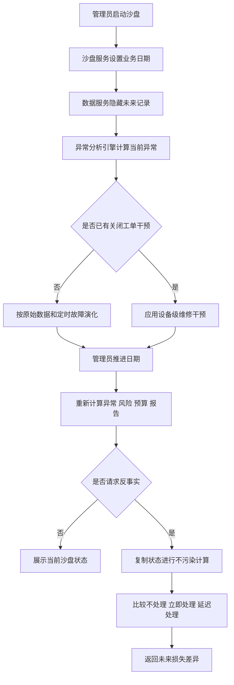

业务规则：

- BR-170：沙盘启动后，未来数据必须隐藏。
- BR-171：关闭工单登记的维修干预应抑制同设备未来异常。
- BR-172：反事实计算不得污染真实沙盘状态。
- BR-173：沙盘业务时间应影响总览、异常、预算、报告和问答。

扩展流程：

- E1：沙盘未启动时，系统使用全量样例数据基线。
- E2：推进超过数据范围时，系统限制日期或返回提示。

后置条件：

- 系统形成可复现的演示业务日期和未来演化结果。

### 4.3 智能决策与接入功能

#### 4.3.1 用例 UC-08：预算执行与闭环改善

用例标识：UC-08

用例名称：预算执行与闭环改善

主要参与者：能源运营管理员

次要参与者：预算与 ROI 决策引擎、工单状态机引擎、沙盘服务引擎、持久化存储

前置条件：

- 能耗数据和建筑信息可用。
- 预算服务已启动。

基本流程：

1. 管理员进入预算管理页面。
2. 系统按建筑和年月生成月度预算。
3. 系统计算预算执行率、预测执行率、预算风险和年度 KPI。
4. 系统汇总已关闭工单的预计节省。
5. 管理员查看闭环改善摘要。

活动图：

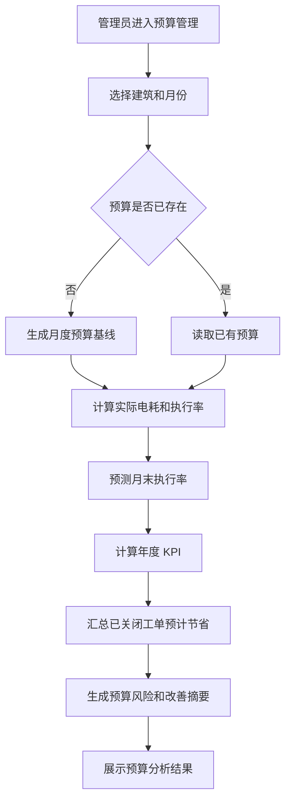

业务规则：

- BR-180：预算基线应使用季节中性日均和季节系数，避免用考核月实测倒推预算。
- BR-181：预算分析应展示超预算楼栋和风险等级。
- BR-182：关闭工单的预计节省应计入预算改善摘要。

扩展流程：

- E1：预算不存在时，系统允许生成默认预算。
- E2：数据不足时，系统应提示预算可信度限制。

后置条件：

- 预算执行信息进入运营报告和 AI 问答上下文。

#### 4.3.2 用例 UC-09：ROI 改造与运营报告

用例标识：UC-09

用例名称：ROI 改造与运营报告

主要参与者：能源运营管理员

次要参与者：预算与 ROI 决策引擎、异常分析引擎、沙盘服务引擎、可信问答引擎

前置条件：

- 存在设备审计数据或反复异常设备。
- ROI 服务和决策服务可用。

基本流程：

1. 管理员选择建筑和设备类型。
2. 系统生成设备能效审计结果。
3. 管理员提交改造方案参数。
4. 系统计算 NPV、IRR、EAA、动态回收期、5 年 ROI 和敏感性。
5. 系统生成运营报告，汇总风险、工单、预算、ROI 和行动项。

活动图：

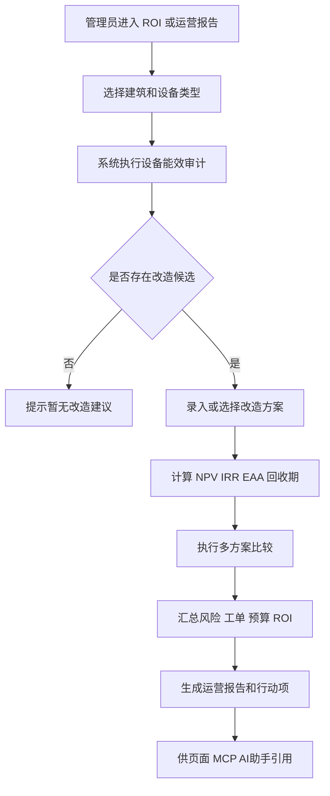

业务规则：

- BR-190：ROI 审计只应输出该建筑实际存在且有实测数据的设备类型。
- BR-191：投资口径应使用增量法。
- BR-192：多方案比较应先筛选 NPV(8%) > 0，再按 EAA 最大择优。
- BR-193：运营报告的生成时间和业务时间应跟随沙盘。

扩展流程：

- E1：候选设备不足时，系统显示无改造建议。
- E2：IRR 不可计算时，系统应返回解释而不是错误中断。

后置条件：

- ROI 结果和运营报告可被页面、MCP 和 AI 助手引用。

#### 4.3.3 用例 UC-10：可信智能问答

用例标识：UC-10

用例名称：可信智能问答

主要参与者：能源运营管理员、现场工人、外部大模型服务

次要参与者：可信问答引擎、数据加载与查询服务、异常分析引擎、工单状态机引擎、预算与 ROI 决策引擎

前置条件：

- 本地知识库和业务服务可用。
- 外部 LLM 可选启用。

基本流程：

1. 用户在 AI 助手中提问。
2. 系统识别问题意图和实体。
3. 系统检索实时业务上下文和本地知识库。
4. 若外部模型启用，系统调用模型增强回答。
5. 系统进行实体校验和事实回退。
6. 系统返回答案、引用来源和后续问题建议。

活动图：

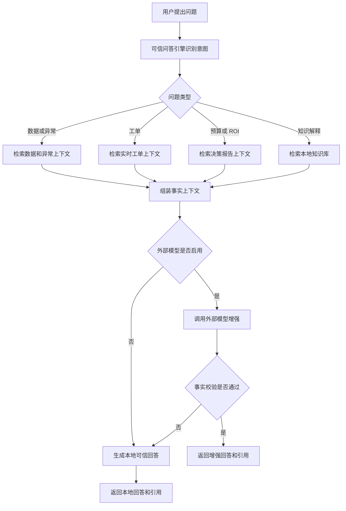

交互时序图：

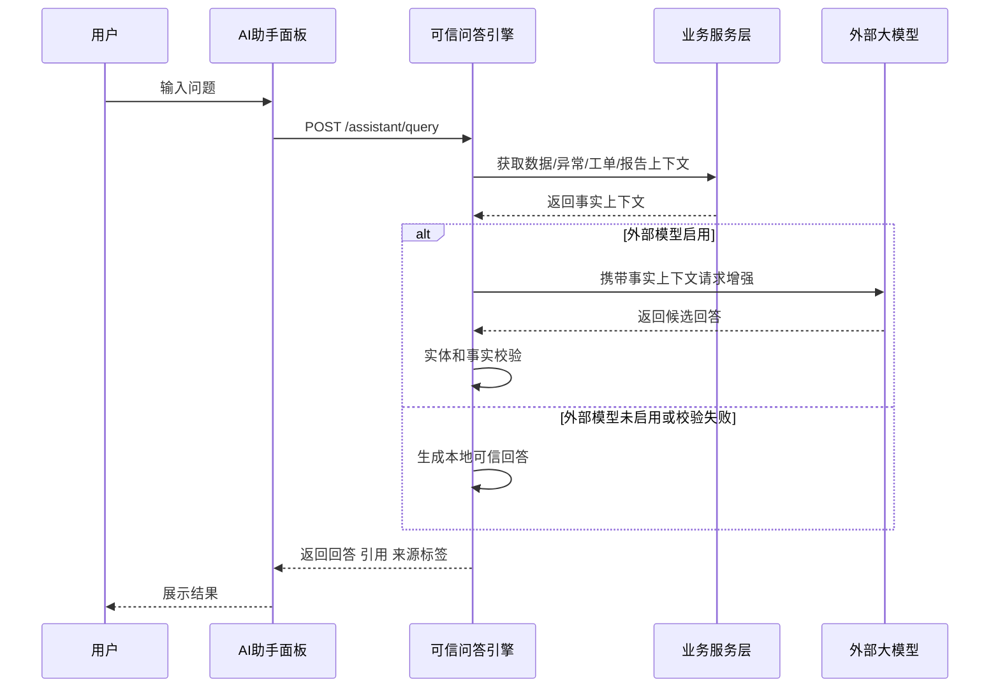

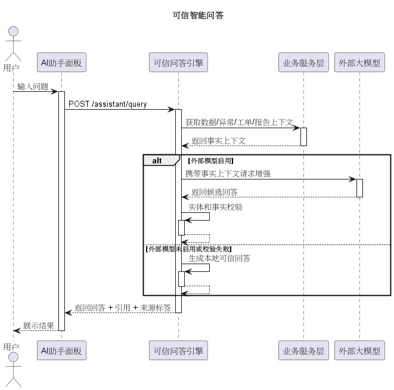

业务规则：

- BR-200：回答必须基于知识库或实时业务上下文。
- BR-201：工单号、设备号、建筑名等实体必须来自真实业务实体。
- BR-202：外部模型失败或回答未通过事实校验时，应回退本地可信回答。
- BR-203：前端应展示回答来源标签。

扩展流程：

- E1：问题缺少实体时，系统给出澄清建议。
- E2：模型未启用时，系统直接使用本地回答。

后置条件：

- 用户获得可追溯、可解释的回答。

#### 4.3.4 用例 UC-11：MCP 工具调用

用例标识：UC-11

用例名称：MCP 工具调用

主要参与者：AI 客户端

次要参与者：MCP Server、数据加载与查询服务、异常分析引擎、工单状态机引擎、可信问答引擎

前置条件：

- MCP Server 已启动。
- AI 客户端支持 stdio 或 streamable-http 连接。

基本流程：

1. AI 客户端连接 MCP Server。
2. 客户端读取可用 Tools 和 Resources。
3. 客户端调用数据、分析、异常、工单、报告或问答工具。
4. MCP Server 复用后端服务层返回结构化结果。

交互时序图：

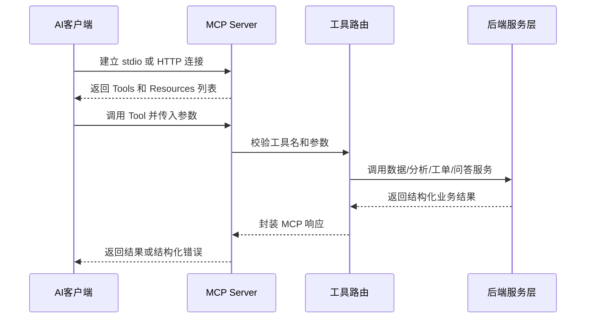

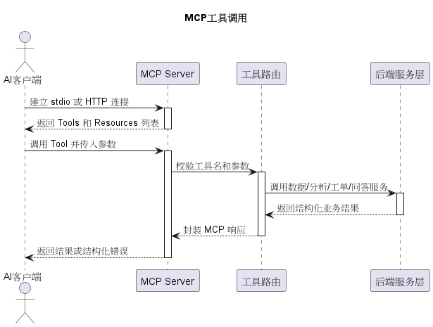

业务规则：

- BR-210：MCP Tools 应覆盖数据元信息、建筑清单、记录查询、总览、统计分析和异常解释。
- BR-211：MCP Tools 应覆盖工单上下文、运营报告、知识库检索和问答。
- BR-212：MCP 不得绕过业务事实校验。
- BR-213：MCP stdio 模式下终端保持等待属于正常行为。

扩展流程：

- E1：传入参数无效时，MCP Tool 返回结构化错误。
- E2：streamable-http 未配置时，仍应支持 stdio 模式。

后置条件：

- AI 客户端获得可用的建筑能源业务工具。

### 4.4 支撑功能

#### 4.4.1 用例 UC-12：项目检查与质量验收

用例标识：UC-12

用例名称：项目检查与质量验收

主要参与者：系统管理员、项目维护人员

次要参与者：项目检查脚本、后端测试框架、前端构建工具、MCP Server

前置条件：

- 项目代码和依赖安装完成。
- 启动脚本和检查脚本存在。

基本流程：

1. 维护人员运行后端启动脚本。
2. 维护人员运行前端启动脚本。
3. 维护人员运行 MCP 启动脚本。
4. 维护人员运行项目检查脚本。
5. 系统执行语法检查、后端测试和前端构建。

活动图：

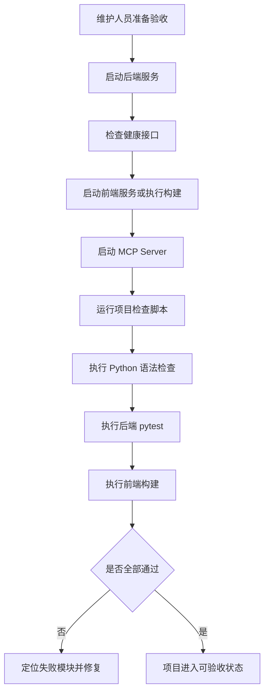

业务规则：

- BR-220：项目应提供后端、前端、MCP 和一键检查脚本。
- BR-221：当前后端测试基线应覆盖数据、分析、工单、MCP、预算、ROI、沙盘和问答。
- BR-222：前端构建应成功。
- BR-223：真实 API Key、`.env`、运行期工单和构建产物不得进入提交。

扩展流程：

- E1：依赖缺失时，脚本应输出明确提示。
- E2：测试失败时，应定位失败模块并阻止验收。

后置条件：

- 项目处于可演示、可验收状态。

---

## 5. 外部接口需求

### 5.1 用户界面需求

| 页面/区域 | 面向角色 | 需求 |
| --- | --- | --- |
| 登录页 | 所有用户 | 支持管理员和工人演示账号登录，错误登录应给出提示。 |
| 总览 | 管理员 | 展示业务闭环看板、系统 KPI、三维楼层风险态势和沙盘控制条。 |
| 数据浏览 | 管理员 | 支持建筑、楼层、时间筛选、记录表格和 CSV 导出。 |
| 统计分析 | 管理员 | 展示趋势、异常、解释、楼层台账、设备监测和优化建议。 |
| 工单中心 | 管理员 | 支持异常选择、派单、自动队列、资源约束建议、复核和工单归档。 |
| 我的工单 | 工人 | 支持本人任务查看、接单、现场填写、附件上传、提交复核。 |
| 预算管理 | 管理员 | 支持预算生成、预算分析、KPI 和闭环改善摘要。 |
| ROI 改造分析 | 管理员 | 支持设备审计、ROI 计算、方案比较和 ROI 候选池。 |
| 决策报告 | 管理员 | 生成并展示运营报告。 |
| AI 助手 | 管理员、工人 | 支持知识库问答、实时业务接地问答和外部模型增强状态展示。 |

### 5.2 软件接口

基础约定：

- API 前缀：`/api/v1`
- 返回格式：列表类接口使用 `items`；单对象常使用 `item`。
- 时间格式：`YYYY-MM-DD HH:mm:ss` 或 ISO datetime。
- 单位：电耗 `kWh`，水耗 `m3`，费用 `yuan`，碳排 `kgCO2`。

| 编号 | 域 | 接口 | 用途 |
| --- | --- | --- | --- |
| IR-REST-01 | 健康检查 | `GET /health` | 检查后端状态。 |
| IR-REST-02 | 数据 | `GET /overview`、`GET /dataset-meta`、`GET /buildings`、`GET /records` | 总览、元信息、建筑清单和记录查询。 |
| IR-REST-03 | 分析 | `GET /analytics/time-summary`、`building-comparison`、`cop-ranking`、`anomalies`、`anomaly-explanations/{record_id}` | 统计分析和异常解释。 |
| IR-REST-04 | 认证 | `POST /auth/login`、`GET /auth/me`、`GET /auth/users` | 演示账号认证和用户列表。 |
| IR-REST-05 | 管理看板 | `GET /admin/dashboard`、`GET /admin/worker-dashboard/{user_id}` | 管理员和工人业务看板。 |
| IR-REST-06 | 异常事件 | `GET /anomaly-events/{record_id}` | 异常、设备和关联工单上下文。 |
| IR-REST-07 | 工单 | `GET /work-orders`、`POST /work-orders`、`PATCH /work-orders/{id}/...` | 工单完整状态机。 |
| IR-REST-08 | 沙盘 | `GET /sim/state`、`POST /sim/start`、`POST /sim/advance`、`POST /sim/reset`、`POST /sim/counterfactual` | 时间沙盘和反事实。 |
| IR-REST-09 | 预算 | `/budget/*` | 预算和 KPI。 |
| IR-REST-10 | ROI | `GET /roi/audit/{building_id}`、`POST /roi/analyze`、`POST /roi/compare` | 改造经济性分析。 |
| IR-REST-11 | 决策 | `/decisions/*` | 经济决策与派单建议。 |
| IR-REST-12 | 导出 | `GET /export/csv` | CSV 导出。 |
| IR-REST-13 | 助手 | `POST /assistant/query`、`GET /assistant/providers` | 智能问答和模型列表。 |
| IR-REST-14 | 演示 | `POST /demo/reset` | 重置演示状态。 |

### 5.3 通信接口

| 编号 | 接口类型 | 通信方式 | 需求 |
| --- | --- | --- | --- |
| IR-COMM-01 | Web 前后端 | HTTP/JSON | 前端通过 REST API 获取业务数据和提交操作。 |
| IR-COMM-02 | MCP stdio | 标准输入输出 | 默认 MCP 连接方式，适合本地 AI 客户端。 |
| IR-COMM-03 | MCP streamable-http | HTTP | 可选 MCP 连接方式，支持指定主机和端口。 |
| IR-COMM-04 | 外部 LLM | OpenAI-compatible HTTP API | 可选启用，失败时必须回退本地回答。 |
| IR-COMM-05 | MySQL | 数据库连接串 | 可选持久化后端，未配置时使用 CSV/JSON。 |

主要 MCP Tools：

| 编号 | Tool | 用途 |
| --- | --- | --- |
| IR-MCP-01 | `get_dataset_meta`、`list_buildings`、`query_energy_records` | 数据元信息和记录查询。 |
| IR-MCP-02 | `get_energy_overview`、`get_time_summary`、`get_building_comparison`、`get_cop_ranking` | 总览和统计分析。 |
| IR-MCP-03 | `get_anomalies`、`get_anomaly_reasons`、`explain_anomaly` | 异常诊断。 |
| IR-MCP-04 | `get_floor_summary`、`get_equipment_summary`、`suggest_anomaly_work_orders`、`get_optimization_recommendations` | 楼层、设备、建议工单和优化建议。 |
| IR-MCP-05 | `get_operation_report` | 运营报告。 |
| IR-MCP-06 | `get_admin_business_dashboard`、`list_persistent_work_orders`、`get_worker_business_dashboard`、`get_work_order_detail` | 业务闭环和工单上下文。 |
| IR-MCP-07 | `search_energy_knowledge`、`ask_energy_assistant` | 知识库检索和问答。 |

---

## 6. 非功能需求

### 6.1 性能需求

| 需求ID | 需求描述 |
| --- | --- |
| NFR-001 | 在当前 4,864 条样例数据规模下，常规查询和分析接口应满足课堂演示交互流畅性。 |
| NFR-002 | 前端页面切换、筛选和图表刷新应无明显卡顿。 |
| NFR-003 | 昂贵分析变换应复用服务层或缓存结果，避免重复计算造成演示延迟。 |
| NFR-004 | MCP 工具调用在样例数据规模下应能返回结构化结果，避免长时间无响应。 |

### 6.2 安全性需求

| 需求ID | 需求描述 |
| --- | --- |
| NFR-010 | 真实 API Key、数据库密码和 `.env` 不得提交到仓库。 |
| NFR-011 | `.env.example` 只能包含占位配置。 |
| NFR-012 | 工单、预算、ROI 和决策接口应进行管理员权限校验。 |
| NFR-013 | 工人操作工单时应校验本人身份和工单归属。 |
| NFR-014 | 模型供应商接口不得向前端返回 API Key。 |

### 6.3 可靠性需求

| 需求ID | 需求描述 |
| --- | --- |
| NFR-020 | 后端接口在数据文件缺失或参数错误时应返回明确错误，不应导致进程崩溃。 |
| NFR-021 | 外部 LLM 调用失败时应回退本地回答，前端不应白屏。 |
| NFR-022 | 工单状态流转应拒绝非法状态跳转。 |
| NFR-023 | 一键重置演示应恢复可重复演示的初始状态。 |
| NFR-024 | 未配置外部 LLM、MySQL 或真实 `.env` 时，系统仍应以默认 CSV/JSON 模式运行。 |

### 6.4 可维护性需求

| 需求ID | 需求描述 |
| --- | --- |
| NFR-025 | 后端应保持路由层、服务层、数据层分离。 |
| NFR-026 | REST API 与 MCP Server 应复用服务层，减少重复业务逻辑。 |
| NFR-027 | 新增接口或字段时应同步更新 API 契约和测试。 |
| NFR-028 | 关键公式、常量和经济参数应在文档中可追溯。 |
| NFR-029 | 本地知识库应支持持续更新。 |

### 6.5 审计需求

| 需求ID | 需求描述 |
| --- | --- |
| NFR-030 | 系统须记录每张工单的完整生命周期。 |
| NFR-031 | 系统须记录工单派单、接单、提交、复核、关闭、驳回和忽略等操作时间线。 |
| NFR-032 | 系统须保证预算、ROI、运营报告和 AI 问答中关键业务数字口径一致。 |
| NFR-033 | 系统须通过测试和检查脚本证明当前交付版本可运行、可构建、可验收。 |

---

## 7. 数据需求

### 7.1 数据实体

#### 7.1.0 用户与权限实体

用户（User）

| 字段 | 说明 |
| --- | --- |
| 用户名 | 用户唯一登录名，如 `admin`、`worker_ahu`。 |
| 角色 | 管理员或工人。 |
| 专业方向 | 工人对应空调、制冷或末端设备方向。 |
| 显示名称 | 页面展示名称。 |
| 状态 | 启用或停用。 |

权限（Permission）

| 字段 | 说明 |
| --- | --- |
| 权限代码 | 操作权限唯一标识。 |
| 角色 | 权限所属角色。 |
| 资源 | 页面、接口或工单对象。 |
| 动作 | 查看、创建、派单、接单、提交、复核、忽略等。 |

#### 7.1.1 核心业务实体

建筑（Building）

| 字段 | 说明 |
| --- | --- |
| 建筑ID | 建筑唯一标识。 |
| 建筑名称 | 展示名称。 |
| 建筑面积 | 用于单位面积能耗和预算分析。 |
| 用途类型 | 教学、办公、实验等派生用途。 |
| 状态 | 是否参与分析。 |

能耗记录（EnergyRecord）

| 字段 | 说明 |
| --- | --- |
| 记录ID | 能耗记录唯一标识。 |
| 时间戳 | 记录采集时间。 |
| 建筑ID | 所属建筑。 |
| 楼层标签 | 派生楼层。 |
| 区域名称 | 派生区域。 |
| 源设备编号 | 原始 CSV 中的设备标签。 |
| 设备类型 | 空调、制冷、末端等派生类型。 |
| 总电耗 | 建筑总电耗，单位 kWh。 |
| 暖通电耗 | HVAC 电耗，单位 kWh。 |
| 制冷量 | 冷量，单位 kWh。 |
| COP | 制冷量与暖通电耗比值。 |
| 设备状态 | 正常、异常、维护等。 |

异常事件（AnomalyEvent）

| 字段 | 说明 |
| --- | --- |
| 记录ID | 对应能耗记录。 |
| 异常原因 | COP 偏低、夜间负荷、设备状态异常等。 |
| 风险分 | 0 至 100。 |
| 严重度 | 高、中、低。 |
| SLA | 建议响应时限。 |
| 浪费电量 | 估算 kWh。 |
| 浪费费用 | 估算 yuan。 |
| 碳排 | 估算 kgCO2。 |
| 建议动作 | 建议排查或处置方式。 |

#### 7.1.2 运维闭环与经济决策实体

工单（WorkOrder）

| 字段 | 说明 |
| --- | --- |
| 工单ID | 主键。 |
| 关联记录ID | 异常来源记录。 |
| 设备ID | 派生运维设备实例。 |
| 状态 | 待确认、已派单、处理中、待复核、已关闭、已驳回、已忽略。 |
| 指派工人 | 当前处理人。 |
| 实际原因 | 工人填写。 |
| 处理结果 | 工人填写。 |
| 复核意见 | 管理员填写。 |
| 创建时间 | 工单创建时间。 |
| 关闭时间 | 工单关闭时间。 |

工单时间线（WorkOrderTimeline）

| 字段 | 说明 |
| --- | --- |
| 时间线ID | 主键。 |
| 工单ID | 所属工单。 |
| 动作 | 创建、派单、接单、提交、复核、关闭、驳回、忽略。 |
| 操作人 | 用户名。 |
| 时间 | 操作时间。 |
| 备注 | 操作说明。 |

沙盘状态（SimulationState）

| 字段 | 说明 |
| --- | --- |
| 是否启用 | 沙盘开关。 |
| 业务日期 | 当前可见日期。 |
| 起始日期 | 沙盘启动日期。 |
| 维修干预列表 | 已关闭工单产生的设备级干预。 |
| 定时故障 | 预置未来故障排程。 |

预算（Budget）

| 字段 | 说明 |
| --- | --- |
| 建筑ID | 预算所属建筑。 |
| 年月 | 预算月份。 |
| 预算电耗 | kWh。 |
| 实际电耗 | kWh。 |
| 预测执行率 | 月末预测值。 |
| KPI 分数 | 年度考核分。 |

ROI 项目（ROIProject）

| 字段 | 说明 |
| --- | --- |
| 项目ID | 主键。 |
| 建筑ID | 改造建筑。 |
| 设备类型 | 改造对象。 |
| 投资额 | 增量投资。 |
| 年节省 | 预计年化节省。 |
| NPV | 净现值。 |
| IRR | 内部收益率。 |
| EAA | 等额年金。 |
| 动态回收期 | 折现回收年限。 |

#### 7.1.3 AI 相关实体

知识库条目（KnowledgeDocument）

| 字段 | 说明 |
| --- | --- |
| 文档ID | 知识条目唯一标识。 |
| 来源路径 | Markdown 或知识文件路径。 |
| 标题 | 条目标题。 |
| 内容片段 | 用于问答检索的文本。 |
| 更新时间 | 条目更新时间。 |

问答引用（KnowledgeCitation）

| 字段 | 说明 |
| --- | --- |
| 来源 | 知识库、实时工单、统计分析或报告。 |
| 标题 | 引用标题。 |
| 摘要 | 引用片段。 |
| 实体 | 工单号、设备号或建筑名等。 |

MCP 调用（MCPToolCall）

| 字段 | 说明 |
| --- | --- |
| Tool 名称 | 被调用工具。 |
| 参数 | 结构化输入参数。 |
| 结果摘要 | 返回结果概述。 |
| 错误信息 | 失败时的结构化错误。 |

### 7.2 数据完整性约束

| 约束类型 | 约束描述 |
| --- | --- |
| 实体完整性 | 关键实体必须有唯一标识，如记录ID、工单ID、项目ID。 |
| 参照完整性 | 工单必须关联异常记录；时间线必须关联工单；预算和 ROI 必须关联建筑。 |
| 域完整性 | 电耗、水耗、冷量、面积、费用、碳排不得为负；状态字段必须使用枚举值。 |
| 业务完整性 | 同一设备只允许一张未关闭工单；关闭工单必须有复核记录。 |
| 时间完整性 | 沙盘查询不得返回业务日期之后的数据。 |
| 口径完整性 | 异常、工单、预算、ROI、报告和问答中的损失、节省和碳排应采用一致计算口径。 |

### 7.3 数据量预估

| 数据类型 | 当前基线 | 年增长量估算 | 5年总量估算 |
| --- | --- | --- | --- |
| 能耗记录 | 4,864 条 | 约 12,000 条 | 约 60,000 条 |
| 异常事件 | 随记录动态计算 | 约 1,000 条 | 约 5,000 条 |
| 工单记录 | 演示运行期生成 | 约 500 条 | 约 2,500 条 |
| 工单时间线 | 演示运行期生成 | 约 3,000 条 | 约 15,000 条 |
| 预算记录 | 按建筑和月份生成 | 约 48 条 | 约 240 条 |
| ROI 项目 | 按候选改造生成 | 约 80 条 | 约 400 条 |
| 知识库条目 | 当前 Markdown 知识库 | 约 100 条 | 约 500 条 |

说明：

- 当前 CSV 基线覆盖 4 栋建筑，时间范围为 2026-01-01 00:00 至 2026-06-01 21:00。
- 当前数据量满足课程演示和测试需求。
- 年增长量为后续真实接入或扩展时的估算，不代表当前课程交付必须实现真实采集。

---

## 8. 需求追踪矩阵

### 8.1 需求与用例及设计实现追踪

| FR ID | 功能需求名称 | 用例ID | 核心业务规则（BR） | 主要设计/实现位置 | 优先级 |
| --- | --- | --- | --- | --- | --- |
| FR-001 | 能源数据管理与查询 | UC-01、UC-02 | BR-110 至 BR-123 | `data_loader.py`、`routes/data.py`、`DataBrowseView` | P0 |
| FR-002 | 统计分析与异常诊断 | UC-03 | BR-130 至 BR-133 | `analysis_service.py`、`routes/analytics.py` | P0 |
| FR-003 | 角色化工单闭环 | UC-00、UC-04、UC-05、UC-06 | BR-100 至 BR-103、BR-140 至 BR-163 | `auth_service.py`、`permission_service.py`、`work_order_store.py` | P0 |
| FR-004 | 时间沙盘与反事实 | UC-02、UC-06、UC-07 | BR-122、BR-163、BR-170 至 BR-173 | `simulation_service.py`、`routes/simulation.py` | P1 |
| FR-005 | 预算、ROI 与运营报告 | UC-08、UC-09 | BR-180 至 BR-193 | `budget_service.py`、`roi_service.py`、`decision_service.py` | P1 |
| FR-006 | 可信智能问答 | UC-10 | BR-200 至 BR-203 | `assistant_service.py`、`grounding_service.py`、`llm_client.py` | P1 |
| FR-007 | MCP 智能体接入 | UC-11 | BR-210 至 BR-213 | `backend/app/mcp_server.py` | P1 |
| FR-008 | 项目检查与质量验收 | UC-12 | BR-220 至 BR-223 | `scripts/check-project.ps1`、`backend/tests/`、前端构建 | P0 |
| NFR-010 | 密钥和权限安全 | UC-00、UC-12 | - | `.gitignore`、`.env.example`、权限测试 | P0 |
| NFR-030 | 工单生命周期审计 | UC-04、UC-05、UC-06 | BR-143、BR-152、BR-162 | 工单时间线、工单测试 | P0 |

### 8.2 题目要求与系统功能的对应

| 题目/交付要求 | 系统对应功能 |
| --- | --- |
| 基于大模型的智能管理 | AI 助手、可信问答、可选外部 LLM、MCP 接入。 |
| 建筑能源管理 | 能源总览、数据查询、统计分析、楼层台账、设备摘要。 |
| 运维优化 | 异常诊断、风险评分、派单建议、工单闭环、设备级维修干预。 |
| 决策支持 | 预算分析、ROI 改造、运营报告、行动项建议。 |
| 可演示可验收 | 时间沙盘、一键重置、演示账号、项目检查脚本。 |
| 工程化实现 | 前后端分离、服务层复用、自动化测试、MCP Server、可选 MySQL。 |

### 8.3 系统创新点

| 创新点 | 说明 |
| --- | --- |
| 从告警到闭环 | 不止展示异常，还能生成工单、处理、复核并反馈未来状态。 |
| 时间沙盘因果演示 | 用业务日期推进和维修干预展示“处理改变未来”。 |
| 经济量化联动 | 异常损失、预算、ROI 和报告使用统一口径。 |
| 可信问答 | AI 回答基于实时业务上下文和知识库引用，并支持事实校验回退。 |
| MCP 智能体接入 | 将能源数据、分析、工单和报告暴露为 AI 客户端可调用工具。 |

---

## 9. 附录

### 9.1 系统实施路线图

| 阶段 | 工作内容 | 交付物 |
| --- | --- | --- |
| 阶段一：需求与数据基线 | 梳理需求、样例数据、数据字典和业务流程。 | SRS、数据字典、需求追踪矩阵。 |
| 阶段二：核心服务开发 | 实现数据查询、统计分析、异常解释、认证权限。 | FastAPI 接口和后端测试。 |
| 阶段三：运维闭环开发 | 实现工单状态机、角色工作台、复核和维修干预。 | 工单中心、我的工单、闭环测试。 |
| 阶段四：决策与智能能力 | 实现沙盘、预算、ROI、运营报告、AI 问答和 MCP。 | 决策页面、MCP Server、问答能力。 |
| 阶段五：验收与答辩 | 完成项目检查、演示脚本、最终文档和答辩材料。 | 最终文档、演示路径、测试结果。 |

### 9.2 开发可行性评估

| 维度 | 评估 |
| --- | --- |
| 技术可行性 | 项目已具备 FastAPI、Vue、CSV/JSON、MCP 和测试基础，技术栈成熟。 |
| 数据可行性 | 当前 4,864 条样例记录覆盖 4 栋建筑和多个业务月份，足以支撑课程演示。 |
| 经济可行性 | 项目使用开源技术和本地样例数据，无需真实传感器、生产数据库或付费模型作为必要依赖。 |
| 运行可行性 | 未配置外部 LLM 和 MySQL 时仍可使用默认模式运行，便于验收环境复现。 |
| 维护可行性 | 路由层、服务层、数据层和前端视图分离，具备测试和文档支撑。 |

### 9.3 词汇表

| 词汇 | 说明 |
| --- | --- |
| 建筑能源智能管理平台 | 本项目系统简称。 |
| 总览 | 展示系统 KPI、沙盘状态和楼层风险的页面。 |
| 统计分析 | 展示趋势、建筑对比、异常、楼层台账和设备摘要的页面。 |
| 工单中心 | 管理员创建、派发、复核和归档工单的页面。 |
| 我的工单 | 工人查看和处理本人任务的页面。 |
| 时间沙盘 | 用业务日期控制数据可见性并模拟维修影响的功能。 |
| 反事实 | 比较不同处理策略下未来损失差异的分析。 |
| 预算改善摘要 | 已关闭工单对预算执行改善的汇总。 |
| ROI 候选 | 根据设备异常和节能潜力生成的改造候选项。 |
| 可信问答 | 带引用、上下文和事实校验的问答能力。 |
| MCP Server | 向 AI 客户端提供工具和资源的服务。 |
