# 软件设计说明书 (SDD)

## Software Design Description

> 本文档遵循 **IEEE Std 1016-2009** 软件设计说明书思想编写，并严格参考 `final_docs/ref/SDD/大型电信运营商智慧合同管理系统-SDD.md` 的内容结构安排。

---

## 文档标识信息

| 项目 | 内容 |
| :--- | :--- |
| **项目名称** | 基于大模型的建筑能源智能管理与运维优化系统 (Building Energy Intelligence Platform) |
| **文档标题** | 软件设计说明书 (Software Design Description) |
| **文档版本** | v3.0 |
| **文档状态** | 正式提交版 |
| **发布日期** | 2026年6月 |
| **发布组织** | 软件工程课程项目组 |
| **作者** | 项目开发团队 |
| **版权声明** | © 2026 软件工程课程项目组，课程项目用途 |

---

## 文档修订历史

| 版本 | 日期 | 修改人 | 变更说明 |
| :--- | :--- | :--- | :--- |
| v1.0 | 2026-05-31 | 项目组 | 形成过程版 SDS，覆盖前后端分离、数据、接口、MCP、测试和部署。 |
| v2.0 | 2026-06-10 | 项目组 | 补充角色登录、工单闭环、时间沙盘、预算、ROI、可信问答和业务闭环设计。 |
| v3.0 | 2026-06-12 | 项目组 | 严格参考大型电信运营商智慧合同管理系统 SDD 的 IEEE 1016 结构重构，补充涉众关注点、设计视图、模块设计、子系统详细设计、数据库、接口、安全、非功能、设计理由和附录。 |

---

## 目录

1. 引言 (Introduction)
2. 设计涉众与关注点 (Design Stakeholders and Concerns)
3. 系统总体设计 (System Architecture)
4. 系统功能模块设计 (Module Design)
5. 子系统详细设计 (Subsystem Detailed Design)
6. 数据库设计 (Database Design)
7. 接口设计 (Interface Design)
8. 安全设计 (Security Design)
9. 非功能性设计 (Non-functional Design)
10. 设计理由说明 (Design Rationale)
11. 需求追踪矩阵 (Requirements Traceability Matrix, RTM)
12. 附录A：第三方库清单
13. 附录B：图片需求清单
14. 附录C：建筑能源业务对象设计详情
15. 附录D：工单闭环与经济决策规则矩阵

---

## 1. 引言 (Introduction)

### 1.1 编写目的

本软件设计说明书（Software Design Description, SDD）旨在详细描述“基于大模型的建筑能源智能管理与运维优化系统”的系统架构、模块划分、关键算法、接口契约、数据存储、安全机制、部署方案和设计取舍。本文档基于同目录下的软件需求规格说明书 `final_docs/01-SRS-软件需求规格说明书.md` 编写，是将需求用例、业务规则和非功能需求转化为工程实现方案的设计蓝图。

本文档的主要预期读者包括：

- **系统架构人员**：用于理解系统分层、模块边界、核心数据流和技术选型。
- **后端开发人员**：用于理解 FastAPI 路由、服务层、数据层、工单状态机、沙盘、预算和 ROI 的实现设计。
- **前端开发人员**：用于理解 Vue 工作台组件、接口调用、角色化页面和交互流程。
- **AI 与 MCP 开发人员**：用于理解知识库问答、外部大模型适配、MCP Tools/Resources 与业务服务复用方式。
- **测试人员**：用于编写和维护接口测试、业务闭环测试、MCP 测试、预算 ROI 测试和前端构建验证。
- **课程评审人员和后续维护人员**：用于评估项目工程完整性、可维护性、可演示性和设计合理性。

### 1.2 项目背景与范围

建筑能源管理场景中，能耗数据通常分散在电表、暖通系统、设备台账、楼层空间和人工巡检记录中。传统能源看板能够展示电耗趋势，但往往缺少异常解释、经济影响量化、现场处置闭环和“处理后是否真的改善”的反馈链路。本项目以校园或园区建筑能源运营为背景，构建一套可运行、可演示、可测试的智能运维系统。

系统的核心定位不是单纯的大屏展示，而是以“时间沙盘”为外层时钟、以“异常识别与经济量化”为分析核心、以“角色化工单”为执行闭环、以“预算与 ROI”为管理反馈的建筑能源业务闭环平台。

**系统范围包括**：

- **前端子系统**：Vue 3 + Vite 单页工作台，提供登录、总览、数据浏览、统计分析、工单中心、我的工单、预算管理、ROI 改造、决策报告和 AI 助手等页面。
- **后端子系统**：FastAPI REST 服务，提供认证、数据查询、统计分析、异常解释、工单闭环、时间沙盘、预算、ROI、决策、导出和问答接口。
- **智能接入子系统**：MCP Server、知识库检索、本地规则问答和可选外部 OpenAI-compatible 大模型增强。
- **数据与持久化子系统**：默认 CSV/JSON 文件模式，可选通过 SQLAlchemy + PyMySQL 切换至 MySQL 持久化业务数据。
- **测试与交付支撑**：pytest 自动化测试、前端构建、启动脚本、检查脚本和最终文档。

**系统范围不包括**：

- 真实楼宇自控系统、BACnet/Modbus 网关、电表硬件或实时传感器接入。
- 生产级企业 SSO、短信邮件通知、财务结算、法定审计或真实碳交易系统。
- 大规模机器学习训练平台、实时流处理平台、多租户 SaaS 或 Kubernetes 高可用集群。

### 1.3 参考资料

1. `final_docs/01-SRS-软件需求规格说明书.md`
2. `final_docs/ref/SDD/大型电信运营商智慧合同管理系统-SDD.md`
3. `docs/06-api-contract.md`
4. `docs/16-mcp-integration.md`
5. `docs/22-business-logic-iteration-plan.md`
6. `docs/23-business-logic-closure-acceptance.md`
7. `docs/24-time-machine-and-causal-upgrade.md`
8. `docs/28-roi-retrofit-methodology-redesign.md`
9. `docs/29-data-quality-acceptance-spec.md`
10. `docs/30-system-reference-for-final-reports.md`
11. FastAPI、Vue 3、Vite、Pandas、SQLAlchemy、MCP Python SDK 官方文档

### 1.4 术语与缩略语定义

| 术语/缩略语 | 全称 | 说明 |
| :--- | :--- | :--- |
| **SDD** | Software Design Description | 软件设计说明书。 |
| **SRS** | Software Requirements Specification | 软件需求规格说明书。 |
| **REST API** | Representational State Transfer API | Web 前端调用的 HTTP/JSON 接口。 |
| **MCP** | Model Context Protocol | 面向 AI 客户端暴露工具和资源的协议。 |
| **LLM** | Large Language Model | 大语言模型，可通过 OpenAI-compatible API 接入。 |
| **RAG** | Retrieval-Augmented Generation | 检索增强生成，本项目体现为知识库检索 + 问答引用。 |
| **RBAC** | Role-Based Access Control | 基于角色的访问控制，本项目以管理员/工人演示角色实现。 |
| **HVAC** | Heating, Ventilation and Air Conditioning | 暖通空调系统。 |
| **COP** | Coefficient of Performance | 制冷性能系数，用于衡量暖通效率。 |
| **SLA** | Service Level Agreement | 服务响应时限，用于工单优先级和风险分级。 |
| **ROI** | Return on Investment | 投资回报分析。 |
| **NPV** | Net Present Value | 净现值，ROI 经济评价指标。 |
| **IRR** | Internal Rate of Return | 内部收益率，ROI 经济评价指标。 |
| **EAA** | Equivalent Annual Annuity | 等额年值，用于寿命不同方案的公平比较。 |
| **时间沙盘** | - | 以业务日期推进方式控制数据可见性、定时故障和维修干预效果的仿真机制。 |
| **维修干预** | - | 工单复核关闭后登记的设备级修复事件，用于影响未来异常。 |
| **接地问答** | Grounded QA | 基于实时业务数据、工单上下文、知识库和引用的问答方式。 |

---

## 2. 设计涉众与关注点 (Design Stakeholders and Concerns)

> 本章依据 IEEE Std 1016-2009 对设计涉众和设计关注点的要求编写，明确不同参与者关心的设计视图。

### 2.1 设计涉众识别

| 涉众类型 | 具体角色 | 描述 |
| :--- | :--- | :--- |
| **开发团队** | 系统架构人员 | 负责总体架构、模块划分、服务复用、数据存储和关键设计取舍。 |
| | 后端开发人员 | 负责 FastAPI 路由、服务层、工单状态机、沙盘、预算、ROI、MCP 和测试。 |
| | 前端开发人员 | 负责 Vue 工作台、图表组件、角色化页面、工单交互、预算 ROI 面板和 AI 助手。 |
| | AI/MCP 开发人员 | 负责知识库检索、外部模型适配、MCP Tools/Resources 和问答事实接地。 |
| **测试团队** | 测试人员 | 负责编写和执行后端接口测试、服务测试、MCP 集成测试、预算 ROI 测试和前端构建验证。 |
| **运维与演示团队** | 系统运行人员 | 负责安装依赖、配置 `.env`、启动后端/前端/MCP、运行一键检查和演示重置。 |
| **业务用户** | 能源运营管理员 | 关注总览、异常解释、派单决策、预算执行、ROI 改造和运营报告。 |
| | 空调/制冷/末端工人 | 关注本人工单、设备位置、标准作业建议、现场处理记录和提交复核。 |
| | 管理决策者 | 关注风险排序、损失金额、碳排影响、预算 KPI 和改造投资收益。 |
| **外部系统/智能体** | MCP Client / AI 客户端 | 通过 MCP 获取数据、异常、工单、报告、知识库和问答能力。 |
| **管理层** | 课程指导教师 / 评审人员 | 验证系统功能完整性、业务闭环合理性、工程质量和最终交付材料。 |

### 2.2 设计关注点声明

| 涉众 | 设计关注点 | 对应设计视图 |
| :--- | :--- | :--- |
| **系统架构人员** | 系统边界、分层架构、模块职责、服务复用、部署形态、设计模式和扩展性。 | 上下文视图、组合视图、依赖视图、模式使用视图 |
| **后端开发人员** | 路由与服务层边界、Pydantic Schema、业务状态机、算法公式、数据读写、错误处理。 | 逻辑视图、接口视图、信息视图、算法视图 |
| **前端开发人员** | 页面结构、组件职责、API 调用、角色化视图、数据刷新、异常和工单交互。 | 接口视图、交互视图、结构视图 |
| **AI/MCP 开发人员** | MCP 工具定义、知识库检索、外部模型调用、问答引用、实时业务上下文。 | 组合视图、接口视图、交互视图 |
| **测试人员** | 模块边界、接口契约、状态转换、非法操作拒绝、缓存和数据一致性。 | 状态动态视图、接口视图、算法视图 |
| **系统运行人员** | 本地部署、依赖安装、环境变量、启动脚本、数据初始化、故障排查。 | 资源视图、部署视图 |
| **能源运营管理员** | 风险定位、派单优先级、预算风险、ROI 建议、日报结论和操作可追溯。 | 上下文视图、交互视图、信息视图 |
| **现场工人** | 本人任务、忙闲锁定、处理步骤、证据上传、提交复核和历史案例。 | 状态动态视图、交互视图 |
| **AI 客户端用户** | 工具调用稳定性、返回结构化结果、问答是否引用真实数据。 | 接口视图、信息视图 |
| **课程评审人员** | 需求覆盖、设计完整性、可运行性、测试充分性、文档规范性。 | 全部设计视图 |

### 2.3 关注点与 IEEE 设计视图映射

| IEEE 设计视点 | 本 SDD 对应章节 | 覆盖的关注点 |
| :--- | :--- | :--- |
| Context Viewpoint（上下文视点） | 3.2 系统逻辑架构 | 系统边界、用户、外部 LLM、MCP 客户端、数据来源。 |
| Composition Viewpoint（组合视点） | 4. 系统功能模块设计 | 前端、后端、服务层、数据层、MCP 和知识库模块划分。 |
| Logical Viewpoint（逻辑视点） | 5. 子系统详细设计 | 服务类职责、状态机、业务对象、组件关系。 |
| Dependency Viewpoint（依赖视点） | 3.4 物理部署架构 | 前后端、MCP、MySQL、CSV/JSON、外部模型之间的依赖。 |
| Information Viewpoint（信息视点） | 6. 数据库设计 | 能耗记录、工单、预算、沙盘状态、知识库和业务实体。 |
| Interface Viewpoint（接口视点） | 7. 接口设计 | REST API、MCP Tools、MCP Resources、环境变量和内部服务接口。 |
| Interaction Viewpoint（交互视点） | 5.3 交互时序设计 | 管理员派单、工人处理、沙盘干预、问答接地的消息流。 |
| State Dynamics Viewpoint（状态动态视点） | 4.3.3 工单状态机与时间沙盘 | 工单生命周期、业务日期推进、维修干预和状态约束。 |
| Algorithm Viewpoint（算法视点） | 4.3.2、4.3.4、4.3.5 | 异常检测、风险评分、资源约束派单、预算、ROI 和反事实。 |
| Resource Viewpoint（资源视点） | 9. 非功能性设计 | 性能、可靠性、可维护性、数据规模和部署资源。 |
| Patterns Use Viewpoint（模式使用视点） | 10. 设计理由说明 | 分层架构、服务复用、仓储切换、规则引擎、策略路由。 |
| Structure Viewpoint（结构视点） | 5. 子系统详细设计 | 前端组件结构、后端目录结构、数据库表结构。 |

**系统上下文图**

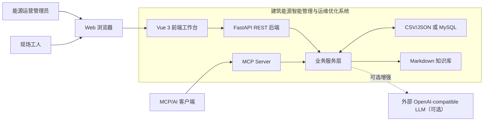

---

## 3. 系统总体设计 (System Architecture, Context/Logical/Dependency Viewpoints)

本章提供系统的上下文视图、逻辑视图和依赖视图，描述系统边界、分层结构、技术栈和部署依赖。

### 3.1 设计原则

1. **高内聚低耦合**：前端、REST 后端、MCP Server、服务层、数据存储和知识库职责分离，模块之间通过明确接口交互。
2. **业务口径一致**：Web 页面、REST API、MCP Tools、运营报告和 AI 助手复用同一套服务层，避免多套计算逻辑导致数据漂移。
3. **可解释优先**：异常检测、风险评分、预算、ROI 和派单优先级均采用可追溯公式，不依赖不可解释黑盒模型作为必要条件。
4. **演示可复现**：时间沙盘、一键重置、默认 CSV/JSON 模式和演示账号保证在课堂环境中稳定运行。
5. **默认零依赖，可选增强**：不配置 MySQL 或外部 LLM 时系统仍可运行；配置 `DATABASE_URL`、模型 API Key 后可增强持久化和问答能力。
6. **安全边界清晰**：真实密钥仅放本地 `.env`；管理员和工人操作边界通过权限服务校验；工人只处理本人任务。
7. **增量可扩展**：新增建筑、设备类型、知识库条目、模型供应商或持久化后端时，应尽量不破坏既有接口和前端交互。

### 3.2 系统逻辑架构 (Logical Architecture，对应 IEEE 逻辑视点 Logical Viewpoint)

系统采用分层架构，自上而下分为展示层、应用接口层、业务服务层、数据与知识层、外部增强层。

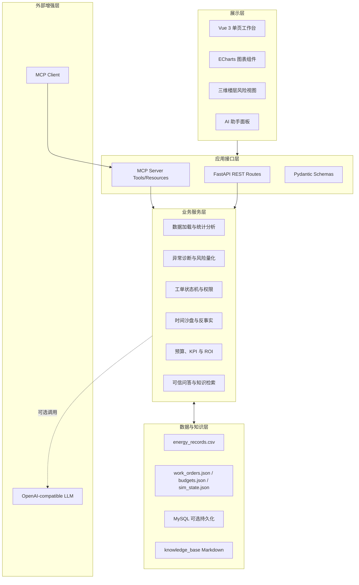

各层职责如下：

| 层次 | 主要职责 | 代表实现 |
| :--- | :--- | :--- |
| 展示层 | 提供角色化页面、图表、工单交互、预算 ROI 面板和 AI 助手。 | `frontend/src/views/DashboardView.vue`、`frontend/src/components/` |
| 应用接口层 | 接收 HTTP/MCP 请求，进行参数解析、错误映射和响应包装。 | `backend/app/api/routes/`、`backend/app/mcp_server.py` |
| 业务服务层 | 实现数据分析、异常诊断、工单、沙盘、预算、ROI、问答等核心逻辑。 | `backend/app/services/` |
| 数据与知识层 | 提供 CSV 原始数据、JSON 运行状态、可选 MySQL 和 Markdown 知识库。 | `data/`、`knowledge_base/`、`backend/app/db/` |
| 外部增强层 | 可选调用外部 LLM；供 MCP 客户端调用项目能力。 | `.env` LLM 配置、MCP transport |

### 3.3 技术架构选型 (Technology Stack)

#### 3.3.1 前端技术栈

- **框架**：Vue 3。
- **构建工具**：Vite 5。
- **图表库**：ECharts 6。
- **语言**：JavaScript，使用 Vue 单文件组件。
- **核心文件**：
  - `frontend/src/App.vue`
  - `frontend/src/views/DashboardView.vue`
  - `frontend/src/lib/api.js`
  - `frontend/src/components/*.vue`
- **设计要点**：采用单页工作台方式，避免课程演示中多路由跳转带来的状态丢失；所有 REST 调用集中在 `api.js`，统一处理 `operator_id` 和错误。

#### 3.3.2 后端技术栈

- **开发语言**：Python 3.11+。
- **Web 框架**：FastAPI。
- **ASGI Server**：Uvicorn。
- **数据处理**：Pandas。
- **数据模型**：Pydantic。
- **持久化**：默认 CSV/JSON；可选 SQLAlchemy 2 + PyMySQL + MySQL。
- **测试**：pytest、httpx。
- **核心文件**：
  - `backend/app/main.py`
  - `backend/app/api/router.py`
  - `backend/app/api/routes/*.py`
  - `backend/app/services/*.py`
  - `backend/app/db/*.py`
  - `backend/tests/*.py`

#### 3.3.3 AI 与 MCP 技术栈

- **MCP 框架**：MCP Python SDK，`FastMCP`。
- **MCP 传输**：默认 `stdio`，可选 `streamable-http`。
- **外部模型协议**：OpenAI-compatible HTTP API。
- **知识库格式**：Markdown 文件，按 `manuals/`、`glossary/`、`faq/` 组织。
- **核心服务**：
  - `assistant_service.py`：本地规则问答。
  - `grounding_service.py`：问题分类、实体识别和业务上下文接地。
  - `knowledge_search_service.py`：知识库检索和引用格式化。
  - `llm_client.py`：外部模型调用封装。
  - `mcp_server.py`：MCP Tools/Resources/Prompt。

#### 3.3.4 数据存储与环境

- **原始能耗数据**：`data/samples/energy_records.csv`，当前 4,864 条记录、16 个原始字段、4 栋建筑，时间范围为 2026-01-01 00:00:00 至 2026-06-01 21:00:00。
- **数据字典**：`data/dictionaries/energy_records_dictionary.csv`。
- **运行期文件**：`data/runtime/work_orders.json`、预算文件、沙盘状态文件，默认不提交。
- **可选数据库**：MySQL 8.x，表包括 `energy_readings`、`work_orders`、`budgets`、`sim_state`。
- **环境变量**：根目录 `.env`，模板为 `.env.example`。

### 3.4 物理部署架构 (Deployment Architecture，对应 IEEE 依赖视点 Dependency Viewpoint)

系统默认面向本地课程演示部署，支持 Windows PowerShell 环境，也可迁移到 Linux 或容器化环境。

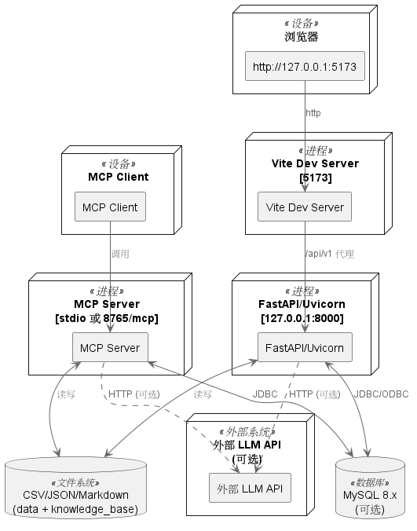

物理部署节点说明：

| 节点 | 说明 |
| :--- | :--- |
| 浏览器 | 用户访问前端工作台，推荐 Chrome 或 Edge。 |
| Vite Dev Server | 开发/演示前端服务，默认 `http://127.0.0.1:5173`。 |
| FastAPI/Uvicorn | 后端 REST 服务，默认 `http://127.0.0.1:8000`。 |
| MCP Server | 面向 AI 客户端的工具服务，默认 stdio，也支持 streamable-http。 |
| CSV/JSON/Markdown | 默认数据和知识存储，无需数据库即可运行。 |
| MySQL | 可选持久化后端，配置 `DATABASE_URL` 后启用。 |
| 外部 LLM | 可选增强能力，未配置或调用失败时回退本地问答。 |

### 3.5 系统部署方案 (System Deployment)

#### 3.5.1 部署环境要求

**硬件要求**

- CPU：2 核及以上，推荐 4 核。
- 内存：4GB 及以上，推荐 8GB。
- 磁盘：1GB 以上项目空间；若启用 MySQL 或长期保留运行期数据，建议预留更多空间。
- 网络：基础演示不依赖外网；调用外部 LLM 或安装依赖时需要访问互联网。

**软件要求**

- 操作系统：Windows 10/11 或 Linux。
- Python：3.11+。
- Node.js：18+ 或 20+。
- PowerShell：用于启动脚本。
- 可选 MySQL：8.x。
- Git：用于拉取和管理代码。

**端口配置**

- `5173`：Vite 前端开发服务。
- `8000`：FastAPI 后端服务。
- `8765`：MCP streamable-http 可选端口。
- `3306`：MySQL 可选端口。

#### 3.5.2 本地部署架构

本地部署采用两个或三个独立进程：

1. 后端进程：`uvicorn app.main:app --reload --host 127.0.0.1 --port 8000 --app-dir backend`
2. 前端进程：`npm run dev`
3. MCP 进程：`scripts/start-mcp.ps1`，按需启动。

前端通过 Vite 代理访问 `/api/v1`，后端通过配置读取数据文件、知识库和运行期状态；MCP Server 复用后端服务层，不需要单独复制业务逻辑。

#### 3.5.3 配置说明

系统通过仓库根目录 `.env` 管理本地配置，主要配置项如下：

| 配置项 | 说明 |
| :--- | :--- |
| `DATA_FILE` | 能耗 CSV 数据文件路径，默认 `data/samples/energy_records.csv`。 |
| `KNOWLEDGE_BASE_DIR` | 知识库目录，默认 `knowledge_base`。 |
| `WORK_ORDER_FILE` | 工单 JSON 文件路径，默认 `data/runtime/work_orders.json`。 |
| `DATABASE_URL` | 可选 MySQL 连接串，留空时使用 CSV/JSON。 |
| `VITE_API_BASE_URL` | 前端 API 前缀，默认 `/api/v1`。 |
| `LLM_ENABLED` | 是否启用外部大模型。 |
| `LLM_PROVIDER`、`LLM_BASE_URL`、`LLM_MODEL`、`LLM_API_KEY` | 外部模型调用配置。 |
| `MCP_TRANSPORT`、`MCP_HOST`、`MCP_PORT` | MCP Server 传输方式和监听地址。 |

真实 `.env` 不得提交，`.env.example` 只保留占位值。

#### 3.5.4 部署流程

1. 克隆项目并进入仓库根目录。
2. 复制 `.env.example` 为 `.env`，按需填写模型或数据库配置。
3. 安装后端依赖：`pip install -r backend/requirements.txt`。
4. 安装前端依赖：进入 `frontend` 后执行 `npm install`。
5. 若启用 MySQL，执行 `cd backend && python -m app.db.init_db` 初始化表和能耗读数。
6. 启动后端：`scripts/start-backend.ps1`。
7. 启动前端：`scripts/start-frontend.ps1`。
8. 按需启动 MCP：`scripts/start-mcp.ps1`。
9. 运行 `scripts/check-project.ps1` 验证后端测试和前端构建。

#### 3.5.5 服务访问方式

| 服务 | 地址或方式 |
| :--- | :--- |
| 前端页面 | `http://127.0.0.1:5173` |
| 后端 API 文档 | `http://127.0.0.1:8000/docs` |
| 健康检查 | `http://127.0.0.1:8000/api/v1/health` |
| MCP stdio | `scripts/start-mcp.ps1` |
| MCP streamable-http | `http://127.0.0.1:8765/mcp` |

#### 3.5.6 运维管理

- **启动管理**：通过 `scripts/start-backend.ps1`、`scripts/start-frontend.ps1`、`scripts/start-mcp.ps1` 分别启动服务。
- **演示重置**：通过页面按钮或 `POST /api/v1/demo/reset` 清理并播种演示状态。
- **数据初始化**：通过 `scripts/generate_sample_dataset.py` 重新生成样例数据，或通过 `python -m app.db.init_db` 导入数据库。
- **测试检查**：通过 `scripts/check-project.ps1` 统一执行后端测试和前端构建。
- **配置变更**：修改 `.env` 后需要重启相关服务；切换数据库连接时可调用数据库初始化脚本。

#### 3.5.7 故障排查

| 问题 | 排查方法 |
| :--- | :--- |
| 前端无法访问后端 | 检查后端是否监听 8000，Vite 代理和 `VITE_API_BASE_URL` 是否正确。 |
| 数据查询失败 | 检查 `DATA_FILE` 是否存在，CSV 字段是否包含必需列。 |
| MySQL 未生效 | 检查 `DATABASE_URL` 是否为空，执行 `python -m app.db.init_db` 是否成功。 |
| 外部 LLM 不可用 | 检查 `LLM_ENABLED`、供应商 API Key 和网络；系统应自动回退本地问答。 |
| MCP 无明显输出 | stdio 模式 stdout 用于 JSON-RPC 协议，终端等待属于正常现象。 |
| 工人无法派单 | 检查工人是否忙碌、设备是否已有未关闭工单或已登记维修干预。 |

#### 3.5.8 生产环境优化方案

若项目后续扩展为生产系统，建议：

- 使用 Nginx 统一托管前端静态文件并反向代理后端 API。
- 使用 MySQL 或 PostgreSQL 替代默认 JSON 运行期存储。
- 引入真实 JWT、密码哈希、权限表和操作审计表。
- 使用对象存储保存现场照片，避免长期保存 base64 大字段。
- 引入任务队列处理外部 LLM 调用、报告生成和批量数据导入。
- 接入 Prometheus/Grafana 或日志平台监控接口性能和异常。
- 将 MCP Server 与 REST 服务统一部署在受控网络中，并限制可调用工具范围。

---

## 4. 系统功能模块设计 (Module Design, Composition/State/Algorithm Viewpoints)

本章提供系统的组合视图，并在核心业务模块中补充状态动态视图和算法视图，说明模块职责、状态机和关键业务规则。

### 4.1 模块划分概述

系统按照“基础设施层、核心业务层、智能增强层、展示交互层”进行功能模块划分。

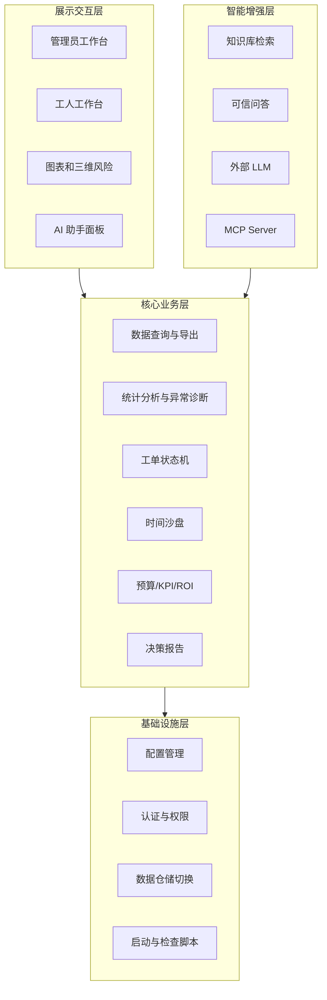

模块与代码映射：

| 模块 | 主要代码位置 | 说明 |
| :--- | :--- | :--- |
| 配置管理 | `backend/app/core/config.py` | 读取 `.env`，解析数据、知识库、工单、数据库和 LLM 配置。 |
| 认证权限 | `auth_service.py`、`permission_service.py`、`routes/auth.py` | 演示用户、token、角色校验、工单归属校验。 |
| 数据仓储 | `data_loader.py`、`backend/app/db/` | CSV/JSON 与 MySQL 可切换。 |
| 分析服务 | `analysis_service.py` | 总览、统计、异常、风险、报告和建议。 |
| 工单服务 | `work_order_store.py` | 工单生命周期、忙闲锁、设备级去重、现场附件和维修干预。 |
| 沙盘服务 | `simulation_service.py`、`scenario_service.py` | 业务日期、定时故障、维修干预和反事实。 |
| 预算 ROI | `budget_service.py`、`roi_service.py`、`decision_service.py` | 预算基线、KPI、ROI、派单优先级和闭环影响。 |
| 问答与 MCP | `assistant_service.py`、`grounding_service.py`、`mcp_server.py` | 接地问答、知识库引用和 MCP 工具。 |
| 前端工作台 | `DashboardView.vue`、`components/*.vue`、`lib/api.js` | 角色化页面和业务交互。 |

### 4.2 基础设施层设计

#### 4.2.1 用户认证与权限管理 (RBAC)

系统采用轻量级演示 RBAC，不引入生产级用户库，直接在 `auth_service.py` 中维护演示账号：

| 账号 | 密码 | 角色 | 专业方向 | 主要权限 |
| :--- | :--- | :--- | :--- | :--- |
| `admin` | `admin123` | admin | 全局调度 | 查看全局数据、生成工单、派单、复核、忽略、预算、ROI、决策。 |
| `worker_ahu` | `worker123` | worker | AHU | 查看和处理空气处理机组相关本人任务。 |
| `worker_chiller` | `worker123` | worker | CH | 查看和处理冷水机组、冷却塔相关本人任务。 |
| `worker_fcu` | `worker123` | worker | FCU | 查看和处理风机盘管相关本人任务。 |

认证流程：

1. 前端调用 `POST /api/v1/auth/login`。
2. 后端校验用户名、密码和启用状态。
3. 登录成功后返回用户公开信息和 `demo-token:<user_id>`。
4. 前端后续通过 `operator_id` 或 Authorization Header 表明操作者。
5. 管理员类接口调用 `require_admin_operator`；工人类接口调用 `require_worker_operator`。

权限控制粒度：

- 管理员可以创建、派单、复核、驳回、忽略工单。
- 工人只能接单和提交本人负责的工单。
- 工人忙碌时不能被重复分配新活动工单。
- 预算、ROI 和决策接口默认要求管理员身份。

#### 4.2.2 配置与环境管理

配置集中在 `Settings` 类中：

```text
backend/app/core/config.py
  ├─ project_name
  ├─ api_v1_prefix = /api/v1
  ├─ data_file
  ├─ knowledge_base_dir
  ├─ work_order_file
  ├─ database_url
  ├─ allowed_origins
  └─ llm_* 配置
```

设计要点：

- 所有相对路径基于仓库根目录解析，避免后端从不同工作目录启动时找不到文件。
- 使用 `python-dotenv` 读取根目录 `.env`。
- `get_settings()` 使用 `lru_cache`，减少重复解析。
- `.env.example` 仅提供占位值，不包含真实 API Key。

#### 4.2.3 数据仓储切换设计

系统采用“双后端存储”模式：

| 模式 | 启用条件 | 存储对象 | 优点 |
| :--- | :--- | :--- | :--- |
| 默认文件模式 | `DATABASE_URL` 为空 | 能耗 CSV、工单 JSON、预算 JSON、沙盘 JSON | 零依赖、便于离线演示、测试稳定。 |
| MySQL 模式 | 配置 `DATABASE_URL` | `energy_readings`、`work_orders`、`budgets`、`sim_state` | 支持标准数据库、事务、并发和持久化演示状态。 |

仓储层通过 `backend/app/db/repository.py` 提供统一读写函数。上层服务只调用 `read_work_orders()`、`write_work_orders()`、`read_budgets()`、`write_budgets()`、`read_sim_state()`、`write_sim_state()` 等函数，不直接关心底层是文件还是数据库。

#### 4.2.4 项目脚本与质量检查

| 脚本 | 职责 |
| :--- | :--- |
| `scripts/start-backend.ps1` | 启动 FastAPI 后端。 |
| `scripts/start-frontend.ps1` | 启动 Vite 前端。 |
| `scripts/start-mcp.ps1` | 启动 MCP Server，支持 stdio 和 streamable-http。 |
| `scripts/check-project.ps1` | 执行项目一键检查。 |
| `scripts/generate_sample_dataset.py` | 生成样例能耗数据集。 |
| `scripts/test_llm_providers.py` | 检查外部模型供应商配置。 |

### 4.3 核心业务层设计

#### 4.3.1 建筑能源数据生命周期管理

数据生命周期包括加载、校验、派生、过滤、分析、导出和持久化。

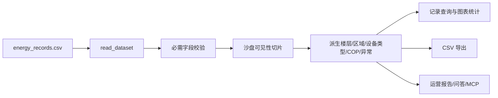

原始数据字段包括：

| 字段类别 | 字段 |
| :--- | :--- |
| 标识字段 | `record_id`、`building_id`、`building_name`、`building_type` |
| 时间字段 | `timestamp` |
| 能耗字段 | `electricity_kwh`、`water_m3`、`hvac_kwh`、`cooling_load_kwh` |
| 暖通字段 | `chilled_water_supply_temp_c`、`chilled_water_return_temp_c` |
| 环境字段 | `environment_temp_c`、`humidity_rh`、`occupancy_density_per_100m2` |
| 设备字段 | `equipment_id`、`equipment_status` |

派生字段包括楼层标签、区域名称、运行设备 ID、设备类型、异常标记、异常原因、业务影响、风险分和 SLA。

记录查询与 CSV 导出必须共享同一组过滤条件：建筑、楼层、开始时间、结束时间和 `limit`。沙盘启动后，查询和导出均只能返回业务日期及以前的数据，避免前端、MCP 与导出文件出现时间口径不一致。

#### 4.3.2 异常诊断与风险评分设计

异常检测采用“情景化基线 + 均值 + 2σ + 设备/能效规则”的可解释方法。

**动态基线**

```text
slot_mean = mean(electricity_kwh | building_id, hour)
slot_std  = std(electricity_kwh | building_id, hour)
upper_bound = slot_mean + 2.0 * slot_std
is_anomaly = electricity_kwh > upper_bound
```

**辅助异常规则**

- COP 低于阈值：`average_cop < 2.2`。
- 夜间高负荷：22:00 至 06:00 仍出现高负荷。
- 设备状态异常：`equipment_status != normal`。
- 定时故障注入：沙盘开启后按排程对部分设备注入劣化。

**业务影响量化**

```text
over_expected = max(0, electricity_kwh - baseline_mean)
cop_waste     = max(0, hvac_kwh - cooling_load / 2.2)   # 仅 COP 偏低时计入
wasted_kwh    = max(over_expected, cop_waste)
wasted_cost_yuan = wasted_kwh * 0.82
carbon_kg = wasted_kwh * 0.5703
estimated_saving_yuan = wasted_cost_yuan * 0.65
```

**风险评分**

```text
risk_score =
  status_component(0/30)
  + overuse_component(0-35)
  + cop_component(0-20)
  + night_component(0/15)
```

| 分量 | 权重 | 说明 |
| :--- | :--- | :--- |
| 设备硬故障 | 30 | 设备状态异常时计满分。 |
| 电耗超期望 | 35 | 按超出同时段期望均值比例归一，35% 及以上占满。 |
| COP 低效 | 20 | 按 `(2.2 - COP) / 2.2` 归一。 |
| 夜间高负荷 | 15 | 夜间非运行时段高负荷计满分。 |

严重度与 SLA：

| 风险分 | 严重度 | SLA |
| :--- | :--- | :--- |
| `>= 70` | 高 | 8 小时 |
| `>= 45` 且 `< 70` | 中 | 24 小时 |
| `< 45` | 低 | 72 小时 |

#### 4.3.3 工单状态机与运维闭环设计

工单是系统从“发现异常”走向“现场处置”的核心业务对象。状态定义如下：

| 状态代码 | 中文标签 | 说明 |
| :--- | :--- | :--- |
| `pending_confirm` | 待确认 | 异常已进入待确认队列，尚未正式派单。 |
| `assigned` | 已派单 | 管理员已指定工人，等待工人接单。 |
| `in_progress` | 处理中 | 工人已接单并处于现场处理状态。 |
| `pending_review` | 待复核 | 工人已提交处理结果，等待管理员复核。 |
| `rejected` | 已驳回 | 管理员复核未通过，需要重新处理或改派。 |
| `closed` | 已关闭 | 管理员复核通过，设备级维修干预登记完成。 |
| `ignored` | 已忽略 | 管理员判断无需现场处理。 |

状态转换图：

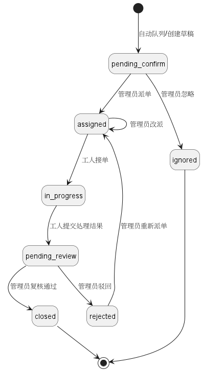

关键约束：

- **忙闲锁**：工人持有 `assigned` 或 `in_progress` 工单时视为忙碌，不能再接第二张活动工单。
- **设备级去重**：同一设备同一时刻只允许一张未关闭工单。
- **设备级修复**：工单复核关闭代表整台设备修复，系统登记维修干预，未来该设备异常被抑制。
- **同设备联动关闭**：一台设备关闭工单后，同设备其它未关闭工单可被标记为随同设备修复关闭。
- **联动原因记录**：因设备级修复关闭同设备其它未关闭工单时，必须在被联动工单的 timeline 中记录“随同设备修复关闭”原因。
- **现场附件可复核**：工人提交的现场说明、备件、安全确认和附件元数据随工单保存，管理员复核页面必须可查看。
- **时间线审计**：每次创建、派单、接单、提交、复核、关闭、驳回、忽略都写入 timeline。

#### 4.3.4 时间沙盘与反事实设计

时间沙盘通过业务日期控制数据可见性和未来演化：

| 机制 | 设计 |
| :--- | :--- |
| 默认起点 | `2026-05-01` |
| 数据切片 | 只展示 `timestamp <= current_date` 的数据。 |
| 推进时间 | `advance_day(days)` 推进业务日期并揭开后续数据。 |
| 定时故障 | 起点后第 3 天开始，每 3 天选择部分运行设备注入劣化。 |
| 维修干预 | 工单关闭后登记 `equipment_id` 和生效日期，未来恢复正常。 |
| 时间自洽 | 工单时间、报告时间、预算状态均跟随沙盘时间。 |

反事实分析比较三种策略：

1. 立即处理。
2. 延迟 N 天处理。
3. 完全不处理。

输出指标包括累计浪费电量、累计损失、碳排、新增异常次数、立即处理相对延迟/不处理的可节省量和决策句。

#### 4.3.5 预算、KPI 与 ROI 决策设计

**预算基线**

```text
季节中性日均 = mean(每日总电耗 / 月份季节系数)
期望运行水平 = 季节中性日均 * 当月季节系数 * 30
预算 budget_kwh = 期望运行水平 * 0.97
```

季节系数：

| 月份 | 1 | 2 | 3 | 4 | 5 | 6 | 7 | 8 | 9 | 10 | 11 | 12 |
| :--- | :--- | :--- | :--- | :--- | :--- | :--- | :--- | :--- | :--- | :--- | :--- | :--- |
| 系数 | 1.06 | 1.02 | 1.01 | 0.94 | 0.97 | 1.04 | 1.15 | 1.18 | 1.02 | 0.95 | 0.98 | 1.08 |

**KPI 评分**

| 维度 | 权重 | 扣分逻辑 |
| :--- | :--- | :--- |
| 预算控制 | 40 | 执行率每超过目标线 1% 扣 4 分，最多扣 40。 |
| COP 达标 | 15 | COP 达标率不足时按差距扣分。 |
| 异常高发 | 15 | 单月异常数量超过阈值后扣分。 |
| 异常响应及时率 | 10 | 工单响应及时率不足时扣分。 |

预算分析必须输出超预算楼栋、风险等级、预测执行率和闭环改善摘要。已关闭工单的预计节省进入预算改善汇总，并与异常损失、运营报告和问答使用同一电价、碳排和节省比例口径。

**ROI 经济评价**

```text
CFt = 年净节省 * (1 + 电价递增率)^(t-1)
NPV = -投资 + Σ CFt / (1 + 折现率)^t
IRR = 使 NPV = 0 的折现率
EAA = NPV * r / (1 - (1+r)^(-n))
动态回收期 = 折现累计现金流首次 >= 投资的年份
```

主判据：先筛选 `NPV(8%) > 0` 的方案，再按 `EAA` 最大择优；动态回收期作为辅助解释。

ROI 审计只输出目标建筑实际存在且有实测能耗数据的设备类型；不存在于该建筑或缺少样本数据的设备类型不得出现在推荐或比较结果中。运营报告的生成时间和业务时间均读取沙盘状态，保证预算、ROI、报告和 AI 问答时间口径一致。

### 4.4 智能增强层设计

#### 4.4.1 知识库管理 (Knowledge Base)

知识库目录结构：

```text
knowledge_base/
  ├─ manuals/
  ├─ glossary/
  └─ faq/
```

知识库用途：

- 为 AI 助手提供术语、规则、设备维护手册和演示问答依据。
- 为 MCP `search_energy_knowledge` 工具返回引用。
- 为运维解释、标准作业建议和后续追问提供文本素材。

#### 4.4.2 可信智能问答服务 (Grounded Assistant)

问答服务采用“本地规则回答优先 + 实时上下文接地 + 知识库引用 + 可选外部模型增强”的设计。

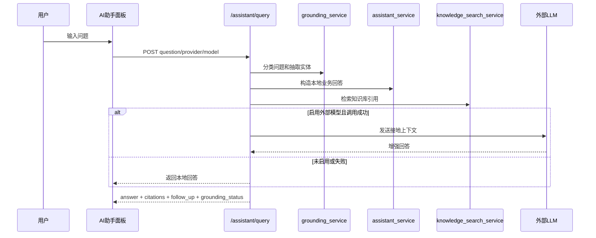

#### 4.4.3 MCP 工具服务 (MCP Server)

MCP Server 位于 `backend/app/mcp_server.py`，通过 `FastMCP` 暴露工具、资源和 prompt。其设计原则是“能力复用而非另写一套逻辑”：MCP Tools 调用 `analysis_service`、`data_loader`、`work_order_store`、`assistant_service` 等现有服务函数，与 Web 前端保持同一口径。

MCP 主要能力：

- 数据集元信息和建筑清单。
- 能耗记录查询。
- 总览、时间汇总、建筑对比、COP 排名。
- 异常列表、原因统计、单条异常解释。
- 楼层汇总、设备摘要、建议工单、优化建议。
- 管理员业务看板、工人工单看板、工单详情。
- 运营报告、知识库检索、智能问答。

---

## 5. 子系统详细设计 (Subsystem Detailed Design, Logical/Structure/Interaction Viewpoints)

本章提供逻辑视图、结构视图和交互视图，定义主要设计元素的职责、依赖、交互时序和可执行边界。

### 5.1 数据与分析子系统 (Data and Analytics Subsystem)

#### 5.1.1 功能描述

数据与分析子系统负责加载能耗记录、应用沙盘过滤、派生业务维度、构建统计图表数据、识别异常、解释异常、生成优化建议和运营报告。

主要输入：

- `data/samples/energy_records.csv`
- MySQL `energy_readings` 表（可选）
- 时间沙盘当前日期
- 建筑、楼层、时间等筛选参数

主要输出：

- 总览 KPI。
- 记录列表。
- 时间汇总、建筑对比、COP 排名。
- 异常明细、异常解释、异常原因分布。
- 楼层汇总、楼层台账、设备摘要。
- 优化建议和运营报告。

#### 5.1.2 核心类/函数设计

| 文件/函数 | 职责 |
| :--- | :--- |
| `data_loader.read_dataset()` | 读取 CSV 或数据库能耗数据，并校验必需字段。 |
| `data_loader.get_filtered_dataset()` | 根据建筑、时间和沙盘状态返回可见数据切片。 |
| `analysis_service.build_analysis_frame()` | 添加楼层、设备类型、异常、业务影响等分析字段。 |
| `analysis_service.build_overview()` | 构建总览 KPI。 |
| `analysis_service.build_time_summary()` | 构建时段汇总。 |
| `analysis_service.build_anomaly_summary()` | 输出异常列表。 |
| `analysis_service.build_anomaly_explanation()` | 输出单条异常解释。 |
| `analysis_service.build_operation_report()` | 汇总运营日报。 |

### 5.2 工单与权限子系统 (Work Order and Permission Subsystem)

#### 5.2.1 功能描述

工单与权限子系统负责将异常记录转化为可执行任务，并约束管理员和工人的操作边界。它覆盖工单创建、自动待确认队列、派单、接单、提交、复核、驳回、关闭、忽略、现场附件和历史案例支持。

#### 5.2.2 核心对象设计

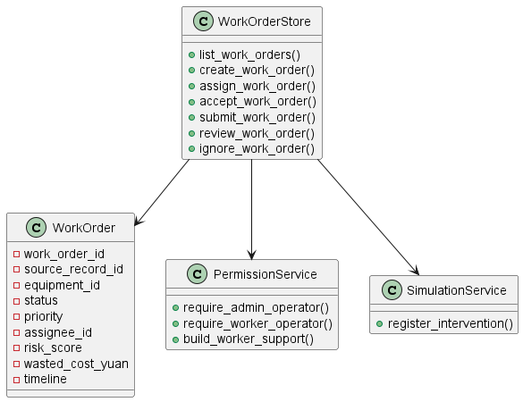

关键异常：

| 异常 | 触发场景 | HTTP 映射 |
| :--- | :--- | :--- |
| `WorkerBusyError` | 工人已有 `assigned/in_progress` 工单仍被派新单。 | 409 |
| `EquipmentAlreadyHandledError` | 同设备已有未关闭工单或已修复仍重复派单。 | 409 |
| `PermissionDenied` | 非授权角色执行操作。 | 403 |

### 5.3 时间沙盘与决策子系统 (Simulation and Decision Subsystem)

#### 5.3.1 功能描述

时间沙盘与决策子系统负责控制业务时间、注入未来故障、登记维修干预、生成反事实对照、排序待处理工单并输出资源约束派单计划。

#### 5.3.2 交互时序设计

**管理员关闭工单并影响未来**

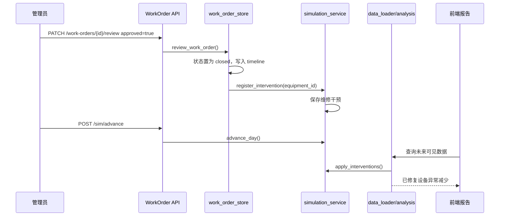

**资源约束派单**

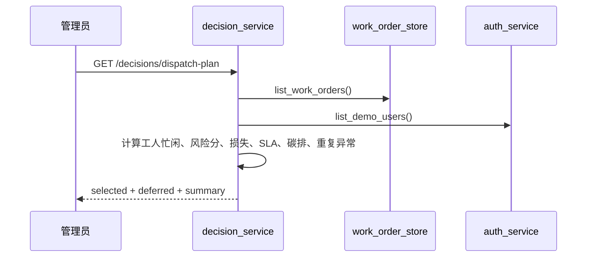

### 5.4 预算与 ROI 子系统 (Budget and ROI Subsystem)

#### 5.4.1 功能描述

预算与 ROI 子系统负责把运维行动和经济决策关联起来。预算服务根据季节中性基线生成月度预算，并计算执行率、预测执行率和年度 KPI；ROI 服务根据设备年化能耗、改造投资和节能率计算经济指标；决策服务汇总关闭工单对预算预测的改善，并识别反复异常设备形成改造候选池。

#### 5.4.2 核心类/函数设计

| 文件/函数 | 职责 |
| :--- | :--- |
| `budget_service.auto_generate_budgets()` | 自动生成建筑月度预算。 |
| `budget_service.build_budget_analysis()` | 汇总预算执行率、风险状态和预测。 |
| `budget_service.build_budget_kpi()` | 计算年度 KPI 分数和等级。 |
| `roi_service.build_equipment_audit()` | 按建筑输出设备能效审计。 |
| `roi_service.analyze_roi_project()` | 计算单个改造项目 ROI。 |
| `roi_service.compare_scenarios()` | 比较多个改造方案。 |
| `decision_service.summarize_budget_impact_from_closures()` | 计算已关闭工单对预算预测的改善。 |
| `decision_service.find_roi_candidates_from_repeated_anomalies()` | 识别改造候选设备。 |

### 5.5 智能服务子系统 (Intelligent Service Subsystem)

#### 5.5.1 功能描述

智能服务子系统面向两类使用者：Web 端 AI 助手用户和 MCP 客户端。它需要在保证事实来源可靠的前提下回答建筑能源、异常、工单、预算、ROI 和项目说明相关问题。

#### 5.5.2 核心交互设计

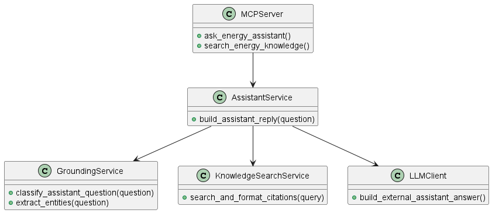

问答响应结构包含：

- `answer`
- `citations`
- `follow_up`
- `llm_used`
- `llm_provider`
- `llm_model`
- `grounding_used`
- `grounding_sources`
- `grounding_status`
- `validation_warnings`
- `referenced_entities`

### 5.6 前端展示子系统 (Frontend Subsystem)

#### 5.6.1 功能描述

前端展示子系统负责将复杂业务闭环组织为可演示、可操作的单页工作台。页面通过角色登录切换管理员视图和工人视图，通过统一 API 封装调用后端。

#### 5.6.2 组件设计

| 组件 | 职责 |
| :--- | :--- |
| `AppHeader.vue` | 顶部标题、登录状态和全局导航区域。 |
| `TabNavigation.vue` | 工作台页签导航。 |
| `KpiCard.vue` | 总览和看板 KPI 卡片。 |
| `TrendChart.vue` | 时间趋势图。 |
| `BuildingComparisonChart.vue` | 建筑对比图。 |
| `AnomalyReasonChart.vue` | 异常原因分布图。 |
| `BuildingRiskScene.vue` | 三维楼层风险态势视图。 |
| `DataTable.vue` | 通用数据表。 |
| `AssistantPanel.vue` | AI 助手问答、引用和模型状态。 |
| `BudgetPanel.vue` | 预算生成、分析和 KPI 展示。 |
| `ROIPanel.vue` | 设备审计、ROI 分析和方案比较。 |
| `StatusBanner.vue`、`EmptyState.vue`、`LoadingSpinner.vue` | 状态反馈和空态处理。 |

---

## 6. 数据库设计 (Database Design, Information Viewpoint)

本章提供系统的信息视图 (Information View)，描述数据对象、持久化结构、逻辑关联、文件存储和数据库表设计。

### 6.1 数据库设计原则

1. **默认轻量，按需持久化**：课程演示默认使用 CSV/JSON，启用 `DATABASE_URL` 后切换到 MySQL。
2. **可检索字段单列化**：工单、预算、沙盘等对象中常用过滤字段单独建列并加索引。
3. **完整对象 JSON 保存**：工单时间线、现场照片、预算明细等易变结构保存在 JSON 列，避免频繁迁移表结构。
4. **业务字段逻辑关联**：当前项目以建筑、设备、记录 ID 作为逻辑关联，不强制所有外键，保持导入与演示灵活性。
5. **数据口径可追溯**：关键指标、字段单位和计算公式在数据字典与文档中同步维护。

### 6.2 概念模型设计 (ER Diagram)

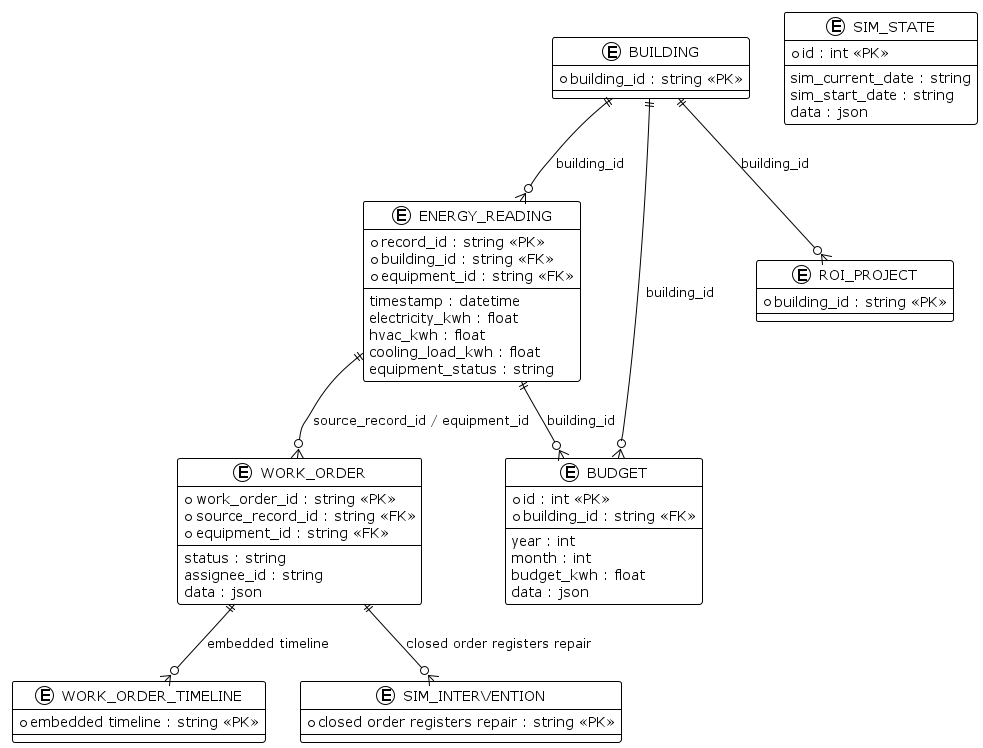

说明：`BUILDING`、`WORK_ORDER_TIMELINE`、`SIM_INTERVENTION`、`ROI_PROJECT` 在当前代码中主要作为派生业务对象或 JSON 内嵌结构存在；MySQL 持久化层实际建表包括 `energy_readings`、`work_orders`、`budgets`、`sim_state`。

### 6.3 物理数据模型 (Data Schema)

#### 6.3.1 能耗读数表

`energy_readings` 由 `backend/app/db/init_db.py` 使用 Pandas `to_sql` 从 CSV 导入，字段与 CSV 列一致。

| 字段 | 类型 | 说明 |
| :--- | :--- | :--- |
| `record_id` | string | 记录唯一标识。 |
| `building_id` | string | 建筑 ID。 |
| `building_name` | string | 建筑名称。 |
| `building_type` | string | 建筑类型。 |
| `timestamp` | datetime | 采集时间。 |
| `electricity_kwh` | float | 总电耗。 |
| `water_m3` | float | 水耗。 |
| `hvac_kwh` | float | 暖通电耗。 |
| `cooling_load_kwh` | float | 制冷负荷。 |
| `chilled_water_supply_temp_c` | float | 冷冻水供水温度。 |
| `chilled_water_return_temp_c` | float | 冷冻水回水温度。 |
| `environment_temp_c` | float | 室外/环境温度。 |
| `humidity_rh` | float | 相对湿度。 |
| `occupancy_density_per_100m2` | float | 人员密度。 |
| `equipment_id` | string | 原始设备编号。 |
| `equipment_status` | string | 设备状态。 |

#### 6.3.2 工单表

对应 SQLAlchemy 模型 `WorkOrderRow`。

| 字段 | 类型 | 索引 | 说明 |
| :--- | :--- | :--- | :--- |
| `work_order_id` | String(64) | 主键 | 工单 ID。 |
| `pos` | Integer | 是 | 插入顺序，保持 JSON 模式排序一致。 |
| `status` | String(32) | 是 | 工单状态。 |
| `assignee_id` | String(64) | 是 | 指派工人。 |
| `building_id` | String(64) | 是 | 所属建筑。 |
| `equipment_id` | String(64) | 否 | 设备 ID。 |
| `priority` | String(16) | 否 | 优先级。 |
| `source_record_id` | String(64) | 是 | 来源异常记录。 |
| `created_at` | String(40) | 否 | 创建时间。 |
| `timestamp` | String(40) | 否 | 异常记录时间。 |
| `data` | JSON | 否 | 完整工单对象，包括时间线和附件。 |

#### 6.3.3 预算表

对应 SQLAlchemy 模型 `BudgetRow`。

| 字段 | 类型 | 索引 | 说明 |
| :--- | :--- | :--- | :--- |
| `id` | Integer | 主键 | 自增 ID。 |
| `pos` | Integer | 是 | 插入顺序。 |
| `building_id` | String(64) | 是 | 建筑 ID。 |
| `year` | Integer | 是 | 年份。 |
| `month` | Integer | 是 | 月份。 |
| `budget_kwh` | Float | 否 | 月度预算电耗。 |
| `data` | JSON | 否 | 完整预算对象。 |

#### 6.3.4 沙盘状态表

对应 SQLAlchemy 模型 `SimStateRow`。

| 字段 | 类型 | 说明 |
| :--- | :--- | :--- |
| `id` | Integer | 固定为 1，全局单例。 |
| `sim_current_date` | String(40) | 当前业务日期。 |
| `sim_start_date` | String(40) | 沙盘起始日期。 |
| `data` | JSON | 完整沙盘状态，包括 interventions。 |

### 6.4 文件存储模型

未配置 MySQL 时，系统使用以下文件：

| 文件 | 说明 |
| :--- | :--- |
| `data/samples/energy_records.csv` | 原始样例能耗数据。 |
| `data/dictionaries/energy_records_dictionary.csv` | 数据字典。 |
| `data/runtime/work_orders.json` | 运行期工单状态。 |
| 预算运行期文件 | 月度预算状态，路径由服务配置管理。 |
| 沙盘运行期文件 | 时间沙盘当前状态，路径由服务配置管理。 |
| `knowledge_base/**/*.md` | 知识库文档。 |

---

## 7. 接口设计 (Interface Design, Interface Viewpoint)

本章提供系统的接口视图 (Interface View)，定义 REST API、MCP、内部服务和外部 LLM 的协议、约束、前置条件、后置条件和异常契约。

### 7.1 接口设计规范 (RESTful API)

基础约定：

- API 前缀：`/api/v1`
- 请求/响应格式：JSON，导出接口除外。
- 列表类返回使用 `items`。
- 时间格式：`YYYY-MM-DD HH:mm:ss` 或 ISO datetime。
- 单位：电耗 `kWh`，水耗 `m3`，费用 `yuan`，碳排 `kgCO2`。
- 错误处理：参数错误、权限错误、资源冲突通过 HTTP 状态码和 `detail` 返回。

REST API 总览：

| 域 | 接口 | 用途 |
| :--- | :--- | :--- |
| 健康检查 | `GET /health` | 后端存活检查。 |
| 数据 | `GET /overview`、`/dataset-meta`、`/buildings`、`/records` | 总览、元信息、建筑清单和记录查询。 |
| 分析 | `GET /analytics/*` | 统计图表、异常、楼层、设备、运营报告。 |
| 认证 | `POST /auth/login`、`GET /auth/me`、`GET /auth/users` | 演示登录和用户列表。 |
| 管理看板 | `GET /admin/dashboard`、`GET /admin/worker-dashboard/{user_id}` | 管理员和工人看板。 |
| 异常事件 | `GET /anomaly-events/{record_id}` | 异常上下文。 |
| 工单 | `GET/POST/PATCH /work-orders` | 工单完整状态机。 |
| 沙盘 | `GET /sim/state`、`POST /sim/start`、`/advance`、`/reset`、`/counterfactual` | 时间沙盘和反事实。 |
| 预算 | `/budget/budgets*` | 预算生成、预算分析、KPI。 |
| ROI | `/roi/audit/{building_id}`、`/roi/analyze`、`/roi/compare` | 改造经济性分析。 |
| 决策 | `/decisions/*` | 派单优先级、派单计划、预算影响、ROI 候选。 |
| 助手 | `/assistant/query`、`/assistant/providers` | 智能问答和模型配置展示。 |
| 导出 | `/export/csv` | CSV 文件导出。 |
| 演示 | `/demo/reset` | 重置演示状态。 |

### 7.2 内部子系统接口

#### 7.2.1 服务层接口

路由层不直接写复杂业务逻辑，统一调用服务层函数：

| 路由文件 | 服务依赖 |
| :--- | :--- |
| `routes/data.py` | `data_loader`、`analysis_service` |
| `routes/analytics.py` | `analysis_service`、`data_loader`、`work_order_store` |
| `routes/work_orders.py` | `work_order_store`、`permission_service` |
| `routes/simulation.py` | `simulation_service`、`scenario_service` |
| `routes/budget.py` | `budget_service`、`permission_service` |
| `routes/roi.py` | `roi_service`、`permission_service` |
| `routes/decision.py` | `decision_service`、`permission_service` |
| `routes/assistant.py` | `assistant_service`、`knowledge_search_service`、`llm_client` |

#### 7.2.2 后端与外部 LLM 接口

外部 LLM 使用 OpenAI-compatible API，配置项来自 `.env`。调用设计：

1. 前端可选择 provider/model，也可使用默认模型。
2. 后端构造本地回答、引用和业务上下文。
3. 若 `LLM_ENABLED=true` 且 API Key 可用，则调用外部模型增强回答。
4. 若外部调用失败、超时或未启用，则返回本地回答，响应结构保持一致。
5. API Key 不返回前端，`/assistant/providers` 仅返回供应商、模型、标签和是否配置。

**外部 LLM 接口约束**

| 约束项 | 设计 |
| :--- | :--- |
| 协议形态 | OpenAI-compatible Chat Completions HTTP API。 |
| 配置来源 | `LLM_ENABLED`、`LLM_PROVIDER`、`LLM_BASE_URL`、`LLM_MODEL`、`LLM_API_KEY` 或供应商专用 Key。 |
| 默认超时 | `LLM_TIMEOUT_SECONDS=20` 秒，可在 `.env` 中调整。 |
| 最大输出 | `LLM_MAX_TOKENS=768`，避免演示场景长时间等待。 |
| 随机性 | `LLM_TEMPERATURE=0.2`、`LLM_TOP_P=0.7`，优先稳定回答。 |
| 上下文输入 | 本地业务回答、知识库引用、实体识别结果和用户问题。 |
| 密钥暴露 | API Key 只在后端使用，前端和 MCP 响应均不得返回。 |

**异常契约与降级策略**

| 异常类型 | 典型状态/原因 | 捕获逻辑 | 标准降级行为 |
| :--- | :--- | :--- | :--- |
| 未启用外部模型 | `LLM_ENABLED=false` | 不发起外部 HTTP 请求。 | 直接返回本地规则与知识库回答，`llm_used=false`。 |
| 供应商未配置 | API Key 为空、provider/model 不存在 | `/assistant/providers` 标记 `configured=false`，问答阶段跳过外部调用。 | 返回本地回答，保留引用和后续问题。 |
| 请求超时 | 超过 `LLM_TIMEOUT_SECONDS` | `llm_client` 捕获超时异常。 | 返回本地回答，`validation_warnings` 记录外部模型超时。 |
| 限流/额度耗尽 | HTTP 429 Too Many Requests | 捕获非 2xx 响应并转换为外部增强失败。 | 返回本地回答，`llm_used=false`，不影响页面可用。 |
| 服务端错误 | HTTP 500/502/503/504 | 捕获外部服务错误。 | 返回本地回答，保留 `grounding_status` 和 citations。 |
| 响应格式异常 | 非 JSON、缺少 answer/content 字段 | 捕获解析异常。 | 丢弃外部响应，返回本地回答。 |
| 事实校验未通过 | 外部回答引用不存在的建筑、设备、工单或与本地上下文冲突 | `grounding_service` 对实体和引用进行校验并生成 warning。 | 丢弃外部回答，返回本地可信回答，`grounding_status=local_fallback`。 |
| 网络不可达 | DNS、连接失败、代理错误 | 捕获请求异常。 | 返回本地回答，并提示外部模型暂不可用。 |

**降级响应 JSON 结构**

外部 LLM 失败时，`POST /assistant/query` 和 MCP `ask_energy_assistant` 仍返回同构响应，示例如下：

```json
{
  "answer": "基于本地数据、工单和知识库生成的回答。",
  "citations": [
    {"title": "知识库或业务来源", "path": "knowledge_base/..."}
  ],
  "follow_up": ["可继续追问的问题"],
  "llm_used": false,
  "llm_provider": null,
  "llm_model": null,
  "grounding_used": true,
  "grounding_sources": ["analytics", "work_orders", "knowledge_base"],
  "grounding_status": "local_fallback",
  "validation_warnings": ["外部模型调用失败，已回退本地可信回答。"],
  "referenced_entities": {}
}
```

设计约束：外部 LLM 仅作为增强层，不是核心业务链路的单点依赖；任何外部失败都不得导致 REST API 500 或前端空白。

### 7.3 前后端交互接口

前端 `frontend/src/lib/api.js` 统一封装 API 调用：

| 前端函数 | 后端接口 |
| :--- | :--- |
| `fetchOverview()` | `GET /overview` |
| `fetchRecords(params)` | `GET /records` |
| `fetchAnomalies(params)` | `GET /analytics/anomalies` |
| `createPersistentWorkOrder(payload)` | `POST /work-orders` |
| `assignPersistentWorkOrder(id, payload)` | `PATCH /work-orders/{id}/assign` |
| `acceptPersistentWorkOrder(id, payload)` | `PATCH /work-orders/{id}/accept` |
| `submitPersistentWorkOrder(id, payload)` | `PATCH /work-orders/{id}/submit` |
| `reviewPersistentWorkOrder(id, payload)` | `PATCH /work-orders/{id}/review` |
| `fetchSimState()` | `GET /sim/state` |
| `advanceSimulation(days)` | `POST /sim/advance` |
| `fetchBudgetAnalysis(year, month)` | `GET /budget/budgets/analysis` |
| `fetchEquipmentAudit(buildingId)` | `GET /roi/audit/{building_id}` |
| `queryAssistant(question, modelSelection)` | `POST /assistant/query` |

#### 7.3.1 关键业务接口契约

下表补充关键接口的设计元素属性，包括功能、依赖项、前置条件和后置条件。若前置条件不满足，接口应返回 403、404、409 或 422 等明确错误，而不是静默修改状态。

| 前端函数 / REST 接口 | 功能 | 依赖项 | 前置条件 (Pre-condition) | 后置条件 (Post-condition) |
| :--- | :--- | :--- | :--- | :--- |
| `loginUser` / `POST /auth/login` | 用户登录并获取演示 token。 | `auth_service.authenticate_user` | 用户存在、启用且密码匹配。 | 返回公开用户信息和 `demo-token:<user_id>`；不返回密码。 |
| `createPersistentWorkOrder` / `POST /work-orders` | 从异常记录创建持久化工单。 | `work_order_store.create_work_order_from_anomaly`、`permission_service` | 调用者为管理员；来源异常记录存在；目标设备不存在未关闭工单；目标设备未被登记为已修复。 | 创建工单并写入存储；状态为 `pending_confirm` 或 `assigned`；Timeline 增加创建记录；若带 `assignee_id` 则校验工人忙闲。 |
| `assignPersistentWorkOrder` / `PATCH /work-orders/{id}/assign` | 管理员派单或改派。 | `work_order_store.assign_work_order`、`auth_service.resolve_worker_for_equipment` | 调用者为管理员；工单存在；工单未关闭/未忽略；目标工人存在且未持有 `assigned/in_progress` 工单；同设备无冲突活动工单。 | 工单状态变为 `assigned`；更新 `assignee_id/assignee_name`；Timeline 增加派单记录。 |
| `acceptPersistentWorkOrder` / `PATCH /work-orders/{id}/accept` | 工人接单。 | `work_order_store.accept_work_order`、`permission_service.require_worker_operator` | 调用者为 worker；工单存在；工单状态为 `assigned`；工单指派给当前工人。 | 工单状态变为 `in_progress`；Timeline 增加接单记录；该工人进入忙碌状态。 |
| `submitPersistentWorkOrder` / `PATCH /work-orders/{id}/submit` | 工人提交处理结果并进入待复核。 | `work_order_store.submit_work_order` | 调用者为 worker；工单存在；工单状态必须为 `in_progress`；工单指派给当前工人；必须填写 `actual_cause` 和 `resolution_note`。 | 工单状态变为 `pending_review`；写入实际原因、处理结果、恢复确认、备件、安全说明和附件；Timeline 增加提交记录；工人从忙碌状态释放。 |
| `reviewPersistentWorkOrder` / `PATCH /work-orders/{id}/review` | 管理员复核工单。 | `work_order_store.review_work_order`、`simulation_service.register_intervention` | 调用者为管理员；工单存在；工单状态为 `pending_review`；`approved` 字段明确为 true/false。 | 若 `approved=true`，工单状态变为 `closed`，登记设备级维修干预，并关闭同设备冲突工单且记录联动原因；若 `approved=false`，状态变为 `rejected`；Timeline 增加复核记录。 |
| `ignorePersistentWorkOrder` / `PATCH /work-orders/{id}/ignore` | 管理员忽略无需处理的工单。 | `work_order_store.ignore_work_order` | 调用者为管理员；工单存在；工单未关闭。 | 工单状态变为 `ignored`；Timeline 增加忽略记录；不登记维修干预。 |
| `advanceSimulation` / `POST /sim/advance` | 推进业务日期。 | `simulation_service.advance_day` | 沙盘已启动；`days` 为正整数。 | `current_date` 前移指定天数；后续查询只展示新业务日期及以前数据；定时故障和维修干预在分析时生效。 |
| `fetchCounterfactualScenario` / `POST /sim/counterfactual` | 比较立即/延迟/不处理策略。 | `scenario_service.build_counterfactual_scenarios` | 来源异常记录存在；请求包含有效 `record_id` 和延迟天数。 | 返回三种策略的累计损失、电量、碳排、异常次数和决策句；不修改持久化状态。 |
| `setBudget` / `POST /budget/budgets` | 设置或更新月度预算。 | `budget_service.set_budget` | 调用者为管理员；建筑 ID、年份、月份和预算电耗合法；预算电耗非负。 | 写入预算对象；后续预算分析和 KPI 使用新预算。 |
| `analyzeROIProject` / `POST /roi/analyze` | 计算单个改造项目经济性。 | `roi_service.analyze_roi_project` | 调用者为管理员；建筑、设备类型、投资额合法；投资额大于 0。 | 返回 NPV、IRR、EAA、动态回收期、含碳价情景和敏感性结果；不修改业务状态。 |
| `queryAssistant` / `POST /assistant/query` | 智能问答。 | `assistant_service`、`grounding_service`、`knowledge_search_service`、`llm_client` | 问题长度满足最小要求；若选择外部模型，provider/model 应存在于配置列表。 | 返回回答、引用、后续问题、接地状态和 LLM 使用状态；前端以 citations/grounding_sources 展示来源标签；外部失败或事实校验未通过时回退本地回答且响应结构不变。 |

### 7.4 MCP 接口设计

#### 7.4.1 MCP Tools

| Tool | 用途 |
| :--- | :--- |
| `get_dataset_meta` | 获取字段、建筑、记录数和时间范围。 |
| `list_buildings` | 获取建筑清单。 |
| `query_energy_records` | 查询能耗记录。 |
| `get_energy_overview` | 获取总览 KPI。 |
| `get_time_summary` | 获取时段汇总。 |
| `get_building_comparison` | 获取建筑对比。 |
| `get_cop_ranking` | 获取 COP 排名。 |
| `get_anomalies` | 获取异常记录。 |
| `get_anomaly_reasons` | 获取异常原因统计。 |
| `explain_anomaly` | 解释单条异常。 |
| `get_floor_summary` | 获取楼层/区域汇总。 |
| `get_equipment_summary` | 获取设备摘要。 |
| `suggest_anomaly_work_orders` | 生成建议工单但不写入持久化。 |
| `get_optimization_recommendations` | 获取节能优化建议。 |
| `get_operation_report` | 生成运营报告。 |
| `get_admin_business_dashboard` | 管理员业务闭环看板。 |
| `list_persistent_work_orders` | 查询持久化工单和状态统计。 |
| `get_worker_business_dashboard` | 工人业务看板。 |
| `get_work_order_detail` | 单个工单详情和时间线。 |
| `get_anomaly_event_context` | 异常事件、设备和关联工单上下文。 |
| `search_energy_knowledge` | 检索本地知识库。 |
| `ask_energy_assistant` | 智能运维问答。 |

#### 7.4.2 MCP Resources

| Resource URI | MIME | 用途 |
| :--- | :--- | :--- |
| `energy://dataset/meta` | `application/json` | 数据集元信息。 |
| `energy://buildings` | `application/json` | 建筑清单。 |
| `energy://operation/report` | `application/json` | 当前全量运营报告。 |
| `energy://knowledge/readme` | `text/markdown` | 知识库入口文档。 |

#### 7.4.3 MCP Prompt

`energy_operation_prompt(question)` 用于生成面向建筑能源运维助手的工具使用提示，要求 AI 客户端优先调用 MCP 工具检查数据、COP、异常、工单建议和知识库引用。

---

## 8. 安全设计 (Security Design, Cross-cutting Interface/Information Concerns)

本章从接口视图和信息视图的横切关注点描述认证、访问控制、密钥保护、数据安全和操作审计。

### 8.1 身份认证与会话管理 (Authentication & Session)

当前系统为课程演示系统，采用轻量 token：

- 登录成功返回 `demo-token:<user_id>`。
- `GET /auth/me` 从 Authorization Header 解析当前用户。
- 前端在调用管理员类接口时附带 `operator_id`。
- 演示账号密码保存在代码中，仅用于本地课程演示，不作为生产级认证方案。

后续生产化应升级为：

- 密码哈希存储。
- JWT 签名和过期时间。
- 刷新 token。
- 登录失败限制。
- 统一用户表、角色表和权限表。

### 8.2 访问控制策略 (Access Control)

| 操作 | 角色要求 | 设计 |
| :--- | :--- | :--- |
| 查看总览、分析、报告 | 管理员为主 | 前端按角色展示，后端读接口保持演示友好。 |
| 创建/派单/复核/忽略工单 | 管理员 | `require_admin_operator` 校验。 |
| 接单/提交工单 | 工人 | `require_worker_operator` 校验，并校验 assignee。 |
| 预算、ROI、决策 | 管理员 | 路由层 `_require_admin`。 |
| 工人看板 | 指定工人 | 只返回该工人相关任务。 |
| 外部模型配置 | 后端读取 | 前端只能看到是否配置，不暴露 Key。 |

### 8.3 数据安全与隐私保护 (Data Security)

- `.env` 被 `.gitignore` 排除，不提交真实密钥。
- `.env.example` 只包含占位配置。
- 外部模型 API Key 只在后端读取，不返回前端。
- 运行期工单和现场附件默认位于 `data/runtime/`，避免污染代码仓库。
- 现场照片以 base64 保存仅用于课程演示；生产环境应改为对象存储并加访问控制。
- MCP Server 默认本地 stdio，HTTP 模式建议仅绑定 `127.0.0.1`。

### 8.4 操作审计设计

系统通过工单 timeline 实现演示级审计：

| 审计项 | 记录内容 |
| :--- | :--- |
| 创建工单 | 操作人、时间、来源异常、设备、初始状态。 |
| 派单 | 管理员、被指派工人、备注、状态变化。 |
| 接单 | 工人、接单时间、备注。 |
| 提交复核 | 实际原因、处理结果、恢复确认、备件、安全说明、附件。 |
| 复核 | 管理员、是否通过、复核意见、关闭时间或驳回原因。 |
| 忽略 | 管理员、忽略原因。 |

---

## 9. 非功能性设计 (Non-functional Design, Resource Viewpoint)

本章提供资源视图 (Resource View)，描述性能、可靠性、可扩展性、可维护性和可测试性等运行资源与质量属性设计。

### 9.1 性能设计 (Performance)

| 设计项 | 说明 |
| :--- | :--- |
| 数据规模 | 当前 4,864 条记录，适合内存 DataFrame 分析。 |
| 缓存 | 数据读取、可见数据切片和分析注释使用缓存，减少重复计算。 |
| 接口响应 | 常规查询、图表和工单接口应满足课堂演示流畅性。 |
| MCP 限流 | 查询类工具使用 `limit` 控制返回条数，避免大响应。 |
| 前端渲染 | 表格、图表和 3D 风险视图按当前筛选范围展示，避免一次渲染过量数据。 |

### 9.2 可靠性与可用性 (Reliability & Availability)

- CSV 文件缺失或字段错误时，后端应返回明确错误。
- 外部 LLM 调用失败时回退本地回答。
- 未配置 MySQL 时自动使用文件模式。
- 工单非法状态跳转、工人忙闲冲突、设备重复派单通过异常和 HTTP 409 阻止。
- 一键重置可恢复演示初始状态。
- 测试覆盖数据、分析、工单、MCP、预算、ROI、沙盘和问答。

### 9.3 可扩展性 (Scalability)

- 新增建筑或设备类型：扩展 CSV 数据、数据字典和设备类型推断规则。
- 新增工人专业方向：扩展 `DEMO_USERS` 和 `resolve_worker_for_equipment`。
- 新增预算或 ROI 参数：扩展 `budget_service.py`、`roi_service.py` 并同步文档。
- 新增 MCP 工具：在 `mcp_server.py` 复用服务层函数注册。
- 新增模型供应商：在 `.env` 和 `llm_client.py` 扩展 OpenAI-compatible 配置。
- 生产级数据增长：启用 MySQL，并可进一步增加索引和分页。

### 9.4 可维护性 (Maintainability)

| 设计 | 维护收益 |
| :--- | :--- |
| 路由层与服务层分离 | 接口变更不影响核心算法，MCP 可复用业务逻辑。 |
| Pydantic Schema | 请求体字段集中定义，减少前后端歧义。 |
| 数据仓储封装 | 文件模式和数据库模式可切换。 |
| 编号化 docs 文档 | 需求、设计、经济评价、验收和演示资料可追溯。 |
| 自动化测试 | 防止工单、沙盘、ROI、MCP 等核心逻辑回归。 |

### 9.5 可测试性 (Testability)

测试资产位于 `backend/tests/`，当前测试文件覆盖：

- 健康检查和数据接口。
- 统计分析和建筑详情。
- 认证、权限和工单状态机。
- 工人忙闲锁、设备级修复去重和工单闭环。
- 时间沙盘和反事实。
- 预算、ROI 和决策服务。
- MCP Server 和 stdio 集成。
- LLM Client 和智能问答。

前端通过 `npm run build` 验证构建。

---

## 10. 设计理由说明 (Design Rationale)

### 10.1 架构决策理由

| 决策 | 理由 |
| :--- | :--- |
| 前后端分离 | 便于独立开发、接口测试和课堂演示。 |
| FastAPI 后端 | 轻量、自动生成 OpenAPI 文档、适合 Python 数据分析生态。 |
| Vue 3 + Vite | 启动快、组件化简单、适合单页演示工作台。 |
| 服务层复用 REST 与 MCP | 保证 Web 页面和 AI 客户端看到的数据口径一致。 |
| 默认 CSV/JSON | 零依赖、便于交付和验收环境复现。 |
| 可选 MySQL | 满足持久化、事务和标准数据库设计要求，同时不牺牲默认可运行性。 |

### 10.2 设计模式应用理由

| 模式/思想 | 应用位置 | 作用 |
| :--- | :--- | :--- |
| 分层架构 | 前端、路由、服务、数据、外部增强 | 降低耦合，便于测试和替换。 |
| 仓储模式 | `backend/app/db/repository.py` | 屏蔽文件模式和 MySQL 模式差异。 |
| 策略/规则模式 | 异常检测、设备派工、ROI 措施选择 | 用可解释规则替代硬编码分支扩散。 |
| 状态机 | `work_order_store.py` | 保证工单生命周期清晰可控。 |
| 适配器 | `llm_client.py`、MCP Tools | 适配外部模型协议和 MCP 客户端。 |
| 防腐层 | `grounding_service.py` | 在 LLM 之前注入业务事实和引用，减少幻觉风险。 |

### 10.3 技术选型理由

- Pandas 适合当前课程级数据规模，能快速完成聚合、分组、异常判断和报表计算。
- SQLAlchemy 2 + PyMySQL 能以较小代价接入 MySQL，并保持与文件模式一致的对象结构。
- MCP Python SDK 直接满足面向 AI 客户端的数据接入与工具调用要求。
- ECharts 能覆盖趋势、对比、分布等图表需求；自定义 3D 风险视图增强演示效果。
- OpenAI-compatible 模型接口便于适配 NVIDIA、Groq、OpenRouter、SiliconFlow、本地模型等多种供应商。

### 10.4 约束与权衡

| 约束/权衡 | 当前选择 | 说明 |
| :--- | :--- | :--- |
| 真实数据 vs 合成数据 | 合成样例数据 | 满足课程演示，避免真实传感器依赖；通过 L0-L3 质量模型保证合理性。 |
| 机器学习 vs 可解释规则 | 可解释规则 | 便于答辩说明、测试和稳定复现。 |
| 生产权限 vs 演示权限 | 演示 RBAC | 降低实现复杂度，保留角色边界和权限校验思想。 |
| 数据库强模型 vs JSON 灵活对象 | 检索字段单列 + 完整 JSON | 兼顾查询和工单对象迭代灵活性。 |
| 外部 LLM 依赖 vs 本地回退 | 本地回退优先 | 保证无 Key 或网络失败时仍可演示。 |
| 多页面路由 vs 单页工作台 | 单页工作台 | 降低演示切换成本，减少状态丢失。 |

---

## 11. 需求追踪矩阵 (Requirements Traceability Matrix, RTM)

本章提供需求追踪矩阵，证明 SRS 中的主要用例和需求均被 SDD 中的设计视图、模块、接口和数据结构覆盖，同时避免设计文档创造无法追溯到需求的核心功能。矩阵以 `final_docs/01-SRS-软件需求规格说明书.md` 的用例编号、功能需求和非功能需求为追踪源。

### 11.1 用例与功能需求追踪矩阵

| SRS 需求编号 / 用例 | 需求名称 | 业务规则覆盖 | 对应 SDD 设计视图/章节 | 对应核心组件/API/数据表 |
| :--- | :--- | :--- | :--- | :--- |
| UC-00 / FR-003 | 用户登录与权限管理 | BR-100、BR-101、BR-102、BR-103 | 4.2.1 用户认证与权限管理；8.1 身份认证；8.2 访问控制 | `auth_service.py`、`permission_service.py`、`routes/auth.py`、`POST /auth/login`、`GET /auth/me` |
| UC-01 / FR-001 | 管理样例数据与演示状态 | BR-110、BR-111、BR-112、BR-113 | 3.3.4 数据存储；4.2.3 数据仓储切换；3.5 部署方案 | `data_loader.py`、`demo_service.py`、`POST /demo/reset`、`energy_readings`、CSV/JSON 文件 |
| UC-02 / FR-001、FR-004 | 查看能源总览与数据查询 | BR-120、BR-121、BR-122、BR-123 | 4.3.1 建筑能源数据生命周期；5.1 数据与分析子系统；7.1 REST API | `routes/data.py`、`build_overview()`、`GET /overview`、`GET /records`、`GET /export/csv`、`energy_readings` |
| UC-03 / FR-002 | 统计分析与异常诊断 | BR-130、BR-131、BR-132、BR-133 | 4.3.2 异常诊断与风险评分；5.1 数据与分析子系统 | `analysis_service.py`、`GET /analytics/time-summary`、`/anomalies`、`/anomaly-explanations/{record_id}` |
| UC-04 / FR-003 | 派发维修工单 | BR-140、BR-141、BR-142、BR-143 | 4.3.3 工单状态机；5.2 工单与权限子系统；7.3.1 接口契约 | `work_order_store.py`、`POST /work-orders`、`PATCH /work-orders/{id}/assign`、`work_orders` |
| UC-05 / FR-003 | 处理现场工单 | BR-150、BR-151、BR-152、BR-153 | 4.3.3 工单状态机；5.2.2 核心对象设计；7.3.1 接口契约 | `PATCH /work-orders/{id}/accept`、`PATCH /work-orders/{id}/submit`、工单 `timeline` JSON |
| UC-06 / FR-003、FR-004 | 复核关闭工单 | BR-160、BR-161、BR-162、BR-163 | 4.3.3 工单状态机；5.3.2 管理员关闭工单时序；8.4 操作审计 | `PATCH /work-orders/{id}/review`、`simulation_service.register_intervention()`、`work_orders`、`sim_state` |
| UC-07 / FR-004 | 时间沙盘与反事实 | BR-170、BR-171、BR-172、BR-173 | 4.3.4 时间沙盘与反事实；5.3 时间沙盘与决策子系统 | `simulation_service.py`、`scenario_service.py`、`GET /sim/state`、`POST /sim/advance`、`POST /sim/counterfactual`、`sim_state` |
| UC-08 / FR-005 | 预算执行与闭环改善 | BR-180、BR-181、BR-182 | 4.3.5 预算、KPI 与 ROI；5.4 预算与 ROI 子系统；6.3.3 预算表 | `budget_service.py`、`decision_service.summarize_budget_impact_from_closures()`、`/budget/budgets*`、`budgets` |
| UC-09 / FR-005 | ROI 改造与运营报告 | BR-190、BR-191、BR-192、BR-193 | 4.3.5 预算、KPI 与 ROI；5.4 预算与 ROI 子系统；7.1 REST API | `roi_service.py`、`analysis_service.build_operation_report()`、`/roi/analyze`、`/roi/compare`、`/analytics/operation-report` |
| UC-10 / FR-006 | 可信智能问答 | BR-200、BR-201、BR-202、BR-203 | 4.4.2 可信智能问答；5.5 智能服务子系统；7.2.2 外部 LLM 异常契约 | `assistant_service.py`、`grounding_service.py`、`knowledge_search_service.py`、`llm_client.py`、`POST /assistant/query` |
| UC-11 / FR-007 | MCP 工具调用 | BR-210、BR-211、BR-212、BR-213 | 4.4.3 MCP 工具服务；7.4 MCP 接口设计 | `backend/app/mcp_server.py`、MCP Tools、MCP Resources |
| UC-12 / FR-008 | 项目检查与质量验收 | BR-220、BR-221、BR-222、BR-223 | 4.2.4 项目脚本与质量检查；9.5 可测试性 | `scripts/check-project.ps1`、`backend/tests/`、`npm run build` |
| FR-001 | 能源数据管理与查询 | BR-110、BR-111、BR-112、BR-113、BR-120、BR-121、BR-122、BR-123 | 4.3.1；6.3.1；6.4 | `energy_readings`、`data/samples/energy_records.csv`、`GET /records`、`GET /export/csv` |
| FR-002 | 统计分析与异常诊断 | BR-130、BR-131、BR-132、BR-133 | 4.3.2 算法视图；5.1 数据与分析子系统 | `analysis_service.py`、异常风险公式、`GET /analytics/*` |
| FR-003 | 角色化工单闭环 | BR-100、BR-101、BR-102、BR-103、BR-140、BR-141、BR-142、BR-143、BR-150、BR-151、BR-152、BR-153、BR-160、BR-161、BR-162、BR-163 | 4.3.3 状态动态视图；5.2 工单子系统；8.4 审计 | `work_order_store.py`、`permission_service.py`、`work_orders.data.timeline` |
| FR-004 | 时间沙盘与反事实 | BR-122、BR-163、BR-170、BR-171、BR-172、BR-173 | 4.3.4；5.3；6.3.4 | `simulation_service.py`、`scenario_service.py`、`sim_state` |
| FR-005 | 预算、ROI 与运营报告 | BR-180、BR-181、BR-182、BR-190、BR-191、BR-192、BR-193 | 4.3.5；5.4；附录D | `budget_service.py`、`roi_service.py`、`decision_service.py`、`budgets` |
| FR-006 | 可信智能问答 | BR-200、BR-201、BR-202、BR-203 | 4.4.2；5.5；7.2.2 | `assistant_service.py`、`llm_client.py`、`knowledge_base/**/*.md` |
| FR-007 | MCP 智能体接入 | BR-210、BR-211、BR-212、BR-213 | 4.4.3；7.4 | `mcp_server.py`、`energy://dataset/meta`、`ask_energy_assistant` |
| FR-008 | 项目检查与质量验收 | BR-220、BR-221、BR-222、BR-223 | 3.5.6 运维管理；9.5 可测试性 | `scripts/*.ps1`、`backend/tests/*.py`、前端构建 |

### 11.2 业务规则追踪矩阵

| SRS 业务规则编号 | 设计落实位置 | 对应核心组件/API |
| :--- | :--- | :--- |
| BR-100、BR-101、BR-102、BR-103 | 4.2.1 用户认证与权限管理；8.1 身份认证；8.2 访问控制；7.3.1 接口契约 | `auth_service.py`、`permission_service.py`、`POST /auth/login`、`GET /auth/users` |
| BR-110、BR-111、BR-112、BR-113 | 3.3.4 数据存储；4.2.3 数据仓储切换；6.4 文件存储模型 | `data/samples/energy_records.csv`、`data/runtime/`、`repository.py`、`DATABASE_URL` |
| BR-120、BR-121、BR-122、BR-123 | 4.3.1 建筑能源数据生命周期；5.1.2 核心函数；7.1 REST API | `get_filtered_dataset()`、`GET /records`、`GET /export/csv`、沙盘过滤 |
| BR-130、BR-131、BR-132、BR-133 | 4.3.2 异常诊断与风险评分；附录D 常量 | `analysis_service.py`、风险评分公式、损失/碳排口径 |
| BR-140、BR-141、BR-142、BR-143 | 4.3.3 工单状态机；5.2 工单与权限子系统；8.4 操作审计 | `work_order_store.py`、`WorkerBusyError`、`EquipmentAlreadyHandledError`、工单 timeline |
| BR-150、BR-151、BR-152、BR-153 | 4.3.3 关键约束；5.2.1 功能描述；7.3.1 接口契约 | `require_worker_operator()`、`submit_work_order()`、附件元数据、管理员复核页 |
| BR-160、BR-161、BR-162、BR-163 | 4.3.3 工单状态机；5.3.2 管理员关闭工单时序；7.3.1 接口契约 | `review_work_order()`、`register_intervention()`、联动关闭 timeline、预算/报告/沙盘反馈 |
| BR-170、BR-171、BR-172、BR-173 | 4.3.4 时间沙盘与反事实；5.3 时间沙盘与决策子系统 | `simulation_service.py`、`scenario_service.py`、`POST /sim/advance`、`POST /sim/counterfactual` |
| BR-180、BR-181、BR-182 | 4.3.5 预算、KPI 与 ROI；5.4 预算与 ROI 子系统 | `budget_service.py`、预算风险等级、闭环改善摘要 |
| BR-190、BR-191、BR-192、BR-193 | 4.3.5 ROI 经济评价；5.4.2 核心函数；7.3.1 接口契约 | `build_equipment_audit()`、`analyze_roi_project()`、`compare_scenarios()`、运营报告沙盘口径 |
| BR-200、BR-201、BR-202、BR-203 | 4.4.2 可信智能问答；5.5 智能服务；7.2.2 外部 LLM 异常契约 | `assistant_service.py`、`grounding_service.py`、citations、`grounding_status=local_fallback` |
| BR-210、BR-211、BR-212、BR-213 | 4.4.3 MCP 工具服务；7.4 MCP 接口设计 | `backend/app/mcp_server.py`、MCP Tools、MCP Resources、事实校验复用 |
| BR-220、BR-221、BR-222、BR-223 | 4.2.4 项目脚本与质量检查；8.3 配置安全；9.5 可测试性 | `scripts/check-project.ps1`、`backend/tests/`、前端构建、`.gitignore` |

### 11.3 接口需求追踪矩阵

| SRS 接口编号 | 接口需求名称 | 对应 SDD 章节 | 对应核心组件/API |
| :--- | :--- | :--- | :--- |
| IR-REST-01 | 健康检查 | 7.1 REST API 总览 | `GET /health` |
| IR-REST-02 | 数据接口 | 4.3.1；7.1 REST API 总览 | `GET /overview`、`GET /dataset-meta`、`GET /buildings`、`GET /records` |
| IR-REST-03 | 分析接口 | 4.3.2；7.1 REST API 总览 | `GET /analytics/time-summary`、`building-comparison`、`cop-ranking`、`anomalies`、`anomaly-explanations/{record_id}` |
| IR-REST-04 | 认证接口 | 4.2.1；8.1 身份认证 | `POST /auth/login`、`GET /auth/me`、`GET /auth/users` |
| IR-REST-05 | 管理看板接口 | 4.2.2；5.6 前端组件映射 | `GET /admin/dashboard`、`GET /admin/worker-dashboard/{user_id}` |
| IR-REST-06 | 异常事件接口 | 4.3.2；5.1 数据与分析子系统 | `GET /anomaly-events/{record_id}` |
| IR-REST-07 | 工单接口 | 4.3.3；5.2；7.3.1 接口契约 | `GET /work-orders`、`POST /work-orders`、`PATCH /work-orders/{id}/...` |
| IR-REST-08 | 沙盘接口 | 4.3.4；5.3；7.3.1 接口契约 | `GET /sim/state`、`POST /sim/start`、`POST /sim/advance`、`POST /sim/reset`、`POST /sim/counterfactual` |
| IR-REST-09 | 预算接口 | 4.3.5；5.4 | `/budget/*` |
| IR-REST-10 | ROI 接口 | 4.3.5；5.4；7.3.1 接口契约 | `GET /roi/audit/{building_id}`、`POST /roi/analyze`、`POST /roi/compare` |
| IR-REST-11 | 决策接口 | 5.3；5.4 | `/decisions/*` |
| IR-REST-12 | 导出接口 | 4.3.1；7.1 REST API 总览 | `GET /export/csv` |
| IR-REST-13 | 助手接口 | 4.4.2；5.5；7.2.2 外部 LLM 异常契约 | `POST /assistant/query`、`GET /assistant/providers` |
| IR-REST-14 | 演示重置接口 | 4.2.3；9.2 可靠性与可用性 | `POST /demo/reset` |
| IR-COMM-01 | Web 前后端通信 | 3.2；7.1；7.3 | HTTP/JSON、`frontend/src/lib/api.js` |
| IR-COMM-02 | MCP stdio 通信 | 4.4.3；7.4 | `scripts/start-mcp.ps1`、`backend/app/mcp_server.py` |
| IR-COMM-03 | MCP streamable-http 通信 | 3.5；7.4 | MCP transport 参数、host/port 配置 |
| IR-COMM-04 | 外部 LLM 通信 | 7.2.2 外部 LLM 接口 | OpenAI-compatible HTTP API、`llm_client.py` |
| IR-COMM-05 | MySQL 通信 | 3.3.4；6.2；6.3 | `DATABASE_URL`、SQLAlchemy、PyMySQL |
| IR-MCP-01 | 数据元信息和记录查询工具 | 7.4.1 MCP Tools | `get_dataset_meta`、`list_buildings`、`query_energy_records` |
| IR-MCP-02 | 总览和统计分析工具 | 7.4.1 MCP Tools | `get_energy_overview`、`get_time_summary`、`get_building_comparison`、`get_cop_ranking` |
| IR-MCP-03 | 异常诊断工具 | 7.4.1 MCP Tools | `get_anomalies`、`get_anomaly_reasons`、`explain_anomaly` |
| IR-MCP-04 | 楼层、设备、建议与优化工具 | 7.4.1 MCP Tools | `get_floor_summary`、`get_equipment_summary`、`suggest_anomaly_work_orders`、`get_optimization_recommendations` |
| IR-MCP-05 | 运营报告工具 | 7.4.1 MCP Tools | `get_operation_report` |
| IR-MCP-06 | 业务闭环和工单上下文工具 | 7.4.1 MCP Tools | `get_admin_business_dashboard`、`list_persistent_work_orders`、`get_worker_business_dashboard`、`get_work_order_detail` |
| IR-MCP-07 | 知识库检索和问答工具 | 7.4.1 MCP Tools；7.4.2 MCP Resources | `search_energy_knowledge`、`ask_energy_assistant` |

### 11.4 非功能需求追踪矩阵

| SRS 非功能需求 | 需求名称 | 对应 SDD 章节 | 对应设计机制 |
| :--- | :--- | :--- | :--- |
| NFR-001、NFR-002、NFR-003、NFR-004 | 性能需求 | 9.1 性能设计 | Pandas 内存分析、缓存、MCP limit 参数、前端按筛选渲染。 |
| NFR-010、NFR-011、NFR-012、NFR-013、NFR-014 | 安全性需求 | 8. 安全设计；7.2.2 LLM 接口约束 | `.env` 隔离、`.env.example` 占位、API Key 不返回、管理员/工人权限校验、LLM 降级。 |
| NFR-020、NFR-021、NFR-022、NFR-023、NFR-024 | 可靠性需求 | 9.2 可靠性与可用性；7.3.1 接口前/后置条件 | 文件模式回退、外部 LLM 回退、非法状态跳转拒绝、一键重置、无 MySQL/LLM 默认可运行。 |
| NFR-025、NFR-026、NFR-027、NFR-028、NFR-029 | 可维护性需求 | 9.4 可维护性；10.2 设计模式应用理由 | 路由/服务/数据层分离、REST 与 MCP 服务层复用、接口与测试同步、公式常量附录、知识库可扩展。 |
| NFR-030、NFR-031、NFR-032、NFR-033 | 审计与验收需求 | 8.4 操作审计；9.5 可测试性 | 工单 timeline、派单/接单/提交/复核/关闭/驳回/忽略记录、关键数字口径一致、检查脚本和测试。 |

### 11.5 设计元素反向追踪

| SDD 设计元素 | 来源需求/用例 | 不越界说明 |
| :--- | :--- | :--- |
| 时间沙盘与定时故障 | UC-02、UC-06、UC-07、FR-004、BR-122、BR-163、BR-170、BR-171、BR-172、BR-173 | 用于模拟业务日期和处置影响未来，未扩展到真实预测平台。 |
| 设备级修复和重复派单拒绝 | UC-04、UC-05、UC-06、UC-07、FR-003、FR-004、NFR-030、NFR-031、NFR-032 | 保证工单闭环和口径一致，不引入真实资产管理系统。 |
| 预算 KPI 与 ROI | UC-08、UC-09、FR-005 | 用于课程级决策支持，不作为真实财务审计或采购审批。 |
| MCP Server | UC-11、FR-007、IR-MCP-01、IR-MCP-02、IR-MCP-03、IR-MCP-04、IR-MCP-05、IR-MCP-06、IR-MCP-07 | 仅暴露项目数据和分析工具，不替代生产 API 网关。 |
| 外部 LLM 增强 | UC-10、FR-006、BR-200、BR-201、BR-202、BR-203、IR-COMM-04、NFR-021 | 作为可选增强，失败或事实校验未通过时回退本地可信回答。 |
| MySQL 可选持久化 | UC-01、BR-113、IR-COMM-05、NFR-024 | 保持默认 CSV/JSON 可运行，不强制生产级数据库部署。 |

---

## 12. 附录A (Appendix A)

### 12.1 第三方库清单

#### 后端依赖

| 依赖 | 用途 |
| :--- | :--- |
| `fastapi` | REST API 框架。 |
| `uvicorn[standard]` | ASGI 服务运行。 |
| `pandas` | CSV 数据加载、筛选、聚合和分析。 |
| `python-dotenv` | 读取 `.env` 配置。 |
| `pytest` | 自动化测试。 |
| `httpx` | 接口测试和外部 HTTP 调用。 |
| `mcp` | MCP Server 实现。 |
| `SQLAlchemy` | 可选 MySQL ORM/连接管理。 |
| `PyMySQL` | MySQL Python 驱动。 |

#### 前端依赖

| 依赖 | 用途 |
| :--- | :--- |
| `vue` | 前端组件框架。 |
| `vite` | 开发服务与构建工具。 |
| `@vitejs/plugin-vue` | Vue 单文件组件支持。 |
| `echarts` | 图表可视化。 |

### 12.2 修订历史

同“文档修订历史”章节。本附录保留以对齐参考 SDD 的附录组织方式。

---

## 13. 附录B：图片需求清单 (Required Diagrams)

### 13.1 现有图示清单

本文档使用 Mermaid 形式给出以下设计图，便于 Markdown 维护和后续转 PDF：

| 图示 | 所在章节 | 类型 |
| :--- | :--- | :--- |
| 系统上下文图 | 2.3 | Context View |
| 系统逻辑架构图 | 3.2 | Logical Architecture |
| 物理部署架构图 | 3.4 | Deployment |
| 模块划分图 | 4.1 | Composition |
| 工单状态转换图 | 4.3.3 | State Dynamics |
| 工单核心类图 | 5.2.2 | Class Design |
| 管理员关闭工单时序图 | 5.3.2 | Sequence |
| 资源约束派单时序图 | 5.3.2 | Sequence |
| 数据库 ER 图 | 6.2 | Information View |

### 13.2 图片完整性说明

参考 SDD 使用图片文件组织系统上下文图、逻辑架构图、部署图和模块划分图。考虑到本项目最终 Markdown 文档需要便于版本管理和直接阅读，本文档以 Mermaid 图替代外部图片文件。若后续转换为正式 PDF，可通过支持 Mermaid 的工具渲染为图片，也可使用 draw.io 按本文图示重绘。

---

## 14. 附录C：建筑能源业务对象设计详情 (Building Energy Object Design)

### C.1 设计原则

1. 以建筑、楼层、区域、设备和时间作为能源数据主维度。
2. 原始 CSV 不强制包含所有运维字段，楼层、区域和设备类型可由设备编号、建筑类型和规则派生。
3. 异常事件不单独持久化为表，而是由当前可见数据和分析规则动态计算，保证沙盘推进和维修干预能够实时影响结果。
4. 工单是异常事件进入人工处置闭环后的持久化对象。
5. 维修干预以设备为最小单位，而不是单条异常记录。

### C.2 建筑与设备结构

当前数据覆盖 4 栋建筑：

| 建筑 ID | 建筑名称 | 用途 |
| :--- | :--- | :--- |
| `BLD-A` | 综合教学楼A | 教学空间。 |
| `BLD-B` | 行政办公楼B | 办公空间。 |
| `BLD-C` | 图书信息楼C | 图书与信息服务空间。 |
| `BLD-D` | 科研实验楼D | 科研实验空间。 |

设备类型包括：

| 设备类型 | 英文/代号 | 对口工人 |
| :--- | :--- | :--- |
| 冷水机组 | CH | `worker_chiller` |
| 冷却塔 | CT | `worker_chiller` |
| 空气处理机组 | AHU | `worker_ahu` |
| 风机盘管 | FCU | `worker_fcu` |

### C.3 异常事件字段

| 字段 | 说明 |
| :--- | :--- |
| `record_id` | 来源能耗记录。 |
| `building_id` / `building_name` | 建筑定位。 |
| `floor_label` / `zone_name` | 楼层和区域定位。 |
| `equipment_id` / `equipment_type` | 运维设备定位。 |
| `anomaly_reason` | 异常原因，如 COP 低、夜间负荷、设备状态异常。 |
| `triggered_rules` | 触发规则列表。 |
| `risk_score` | 0-100 风险分。 |
| `severity` | 高/中/低。 |
| `sla_hours` | 建议响应时限。 |
| `wasted_kwh` | 估算浪费电量。 |
| `wasted_cost_yuan` | 估算损失金额。 |
| `carbon_kg` | 估算碳排。 |
| `estimated_saving_yuan` | 估算可回收金额。 |

### C.4 数据质量层级

系统采用 L0-L3 数据质量模型：

| 层级 | 目标 | 示例 |
| :--- | :--- | :--- |
| L0 原始数据合理性 | 检查量级、季节性、字段范围和 COP 区间。 | 电耗、水耗、冷量不为负。 |
| L1 单功能逻辑自洽 | 单项算法结果可解释。 | 异常检测、风险分、浪费电量口径一致。 |
| L2 跨功能对齐 | 工单、预算、ROI、报告互相印证。 | 关闭工单影响预算预测。 |
| L3 业务闭环 | 操作能够通过沙盘影响未来。 | 设备修复后未来异常减少。 |

---

## 15. 附录D：工单闭环与经济决策规则矩阵 (Workflow and Decision Configuration Matrix)

### D.1 治理原则

| 原则 | 说明 |
| :--- | :--- |
| **风险优先** | 高风险、高损失、短 SLA 工单优先处理。 |
| **对口专业** | 工单按设备类型分配给对口工人。 |
| **资源有限** | 空闲工人数决定本轮派单容量。 |
| **忙闲锁定** | 工人持有活动工单时不能再被派第二单。 |
| **设备级修复** | 修一台设备即解决该设备当前未闭环异常。 |
| **经济闭环** | 工单关闭后的节省反馈至预算预测和 ROI 候选。 |

### D.2 工单优先级评分矩阵

决策服务使用以下维度为开放工单或实时异常候选排序：

| 维度 | 权重 | 说明 |
| :--- | :--- | :--- |
| 风险分 | 40 | 0-100 风险分归一。 |
| 预计损失 | 25 | 按候选中最大损失归一。 |
| SLA 紧迫度 | 15 | SLA 越短得分越高。 |
| 碳排影响 | 10 | 按候选中最大碳排归一。 |
| 重复异常 | 10 | 同设备重复异常越多得分越高。 |

### D.3 派单路径配置

| 场景 | 条件 | 推荐路径 |
| :--- | :--- | :--- |
| 高风险设备故障 | `risk_score >= 70` 或硬故障 | 管理员确认 -> 对口工人派单 -> 工人接单 -> 提交复核 -> 管理员关闭。 |
| COP 低效 | COP 低于 2.2 且设备可定位 | 管理员确认 -> 设备专业工人检查 -> 记录原因和 COP 恢复情况 -> 复核。 |
| 夜间高负荷 | 夜间负荷异常但风险中低 | 管理员判断 -> 可派单巡检或暂缓观察 -> 报告记录。 |
| 重复异常设备 | 同设备多次异常或累计损失高 | 纳入 ROI 候选 -> 选择改造方案 -> 经济性分析。 |
| 无明显经济差异 | 反事实三情景损失差异小 | 建议巡检或持续观察，不强制展示虚假节省。 |

### D.4 ROI 措施配置

| 设备类型 | 典型功率 | 寿命 | 目标 COP | 变频 | 高效更换 | 智能控制 | 综合方案 |
| :--- | :--- | :--- | :--- | :--- | :--- | :--- | :--- |
| 冷水机组 | 350 kW | 15 年 | 3.6 | 8.0 万 | 12.0 万 | 4.5 万 | 18.0 万 |
| 冷却塔 | 45 kW | 12 年 | 3.2 | 3.0 万 | 4.0 万 | 1.8 万 | 7.0 万 |
| 空气处理机组 | 55 kW | 15 年 | 3.4 | 4.5 万 | 6.0 万 | 2.5 万 | 11.0 万 |
| 风机盘管 | 2.5 kW | 10 年 | 3.0 | 0.3 万 | 0.5 万 | 0.25 万 | 0.8 万 |

措施基准节能率：

| 措施 | 基准节能率 |
| :--- | :--- |
| 变频 | 20% |
| 高效更换 | 35% |
| 智能控制 | 12% |
| 综合方案 | 28% |

### D.5 关键常量速查

| 常量 | 值 | 应用 |
| :--- | :--- | :--- |
| 工商业电价 | 0.82 元/kWh | 异常损失、预算、ROI。 |
| 碳排因子 | 0.5703 kgCO2/kWh | 碳排估算。 |
| 异常检测 σ | 2.0 | 动态阈值。 |
| COP 告警阈值 | 2.2 | 异常和风险评分。 |
| 处置可回收比例 | 0.65 | 异常损失可回收估算。 |
| 风险权重 | 30/35/20/15 | 故障、超耗、COP、夜间。 |
| 高风险阈值 | 70 | 严重度。 |
| 中风险阈值 | 45 | 严重度。 |
| 预算目标系数 | 0.97 | 月度预算。 |
| 社会折现率 | 8% | ROI 主判据。 |
| 敏感性折现率 | 5% / 8% / 10% | ROI 敏感性分析。 |
| 电价递增率 | 3%/年 | ROI 现金流。 |
| 碳价 | 80 元/吨 | ROI 含碳价情景。 |
| 沙盘默认起点 | 2026-05-01 | 时间沙盘。 |
| 定时故障排程 | 首 3 天、步进 3 天、每 2 台取 1 | 沙盘故障注入。 |

### D.6 工单状态种子数据格式（JSON Schema）

```json
{
  "work_order_id": "WO-20260501-001",
  "source_record_id": "REC-20260501-BLD-A-001",
  "building_id": "BLD-A",
  "building_name": "综合教学楼A",
  "floor_label": "3F",
  "zone_name": "教学区",
  "equipment_id": "AHU-A-03-01",
  "equipment_type": "空气处理机组",
  "priority": "高",
  "status": "assigned",
  "assignee_id": "worker_ahu",
  "risk_score": 78.0,
  "wasted_kwh": 120.5,
  "wasted_cost_yuan": 98.81,
  "carbon_kg": 68.72,
  "sla_hours": 8,
  "timeline": [
    {
      "action": "created",
      "operator_id": "admin",
      "at": "2026-05-01 09:00:00",
      "note": "由高风险异常创建工单"
    }
  ]
}
```

---

**文档结束**

---

> **符合标准**：本文档依据 IEEE Std 1016-2009 (IEEE Standard for Information Technology--Systems Design--Software Design Descriptions) 的设计说明思想编写，并与本项目 SRS、API 契约、代码结构和最终交付材料保持一致。
