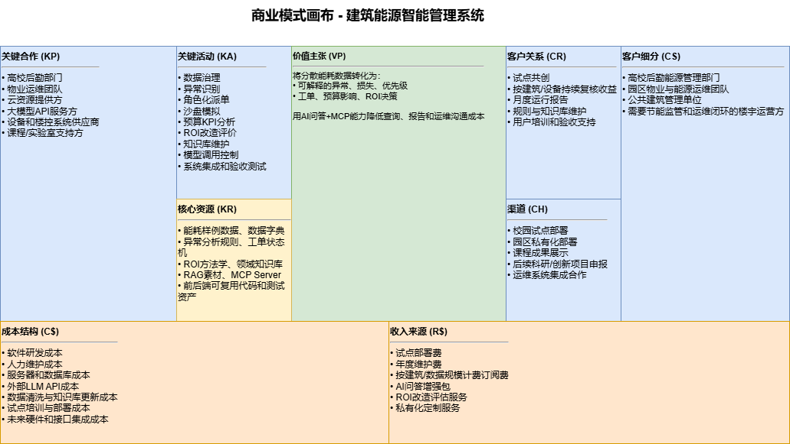
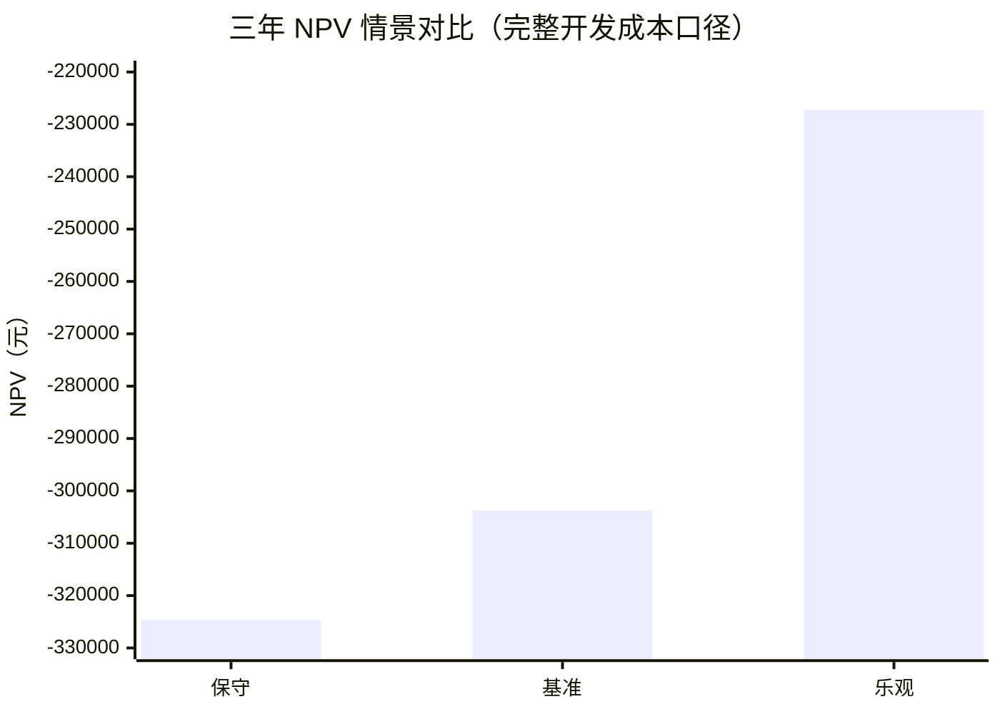
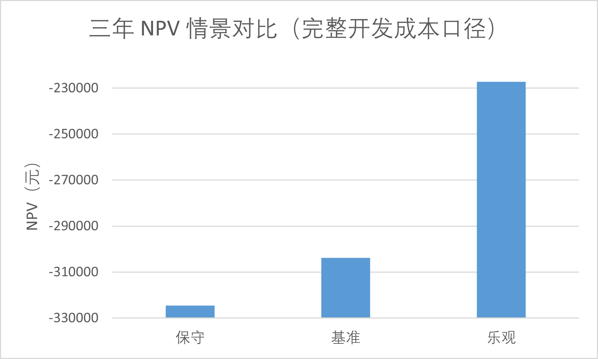
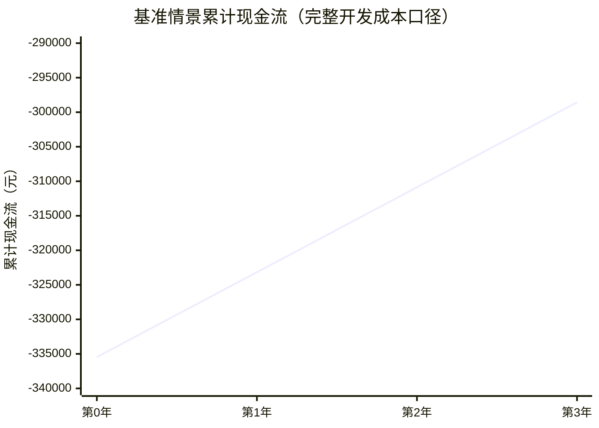
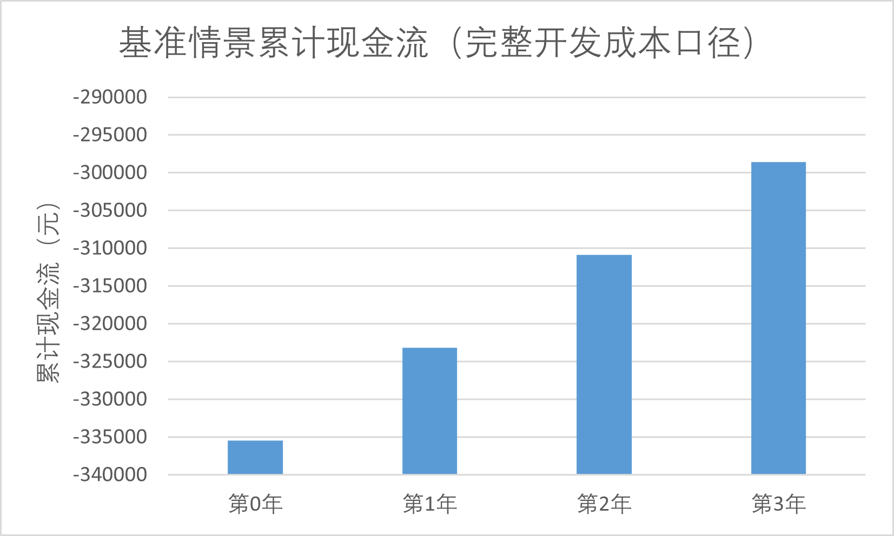

# 基于大模型的建筑能源智能管理与运维优化系统
## 软件工程经济学文档（SEE）

**文档版本**：v1.3  
**编制日期**：2026年6月  
**课程**：软件工程管理与经济学  
**项目类型**：课程项目基础上的建筑能源运维闭环与智能决策系统  
**文档作者**：2351441 许奕、2351270 王天一、2353249 马源胜、2353408 周由  
**适用范围**：本文件用于从软件工程经济学角度分析“基于大模型的建筑能源智能管理与运维优化系统”的成本、收益、可行性、投资回收、敏感性与经济风险。分析对象包括建筑能耗数据管理、异常识别与经济量化、角色化工单闭环、时间沙盘、预算与 KPI、ROI 改造分析、可信问答、MCP Server、可选 MySQL 持久化、前后端展示与系统集成；真实传感器采购、楼宇自控系统对接、生产级多租户 SaaS、法定财务审计与商业销售费用不纳入本次经济分析范围。

---

## 目录

1. 文档目的与分析范围
   - 1.1 文档目的
   - 1.2 分析边界
   - 1.3 依据材料
2. 项目经济背景
   - 2.1 业务问题
   - 2.2 经济目标
   - 2.3 经济分析假设
   - 2.4 商业模式画布
3. 备选方案经济比较
   - 3.1 方案定义
   - 3.2 推荐方案
   - 3.3 备选方案评分
4. 成本估算基础
   - 4.1 软件规模
   - 4.2 生产率与人月费率
   - 4.3 成本估算假设
5. 开发成本估算
   - 5.1 工作量估算
   - 5.2 成本估算
   - 5.3 团队角色与成本承接
   - 5.4 成本区间与交叉验证
6. 运行与维护成本说明
   - 6.1 本课程项目阶段的运行成本
   - 6.2 未来生产部署的增量成本
   - 6.3 运行成本分层
7. 收益分析
   - 7.1 收益来源
   - 7.2 年度收益情景估算
   - 7.3 收益金额推导说明
   - 7.4 收益可信度分级
8. 资金筹集与定价策略
   - 8.1 资金来源划分
   - 8.2 版本定价策略
   - 8.3 定价与敏感性联动
9. 投资回收与财务指标
   - 9.1 投资回收期
   - 9.2 三年投资收益率
   - 9.3 净现值分析
   - 9.4 基准情景现金流表
   - 9.5 盈亏平衡年度收益
   - 9.6 收益/成本比
   - 9.7 经济指标总览
10. 敏感性分析
    - 10.1 成本上升敏感性
    - 10.2 收益下降敏感性
    - 10.3 关键敏感因素
    - 10.4 组合敏感性分析
    - 10.5 敏感性结论
11. 经济风险与应对措施
    - 11.1 风险成本影响
    - 11.2 经济控制措施
    - 11.3 经济监控指标
12. 经济可行性结论
    - 12.1 成本结论
    - 12.2 收益结论
    - 12.3 定价与成本衔接
    - 12.4 可行性判断
13. 后续经济管理建议
14. 标准财务分析报表
    - 14.1 无形资产摊销表
    - 14.2 固定资产折旧说明
    - 14.3 利润及利润分配表
    - 14.4 综合资产负债表
15. 附录：核心计算汇总

---

## 1. 文档目的与分析范围

### 1.1 文档目的

本 SEE 文档面向课程项目正式交付，目标不是编制企业正式投标报价，而是以可追溯、可解释、可复核的方式说明：

1. 本项目为什么具有经济建设价值。
2. 本项目的开发成本和试点运行成本如何估算。
3. 本项目的收益来自哪些业务改进。
4. 在不同收益情景和部署规模下，项目是否具备经济可行性。
5. 哪些经济风险会影响项目收益，应如何控制。

本文延续《01-SRS-软件需求规格说明书.md》和《02-SDD-软件设计说明书.md》对系统范围、架构和业务闭环的定义，并严格参考《智慧幕墙系统_SEE.md》的章节结构组织内容。

### 1.2 分析边界

本项目是课程背景下的工程实践项目，但本 SEE 的开发成本主口径采用《实验二：软件规模度量报告.md》和《实验三：软件成本估算报告.md》形成的“功能点规模 + 行业生产率 + 地区人月费率”工程等价估算方法；试点实施和未来扩展部署另作情景分析：

| 项目 | 分析处理方式 |
|---|---|
| 开发成本 | 以 287 FP 主规模、6.72 人时/FP 生产率和上海地区 31,309 元/人月费率估算工程等价软件开发成本 |
| 实际学生劳动报酬 | 不作为真实工资支出；开发成本反映同等软件范围在工程化场景下的估算价值 |
| 试点实施成本 | 作为已有软件原型未来在校园或园区部署时的一次性边际部署、配置、培训和数据初始化成本 |
| 运行维护成本 | 按云服务器、存储备份、外部模型调用、域名证书和人工维护估算 |
| 真实硬件采购 | 电表、传感器、网关、楼宇自控系统接口不纳入本次初始软件经济评价 |
| 外部大模型成本 | 作为可配置成本处理；系统未配置 LLM 时仍可通过本地知识库和规则问答运行 |
| 数据库成本 | 默认 CSV/JSON 离线模式不产生数据库费用；MySQL 为可选持久化能力，生产部署另行核算 |
| 项目收益 | 采用情景化估算，用于经济可行性分析，不作为真实财务收入证明 |

因此，本文中的金额用于课程经济分析、方案比较和后续试点决策论证，不等同于商业合同报价或财务审计数据。

### 1.3 依据材料

| 材料 | 用途 |
|---|---|
| 《01-SRS-软件需求规格说明书.md》 | 提供系统范围、用户、功能需求、非功能需求和数据需求依据 |
| 《02-SDD-软件设计说明书.md》 | 提供系统架构、模块设计、数据库、接口和安全设计依据 |
| 《04-SEM-软件工程管理文档.md》 | 提供阶段计划、质量指标、风险管理和交付组织依据 |
| 《实验二：软件规模度量报告.md》 | 提供 IFPUG 功能点规模估算、NESMA 验证规模和软件边界依据 |
| 《实验三：软件成本估算报告.md》 | 提供生产率、人月费率、工作量、人月、开发成本和成本区间依据 |
| 《Project_Charter_v1.md》 | 仅作为团队角色和人员分工依据，不采用其中早期预算作为本 SEE 成本基线 |
| 《19-SEE-software-economic-evaluation.md》 | 提供过程版经济评价口径和试点收益假设参考 |
| 《23-business-logic-closure-acceptance.md》 | 提供工单闭环、角色权限和业务验收依据 |
| 《24-time-machine-and-causal-upgrade.md》 | 提供时间沙盘、维修干预和因果仿真依据 |
| 《28-roi-retrofit-methodology-redesign.md》 | 提供 ROI 方法学重构依据，包括增量法、折现率、EAA 和敏感性 |
| 《29-data-quality-acceptance-spec.md》 | 提供 L0-L3 数据质量、异常、风险、预算和 ROI 口径依据 |
| 《30-system-reference-for-final-reports.md》 | 提供四份正式报告统一事实底稿、关键参数和答辩口径 |
| 当前源码与数据集 | 提供实际模块、接口、测试、数据规模和实现约束依据 |
| Git 提交历史 | 支撑项目阶段、关键变更和最终封版事实 |

---

## 2. 项目经济背景

### 2.1 业务问题

本系统面向校园或园区建筑能源运营场景。建筑能源管理并不只是展示电表曲线，而是要回答“哪里异常、损失多少、谁先处理、处理后是否改善、是否值得改造”等管理问题。传统人工巡检或静态报表方式在经济上存在以下问题：

1. **能源数据分散导致定位成本高**  
   建筑、楼层、区域、设备和时间维度分散在不同记录中，人工查表难以及时定位异常设备和异常时段，增加排查和沟通成本。

2. **异常告警缺少经济量化**  
   仅提示“电耗偏高”不足以支持管理决策。若不能把异常转换为浪费电量、电费、碳排和 SLA，就难以判断处理优先级。

3. **有限工人资源缺少调度依据**  
   运维团队通常只有少数对口工人。若不考虑工种、忙闲状态、同设备重复工单和风险排序，容易出现重复派单、低价值派单或高风险事项延误。

4. **处理结果无法反馈到预算和改造决策**  
   传统看板往往在“发现问题”处停止，不能将工单关闭、设备修复和未来异常变化反馈到预算预测、KPI 考核和 ROI 改造分析中。

5. **智能问答容易脱离事实**  
   大模型若不接入实时业务数据、知识库和工单上下文，容易生成泛化回答，不能支撑能源运营中的可审计决策。

6. **课程演示和后续交接存在复现成本**  
   若系统缺少时间沙盘、演示重置、测试脚本和统一文档，答辩演示、验收复查和后续维护都会产生额外沟通与返工成本。

### 2.2 经济目标

本项目的经济目标可以归纳为：

| 目标 | 经济含义 |
|---|---|
| 降低异常定位成本 | 通过统一数据查询、统计分析、楼层风险和设备摘要减少人工查表时间 |
| 降低能耗浪费 | 通过异常检测、COP 判断、夜间高负荷识别和处置建议减少无效电耗 |
| 降低派单协作成本 | 通过角色化工单、忙闲锁、设备级去重和复核闭环减少重复沟通 |
| 提高预算控制能力 | 将闭环节省反馈到预算预测和 KPI 考核，降低超预算风险 |
| 提高改造投资决策质量 | 用实测年化电耗、增量投资、NPV、IRR、EAA 和动态回收期判断改造可行性 |
| 降低智能化使用风险 | 通过本地知识库、实时上下文、MCP 工具和外部 LLM 可配置开关控制成本和事实漂移 |
| 提高项目交付质量 | 用 SRS、SDD、SEE、SEM、测试和演示脚本统一事实，减少答辩和维护返工 |

### 2.3 经济分析假设

由于本项目尚未接入真实楼宇自控系统和生产级能源计量平台，本文采用可解释假设进行收益测算。核心假设如下：

| 假设编号 | 假设内容 | 对经济分析的影响 |
|---|---|---|
| A1 | 软件开发成本按 287 FP、6.72 人时/FP 和上海 31,309 元/人月进行工程等价估算 | 成本用于经济论证，不代表课程团队真实工资支付 |
| A2 | 当前系统可作为校园 4 栋建筑能源管理试点原型 | 试点收益按 4 栋建筑估算 |
| A3 | 已有原型的小规模试点边际部署成本取 25,000 元 | 覆盖部署、配置、数据初始化和培训，不含传感器，不替代完整开发成本 |
| A4 | 小规模试点年运行维护成本取 30,000 元 | 覆盖云资源、少量外部模型调用和日常维护 |
| A5 | 4 栋建筑年用电量按 300,000 kWh 估算，电价按系统口径 0.82 元/kWh | 用于计算直接节能收益 |
| A6 | 系统通过异常识别、工单闭环和运行建议保守实现 5% 节能潜力 | 用于计算年度节电收益 |
| A7 | 人工机会成本按 80 元/小时、每年 250 个工作日估算 | 用于人工巡检和沟通节约折算 |
| A8 | 财务评价采用三年周期和 8% 折现率 | 与 ROI 模块使用的社会折现率口径一致 |
| A9 | 碳价值、外部模型价值和管理透明度主要作为辅助收益，不夸大为确定现金收入 | 避免收益高估 |

这些假设使 SEE 的结论具备边界：如果系统只作为课堂演示工具，直接财务收益较低；如果系统进入稳定的校园能源运维流程，经济收益主要来自人工节约、异常损失减少和节能改善；如果扩展到更多建筑或真实分项计量，平台摊薄效应和节能收益将更加明显。

### 2.4 商业模式画布

为使项目经济逻辑更直观，本文采用商业模式画布（Business Model Canvas）描述系统从技术能力到客户价值、收入与成本的转换关系。该画布不表示项目已经商业销售，而是用于说明若系统从课程原型进入校园或园区试点，其价值创造与价值回收路径。


---

## 3. 备选方案经济比较

### 3.1 方案定义

| 方案 | 内容 | 初始成本 | 运维成本 | 主要收益 | 主要风险 |
|---|---:|---:|---:|---|---|
| A. 人工表格与离线报表 | 继续使用 CSV/Excel、人工巡检和人工汇报 | 低 | 高 | 短期投入最低 | 异常定位慢、无法形成工单闭环、无预算和 ROI 联动 |
| B. 基础能耗看板 | 只建设数据查询、趋势图和简单统计 | 中低 | 中 | 可视化改善明显，实施较快 | 只能“看见数据”，难以回答损失、优先级和改造经济性 |
| C. 能源运维闭环与智能决策平台 | 建设本项目交付范围：异常量化、角色工单、时间沙盘、预算、ROI、问答和 MCP | 中 | 中 | 同时改善定位、派单、预算、改造和智能接入 | 需要控制数据口径、演示状态和外部依赖 |
| D. 生产级 IoT + 多租户 SaaS | 接入真实传感器、楼控系统、多租户、计费、安全审计和高可用集群 | 高 | 高 | 商业化潜力最大 | 超出课程周期，硬件和运维成本高，范围风险大 |

### 3.2 推荐方案

本 SEE 推荐采用 **方案 C：能源运维闭环与智能决策平台**。

推荐理由如下：

1. 方案 C 与当前代码、正式 SRS/SDD 和最终演示范围一致，验收边界清晰。
2. 方案 C 不停留在看板展示，而是把异常识别、经济损失、派单执行、复核关闭、预算修正和 ROI 改造串成闭环。
3. 方案 C 通过默认 CSV/JSON 和可选 MySQL 的双后端设计降低部署门槛，同时为未来规范部署保留路径。
4. 方案 C 的 LLM 和 MCP 能力复用服务层，能够提升智能化展示价值，又不会在未配置外部模型时阻断系统运行。
5. 方案 C 避免了方案 D 的真实硬件、生产 SLA、多租户和高可用集群成本，更符合课程项目周期和团队资源约束。

### 3.3 备选方案评分

为使方案选择更可复核，本文按成本、收益、风险、可验收性和扩展性进行定性评分，5 分为最佳。

| 评价维度 | 权重 | A 人工表格 | B 基础看板 | C 推荐方案 | D 生产级 SaaS |
|---|---:|---:|---:|---:|---:|
| 初始成本可控 | 20% | 5 | 4 | 3 | 1 |
| 长期运维收益 | 25% | 1 | 2 | 5 | 5 |
| 技术风险可控 | 20% | 4 | 4 | 4 | 2 |
| 课程周期可验收 | 20% | 2 | 4 | 5 | 1 |
| 后续扩展空间 | 15% | 1 | 2 | 4 | 5 |
| 加权得分 | 100% | 2.55 | 3.15 | 4.20 | 2.75 |

方案 C 的优势不在于初始成本最低，而在于能在可控成本内获得更完整的运维闭环收益，并且与课程验收范围一致。因此，方案 C 是本项目最合理的经济选择。

---

## 4. 成本估算基础

### 4.1 软件规模

本项目的软件规模以《实验二：软件规模度量报告.md》的功能点分析结果为主。当前封版系统已经不是单页演示，而是覆盖前端、后端、数据、知识库、测试和文档的完整课程系统；规模度量按用户可识别功能边界进行，不把测试脚本、启动脚本、课程汇报材料和同一业务功能的多入口重复暴露计入规模。

| 指标 | 数值 | 说明 |
|---|---:|---|
| 原始能耗记录 | 4,864 条 | 覆盖 2026-01-01 至 2026-06-01，4 栋建筑 |
| 原始字段 | 16 个 | 包含建筑、时间、电耗、水耗、暖通、冷量、温湿度、人员密度、设备编号和状态 |
| 业务设备类型 | 4 类 | 冷水机组、冷却塔、空气处理机组、风机盘管 |
| 后端路由模块 | 15 个 | 覆盖认证、数据、分析、工单、沙盘、预算、ROI、决策、问答、MCP 等 |
| 后端服务模块 | 19 个 | 覆盖数据加载、异常分析、工单状态机、沙盘、预算、ROI、LLM、权限和持久化 |
| 前端 Vue 组件 | 18 个 | 覆盖总览、图表、预算、ROI、AI 助手、数据表、风险场景等 |
| 自动化测试文件 | 19 个 | 当前基线为 119 个 pytest 用例全绿 |
| 正式交付文档 | SRS、SDD、SEE、SEM 等 | 配合 README、验收、用户手册、演示脚本和接口说明形成交付包 |

从功能复杂度看，系统包含数据输入、数据查询、统计输出、内部状态文件、外部 LLM 接口、MCP 工具接口、MySQL 可选持久化、业务状态机、预算和 ROI 算法等多种类型功能。因此，本 SEE 采用 IFPUG 高层级功能点估算作为主规模依据，并采用 NESMA 估算结果作为保守验证。

IFPUG 高层级功能点估算如下：

| 功能类型 | 数量 | 权重 | 未调整功能点 UFP | 说明 |
|---|---:|---:|---:|---|
| ILF 内部逻辑文件 | 8 | 7 | 56 | 能耗数据、设备台账、数据字典、知识库、工单、预算、沙盘、用户角色等内部数据 |
| EIF 外部接口文件 | 2 | 5 | 10 | 外部公共能源资料、可选外部大模型服务 |
| EI 外部输入 | 10 | 4 | 40 | 登录、工单生命周期、预算维护、沙盘控制、智能助手输入等 |
| EO 外部输出 | 24 | 5 | 120 | KPI、趋势、异常、工单建议、预算、ROI、日报、问答响应、CSV 导出等 |
| EQ 外部查询 | 7 | 4 | 28 | 数据集元信息、原始记录、用户、工单、预算、沙盘、知识库检索等 |
| **合计** |  |  | **254** | 未调整功能点 UFP |

为避免功能点结果成为黑盒，本文进一步给出数据功能与事务功能的审计展开。下列 RET、DET、FTR 为高层级估算口径下的可复核近似，用于解释复杂度判断；最终计数、复杂度和权重与《实验二：软件规模度量报告.md》保持一致。

数据功能识别明细如下：

| 序号 | 数据功能 | 类型 | 主要逻辑表/资源 | RET | DET | 复杂度 | 权重 | FP |
|---:|---|---|---|---:|---:|---|---:|---:|
| 1 | 能耗监测数据集 | ILF | energy_records | 1 | 16 | Low | 7 | 7 |
| 2 | 建筑与设备逻辑台账 | ILF | buildings / floors / zones / devices | 2 | 12 | Low | 7 | 7 |
| 3 | 数据字典与字段规则 | ILF | data_dictionary / field_rules | 1 | 10 | Low | 7 | 7 |
| 4 | 知识库与 RAG 素材 | ILF | knowledge_cards / rag_chunks | 2 | 18 | Low | 7 | 7 |
| 5 | 工单与处置记录 | ILF | work_orders / work_order_events | 2 | 18 | Low | 7 | 7 |
| 6 | 预算与 KPI 数据 | ILF | budgets / kpi_results | 2 | 16 | Low | 7 | 7 |
| 7 | 时间沙盘与维修干预状态 | ILF | simulation_state / repair_actions | 2 | 14 | Low | 7 | 7 |
| 8 | 用户角色与权限配置 | ILF | users / roles / permissions | 2 | 12 | Low | 7 | 7 |
| 9 | 外部公共能源资料与行业参数 | EIF | energy_price / carbon_factor / benchmark_params | 1 | 10 | Low | 5 | 5 |
| 10 | 外部大语言模型服务 | EIF | llm_provider / model_config | 1 | 8 | Low | 5 | 5 |
| **合计** |  |  |  |  |  |  |  | **66** |

事务功能识别明细如下：

| 序号 | 事务功能 | 类型 | FTR | DET | 复杂度 | 权重 | FP |
|---:|---|---|---:|---:|---|---:|---:|
| 1 | 用户登录认证 | EI | 2 | 6 | Average | 4 | 4 |
| 2 | 异常确认与工单创建 | EI | 2 | 10 | Average | 4 | 4 |
| 3 | 工单派单与改派 | EI | 2 | 8 | Average | 4 | 4 |
| 4 | 工人接单 | EI | 2 | 6 | Average | 4 | 4 |
| 5 | 工人提交处理结果 | EI | 2 | 12 | Average | 4 | 4 |
| 6 | 管理员复核、驳回或忽略 | EI | 2 | 10 | Average | 4 | 4 |
| 7 | 预算自动生成 | EI | 2 | 8 | Average | 4 | 4 |
| 8 | 预算人工调整 | EI | 2 | 8 | Average | 4 | 4 |
| 9 | 时间沙盘控制 | EI | 2 | 8 | Average | 4 | 4 |
| 10 | 智能助手问题输入 | EI | 2 | 8 | Average | 4 | 4 |
| 11 | 能耗总览 KPI 输出 | EO | 2 | 12 | Average | 5 | 5 |
| 12 | 时间汇总趋势输出 | EO | 2 | 14 | Average | 5 | 5 |
| 13 | 建筑对比输出 | EO | 2 | 12 | Average | 5 | 5 |
| 14 | COP 排名与能效输出 | EO | 2 | 10 | Average | 5 | 5 |
| 15 | 异常检测结果输出 | EO | 2 | 12 | Average | 5 | 5 |
| 16 | 异常原因与风险量化输出 | EO | 3 | 16 | Average | 5 | 5 |
| 17 | 楼层区域风险输出 | EO | 2 | 12 | Average | 5 | 5 |
| 18 | 设备运行监测输出 | EO | 2 | 10 | Average | 5 | 5 |
| 19 | 异常工单建议输出 | EO | 2 | 10 | Average | 5 | 5 |
| 20 | 优化建议输出 | EO | 2 | 12 | Average | 5 | 5 |
| 21 | 运营日报输出 | EO | 3 | 18 | Average | 5 | 5 |
| 22 | 管理员业务看板输出 | EO | 3 | 14 | Average | 5 | 5 |
| 23 | 工人个人工作台输出 | EO | 3 | 12 | Average | 5 | 5 |
| 24 | 工单经济优先级输出 | EO | 3 | 14 | Average | 5 | 5 |
| 25 | 资源约束派单计划输出 | EO | 3 | 12 | Average | 5 | 5 |
| 26 | 预算执行分析输出 | EO | 2 | 12 | Average | 5 | 5 |
| 27 | 年度 KPI 考核输出 | EO | 2 | 12 | Average | 5 | 5 |
| 28 | 工单闭环预算影响输出 | EO | 3 | 14 | Average | 5 | 5 |
| 29 | ROI 设备审计输出 | EO | 2 | 10 | Average | 5 | 5 |
| 30 | ROI 单方案经济评价输出 | EO | 3 | 18 | Average | 5 | 5 |
| 31 | ROI 多方案对比输出 | EO | 3 | 18 | Average | 5 | 5 |
| 32 | 反事实情景模拟输出 | EO | 3 | 16 | Average | 5 | 5 |
| 33 | 智能问答响应输出 | EO | 3 | 16 | Average | 5 | 5 |
| 34 | CSV 分析结果导出 | EO | 2 | 10 | Average | 5 | 5 |
| 35 | 数据集元信息与建筑列表查询 | EQ | 2 | 8 | Average | 4 | 4 |
| 36 | 多条件原始能耗记录查询 | EQ | 2 | 10 | Average | 4 | 4 |
| 37 | 当前用户与演示用户查询 | EQ | 2 | 6 | Average | 4 | 4 |
| 38 | 持久化工单列表与详情查询 | EQ | 2 | 10 | Average | 4 | 4 |
| 39 | 预算列表查询 | EQ | 2 | 8 | Average | 4 | 4 |
| 40 | 沙盘状态查询 | EQ | 2 | 8 | Average | 4 | 4 |
| 41 | 知识库检索与资料入口查询 | EQ | 2 | 10 | Average | 4 | 4 |
| **合计** |  |  |  |  |  |  | **188** |

值调整因子采用《实验二：软件规模度量报告.md》中 14 项通用系统特性的评分结果：

| 序号 | 通用系统特性 | 分值 | 评分依据 |
|---:|---|---:|---|
| 1 | 数据通信 | 5 | 系统同时提供 REST、MCP、可选 LLM 调用和前后端通信 |
| 2 | 分布式数据处理 | 4 | 前端、后端、持久化层、MCP 和外部模型逻辑分离 |
| 3 | 性能 | 3 | 多图表、多分析接口和缓存机制要求较好的响应性能 |
| 4 | 高使用强度配置 | 2 | 当前为课程演示系统，尚非生产高并发系统 |
| 5 | 事务率 | 3 | 工单、预算、沙盘和问答产生较多交互事务 |
| 6 | 在线数据输入 | 4 | 用户可在线提交工单、处理记录、预算、沙盘控制和问题 |
| 7 | 最终用户效率 | 4 | 角色化工作台、图表联动和自动建议提升用户效率 |
| 8 | 在线更新 | 4 | 工单、预算、沙盘和维修干预均可在线更新 |
| 9 | 复杂处理 | 5 | 包含异常检测、风险评分、预算预测、ROI、反事实和 AI 问答 |
| 10 | 可重用性 | 4 | REST 与 MCP 复用服务层，分析服务可被多入口调用 |
| 11 | 安装易用性 | 2 | 提供脚本和文档，但仍需 Python、Node、可选 MySQL/LLM 配置 |
| 12 | 运行易用性 | 3 | 具备一键检查和演示重置，但多服务协同仍需管理 |
| 13 | 多站点 | 2 | 主要面向本地演示，可迁移到不同开发环境 |
| 14 | 促进变更 | 3 | 模块化目录、接口契约和文档体系支持迭代 |
| **合计 TDI** |  | **48** |  |

```text
TDI = 48
VAF = 0.65 + 0.01 × 48 = 1.13
FP = 254 × 1.13 = 287.02 ≈ 287 FP
```

因此，本项目当前封版范围的主规模估算为 **287 FP**。

NESMA 验证口径将“智能助手问题输入”作为生成 EO 的控制信息处理，不单独计为 EI；其余组件保持一致，且不使用 VAF：

```text
FP_NESMA = 8×7 + 2×5 + 9×4 + 24×5 + 7×4 = 250 FP
```

两种方法差异约为 12.9%，处于功能点估算可接受波动范围内。因此，本 SEE 将 **287 FP** 作为主规模，将 **250 FP** 作为保守下界。

### 4.2 生产率与人月费率

本项目的生产率、人月费率、工作量与成本估算依据《实验三：软件成本估算报告.md》。该报告基于《实验二：软件规模度量报告.md》的 287 FP 主规模，采用 2025 年中国软件行业基准数据中的生产率与地区费率参数，将软件规模换算为工作量、人月和人民币开发成本。

| 参数 | 数值 | 说明 |
|---|---:|---|
| 主估算软件规模 | 287 FP | 来自 IFPUG 调整后功能点 |
| 验证软件规模 | 250 FP | 来自 NESMA 保守估算 |
| 开发生产率 | 6.72 人时/FP | 2025 年中国软件行业基准数据，全行业 P50 |
| 每人月工时 | 180 人时/人月 | 22.5 天 × 8 小时 |
| 上海软件开发人月费率 | 31,309 元/人月 | 按项目完成地点采用上海地区口径 |
| 北京软件开发人月费率 | 32,198 元/人月 | 用于功能点单价地区折算 |
| 北京功能点单价 | 1,243.52 元/FP | 2025 年中国软件行业基准数据 |
| 折算后上海功能点单价 | 1,209.19 元/FP | 1,243.52 × 31,309 / 32,198 |
| 工作量调整因子 | 1.00 | 课程实验中不额外引入质量、风险或外包调整 |
| 直接非人力成本 | 0 元 | 实验三仅核算软件开发人力成本，不计硬件、差旅和云资源 |

### 4.3 成本估算假设

1. 本 SEE 的软件开发成本主口径为工程等价估算，不代表课程团队真实工资支出或已发生现金支出。
2. 当前系统不采购真实电表、传感器、网关和楼宇自控设备，硬件接入成本不计入软件开发成本。
3. 系统默认使用本地开发环境、开源框架和 CSV/JSON 运行期状态，MySQL 和外部 LLM 均为可选增强。
4. 实验三中的直接非人力成本取 0 元；若未来生产部署，应另行估算云资源、数据库托管、商业模型 API、监控告警、数据采购和现场实施费用。
5. 小规模校园试点的一次性实施成本可作为部署边际成本单独讨论，但不替代 287 FP 对应的软件开发成本。
6. 项目范围聚焦建筑能源运维闭环，不把移动端 App、多租户 SaaS、生产级高可用集群和真实计费系统计入本次成本。

---

## 5. 开发成本估算

### 5.1 工作量估算

根据《实验三：软件成本估算报告.md》，本项目主估算工作量采用功能点规模、生产率和调整因子计算：

```text
开发工作量（人时） = 软件规模（FP） × 开发生产率（人时/FP） × 调整因子
                  = 287 × 6.72 × 1.00
                  = 1,928.64 人时
```

折算为人月：

```text
开发工作量（人月） = 1,928.64 ÷ 180
                  = 10.7147 人月
                  ≈ 10.71 人月
```

若按 4 人团队全职投入估算，日历工期为：

```text
全职日历工期 = 10.7147 ÷ 4 = 2.6787 月 ≈ 2.68 月
折合工作日 = 2.6787 × 22.5 = 60.27 个工作日
```

由于课程项目并非全职投入，若按每人约 50% 课余投入折算，则实际日历周期约为：

```text
课程实际日历工期 = 10.7147 ÷ (4 × 0.5) = 5.3573 月 ≈ 5.36 月
```

### 5.2 成本估算

软件开发成本按上海地区软件开发人月费率估算：

```text
软件开发成本 = 10.7147 人月 × 31,309 元/人月 + 0
            = 335,465.50 元
            ≈ 33.55 万元
```

> **本项目当前封版范围的软件开发成本主估算为 335,465.50 元，约 33.55 万元。**

### 5.3 团队角色与成本承接

《Project_Charter_v1.md》仅作为团队角色和人员分工依据。成本估算不采用该章程中的早期预算，而是将第 5.1 节得到的总工作量和第 5.2 节得到的总成本理解为以下角色共同承接的软件开发活动：

| 成员 | 项目角色 | 主要职责 | 对成本估算的作用 |
|---|---|---|---|
| 许奕 | 项目经理 / 集成与交付负责人 | 制定项目计划，拆解任务，统筹需求、文档、集成、测试、演示和最终提交；维护 README、任务说明、集成总结、验收报告、最终文档和演示脚本。 | 对应需求管理、项目协调、集成交付、测试验收、文档编制和演示准备等管理与交付工作量。 |
| 王天一 | 后端与系统架构负责人 | 负责 FastAPI 后端、REST API、服务层架构、异常分析、工单状态机、时间沙盘、MCP Server、MySQL 可切换持久化和后端测试。 | 对应后端架构、接口服务、核心业务逻辑、状态机、MCP、持久化适配和后端测试等核心开发工作量。 |
| 马源胜 | 数据与 AI 负责人 | 负责样例数据集、数据字典、数据源调研、知识库、RAG 检索素材、外部大模型配置和问答评估材料。 | 对应数据治理、数据口径整理、知识库建设、RAG/LLM 接入、问答评估和规模度量依据整理等数据与 AI 工作量。 |
| 周由 | 前端与联调负责人 | 负责 Vue 工作台、图表可视化、三维风险态势、角色化页面、预算和 ROI 面板、前后端联调与演示体验优化。 | 对应前端页面、可视化组件、角色交互、预算与 ROI 面板、前后端联调和演示体验优化等前端与集成工作量。 |

上述角色分工用于解释工作量的组织承接关系，不用于重新分摊或替代实验三的行业基准成本。

### 5.4 成本区间与交叉验证

《实验三：软件成本估算报告.md》采用两种方法对主估算进行交叉验证。

第一种为功能点单价法。北京地区软件开发功能点单价为 1,243.52 元/FP，按上海与北京软件开发人月费率折算后，上海功能点单价为 1,209.19 元/FP：

```text
上海功能点单价 = 1,243.52 × 31,309 ÷ 32,198 = 1,209.19 元/FP
功能点单价法成本 = 287 × 1,209.19 = 347,036.35 元 ≈ 34.70 万元
```

第二种为 NESMA 保守规模验证：

```text
NESMA 工作量 = 250 × 6.72 = 1,680.00 人时
NESMA 人月 = 1,680.00 ÷ 180 = 9.3333 人月
NESMA 成本 = 9.3333 × 31,309 = 292,217.33 元 ≈ 29.22 万元
```

| 估算口径 | 规模 | 成本结果 | 与主估算差异 |
|---|---:|---:|---:|
| IFPUG + 生产率 + 上海人月费率 | 287 FP | 335,465.50 元 | -- |
| IFPUG + 上海功能点单价 | 287 FP | 347,036.35 元 | 约 3.45% |
| NESMA + 生产率 + 上海人月费率 | 250 FP | 292,217.33 元 | 约 12.89% |

三种结果差异均未超过 20%。因此，本 SEE 采用 **33.55 万元** 作为主成本估算，并将 **29.22 万元至 34.70 万元** 作为合理成本区间。若未来将系统作为商业项目产品化，还应在该开发成本基础上补充项目管理、质量保证、运维支持、安全合规、真实数据接入、合同税费、风险预留和利润空间。

---

## 6. 运行与维护成本说明

### 6.1 本课程项目阶段的运行成本

在课程项目交付阶段，系统主要运行在已有开发与演示环境中，直接运行成本较低：

| 成本项 | 课程阶段处理方式 |
|---|---|
| 服务器 | 使用本地电脑或课程演示环境，不新增采购 |
| 数据存储 | 默认 CSV/JSON 文件模式，不需要数据库授权费 |
| MySQL | 可选启用；未配置 `DATABASE_URL` 时不影响演示 |
| 外部 LLM | 可配置关闭，未启用时使用本地知识库和规则问答 |
| MCP Server | 与后端共用 Python 环境，不单独计费 |
| 域名与 HTTPS | 本地演示不需要公网域名 |
| 测试与构建 | 主要体现为团队工时，已计入开发成本 |

### 6.2 未来生产部署的增量成本

如果系统未来面向真实校园或园区长期运行，应补充核算以下成本：

| 成本项 | 可能影响 |
|---|---|
| 云服务器与数据库实例 | 取决于建筑数量、数据频率、并发用户和历史数据保留周期 |
| 存储与备份 | 能耗记录、工单、照片、日志和报告会持续累积 |
| 外部大模型 API | 取决于问答频率、模型选择、上下文长度和是否启用外部增强 |
| 真实设备接口 | 电表、楼控、BACnet/Modbus 网关或接口开发费用需单独核算 |
| 安全与审计 | 生产环境需要日志留存、权限审计、密钥管理和备份恢复 |
| 运维值守 | 需要定期检查数据质量、服务状态、模型配置和业务规则 |

### 6.3 运行成本分层

为区分课程交付阶段和未来试点阶段，运行成本分为三层管理：

| 成本层级 | 内容 | 课程阶段处理 | 试点/生产阶段处理 |
|---|---|---|---|
| 基础运行成本 | 前端、后端、MCP、数据文件、数据库 | 本地环境运行，不单独计费 | 按服务器、数据库、备份和带宽计费 |
| 外部服务成本 | 外部 LLM、域名、HTTPS、短信或邮件 | 默认关闭或使用测试配置 | 按调用量、SLA 和服务等级计费 |
| 运维保障成本 | 数据检查、知识库更新、规则维护、故障处理、文档更新 | 计入课程工时 | 按月维护工时或服务合同计费 |

小规模校园试点可采用以下年运行成本估算：

| 项目 | 月费用估算 | 年费用估算 | 说明 |
|---|---:|---:|---|
| 云服务器 | 100 元/月 | 1,200 元/年 | 2 核 4G 级别可支撑小规模试点 |
| 存储与备份 | 30 元/月 | 360 元/年 | 保存 CSV、JSON、日志、工单和报告 |
| 外部大模型 API | 100-500 元/月 | 1,200-6,000 元/年 | 可关闭，取决于问答频率 |
| 域名与 HTTPS | 50 元/月 | 600 元/年 | 校园内网部署可省略 |
| 日常维护人力 | 2,160 元/月 | 25,920 元/年 | 数据检查、规则维护、故障处理和文档维护 |
| **合计** | **2,440-2,840 元/月** | **29,280-34,080 元/年** | 不含真实传感器和楼控接口 |

后续财务评价采用 **30,000 元/年** 作为小规模试点年运行维护成本基准。

---

## 7. 收益分析

### 7.1 收益来源

本项目收益主要来自节能、人工节约、异常损失减少和管理效率提升。

| 收益类别 | 形成机制 | 经济表现 |
|---|---|---|
| 直接节能收益 | 异常识别、低效设备定位、夜间高负荷发现、工单闭环处置 | 降低电费支出 |
| 人工巡检节约 | 数据自动汇总、异常排序、设备定位、报告生成和 AI 问答 | 减少查表、定位、沟通和汇报工时 |
| 异常损失减少 | 高风险异常优先派单、SLA 管理、设备级修复和未来异常抑制 | 降低额外电费、设备磨损和投诉成本 |
| 预算管理收益 | 预算基线、执行率、月末预测和 KPI 考核联动 | 提高费用控制能力 |
| 改造决策收益 | ROI、NPV、IRR、EAA、动态回收期和敏感性分析 | 减少低价值改造或投资误判 |
| 智能接入收益 | MCP 工具和可信问答复用真实业务上下文 | 降低报告和答疑成本，提高展示价值 |

### 7.2 年度收益情景估算

以 4 栋建筑小规模校园试点为基准，直接收益估算如下：

1. 年用电量假设为 300,000 kWh。
2. 电价按系统统一口径 0.82 元/kWh。
3. 节能率保守取 5%。
4. 人工巡检节约按每天 1 小时、250 个工作日、80 元/小时估算。
5. 异常损失减少按每年避免 5 次中等异常、每次 2,000 元估算。

| 收益项 | 保守情景（元/年） | 基准情景（元/年） | 乐观情景（元/年） | 说明 |
|---|---:|---:|---:|---|
| 直接节能收益 | 8,200 | 12,300 | 20,500 | 对应约 3.3% / 5% / 8.3% 节能潜力 |
| 人工巡检与沟通节约 | 18,000 | 20,000 | 25,000 | 减少查表、定位、派单和汇报时间 |
| 异常损失减少 | 8,000 | 10,000 | 18,000 | 减少额外电费、设备损耗和现场返工 |
| 管理与报告效率收益 | 0 | 0 | 8,500 | 保守和基准情景为避免重复计算暂不货币化 |
| **年度总收益** | **34,200** | **42,300** | **72,000** |  |

基准情景的直接计算为：

```text
年节电量 = 300,000 kWh × 5% = 15,000 kWh
年节能收益 = 15,000 kWh × 0.82 元/kWh = 12,300 元
年人工节约 = 1 小时/天 × 250 天 × 80 元/小时 = 20,000 元
年异常损失减少 = 5 次 × 2,000 元/次 = 10,000 元
年度总收益 = 12,300 + 20,000 + 10,000 = 42,300 元
```

### 7.3 收益金额推导说明

为避免收益估算过于概括，本文将基准情景收益进一步拆解为可复核来源：

| 收益项 | 基准金额（元/年） | 折算方式 | 等价解释 |
|---|---:|---|---|
| 直接节能收益 | 12,300 | 300,000 × 5% × 0.82 | 异常处置、夜间负荷控制和设备运行建议带来的保守节能收益 |
| 人工巡检节约 | 20,000 | 1 × 250 × 80 | 每个工作日减少约 1 小时查表、定位、沟通和报告整理 |
| 异常损失减少 | 10,000 | 5 × 2,000 | 避免中等异常长时间运行造成的电费、磨损和服务损失 |
| 管理收益 | 未计入基准 | 难以稳定货币化 | 数据口径统一、预算 KPI、ROI 决策和 MCP 智能接入提升管理质量 |

若系统扩展到 20 栋建筑，直接节能收益和异常损失减少会随建筑规模上升，而平台维护成本不会等比例增长。按 20 栋建筑估算：

```text
年节能收益 ≈ 12,300 × 5 = 61,500 元
年人工节约 ≈ 30,000 元
年异常损失减少 ≈ 30,000 元
年度总收益 ≈ 121,500 元
```

### 7.4 收益可信度分级

| 收益项 | 可信度 | 原因 |
|---|---|---|
| 人工巡检节约 | 中高 | 系统已提供异常聚合、风险排序、派单建议和报告摘要，直接减少人工查表 |
| 直接节能收益 | 中 | 取决于真实运行数据、处置执行率和设备可控性，需要试点后复核 |
| 异常损失减少 | 中 | 当前系统能量化损失和 SLA，但真实损失需现场运维数据验证 |
| 预算管理收益 | 中 | 可提升费用控制，但现金化效果取决于组织是否按预算 KPI 执行 |
| ROI 决策收益 | 中高 | 方法学已按增量法、8% 折现率、EAA 和敏感性重构，可减少明显不经济改造 |
| 智能问答收益 | 中 | 能降低汇报和答疑成本，但外部 LLM 成本与准确性需持续监控 |

因此，本文在财务指标中以 4 栋建筑基准情景和扩展部署情景同时判断，不把乐观收益作为唯一依据。

---

## 8. 资金筹集与定价策略

### 8.1 资金来源划分

本项目的 335,465.50 元为工程等价软件开发成本，表示若按行业生产率和上海地区人月费率重新组织同等范围软件开发，需要投入的估算价值。由于当前项目为课程项目，该金额不等同于团队已经发生的现金支出。若项目进入真实试点或成果转化，可采用多来源组合覆盖研发与部署成本：

| 资金来源 | 覆盖对象 | 建议金额或比例 | 说明 |
|---|---|---:|---|
| 高校科研或教学改革经费 | 原型研发、实验环境、课程成果沉淀 | 40%-50% | 适合覆盖基础平台、数据治理、文档体系和教学复用部分 |
| 实验室自筹或学院配套 | 服务器、测试环境、知识库维护、学生创新支持 | 20%-30% | 适合覆盖非商业化阶段的持续迭代和演示环境 |
| 科技创新基金或双碳专项 | AI 节能分析、异常闭环、ROI 决策能力 | 20%-30% | 适合以节能减排、智慧后勤或低碳校园为申请主题 |
| 试点单位配套资金 | 部署、配置、培训、数据初始化和验收 | 25,000 元起 | 对应已有原型边际部署成本，不替代完整开发成本 |
| 后续商业收入反哺 | 产品化、运维服务、模型调用和定制开发 | 视部署规模确定 | 用于摊销研发成本并支持持续维护 |

在财务分析中，若 33.55 万元全部由单一 4 栋建筑试点承担，则三年回收压力较大；若研发成本由科研/教学/创新资金先行覆盖，后续试点只承担边际部署成本，则 4 栋建筑试点具备谨慎可行性。

### 8.2 版本定价策略

为便于未来商业化或校内试点预算沟通，本文采用买方导向的版本定价。价格不是当前课程项目报价，而是将完整开发成本、边际部署成本、运维成本和客户支付意愿结合后的建议区间。

| 版本 | 目标客户 | 功能范围 | 建议价格 | 成本与收益逻辑 |
|---|---|---|---:|---|
| 基础版 | 单楼或小型教学楼试点 | 数据看板、能耗查询、统计分析、时间沙盘、基础报表 | 3-5 万元/年 | 主要覆盖边际部署、基础运维和数据维护，适合验证使用频率 |
| 标准版 | 高校后勤、多楼栋园区 | 基础版 + 异常识别、角色化工单、预算 KPI、工单闭环反馈 | 8-12 万元/年 | 对应人工节约、异常损失减少和管理闭环收益，适合 10-20 栋建筑 |
| 智能版 | 能源管理要求较高的园区或公共建筑 | 标准版 + ROI 改造分析、AI 问答、RAG 知识库、MCP Server、决策报告 | 15-25 万元/年 | 覆盖 AI 能力、知识库维护、ROI 决策和更高服务支持，适合多楼栋复用 |
| 私有化增强版 | 需要本地部署和定制集成的单位 | 智能版 + MySQL/外部系统接口、权限定制、部署培训、安全加固 | 30 万元起 + 年维护费 | 用于摊销完整开发成本、定制开发、项目管理、风险预留和质量保证 |

### 8.3 定价与敏感性联动

定价策略与后续敏感性分析的关系如下：

1. 若客户只购买基础版，则应控制功能边界，避免把完整智能闭环成本压到低价版本中。
2. 若覆盖 10 栋以上建筑，标准版更容易通过人工节约、异常损失减少和节能收益形成经济闭环。
3. 若启用智能版，应对外部 LLM 调用设置额度、缓存和本地知识库兜底，避免模型费用侵蚀收益。
4. 私有化增强版应单独评估接口、数据迁移、安全审计和运维值守成本，不宜套用课程原型的边际部署成本。

---

## 9. 投资回收与财务指标

本章财务评价区分两个口径：

1. **完整软件开发成本口径**：以《实验三：软件成本估算报告.md》的 335,465.50 元作为初始开发投入，判断当前 4 栋建筑试点能否在三年内覆盖完整软件开发成本。
2. **已有原型边际部署口径**：假设课程成果已形成可复用原型，仅另计 25,000 元部署、配置、数据初始化、培训和验收成本，用于判断小规模试点部署是否值得继续。

后续投资回收、NPV 和 BCR 以完整软件开发成本口径为主；边际部署口径作为补充说明，不替代实验三的开发成本结论。

### 9.1 投资回收期

投资回收期计算公式为：

```text
年度净收益 = 年度总收益 - 年运行维护成本
投资回收期 = 初始开发成本 ÷ 年度净收益
```

以初始开发成本 335,465.50 元、年运行维护成本 30,000 元计算：

| 情景 | 年度总收益（元） | 年度净收益（元） | 投资回收期 |
|---|---:|---:|---:|
| 保守情景 | 34,200 | 4,200 | 79.87 年 |
| 基准情景 | 42,300 | 12,300 | 27.27 年 |
| 乐观情景 | 72,000 | 42,000 | 7.99 年 |

从完整开发成本口径看，4 栋建筑小规模试点无法在三年内覆盖 33.55 万元软件开发成本。这说明本系统的经济价值不宜理解为“单个 4 栋建筑试点一次性摊销全部研发成本”，而应理解为可复用平台能力在多楼栋、多园区或后续项目中的长期摊销。

### 9.2 三年投资收益率

三年投资收益率计算公式为：

```text
三年 ROI = （三年累计净收益 - 初始开发成本） ÷ 初始开发成本
```

| 情景 | 三年累计净收益（元） | 三年 ROI |
|---|---:|---:|
| 保守情景 | 12,600 | -96.2% |
| 基准情景 | 36,900 | -89.0% |
| 乐观情景 | 126,000 | -62.4% |

结论：

1. 若只服务 4 栋建筑，三年现金收益不足以覆盖完整软件开发成本。
2. 即使乐观情景下，单个小规模试点仍更适合解释为教学资产、管理改进和可复用平台验证，而不是独立商业投资。
3. 若建筑数量增加、系统被多个场景复用或周期拉长，经济收益会显著改善。

### 9.3 净现值分析

采用 8% 年折现率，并假设三年内年度净收益保持不变。三年期折现因子为：

```text
1 / 1.08 + 1 / 1.08^2 + 1 / 1.08^3 = 2.577
```

净现值计算公式为：

```text
NPV = 年度净收益 × 2.577 - 初始开发成本
```

| 情景 | 年度净收益（元） | 三年 NPV（元） |
|---|---:|---:|
| 保守情景 | 4,200 | -324,642 |
| 基准情景 | 12,300 | -303,768 |
| 乐观情景 | 42,000 | -227,232 |

基准情景下三年 NPV 为 -303,768 元，说明如果将完整软件开发成本全部分摊到 4 栋建筑试点上，项目在三年财务口径下不可回收。但该结论并不否定项目价值，而是说明当前课程系统的开发成果应作为可复用平台能力，在更大建筑规模、更长运行周期或多个部署项目中摊销。

### 9.4 基准情景现金流表

以初始开发成本 335,465.50 元、年度净收益 12,300 元、折现率 8% 计算：

| 年度 | 未折现现金流（元） | 累计未折现现金流（元） | 折现系数 | 折现现金流（元） |
|---|---:|---:|---:|---:|
| 0 | -335,466 | -335,466 | 1.000 | -335,466 |
| 1 | 12,300 | -323,166 | 0.926 | 11,390 |
| 2 | 12,300 | -310,866 | 0.857 | 10,545 |
| 3 | 12,300 | -298,566 | 0.794 | 9,762 |
| **合计** | **-298,566** |  |  | **-303,768** |

基准情景下，三年累计现金流仍为负。该结果表明：若要求单个 4 栋建筑试点完全消化研发成本，则经济性不足；若将系统视为课程项目形成的可复用资产，则后续部署的边际成本和平台摊薄收益才是更合理的决策关注点。

### 9.5 盈亏平衡年度收益

若以三年、8% 折现率为分析周期，则盈亏平衡年度净收益为：

```text
盈亏平衡年度净收益 = 初始开发成本 ÷ 三年折现因子
                  = 335,465.50 ÷ 2.577
                  ≈ 130,177 元/年
```

若年运行维护成本仍按 30,000 元估算，则 4 栋建筑试点要在三年折现口径下覆盖完整开发成本，年度总收益需达到约 160,177 元。基准情景年度总收益为 42,300 元，差距较大。因此：

1. 4 栋建筑小规模试点不适合独立承担全部软件研发成本。
2. 若系统复用于多个园区、多个课程项目或后续真实部署，研发成本可被摊薄。
3. 若建筑数量、数据规模和异常处理频率显著上升，项目经济性会进一步增强。

### 9.6 收益/成本比

收益/成本比用于判断折现后净收益是否覆盖初始投入：

```text
BCR = 三年折现净收益 ÷ 初始开发成本
```

| 情景 | 年度净收益（元） | 三年折现净收益（元） | 初始开发成本（元） | BCR |
|---|---:|---:|---:|---:|
| 保守情景 | 4,200 | 10,823 | 335,466 | 0.03 |
| 基准情景 | 12,300 | 31,697 | 335,466 | 0.09 |
| 乐观情景 | 42,000 | 108,234 | 335,466 | 0.32 |

BCR 大于 1 表示折现净收益能够覆盖初始开发成本。4 栋建筑三种情景下 BCR 均小于 1，说明完整软件开发成本需要通过更大规模、更长周期或多次复用摊销。

### 9.7 经济指标总览

| 指标 | 保守情景 | 基准情景 | 乐观情景 |
|---|---:|---:|---:|
| 年度总收益 | 34,200 元 | 42,300 元 | 72,000 元 |
| 年运行维护成本 | 30,000 元 | 30,000 元 | 30,000 元 |
| 年度净收益 | 4,200 元 | 12,300 元 | 42,000 元 |
| 初始开发成本 | 335,466 元 | 335,466 元 | 335,466 元 |
| 投资回收期 | 79.87 年 | 27.27 年 | 7.99 年 |
| 三年 ROI | -96.2% | -89.0% | -62.4% |
| 三年 NPV | -324,642 元 | -303,768 元 | -227,232 元 |
| BCR | 0.03 | 0.09 | 0.32 |

若系统扩展到 20 栋建筑，按完整软件开发成本 335,465.50 元、年运行维护成本 45,000 元、年度总收益 121,500 元计算：

```text
年度净收益 = 121,500 - 45,000 = 76,500 元
投资回收期 = 335,465.50 ÷ 76,500 = 4.39 年
三年 NPV = 76,500 × 2.577 - 335,465.50 ≈ -138,325 元
```

20 栋建筑情景明显优于 4 栋建筑，但若把完整开发成本全部分摊给单一部署项目，三年 NPV 仍未转正。项目经济性真正增强的路径是继续扩大覆盖规模、延长运行周期，或将同一软件平台复用于多个园区和后续项目。

补充来看，若课程成果已形成原型、后续只评估 25,000 元边际部署成本，则 4 栋建筑基准情景为：

```text
边际部署口径年度净收益 = 42,300 - 30,000 = 12,300 元
边际部署口径投资回收期 = 25,000 ÷ 12,300 = 2.03 年
边际部署口径三年 NPV = 12,300 × 2.577 - 25,000 = 6,697 元
边际部署口径 BCR = 31,697 ÷ 25,000 = 1.27
```

因此，“完整开发成本口径”用于评价软件资产投入是否能被小规模试点回收；“边际部署口径”用于评价已有原型是否值得在 4 栋建筑场景继续试点。









---

## 10. 敏感性分析

### 10.1 成本上升敏感性

若由于范围扩张、接口调整、测试返工、文档重做或外部环境变化导致软件开发成本上升 20%，初始开发成本变为：

```text
335,465.50 × 1.20 = 402,558.60 元
```

此时基准情景回收期变为：

```text
402,558.60 ÷ 12,300 = 32.73 年
```

三年 NPV 变为：

```text
12,300 × 2.577 - 402,558.60 = -370,862 元
```

成本上升 20% 会进一步降低完整开发成本口径下的经济性。因此，控制范围变更、数据返工、接口复杂度和生产级能力扩张对经济性有直接影响。

### 10.2 收益下降敏感性

若实际年度净收益比基准情景下降 20%，年度净收益变为：

```text
12,300 × 0.80 = 9,840 元
```

回收期为：

```text
335,465.50 ÷ 9,840 = 34.09 年
```

三年 NPV 为：

```text
9,840 × 2.577 - 335,465.50 = -310,108 元
```

收益下降 20% 后，完整开发成本口径的三年 NPV 继续为负。收益下降的主要原因可能包括设备数量不足、系统未进入日常工作流、异常处置执行率不足、外部 LLM 成本升高或节能效果不明显。

### 10.3 关键敏感因素

| 敏感因素 | 对经济性的影响 | 控制建议 |
|---|---|---|
| 建筑数量与数据规模 | 建筑越多，平台摊薄效应越明显，节能收益越高 | 优先选择多楼栋、多设备试点，避免只在单楼低频使用 |
| 实际节能率 | 直接影响电费节约，是最重要收益变量之一 | 用真实运行数据持续校正 5% 假设 |
| 运维使用频率 | 使用越充分，人工节约和异常损失减少越明显 | 将工单闭环纳入日常运维流程 |
| 外部模型调用成本 | LLM 调用过多会吞噬管理效率收益 | 保持本地知识库兜底，限制外部模型调用频率 |
| 数据质量 | 影响异常识别、预算、ROI 和问答可信度 | 按 L0-L3 质量模型检查数据和算法 |
| ROI 方法口径 | 若投资和节省口径不一致，会造成错误投资判断 | 坚持实测门控、增量法、8% 折现率和 EAA 主判据 |
| 范围变更 | 增加开发、测试、文档和部署成本 | 后期停止新增大模块，优先稳住核心闭环 |

### 10.4 组合敏感性分析

仅分析单个变量不足以说明项目抗风险能力，因此本文进一步分析成本和收益同时变化的情况。

| 情况 | 初始投入（元） | 年度净收益（元） | 三年 NPV（元） | 经济判断 |
|---|---:|---:|---:|---|
| 基准情况 | 335,466 | 12,300 | -303,768 | 4 栋建筑无法三年覆盖完整开发成本 |
| 成本上升 20% | 402,559 | 12,300 | -370,862 | 成本失控会显著恶化经济性 |
| 收益下降 20% | 335,466 | 9,840 | -310,108 | 使用频率和节能兑现不足会削弱收益 |
| 成本上升 20% 且收益下降 20% | 402,559 | 9,840 | -377,201 | 经济性进一步转弱，应压缩范围并扩大复用 |
| 运维成本上升 20% | 335,466 | 6,300 | -319,230 | 不宜过度依赖高成本外部服务 |
| 扩展到 20 栋建筑 | 335,466 | 76,500 | -138,325 | 明显改善，但单一项目三年仍未完全回收 |
| 已有原型边际部署 | 25,000 | 12,300 | 6,697 | 仅评估部署边际成本时，4 栋试点谨慎可行 |

敏感性分析表明，本项目经济性的关键不是继续堆功能，而是扩大软件平台复用范围，确保系统真正进入能源运维流程，并控制外部模型、部署和维护成本。

### 10.5 敏感性结论

1. 成本端最敏感因素是软件范围扩张、部署复杂度、外部依赖和返工。
2. 收益端最敏感因素是实际节能率、使用频率和建筑覆盖规模。
3. 完整开发成本口径下，4 栋建筑试点不足以在三年内回收 33.55 万元开发成本。
4. 已有原型边际部署口径下，4 栋建筑试点具备谨慎可行性。
5. 多建筑、多园区或多项目复用后平台摊薄效应明显，经济性显著增强。
6. 从经济角度，项目应保持当前核心闭环范围，不宜在未验证收益前扩展生产级 SaaS、多租户和真实硬件大规模接入。

---

## 11. 经济风险与应对措施

| 风险 | 影响 | 概率 | 影响程度 | 应对措施 |
|---|---|---:|---:|---|
| 数据质量不足 | 异常、预算和 ROI 结论失真 | 中 | 高 | 执行 L0-L3 数据质量验收，关键公式可复算 |
| 节能收益低于预期 | 投资回收期延长 | 中 | 高 | 用保守/基准/乐观情景表达，并在试点中记录真实节能 |
| 系统未进入日常流程 | 人工节约和异常损失减少无法兑现 | 中 | 高 | 提供管理员/工人操作流程，将工单闭环纳入运维制度 |
| 外部 LLM 成本或不可用 | 运行成本增加或问答能力下降 | 中 | 中 | 外部 LLM 可配置关闭，本地知识库和规则回答兜底 |
| MySQL 或部署环境差异 | 部署和维护成本增加 | 中 | 中 | 保持 CSV/JSON 默认模式，MySQL 作为可选增强 |
| ROI 口径误用 | 可能导致错误改造投资 | 中 | 高 | 实测门控、增量法、8% 折现率、EAA 和动态回收期统一 |
| 生产硬件接入被低估 | 后续试点预算不足 | 中 | 高 | 真实传感器和楼控接口单独立项，不混入本次软件成本 |
| 文档事实不一致 | 验收和答辩产生争议 | 中 | 中 | 正式文档统一引用当前代码、数据集和《30-system-reference-for-final-reports.md》事实底稿 |
| 团队后续维护不足 | 功能衰退或数据过期 | 中 | 中 | 保持测试脚本、用户手册、部署说明和知识库更新机制 |

### 11.1 风险成本影响

| 风险 | 可能增加的成本类型 | 对策 |
|---|---|---|
| 数据口径返工 | 数据清洗、测试、文档和前端说明成本 | 按《29-data-quality-acceptance-spec.md》固化数据红线和公式口径 |
| 外部模型费用上升 | API 调用费、调试费和响应延迟成本 | 默认本地问答，外部模型按需启用 |
| 真实硬件接入 | 传感器、网关、施工、接口开发和验收成本 | 作为后续生产项目单独估算 |
| MySQL 环境差异 | 数据库安装、初始化、迁移和备份成本 | 双后端切换，保留文件模式演示能力 |
| 范围扩张 | 开发、测试、文档和演示返工成本 | 坚持 SRS/SDD 定义的课程范围 |
| 维护人员不足 | 数据过期、知识库失效和故障响应成本 | 制定月度维护清单和责任人 |

### 11.2 经济控制措施

1. 以 335,465.50 元作为完整软件开发成本主估算，以 29.22 万元至 34.70 万元作为合理成本区间。
2. 以 25,000 元作为已有原型小规模试点的边际部署成本，以 30,000 元/年作为年运行维护成本基线。
3. 以 130,177 元/年作为三年折现口径下覆盖完整开发成本的年度净收益门槛；以 9,701 元/年作为仅覆盖边际部署成本的年度净收益门槛。
4. 对 LLM、MySQL 和外部服务采用可配置开关，避免课程和试点阶段被外部费用锁死。
5. 对 ROI 采用实测数据门控、投资增量法和 EAA 主判据，避免产生“看起来高收益但口径错误”的投资建议。
6. 将真实传感器、楼控接口、多租户和生产高可用排除在本次成本之外，后续单独立项。

### 11.3 经济监控指标

若系统未来进入真实运行阶段，建议持续跟踪以下经济指标，用于校正本 SEE 中的情景估算：

| 指标 | 监控目的 | 建议频率 | 预警阈值 |
|---|---|---|---|
| 月度节电量 | 验证 5% 节能假设是否成立 | 每月 | 连续三月低于预期 50% |
| 告警处理工时 | 验证人工节约是否兑现 | 每月 | 人工查表时间未下降 |
| 工单关闭后节省 | 验证闭环处置是否影响预算预测 | 每月 | 关闭工单无明显预测改善 |
| 异常复发率 | 验证设备级修复和干预是否有效 | 每月 | 已修复设备重复异常 |
| 外部 LLM 费用 | 控制智能问答运行成本 | 每月 | 超过预算或高于人工节约 |
| ROI 实施后现金流 | 复核改造方案真实收益 | 每季度 | 实际收益低于预测 30% |
| 系统维护工时 | 控制持续维护成本 | 每月 | 超过 27 小时/月且无收益提升 |

这些指标不要求在课程阶段全部具备真实运营数据，但可作为后续试点部署后的经济复核框架。

---

## 12. 经济可行性结论

### 12.1 成本结论

基于《实验二：软件规模度量报告.md》和《实验三：软件成本估算报告.md》，本项目当前封版范围的软件规模和开发成本为：

```text
主规模 = 287 FP
开发工作量 = 287 × 6.72 = 1,928.64 人时
等价人月 = 1,928.64 ÷ 180 = 10.7147 人月
主估算成本 = 10.7147 × 31,309 = 335,465.50 元
```

> **本项目软件开发成本主估算为 335,465.50 元，约 33.55 万元。**

结合 IFPUG 功能点单价法和 NESMA 保守规模验证，合理成本区间为：

> **约 29.22 万元至 34.70 万元。**

若进入小规模校园试点，已有原型的边际部署成本可另按 25,000 元估算，年运行维护成本约 30,000 元。若进入真实生产部署，则必须单独核算硬件接入、安全审计、数据备份、云资源、外部模型调用和运维值守成本。

### 12.2 收益结论

本项目的主要收益来自：

1. 异常识别和工单闭环带来的节能收益。
2. 自动统计、异常排序、报告生成和问答带来的人工节约。
3. 高风险异常优先处置带来的损失减少。
4. 预算和 KPI 联动带来的费用控制收益。
5. ROI 改造分析带来的投资决策质量提升。
6. MCP 和可信问答带来的智能化展示与后续复用价值。

在 4 栋建筑小规模试点基准情景下，年度总收益约 42,300 元，扣除 30,000 元运行维护成本后，年度净收益约 12,300 元。若以完整软件开发成本 335,465.50 元为初始投入，则投资回收期约 27.27 年，三年 NPV 约 -303,768 元，BCR 约 0.09，说明单个 4 栋建筑试点不足以在三年内覆盖完整开发成本。

若仅评估已有原型的 25,000 元边际部署成本，则基准情景投资回收期约 2.03 年，三年 NPV 约 6,697 元，BCR 约 1.27，说明已有原型继续试点具备谨慎可行性。若扩展到 20 栋建筑，年度净收益可提升至约 76,500 元，完整开发成本口径下投资回收期约 4.39 年，三年 NPV 约 -138,325 元，经济性明显改善但仍需更大规模、更长周期或多项目复用来完全摊销研发成本。

### 12.3 定价与成本衔接

本 SEE 主要关注项目经济可行性，不直接给出商业报价。若未来作为产品或服务推广，可参考以下定价逻辑：

| 项目 | 金额或区间 | 用途 |
|---|---:|---|
| 软件开发成本主估算 | 335,465.50 元 | 完整软件范围的工程等价开发成本 |
| 开发成本合理区间 | 292,217.33-347,036.35 元 | NESMA 保守规模与功能点单价法交叉验证 |
| 已有原型边际部署成本 | 25,000 元 | 校园试点部署、配置、培训和验收 |
| 年运行维护成本 | 约 30,000 元 | 云资源、外部模型、数据维护和故障处理 |
| 私有化部署参考 | 不低于开发成本与实施成本之和 | 若面向学校、园区或企业部署，应覆盖项目管理、定制接口、质量保证、风险预留和利润 |
| 年维护费参考 | 部署费的 15%-20% | 用于系统维护、规则更新、数据检查和技术支持 |
| SaaS 订阅参考 | 1,000-8,000 元/月 | 取决于建筑数量、数据规模、AI 功能和接口数量 |

因此，SEE 中的开发成本不等同于商业报价。商业报价应在开发成本基础上增加项目管理、质量保证、风险预留、运维支持、税费和利润空间，并根据是否复用既有平台区分完整开发报价和边际部署报价。

### 12.4 可行性判断

从软件工程经济学角度，本项目具备以下判断：

1. **课程阶段可行**：功能完整、文档体系清晰，具备较高教学、演示和工程实践价值。
2. **完整开发成本口径下小规模试点不可独立回收**：4 栋建筑基准情景下三年 NPV 为负，不应要求单个小规模试点摊销全部研发成本。
3. **已有原型边际部署谨慎可行**：若只评估 25,000 元边际部署成本，4 栋建筑基准情景三年 NPV 为正，但仍需确保系统进入日常运维流程。
4. **多建筑、多园区复用经济性更强**：当建筑数量和数据规模扩大后，平台成本被摊薄，节能与异常处置收益更明显。
5. **不建议直接扩张到生产级 SaaS**：真实硬件、多租户、高可用和商业审计成本较高，应在试点收益验证后再扩展。

推荐继续采用方案 C，即“建筑能源运维闭环与智能决策平台”，并以真实运行数据逐步修正收益假设。

---

## 13. 后续经济管理建议

为保证项目在未来真实部署中继续保持经济性，建议后续管理重点如下：

1. **建立真实收益台账**  
   记录月度节电量、异常数量、处置工时、工单关闭后节省、预算改善和 ROI 实施结果，用真实数据替代课程阶段假设。

2. **持续复核数据和算法口径**  
   对异常检测、风险评分、浪费电量、预算基线和 ROI 指标继续执行 L0-L3 数据质量验收，避免经济结论失真。

3. **分离开发成本、边际部署成本和生产成本**  
   开发成本用于衡量完整软件资产；边际部署成本用于判断已有原型是否值得试点；真实生产成本应单独核算硬件、接口、安全、运维和审计。

4. **控制外部模型费用**  
   保留本地知识库和规则回答作为兜底，外部 LLM 仅在需要增强回答质量时启用，并记录调用成本。

5. **优先选择多楼栋试点**  
   系统在单楼或低频数据场景下经济性较弱，建议优先覆盖多栋建筑和多类暖通设备，提高平台摊薄收益。

6. **将 ROI 结果与实际改造闭环**  
   对被推荐的改造方案记录实施成本、实际节能、维护成本和回收期，持续校正 NPV、IRR 和 EAA 参数。

7. **重大范围变更同步更新 SEE**  
   若后续加入真实传感器、多租户、移动端、生产审计或高可用部署，应同步更新成本、收益、风险和可行性结论。

---

## 14. 标准财务分析报表

本章从标准财务报表角度补充经济分析。为避免与第 9 章的“节省收益口径”混淆，本章采用“商业化运营口径”进行简化测算：将 335,465.50 元软件研发成本确认为无形资产，按 5 年直线摊销；假设第 1 年至第 3 年逐步形成标准版/智能版客户收入，运营维护成本包含服务器、模型调用、数据维护、客户支持和小规模部署支持。该报表为经济评价模型，不代表真实会计入账结果。

### 14.1 无形资产摊销表

```text
年摊销额 = 335,465.50 ÷ 5 = 67,093.10 元/年
```

| 年度 | 期初无形资产净值（元） | 本年摊销（元） | 期末无形资产净值（元） | 说明 |
|---:|---:|---:|---:|---|
| 1 | 335,465.50 | 67,093.10 | 268,372.40 | 软件平台研发成本资本化后的第一年摊销 |
| 2 | 268,372.40 | 67,093.10 | 201,279.30 | 继续按直线法摊销 |
| 3 | 201,279.30 | 67,093.10 | 134,186.20 | 三年评价期末仍有未摊销价值 |
| 4 | 134,186.20 | 67,093.10 | 67,093.10 | 后续年度摊销 |
| 5 | 67,093.10 | 67,093.10 | 0.00 | 五年摊销完毕 |

### 14.2 固定资产折旧说明

当前 SEE 的成本主口径不包含真实传感器、网关、边缘服务器和楼控接口采购，因此不单独编制固定资产折旧表。若未来进入生产部署，可按如下口径新增：

| 固定资产类别 | 是否纳入当前 SEE | 后续处理建议 |
|---|---|---|
| 边缘服务器 | 否 | 若单独采购，按 3-5 年折旧 |
| 传感器与电表 | 否 | 作为硬件专项或楼宇自控项目单独立项 |
| 网关与采集设备 | 否 | 按设备采购价、安装费和运维费另行核算 |
| 办公与演示设备 | 否 | 当前视为既有教学环境，不进入本项目资产 |

### 14.3 利润及利润分配表

商业化运营口径假设如下：第 1 年形成 1 个基础/标准客户，营业收入 100,000 元；第 2 年扩展到约 2 个客户，营业收入 200,000 元；第 3 年扩展到约 3 个客户或 1 个私有化增强客户，营业收入 300,000 元。所得税率按 25% 简化估算，亏损年度不计所得税。

| 项目 | 第 1 年（元） | 第 2 年（元） | 第 3 年（元） |
|---|---:|---:|---:|
| 营业收入 | 100,000.00 | 200,000.00 | 300,000.00 |
| 运营维护成本 | 50,000.00 | 70,000.00 | 90,000.00 |
| 无形资产摊销 | 67,093.10 | 67,093.10 | 67,093.10 |
| 税前利润 | -17,093.10 | 62,906.90 | 142,906.90 |
| 所得税 | 0.00 | 15,726.73 | 35,726.73 |
| 净利润 | -17,093.10 | 47,180.17 | 107,180.17 |
| 期末累计未分配利润 | -17,093.10 | 30,087.07 | 137,267.24 |

该表说明：若项目进入商业化运营，并能在第 2 年开始形成稳定标准版或智能版收入，则利润表口径可从第 2 年起转正。第 1 年亏损主要来自研发成本摊销与客户规模尚小。

### 14.4 综合资产负债表

资产负债表采用简化口径：假设初始投入 335,465.50 元作为所有者投入或项目资本金，不考虑银行贷款；现金由经营现金流累计形成；无形资产按第 14.1 节摊销。该表用于呈现项目第 1 年至第 3 年资产与权益结构变化。

| 项目 | 第 1 年末（元） | 第 2 年末（元） | 第 3 年末（元） |
|---|---:|---:|---:|
| 货币资金 | 50,000.00 | 164,273.27 | 338,546.54 |
| 无形资产净值 | 268,372.40 | 201,279.30 | 134,186.20 |
| **资产合计** | **318,372.40** | **365,552.57** | **472,732.74** |
| 有息负债 | 0.00 | 0.00 | 0.00 |
| 应付及其他负债 | 0.00 | 0.00 | 0.00 |
| **负债合计** | **0.00** | **0.00** | **0.00** |
| 初始资本金 | 335,465.50 | 335,465.50 | 335,465.50 |
| 未分配利润 | -17,093.10 | 30,087.07 | 137,267.24 |
| **所有者权益合计** | **318,372.40** | **365,552.57** | **472,732.74** |
| **负债和所有者权益合计** | **318,372.40** | **365,552.57** | **472,732.74** |

从标准报表角度看，项目的核心财务压力在于前期研发成本较高、单一小规模试点现金流较弱；核心改善路径是提升客户数量、提高版本单价、控制运营维护成本，并延长软件资产复用周期。

---

## 15. 附录：核心计算汇总

| 指标 | 数值 |
|---|---:|
| 当前能耗记录数 | 4,864 条 |
| 建筑数量 | 4 栋 |
| 业务设备类型 | 4 类 |
| 后端路由模块 | 15 个 |
| 后端服务模块 | 19 个 |
| 前端 Vue 组件 | 18 个 |
| 自动化测试基线 | 119 个 pytest 用例 |
| IFPUG 未调整功能点 UFP | 254 |
| 值调整因子 VAF | 1.13 |
| IFPUG 主规模 | 287 FP |
| NESMA 验证规模 | 250 FP |
| 开发生产率 | 6.72 人时/FP |
| 主估算工作量 | 1,928.64 人时 |
| 主估算人月 | 10.7147 人月 |
| 上海人月费率 | 31,309 元/人月 |
| 主估算软件开发成本 | 335,465.50 元 |
| 功能点单价法验证成本 | 347,036.35 元 |
| NESMA 保守验证成本 | 292,217.33 元 |
| 开发成本合理区间 | 292,217.33-347,036.35 元 |
| 已有原型边际部署成本 | 25,000 元 |
| 小规模试点年运行维护成本 | 30,000 元 |
| 基准年用电量假设 | 300,000 kWh |
| 电价 | 0.82 元/kWh |
| 基准节能率 | 5% |
| 基准年度总收益 | 42,300 元 |
| 基准年度净收益 | 12,300 元 |
| 完整开发成本口径基准回收期 | 27.27 年 |
| 完整开发成本口径基准三年 ROI | -89.0% |
| 完整开发成本口径基准三年 NPV | -303,768 元 |
| 完整开发成本口径基准 BCR | 0.09 |
| 边际部署口径基准回收期 | 2.03 年 |
| 边际部署口径基准三年 NPV | 6,697 元 |
| 边际部署口径基准 BCR | 1.27 |
| 完整开发成本三年盈亏平衡年度净收益 | 约 130,177 元/年 |
| 扩展到 20 栋建筑年度净收益 | 约 76,500 元/年 |
| 扩展到 20 栋建筑完整开发成本口径三年 NPV | 约 -138,325 元 |

关键业务经济参数如下：

| 参数 | 数值 | 对应模块 |
|---|---:|---|
| 工商业电价 | 0.82 元/kWh | `analysis_service.py`、`roi_service.py` |
| 电网碳排因子 | 0.5703 kgCO2/kWh | `analysis_service.py`、`roi_service.py` |
| 处置可回收比例 | 0.65 | `analysis_service.py` |
| 异常检测阈值 | 建筑×时段均值 + 2σ | `analysis_service.py` |
| 风险权重 | 故障30 / 超耗35 / COP20 / 夜间15 | `analysis_service.py` |
| 严重度阈值 | 高≥70 / 中≥45 / 低 | `analysis_service.py` |
| SLA | 高8h / 中24h / 低72h | `analysis_service.py` |
| 预算目标系数 | 0.97 | `budget_service.py` |
| 社会折现率 | 8% | `roi_service.py` |
| ROI 敏感性折现率 | 5% / 8% / 10% | `roi_service.py` |
| 电价年递增 | 3% | `roi_service.py` |
| 碳价情景 | 80 元/吨 | `roi_service.py` |
| 沙盘默认起点 | 2026-05-01 | `simulation_service.py` |
