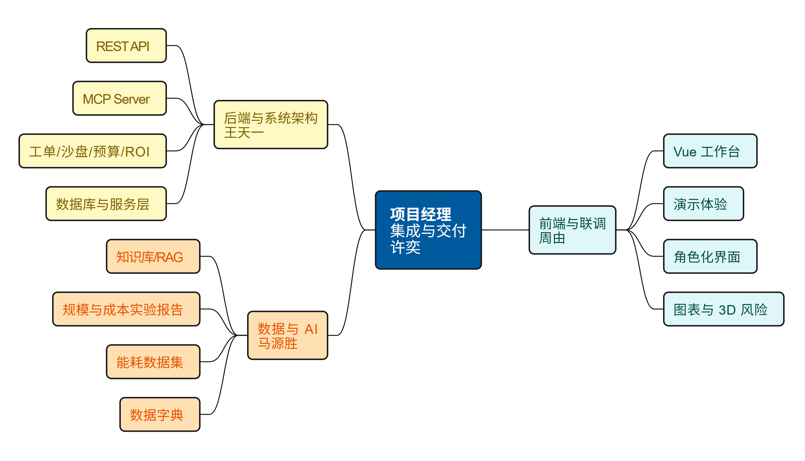
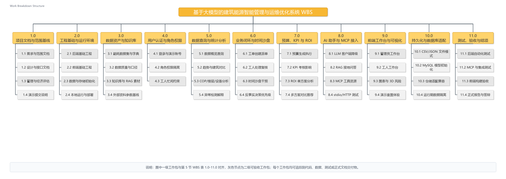
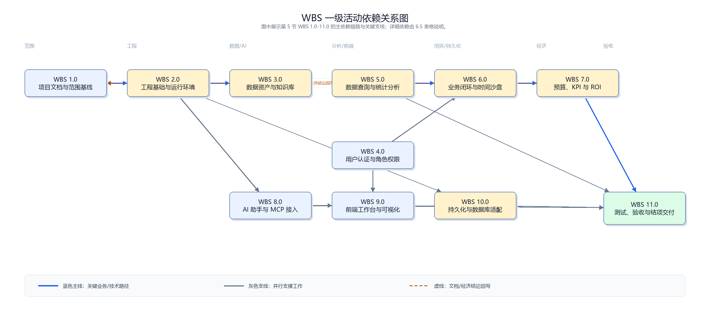
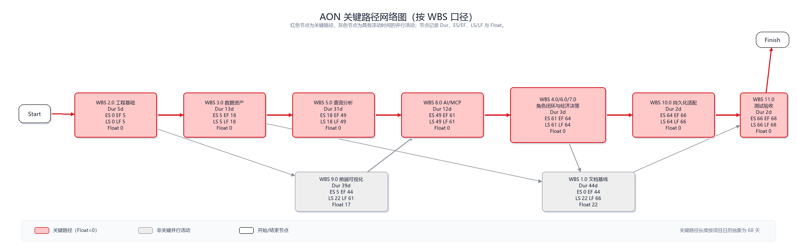
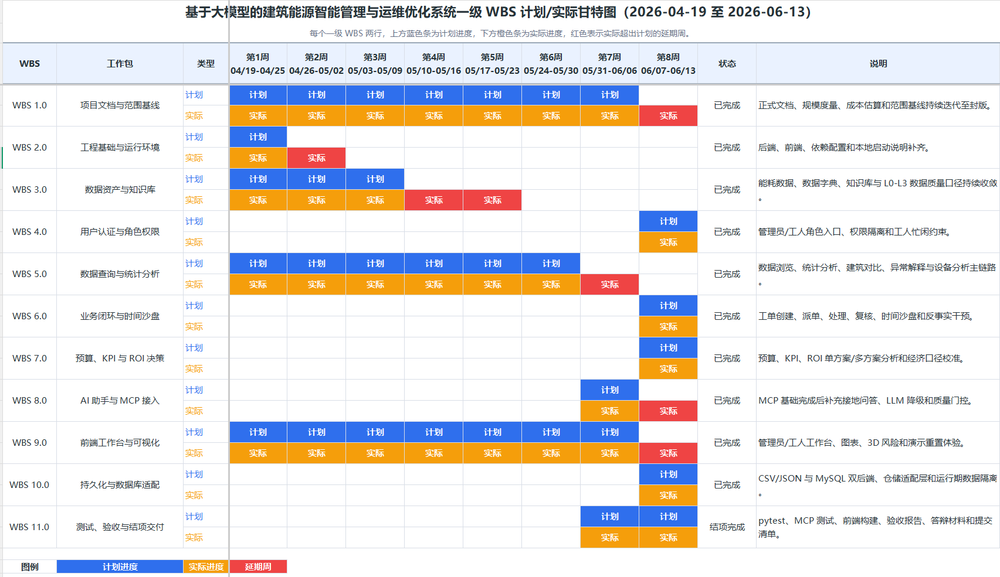
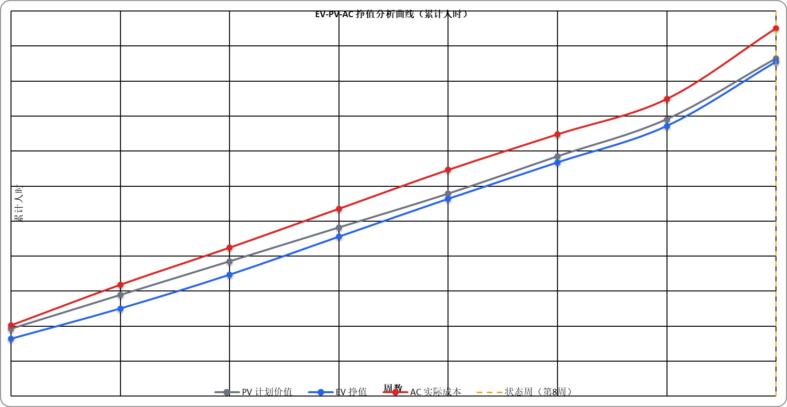
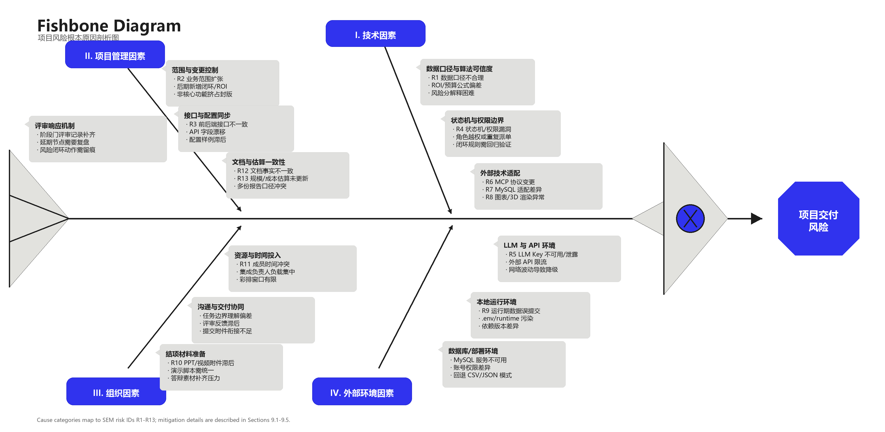
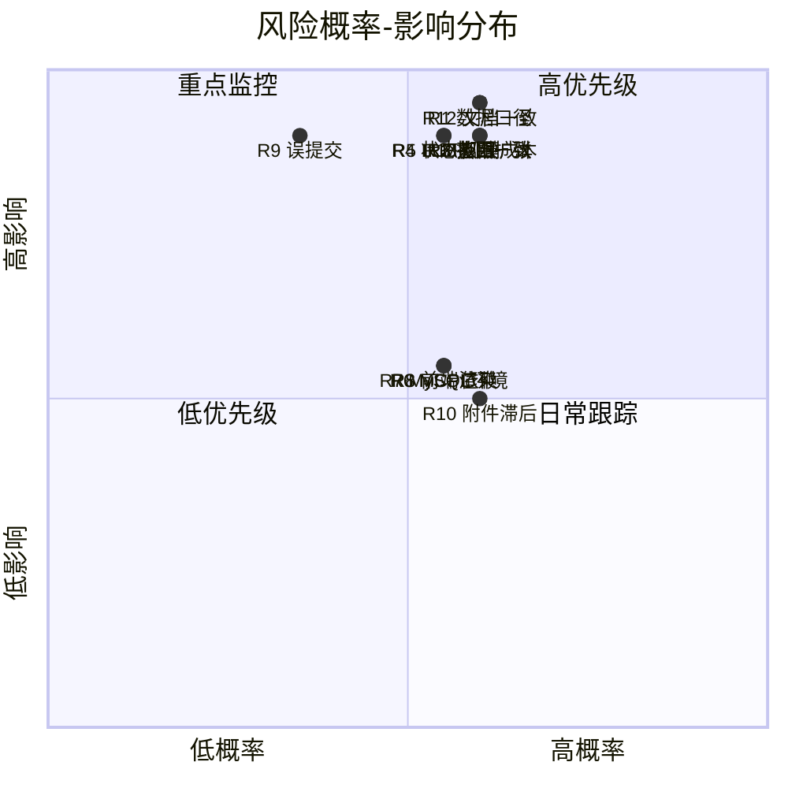

# 基于大模型的建筑能源智能管理与运维优化系统

## 软件工程管理文档（SEM）

**文档版本**：v1.3  
**编制日期**：2026年6月  
**课程**：软件工程管理与经济学  
**项目类型**：课程项目基础上的迭代增强与完整交付项目  
**适用范围**：本文档用于说明本课程项目的组织方式、范围控制、进度安排、质量管理、风险管理、沟通机制、配置与变更管理、测试验收和项目收尾安排。项目管理范围覆盖建筑能耗数据集、FastAPI 后端、Vue 前端工作台、MCP Server、知识库与大模型问答、时间沙盘、角色化工单闭环、预算与 KPI、ROI 改造分析、MySQL 可切换持久化、测试与最终交付材料。

## 目录

| 章节 | 小节 |
|---|---|
| 1. 项目概述 | 1.1 项目背景；1.2 可行性分析；1.3 管理目标；1.4 管理依据 |
| 2. 项目组织 | 2.1 团队成员与角色；2.2 责任矩阵；2.3 管理职责说明；2.4 协作边界 |
| 3. 生命周期与过程模型 | 3.1 过程模型选择；3.2 阶段划分；3.3 阶段门控制；3.4 轻量敏捷与阶段化控制结合；3.5 Sprint 计划与产出 |
| 4. 范围管理 | 4.1 项目范围；4.2 不纳入范围；4.3 范围控制原则；4.4 范围基线；4.5 范围验收边界 |
| 5. 工作分解结构 | 5.1 WBS 交付物与验收责任；5.2 WBS 结构图 |
| 6. 进度管理 | 6.1 里程碑计划；6.2 进度控制方法；6.3 进度控制表；6.4 进度偏差处理；6.5 活动依赖关系；6.6 甘特图；6.7 挣值分析 |
| 7. 资源与成本管理 | 7.1 人力资源管理；7.2 成本控制方法；7.3 成本控制措施；7.4 工作量分配；7.5 成本基线与控制点 |
| 8. 质量管理 | 8.1 质量目标；8.2 质量保证活动；8.3 验收标准；8.4 质量指标；8.5 质量保证流程 |
| 9. 风险管理 | 9.1 风险矩阵；9.2 风险评分方法；9.3 重点风险说明；9.4 风险触发条件与应急计划；9.5 过程改进措施 |
| 10. 沟通管理 | 10.1 沟通机制；10.2 沟通原则；10.3 沟通升级机制；10.4 会议记录要求 |
| 11. 配置与版本管理 | 11.1 配置项；11.2 文档版本规则；11.3 配置基线；11.4 配置审查要求 |
| 12. 变更管理 | 12.1 变更流程；12.2 关键变更记录；12.3 变更影响评估表；12.4 变更关闭标准 |
| 13. 测试与验收管理 | 13.1 测试范围；13.2 验收材料；13.3 验收责任矩阵；13.4 验收问题处理；13.5 过程改进与技术债务管理 |
| 14. 项目收尾 | 14.1 收尾条件；14.2 经验总结；14.3 收尾交付清单；14.4 后续改进建议 |

---

## 1. 项目概述

### 1.1 项目背景

建筑能源管理场景中，能耗数据通常分散在电表、暖通系统、设备台账、楼层空间和人工巡检记录中。传统能耗看板可以展示趋势，却难以及时回答运维管理中更关键的问题：哪些楼层或设备正在异常，异常会造成多少电费和碳排损失，有限工人应该先处理哪一项，处理结果是否改变了后续能耗走势，以及这些处置是否能反馈到预算、考核和改造投资决策中。

本项目以校园或园区建筑能源运营为背景，建设“基于大模型的建筑能源智能管理与运维优化系统”。系统并不是单纯的数据展示大屏，而是以能耗数据为基础，以“时间沙盘”推进业务时钟，以异常识别和经济量化为分析核心，以管理员与工人的角色化工单为执行闭环，以预算、KPI 和 ROI 为管理反馈，并通过 MCP 与智能问答向 AI 客户端开放同一套业务能力。

截至 2026年6月12日，项目已从初始脚手架发展为可运行、可测试、可演示、可交付的完整课程系统。当前核心事实如下：

1. 数据集覆盖 2026年1月1日 至 2026年6月1日，包含 4864 条能耗记录和 4 栋建筑，字段覆盖电耗、水耗、暖通电耗、制冷量、温湿度、人员密度、设备编号和设备状态。
2. 后端采用 FastAPI，服务层覆盖数据加载、异常分析、时间沙盘、工单状态机、预算、ROI、决策、知识库检索、大模型问答和 MCP Server。
3. 前端采用 Vue 3 + Vite，形成角色化工作台，管理员可使用总览、数据浏览、统计分析、工单中心、预算管理、改造分析、决策报告和智能问答，工人只访问“我的工单”和智能问答。
4. 系统具备 REST API 与 MCP 双接口形态。Web 前端通过 `/api/v1` REST API 访问业务能力，支持 MCP 的 AI 客户端可通过 stdio 或 streamable-http 调用同一套服务层。
5. 项目在后期迭代中补充了设备级修复、忙闲锁、有限人力派单、MySQL 可切换持久化、L0-L3 数据质量验收、ROI 经济学重构和演示重置机制。

### 1.2 可行性分析（Feasibility Analysis）

**技术可行性**：项目采用 FastAPI、Vue 3、Vite、Pandas、SQLAlchemy、MCP Python SDK 和 OpenAI-compatible LLM Client 等成熟技术。FastAPI 适合快速构建 REST API 和自动接口文档，Vue 3 + Vite 适合课程周期内快速形成可演示工作台，Pandas 能支撑当前 4864 条样例数据的内存分析。系统同时设计了默认 CSV/JSON 离线模式和可选 MySQL 持久化模式，既降低了本地运行门槛，又为数据库章节和后续扩展保留空间。LLM 与 MCP 均通过服务层和适配层接入，不直接侵入核心业务逻辑，因此外部模型或 MCP 环境异常时仍可回退到本地知识库和 REST 演示路径。

**经济可行性**：项目主要依托开源工具链和本地开发环境，不需要购买商业软件、传感器硬件或云上高配资源。课程实际投入以小组人力为主，行业基准估算则由《实验二：软件规模度量报告.md》和《实验三：软件成本估算报告.md》支撑，当前封版范围约 287 FP、10.71 人月、33.55 万元主成本。系统本身围绕异常能耗识别、工单闭环、预算执行、KPI 考核和 ROI 改造建议展开，具备明确的降本增效价值；详细经济收益、成本区间和敏感性分析由 SEE 文档进一步论证。

**组织与操作可行性**：项目组由 4 名成员组成，职责覆盖项目管理与交付、后端架构、数据与 AI、前端与联调，能力结构与系统模块边界基本匹配。系统面向管理员和工人两类核心角色设计界面：管理员聚焦监测、决策、派单、预算和报告，工人聚焦“我的工单”、接单、处理和提交复核。角色化入口降低了用户学习成本，演示账号、演示重置按钮、用户手册和演示脚本进一步提高了课程验收和后续维护的可操作性。

### 1.3 管理目标

本项目的软件工程管理目标如下：

1. **范围可控**：将课程项目范围限定在“可运行、可测试、可演示、可解释的建筑能源业务闭环系统”，避免扩张到真实硬件接入、商业级多租户和生产运维平台。
2. **进度可追踪**：通过 Git 提交历史、两轮任务包、整合总结、迭代计划和最终验收文档记录项目推进路径。
3. **质量可验证**：围绕数据合理性、异常口径、工单状态机、权限、预算 ROI、MCP 工具和前端构建设置自动化测试与验收标准。
4. **业务闭环可解释**：确保系统不是静态展示，而能解释“异常发现、量化损失、派单处置、复核关闭、影响预算和未来异常”的因果链路。
5. **配置与变更可追溯**：对数据重构、时间沙盘、角色工单、ROI 方法学、MySQL 持久化、重复派单约束等关键变更保留文档和提交记录。
6. **规模与成本可估**：以功能点规模度量和成本估算报告支撑范围边界、资源投入、工作量、人月和成本区间。
7. **交付材料一致**：保证 SRS、SDD、SEE、SEM、测试验收、用户手册、演示脚本和 README 对项目范围、数据规模、接口、账号和测试结论表述一致。

### 1.4 管理依据

| 文档/材料 | 用途 |
|---|---|
| 《README.md》 | 项目总入口，说明目标、仓库结构、启动方式、接口、演示账号和封版状态 |
| 《Project_Charter_v1.md》 | 提供项目启动背景、团队成员和早期职责分工依据 |
| 《01-requirements.md》 | 原始需求整理和早期需求边界 |
| 《02-technical-solution.md》 | 技术方案、架构和实现路线依据 |
| 《06-api-contract.md》 | REST API 契约和前后端联调依据 |
| 《07-collaboration-rules.md》 | 团队协作方式、目录归属和冲突控制依据 |
| 《09-testing-plan.md》 | 测试目标、测试范围和验证策略 |
| 《15-project-acceptance-report.md》 | 早期完整验收报告和测试证据 |
| 《16-mcp-integration.md》 | MCP Server 接入方式和工具说明 |
| 《17-SRS-software-requirements-specification.md》 | 过程版需求规格说明 |
| 《18-SDS-software-design-description.md》 | 过程版软件设计说明 |
| 《19-SEE-software-economic-evaluation.md》 | 过程版软件经济评价依据 |
| 《20-SEM-software-engineering-management.md》 | 过程版软件工程管理说明 |
| 《22-business-logic-iteration-plan.md》 | 业务闭环迭代计划 |
| 《23-business-logic-closure-acceptance.md》 | 工单闭环实现与验收记录 |
| 《24-time-machine-and-causal-upgrade.md》 | 时间沙盘与因果升级说明 |
| 《25-grounded-llm-economic-simulation-role-iteration-plan.md》 | 接地问答、经济模拟和角色协作升级计划 |
| 《27-demo-rehearsal-guide.md》 | 答辩演示路径和彩排脚本 |
| 《28-roi-retrofit-methodology-redesign.md》 | ROI 改造分析方法学重构依据 |
| 《29-data-quality-acceptance-spec.md》 | L0-L3 数据质量与计算口径验收规范 |
| 《30-system-reference-for-final-reports.md》 | 四份正式报告共用事实底稿 |
| 《01-SRS-软件需求规格说明书.md》 | 正式需求文档 |
| 《02-SDD-软件设计说明书.md》 | 正式设计文档 |
| 《03-SEE-软件经济分析与评价.md》 | 正式经济分析文档 |
| 《实验二：软件规模度量报告.md》 | 提供 IFPUG/NESMA 功能点规模、系统边界和后续成本估算输入 |
| 《实验三：软件成本估算报告.md》 | 提供生产率、人时、人月、成本区间和经济管理方法 |
| Git 提交历史 | 支撑项目阶段、迭代路线、变更记录和完成证据 |

---

## 2. 项目组织

### 2.1 团队成员与角色

根据项目过程文档与任务分工，本项目团队规模为 4 人。



组织结构图体现了本项目的“项目经理统筹 + 三条专业线并行”模式。许奕负责范围、进度、文档、集成和交付闭环；王天一负责后端、架构和业务服务；周由负责前端工作台和交互联调；马源胜负责数据、知识库、AI 素材以及实验二/实验三报告支撑。

| 成员 | 项目角色 | 主要职责 |
|---|---|---|
| 许奕 | 项目经理 / 集成与交付负责人 | 制定项目计划，拆解任务，统筹需求、文档、集成、测试、演示和最终提交；维护 README、任务说明、集成总结、验收报告、最终文档和演示脚本。 |
| 王天一 | 后端与系统架构负责人 | 负责 FastAPI 后端、REST API、服务层架构、异常分析、工单状态机、时间沙盘、MCP Server、MySQL 可切换持久化和后端测试。 |
| 马源胜 | 数据与 AI 负责人 | 负责样例数据集、数据字典、数据源调研、知识库、RAG 检索素材、外部大模型配置和问答评估材料。 |
| 周由 | 前端与联调负责人 | 负责 Vue 工作台、图表可视化、三维风险态势、角色化页面、预算和 ROI 面板、前后端联调与演示体验优化。 |

### 2.2 责任矩阵

| 工作项 | 许奕 | 王天一 | 马源胜 | 周由 |
|---|---|---|---|---|
| 项目计划与范围控制 | A/R | C | C | C |
| 需求梳理与 SRS | A/R | C | C | C |
| 系统设计与 SDD | A | A/R | C | C |
| FastAPI 后端与 REST API | C | A/R | C | C |
| MCP Server 与 AI 客户端接入 | C | A/R | C | I |
| 数据集与数据字典 | C | C | A/R | I |
| 知识库与问答素材 | C | C | A/R | C |
| 前端工作台与可视化 | C | C | I | A/R |
| 角色工单与业务闭环 | A | A/R | C | R |
| 预算、KPI 与 ROI | A | A/R | C | R |
| 测试计划与验收 | A/R | R | C | R |
| SEE/SEM/最终提交材料 | A/R | C | C | C |

说明：A 表示主责，R 表示执行负责，C 表示参与协作，I 表示知情。

### 2.3 管理职责说明

| 管理领域 | 主责人 | 执行机制 | 主要产出 |
|---|---|---|---|
| 范围管理 | 许奕 | 对照课程题目、SRS、SDD 与最终报告事实底稿判断新增内容是否纳入本期交付 | 范围说明、不纳入范围、变更记录 |
| 进度管理 | 许奕 | 以任务包、整合节点、Git 提交和可运行系统为进度检查依据 | 任务分工、集成总结、提交历史、演示脚本 |
| 后端质量 | 王天一 | 通过服务层复用、路由测试、业务规则测试和 MCP 测试保证后端稳定 | 后端代码、测试用例、接口契约、MCP 工具 |
| 数据与 AI 质量 | 马源胜 | 通过数据字典、知识库、RAG 卡片、外部模型配置和数据源调研保证内容可信 | 数据集、知识库、问答评估、模型配置说明 |
| 前端质量 | 周由 | 通过组件化工作台、图表联调、角色页面、构建验证和演示路径优化保证体验 | Vue 组件、工作台页面、图表、构建结果 |
| 文档与交付 | 许奕 | 按 SRS/SDD/SEE/SEM、验收报告、用户手册、演示指南和提交清单统一检查 | 正式文档包、PPT/演示说明、提交材料 |

### 2.4 协作边界

本项目采用目录归属和接口契约结合的协作方式，以减少多人同时修改同一文件造成的冲突。

1. `backend/` 主要由后端与架构负责人维护，涉及 API 路由、服务层、数据库适配、MCP Server 和测试用例。
2. `frontend/` 主要由前端与联调负责人维护，涉及 Vue 页面、组件、ECharts、3D 风险态势、API 封装和角色化交互。
3. `data/` 和 `knowledge_base/` 主要由数据与 AI 负责人维护，涉及样例数据、数据字典、知识库、FAQ 和评估集。
4. 过程文档、正式文档、《README.md》和提交说明由项目经理统筹，其他成员补充各自模块事实。
5. REST 接口以《06-api-contract.md》为契约，前端统一通过 `frontend/src/lib/api.js` 调用，后端路由层不直接复制复杂业务逻辑。
6. MCP Server 复用后端服务层，避免 Web 页面与 AI 客户端出现两套不一致的分析口径。
7. 真实 `.env`、运行期工单和本地缓存不得提交，避免外部模型密钥和演示状态污染仓库。

---

## 3. 生命周期与过程模型

### 3.1 过程模型选择

本项目采用**阶段化增量开发模型**，并在后期引入轻量敏捷式迭代收敛。选择该模型的原因如下：

1. 项目从课程题目和初始脚手架出发，必须先建立可运行主链路，再逐步加入数据、AI、前端、MCP 和业务闭环能力。
2. 建筑能源系统涉及数据、后端、前端、知识库、经济分析和文档多个子系统，适合按模块并行开发、按阶段集成。
3. 后期需求出现明显演进：从早期“能耗数据看板”升级为“时间沙盘驱动的异常运维闭环系统”，需要通过变更管理和阶段门控制范围。
4. 课程周期有限，项目必须始终保持可演示版本，避免长期处于不可运行的重构状态。
5. 最终交付不仅要求代码，还要求 SRS、SDD、SEE、SEM、测试验收、用户手册、演示脚本和提交说明相互一致。

### 3.2 阶段划分

| 阶段 | 时间范围 | 主要目标 | 主要交付物 |
|---|---|---|---|
| P1 项目初始化与架构搭建 | 2026-04-19 至 2026-04-23 | 建立仓库骨架、后端依赖、基础文档和项目方向 | 初始脚手架、README、docs、backend/frontend/data/knowledge_base 目录 |
| P2 第一轮任务开发 | 2026-04-24 至 2026-05-06 | 分别完成后端基础包、前端基础页面、数据与知识库第一轮能力 | `第一次任务/`、数据知识包、后端接口、前端初版 |
| P3 第一轮整合与第二轮增强 | 2026-05-06 至 2026-05-25 | 完成第一次集成，补齐知识检索、建筑详情、图表和文档 | 《11-first-integration-summary.md》、《12-second-integration-summary.md》 |
| P4 最终交付基础版 | 2026-05-30 至 2026-06-01 | 打磨最终能源管理平台，补充 MCP、最终文档、提交材料和演示指南 | MCP Server、SRS/SDS/SEE/SEM 过程版、验收报告、提交清单 |
| P5 业务闭环增强 | 2026-06-10 至 2026-06-11 | 增加角色工单、时间沙盘、预算 KPI、ROI、接地问答和决策工作流 | 角色闭环、预算/ROI、时间机器、业务迭代文档 |
| P6 数据口径与工程封版 | 2026-06-11 至 2026-06-12 | 完成 L0-L3 数据质量清洗、MySQL 可切换持久化、资源约束派单和设备级修复 | 数据重构、MySQL 后端、119 个 pytest 用例、正式 SRS/SDD/SEM 文档 |

### 3.3 阶段门控制

| 阶段门 | 检查内容 | 通过标准 | 未通过处理 |
|---|---|---|---|
| G1 启动门 | 项目目标、目录结构、依赖和基础文档是否建立 | 能启动基础后端/前端骨架，项目范围初步明确 | 补齐 README、目录和依赖 |
| G2 第一轮任务门 | 后端、前端、数据 AI 是否具备可整合成果 | 每个模块有独立交付物，接口字段可对齐 | 回到任务说明，缩小未完成范围 |
| G3 集成门 | REST API、前端页面、数据字段和知识库是否能联通 | 总览、数据查询、统计分析和问答主链路可运行 | 建立阻塞清单，由集成负责人统一修复 |
| G4 MCP 与文档门 | MCP Tools、Resources、SRS/SDD/SEE/SEM 是否补齐 | MCP 测试通过，正式文档能支撑课程交付 | 补充接口说明、测试和最终提交指南 |
| G5 业务闭环门 | 角色登录、工单状态机、时间沙盘、预算和 ROI 是否闭环 | 管理员与工人可跑通派单、接单、提交、复核和报告归档 | 优先修复阻塞链路，非核心扩展降级 |
| G6 封版门 | 数据口径、测试、构建、MySQL、重复派单和演示重置是否稳定 | 后端测试全绿，前端构建通过，关键业务约束有用例覆盖 | 停止新增范围，集中修复一致性问题 |

### 3.4 轻量敏捷与阶段化控制结合

项目采用“阶段化主线 + 轻量敏捷反馈”的过程控制方式。阶段化主线用于保证课程节点、交付物和文档完整；轻量敏捷用于处理接口联调、业务口径修复和演示反馈。

| 敏捷元素 | 本项目采用方式 | 管理目的 |
|---|---|---|
| Product Backlog | 以数据集、后端 API、前端工作台、MCP、工单闭环、时间沙盘、预算 ROI、文档交付作为待办项 | 保证所有工作都能映射到课程目标和业务闭环 |
| Sprint | 按第一轮任务、第二轮任务、最终交付、业务升级、数据封版划分 | 便于阶段性集成和持续可演示 |
| Sprint Review | 每轮整合后检查系统能否运行、页面能否展示、接口能否调用、文档是否同步 | 防止代码完成但无法验收 |
| Sprint Retrospective | 在《11-first-integration-summary.md》、《12-second-integration-summary.md》、《23-business-logic-closure-acceptance.md》、《29-data-quality-acceptance-spec.md》等文档中记录问题和改进 | 形成过程改进闭环 |
| Daily/Weekly Sync | 通过任务文件、即时沟通和 Git 提交同步 | 适配课程小组项目时间安排 |

项目待办按优先级组织如下：

| 优先级 | 待办项 | 价值说明 | 验收方式 |
|---|---|---|---|
| P0 | 数据集与数据字典 | 支撑所有分析、展示、问答和报告 | 检查 CSV、数据字典、数据质量规范 |
| P0 | 后端 REST API | 支撑前端和测试主链路 | pytest、接口抽查、API 契约 |
| P0 | 前端工作台 | 支撑课程展示和用户操作闭环 | Vite build、浏览器演示 |
| P0 | 工单状态机与角色权限 | 支撑业务闭环核心叙事 | 工单生命周期测试、角色隔离测试 |
| P0 | 时间沙盘与因果干预 | 支撑“操作改变未来”的系统创新点 | simulation 测试、演示脚本 |
| P1 | MCP Server | 支撑 AI 客户端数据接入和工具调用 | MCP Server 测试、stdio 集成测试 |
| P1 | 预算 KPI 与 ROI | 支撑经济分析和运营决策 | budget/roi 测试、SEE 论证 |
| P1 | MySQL 可切换持久化 | 支撑更真实的部署说明和数据落库 | init_db、repository、端到端验证 |
| P1 | 正式交付文档 | 满足课程提交要求 | SRS、SDD、SEE、SEM、验收报告 |

### 3.5 Sprint 计划与产出

| Sprint | 时间范围 | Sprint 目标 | 主要任务 | 产出 |
|---|---|---|---|---|
| S1 脚手架与项目理解 | 2026-04-19 至 2026-04-23 | 搭建基础结构并明确题目方向 | 初始化仓库、配置依赖、建立过程文档、后端、前端、数据和知识库目录 | 初始脚手架、README、基础文档 |
| S2 第一轮分工 | 2026-04-24 至 2026-05-06 | 形成可整合的模块成果 | 后端接口、数据与知识库、前端基础页面 | 第一轮任务包、后端包、知识库包、前端初版 |
| S3 集成与增强 | 2026-05-06 至 2026-05-25 | 统一字段和接口，补齐分析能力 | 知识检索、建筑详情、数据分析、页面联调 | 第一/第二次集成总结 |
| S4 最终基础交付 | 2026-05-30 至 2026-06-01 | 形成课程可提交基础版 | MCP、LLM 配置、最终文档、验收报告、提交指南 | MCP Server、SRS/SDD/SEE/SEM 过程版、验收报告 |
| S5 业务闭环升级 | 2026-06-10 至 2026-06-11 | 从看板升级为运营闭环系统 | 角色登录、工单闭环、时间沙盘、预算、ROI、接地问答 | 业务闭环文档、演示脚本、测试增强 |
| S6 质量封版 | 2026-06-11 至 2026-06-12 | 统一数据口径、修复业务约束、补齐正式报告 | L0-L3 数据清洗、MySQL、资源约束派单、设备级修复、正式 SRS/SDD/SEM | 全量测试、正式文档、封版提交 |

---

## 4. 范围管理

### 4.1 项目范围

本项目范围包括：

1. 构建建筑能耗样例数据集和数据字典，支撑建筑、楼层、设备、时间、能耗、环境和状态维度分析。
2. 实现 FastAPI 后端 REST API，覆盖健康检查、数据查询、统计分析、异常解释、工单、认证、时间沙盘、预算、ROI、决策、导出和智能问答。
3. 实现 Vue 3 前端工作台，覆盖总览、数据浏览、统计分析、工单中心、预算管理、改造分析、决策报告、AI 助手和工人工作台。
4. 建设三维楼宇风险态势和多类图表，用于展示楼层风险、趋势、建筑对比、COP、异常原因、设备状态和预算/ROI 结果。
5. 建设管理员与工人两类角色，支持登录、权限隔离、派单、接单、处理、提交复核、复核关闭、驳回、忽略和生命周期时间线。
6. 建设时间沙盘和因果干预能力，支持启动、推进、重置、定时故障、维修干预和“修复后未来不再异常”的业务效果。
7. 建设资源约束派单能力，按工种和忙闲状态安排有限工人，并对重复设备派单进行后端强约束。
8. 建设预算管理、年度 KPI 和 ROI 改造分析，形成电费、碳排、回收期、NPV、IRR、EAA 和敏感性分析等经济决策结果。
9. 建设知识库问答、外部 OpenAI-compatible 大模型可选接入和接地回答质量门控。
10. 建设 MCP Server，向 AI 客户端暴露数据元信息、建筑列表、记录查询、统计分析、异常解释、工单看板、知识检索和智能问答工具。
11. 建设可切换存储后端，默认使用 CSV/JSON，配置 `DATABASE_URL` 后通过 SQLAlchemy + PyMySQL 接入 MySQL。
12. 完成自动化测试、启动脚本、验证脚本、用户手册、演示脚本、验收报告和正式 SRS/SDD/SEE/SEM 文档。

### 4.2 不纳入范围

以下内容不纳入本次课程项目范围：

1. 真实电表、传感器、楼宇自控系统或边缘设备的现场接入。
2. 企业级多租户、组织架构、细粒度权限审计和正式账号管理。
3. 商业级高可用部署、容灾备份、监控告警平台和生产 SLA。
4. 长周期真实节能审计、第三方能源审计认证和正式合同收益分成。
5. 大规模机器学习训练平台、在线模型训练和自动调参系统。
6. 移动端 App、小程序和离线工单扫码巡检能力。
7. 对所有历史课程作业目录和个人文件的统一整理。
8. 真实短信、邮件和外部付费服务的长期运维托管。

### 4.3 范围控制原则

1. 新增功能必须能对应到 SRS 用例、SDD 设计章节、业务闭环目标或课程提交要求。
2. 优先保证主链路可运行：数据可读、接口可测、页面可演示、文档可追踪。
3. 对会影响数据口径、经济结论、工单状态机、权限边界和存储方式的变更，必须同步更新文档和测试。
4. 后期封版阶段不再引入大范围新模块，只允许修复一致性、补齐验证和改善演示稳定性。
5. 外部大模型和 MySQL 均采用可选配置，不能成为课程演示的单点依赖。

### 4.4 范围基线

本项目范围基线由以下内容共同构成：

| 基线项 | 内容 | 管理要求 |
|---|---|---|
| 需求基线 | 《01-SRS-软件需求规格说明书.md》中的功能需求、接口需求、非功能需求和追踪矩阵 | 范围变化必须能映射到需求条目或附录说明 |
| 设计基线 | 《02-SDD-软件设计说明书.md》中的架构、模块、数据库、接口、安全和非功能设计 | 设计调整不得破坏已验收需求 |
| 数据基线 | 《energy_records.csv》、数据字典和《29-data-quality-acceptance-spec.md》L0-L3 数据质量规范 | 数据或公式调整必须重新检查合理区间和红线 |
| 接口基线 | 《06-api-contract.md》、后端路由和 MCP 工具定义 | 前后端和 MCP 不得各自形成不一致口径 |
| 规模基线 | 《实验二：软件规模度量报告.md》中 IFPUG 主估算 287 FP、NESMA 保守估算 250 FP | 范围扩展或收缩时必须重新识别 ILF、EIF、EI、EO、EQ |
| 管理基线 | 本 SEM 中的分工、进度、WBS、质量、风险、配置和变更机制 | 管理计划随重大范围变化同步更新 |
| 成本/经济基线 | 《03-SEE-软件经济分析与评价.md》、ROI 方法学、预算 KPI 参数和《实验三：软件成本估算报告.md》 | 经济结论变化必须说明规模来源、生产率、人月费率、公式和假设 |
| 交付基线 | 《README.md》、用户手册、演示脚本、验收报告和最终文档包 | 提交前统一检查文件、版本、日期、术语和账号 |

### 4.5 范围验收边界

项目验收只评价本期课程项目范围是否完成，不评价未纳入范围的商业级生产能力。判断原则如下：

1. 能直接支撑建筑能源数据分析、异常识别、工单闭环、预算 ROI、智能问答或 MCP 接入的功能属于验收范围。
2. 能直接支撑课程答辩、演示复现、测试验证和文档提交的脚本与文档属于验收范围。
3. 真实硬件、生产高可用、移动端、多租户和长期运营审计属于后续扩展，不作为本期验收项。
4. 外部 LLM 和 MySQL 作为增强能力验收其可配置与降级机制，不要求在无密钥或无数据库环境下强制启用。

---

## 5. 工作分解结构

| WBS 编号 | 层级 | 工作包 | 主要交付物 |
|---|---|---|---|
| 1.0 | 一级 | 项目文档与范围基线 | 《01-SRS-软件需求规格说明书.md》、《02-SDD-软件设计说明书.md》、《03-SEE-软件经济分析与评价.md》、本 SEM、范围基线 |
| 1.1 | 二级 | 需求与范围文档 | 《01-SRS-软件需求规格说明书.md》、用例清单、范围纳入/不纳入说明、验收边界 |
| 1.2 | 二级 | 设计与接口文档 | 《02-SDD-软件设计说明书.md》、《06-api-contract.md》、架构设计、模块设计、接口契约 |
| 1.3 | 二级 | 管理与经济评估材料 | 本 SEM、《03-SEE-软件经济分析与评价.md》、《实验二：软件规模度量报告.md》、《实验三：软件成本估算报告.md》 |
| 1.4 | 二级 | 演示与提交说明 | 《README.md》、用户手册、演示脚本、提交清单、答辩材料说明 |
| 2.0 | 一级 | 工程基础与运行环境 | FastAPI、Vue 3、Vite、依赖配置、本地启动脚本、可选 MySQL 运行配置 |
| 2.1 | 二级 | 后端基础工程 | backend/app、backend/requirements.txt、统一路由、配置管理、健康检查接口 |
| 2.2 | 二级 | 前端基础工程 | frontend/src、frontend/package.json、页面框架、API 封装、图表基础组件 |
| 2.3 | 二级 | 数据与存储初始化 | data、backend/app/db/init_db.py、样例数据、运行期 JSON/CSV 存储目录 |
| 2.4 | 二级 | 本地运行与部署环境 | 启动脚本、.env.example、LOCAL_DEV/README 说明、前后端联调配置 |
| 3.0 | 一级 | 数据资产与知识库 | 能耗数据集、数据字典、知识库、RAG 素材、数据质量验收规范 |
| 3.1 | 二级 | 能耗数据集与数据字典 | energy_records.csv、建筑/楼层/设备字段说明、4864 条样例记录、设备状态字段 |
| 3.2 | 二级 | 数据质量与口径验收 | 《29-data-quality-acceptance-spec.md》、L0-L3 验收规则、异常率与风险分口径 |
| 3.3 | 二级 | 知识库与 RAG 素材 | knowledge_base、运维 FAQ、指标解释卡、异常诊断资料、检索增强素材 |
| 3.4 | 二级 | 外部资料与参数基线 | 《10-data-source-research.md》、电价/碳排参数、ROI 经济参数、问答引用素材 |
| 4.0 | 一级 | 用户认证与角色权限 | 登录接口、演示账号、管理员/工人角色、页面访问控制、权限隔离规则 |
| 4.1 | 二级 | 登录与演示账号 | auth.py、auth_service.py、登录入口、管理员与工人演示账号 |
| 4.2 | 二级 | 角色权限与页面隔离 | 前端路由守卫、角色化菜单、管理员工作台、工人工作台访问边界 |
| 4.3 | 二级 | 工人忙闲与权限约束 | 工人状态、忙闲锁、重复派单限制、工单处理权限校验 |
| 5.0 | 一级 | 数据查询与统计分析 | 数据浏览、统计图表、建筑对比、异常解释、COP/楼层/设备分析 |
| 5.1 | 二级 | 数据概览与记录查询 | data.py、analytics.py、DataTable.vue、筛选器、分页查询、导出接口 |
| 5.2 | 二级 | 时间趋势与建筑对比 | TrendChart.vue、BuildingComparisonChart.vue、按日/楼宇/设备维度统计 |
| 5.3 | 二级 | COP、楼层与设备分析 | building_detail.py、building_detail_service.py、COP 指标、楼层风险、设备状态分析 |
| 5.4 | 二级 | 异常检测与解释 | anomaly_events.py、analysis_service.py、异常原因图、风险分、经济损失解释 |
| 6.0 | 一级 | 业务闭环与时间沙盘 | 工单生命周期、派单、处理、复核、时间推进、反事实干预 |
| 6.1 | 二级 | 工单创建与派单 | work_orders.py、work_order_service.py、派单规则、资源约束、设备级工单 |
| 6.2 | 二级 | 工人处理与复核 | 工人工作台、接单处理、提交复核、关闭/驳回、日报归档 |
| 6.3 | 二级 | 时间沙盘与因果干预 | simulation.py、simulation_service.py、时间推进、定时故障、维修干预 |
| 6.4 | 二级 | 反事实情景与决策优先级 | decision.py、decision_service.py、派单建议、未来异常影响、预算影响 |
| 7.0 | 一级 | 预算、KPI 与 ROI 决策 | 预算执行、年度 KPI、设备改造经济性、单方案与多方案 ROI |
| 7.1 | 二级 | 预算生成与执行分析 | budget.py、budget_service.py、预算基线、执行偏差、预算影响解释 |
| 7.2 | 二级 | KPI 考核与预算影响 | 年度 KPI、节能率、异常处理率、预算超支风险、管理报告 |
| 7.3 | 二级 | ROI 设备审计与单方案分析 | roi.py、roi_service.py、NPV、IRR、EAA、回收期、敏感性分析 |
| 7.4 | 二级 | ROI 多方案对比与候选推荐 | 多设备改造候选、排序规则、情景对比、SEE 经济论证输入 |
| 8.0 | 一级 | AI 助手与 MCP 接入 | LLM 适配、知识库问答、MCP Tools/Resources、stdio 与 HTTP 接入 |
| 8.1 | 二级 | LLM 客户端与降级模式 | assistant_service.py、OpenAI-compatible Client、本地知识库降级回复 |
| 8.2 | 二级 | 知识库检索与接地问答 | RAG 检索、引用片段、回答质量门控、建筑能源问答卡片 |
| 8.3 | 二级 | MCP Tools 与 Resources | mcp_server.py、建筑列表、统计分析、异常解释、工单看板、知识检索工具 |
| 8.4 | 二级 | MCP stdio/HTTP 启动与测试 | 《16-mcp-integration.md》、MCP 测试脚本、stdio/streamable-http 验证 |
| 9.0 | 一级 | 前端工作台与可视化 | 管理员工作台、工人工作台、图表组件、三维风险态势、演示重置 |
| 9.1 | 二级 | 管理员工作台 | DashboardView.vue、总览、数据浏览、统计分析、预算、ROI、报告入口 |
| 9.2 | 二级 | 工人工作台 | 我的工单、接单处理、复核提交、权限收敛后的现场操作入口 |
| 9.3 | 二级 | 图表与三维风险态势 | KpiCard.vue、TrendChart.vue、BuildingRiskScene.vue、异常原因与建筑对比图 |
| 9.4 | 二级 | 演示重置与前端体验 | demo.py、演示重置按钮、加载态、空状态、状态提示、答辩演示路径 |
| 10.0 | 一级 | 持久化与数据库适配 | CSV/JSON 默认存储、MySQL 可选持久化、仓储适配层、数据隔离策略 |
| 10.1 | 二级 | CSV/JSON 文件模式 | 默认离线运行数据、运行期工单/预算/沙盘状态文件、演示可复现数据 |
| 10.2 | 二级 | MySQL ORM 模型与初始化 | engine.py、models.py、init_db.py、SQLAlchemy、PyMySQL、DATABASE_URL 配置 |
| 10.3 | 二级 | 仓储适配层与兼容测试 | repository.py、文件/数据库双后端切换、兼容性测试、回退策略 |
| 10.4 | 二级 | 运行期数据隔离 | .gitignore、演示状态隔离、密钥与运行数据不提交、重置机制 |
| 11.0 | 一级 | 测试、验收与结项交付 | pytest、MCP 集成测试、前端构建、验收报告、正式文档、答辩材料 |
| 11.1 | 二级 | 后端关键测试 | backend/tests、API 测试、服务测试、工单/预算/ROI/沙盘/MCP 测试 |
| 11.2 | 二级 | MCP 与主链路集成测试 | MCP Server 测试、REST 主链路联调、角色化流程验证、演示彩排 |
| 11.3 | 二级 | 前端构建与浏览器验收 | npm run build、页面操作检查、图表渲染、管理员/工人流程验收 |
| 11.4 | 二级 | 正式报告、实验报告与答辩材料 | SRS、SDD、SEE、SEM、验收报告、实验二/实验三、PPT/Demo 说明 |

### 5.1 WBS 交付物与验收责任

| WBS 工作包 | 交付物 | 验收责任 | 验收依据 |
|---|---|---|---|
| 1.0 项目文档与范围基线 | SRS、SDD、SEE、SEM、规模与成本估算报告、范围基线 | 许奕 | 《01-SRS-软件需求规格说明书.md》、《02-SDD-软件设计说明书.md》、《03-SEE-软件经济分析与评价.md》、本 SEM、《实验二：软件规模度量报告.md》、《实验三：软件成本估算报告.md》 |
| 2.0 工程基础与运行环境 | FastAPI 后端、Vue 前端、依赖配置、启动说明、本地运行配置 | 王天一、周由 | backend、frontend、《README.md》、启动脚本、依赖清单 |
| 3.0 数据资产与知识库 | 能耗数据集、数据字典、知识库、RAG 素材、数据质量规范 | 马源胜 | data、knowledge_base、《10-data-source-research.md》、《29-data-quality-acceptance-spec.md》 |
| 4.0 用户认证与角色权限 | 登录接口、演示账号、角色权限、工人忙闲约束 | 王天一、周由 | auth.py、auth_service.py、前端角色化入口、工单权限测试 |
| 5.0 数据查询与统计分析 | 数据浏览、统计分析、建筑对比、异常解释、COP/设备分析 | 王天一、周由 | data.py、analytics.py、building_detail.py、DashboardView.vue、统计图表组件 |
| 6.0 业务闭环与时间沙盘 | 工单状态机、派单处理、复核关闭、时间推进、反事实决策 | 王天一、周由 | 《23-business-logic-closure-acceptance.md》、work_orders.py、simulation.py、decision.py、业务闭环演示 |
| 7.0 预算、KPI 与 ROI 决策 | 预算执行、KPI、ROI 单方案/多方案分析、经济指标 | 王天一、许奕 | 《28-roi-retrofit-methodology-redesign.md》、《29-data-quality-acceptance-spec.md》、budget.py、roi.py、SEE |
| 8.0 AI 助手与 MCP 接入 | LLM 适配、接地问答、MCP Tools/Resources、MCP 测试 | 王天一、马源胜 | assistant_service.py、mcp_server.py、《16-mcp-integration.md》、MCP 测试记录 |
| 9.0 前端工作台与可视化 | 管理员/工人工作台、图表组件、三维风险态势、演示重置 | 周由 | frontend/src、Vite build、浏览器演示、演示脚本 |
| 10.0 持久化与数据库适配 | CSV/JSON 默认模式、MySQL ORM、仓储适配、运行期数据隔离 | 王天一 | engine.py、models.py、repository.py、init_db.py、MySQL 兼容验证 |
| 11.0 测试、验收与结项交付 | pytest、前端构建、MCP 集成、验收报告、答辩材料 | 许奕、王天一、周由 | 《09-testing-plan.md》、《15-project-acceptance-report.md》、《27-demo-rehearsal-guide.md》、backend/tests、frontend build |

### 5.2 WBS 结构图



图 5-1 采用与 WBS 表一致的三层树形表达：根节点为本项目系统，黄色节点为 1.0-11.0 一级工作包，灰色节点为可独立验收的二级工作包。该图用于替代表格的纯文本阅读方式，便于在评审中快速说明项目范围、模块拆分和交付物追踪关系。

---

## 6. 进度管理

本节进度管理以第 5 节 WBS 作为唯一口径。后续里程碑、活动依赖、甘特图和挣值分析均使用 `WBS 1.0` 至 `WBS 11.0` 的一级工作包名称，避免“阶段名称”和“工作分解名称”不一致导致的追踪断裂。

### 6.1 里程碑计划

| 里程碑 | 日期 | 对应 WBS | 说明 | 完成标准 |
|---|---|---|---|---|
| M1 工程启动与基础环境 | 2026-04-19 至 2026-04-25 | WBS 1.0、2.0 | 建立项目仓库、后端/前端基础工程、依赖配置和初始范围文档 | 仓库可拉取，后端依赖补齐，README 能支撑本地启动 |
| M2 第一轮并行交付 | 2026-04-19 至 2026-05-09 | WBS 3.0、5.0、9.0 | 数据资产、统计分析接口和前端可视化形成第一轮可集成成果 | 数据样例、后端接口、前端工作台具备联调入口 |
| M3 数据与查询分析收敛 | 2026-05-10 至 2026-05-23 | WBS 3.0、5.0、9.0 | 数据资产补充、查询分析联调和前端展示继续收敛 | 数据质量基础口径、统计分析和可视化主链路稳定 |
| M4 计划基线收口 | 2026-05-24 至 2026-06-06 | WBS 1.0、5.0、8.0、9.0、11.0 | 文档基线、查询分析、AI/MCP、前端可视化和测试验收达到计划收口点 | 主要计划条在第 7 周前完成，延期项进入红色实际延伸区 |
| M5 封版增强与闭环交付 | 2026-06-07 至 2026-06-13 | WBS 1.0、4.0、6.0、7.0、8.0、9.0、10.0、11.0 | 完成角色权限、工单闭环、时间沙盘、预算 ROI、MCP 补强、MySQL 和最终文档 | 所有一级 WBS 在第 8 周达到完成或结项完成状态 |

### 6.2 进度控制方法

1. 以第 5 节 WBS 作为进度台账主键，所有任务状态均归入 `WBS 1.0` 至 `WBS 11.0`。
2. 以 Git 提交、任务文档、测试结果和可运行演示版本作为进度证据，而不是只记录口头进展。
3. 每个一级 WBS 至少保留一个可验收交付物，避免出现“活动完成但交付物不可检查”的管理空洞。
4. 对计划与实际偏差采用双轨跟踪：计划基线用于评价延期，实际轨迹用于复盘返工和范围增量。
5. 后期所有新增能力必须服务于答辩主线：监测、量化、决策、派单、复核、反馈。
6. 当发现数据口径、经济结论或接口契约不可信时，优先修复底层口径，再补前端展示。
7. 封版阶段使用测试和演示脚本控制进度，避免临近提交继续扩张范围。

### 6.3 进度控制表

| WBS 工作包 | 计划窗口 | 关键控制点 | 延误影响 | 纠偏措施 |
|---|---|---|---|---|
| WBS 1.0 项目文档与范围基线 | 第 1 周至第 7 周 | SRS、SDD、SEE、SEM 与范围基线同步 | 文档不能支撑验收和答辩追问 | 第 8 周用统一事实底稿集中封版，保证正式文档与系统一致 |
| WBS 2.0 工程基础与运行环境 | 第 1 周 | 后端、前端、依赖和启动说明可运行 | 后续成员无法并行开发 | 第 2 周补齐依赖和启动说明，恢复最小可运行主链路 |
| WBS 3.0 数据资产与知识库 | 第 1 周至第 3 周 | 能耗数据、数据字典、知识库和数据质量规则可用 | 统计分析、问答、ROI 和预算结论失去依据 | 第 4-5 周补充数据质量和知识库口径，避免经济结论失真 |
| WBS 4.0 用户认证与角色权限 | 第 8 周 | 管理员/工人角色入口和权限隔离可验收 | 工单闭环无法体现真实角色协作 | 角色能力只保留答辩主链路所需操作，避免扩大权限体系 |
| WBS 5.0 数据查询与统计分析 | 第 1 周至第 6 周 | 查询、统计、建筑对比、异常解释可联通 | 前端无法展示核心分析价值 | 第 7 周完成剩余联调，用《06-api-contract.md》统一字段 |
| WBS 6.0 业务闭环与时间沙盘 | 第 8 周 | 派单、处理、复核、沙盘推进和反事实链路可跑通 | 系统停留在看板，缺少运营闭环 | 砍掉非核心扩展，优先保证工单状态机和沙盘时钟一致 |
| WBS 7.0 预算、KPI 与 ROI 决策 | 第 8 周 | 预算、KPI、ROI 指标和 SEE 经济结论一致 | 经济分析难以解释，影响项目价值论证 | 以 ROI 方法学重构和数据质量规范统一公式、参数和展示口径 |
| WBS 8.0 AI 助手与 MCP 接入 | 第 7 周 | MCP Tools/Resources、LLM 客户端和接地问答可用 | AI 客户端无法复用业务能力 | 第 8 周补充接地问答、降级机制和质量门控 |
| WBS 9.0 前端工作台与可视化 | 第 1 周至第 7 周 | 管理员/工人工作台、图表和演示体验可操作 | 演示路径断裂，业务价值不可见 | 第 8 周收敛角色页、演示重置和预算 ROI 展示 |
| WBS 10.0 持久化与数据库适配 | 第 8 周 | CSV/JSON 与 MySQL 双后端可切换 | 部署说明缺少真实持久化支撑 | 仓储适配层隔离存储差异，MySQL 为可选增强而非单点依赖 |
| WBS 11.0 测试、验收与结项交付 | 第 7 周至第 8 周 | pytest、MCP、前端构建、验收报告和答辩材料完成 | 交付物不完整，无法稳定复现演示 | 停止新增范围，围绕测试、文档和演示脚本做封版检查 |

### 6.4 进度偏差处理

主要偏差如下：

| WBS 工作包 | 表观偏差 | 根因 | 处理结果 |
|---|---:|---|---|
| WBS 1.0 项目文档与范围基线 | +1 周 | 第 8 周业务闭环、ROI、MySQL 和数据质量修复改变了正式文档事实口径 | 采用统一事实底稿，集中更新 SRS、SDD、SEE、SEM 和实验二/三引用 |
| WBS 2.0 工程基础与运行环境 | +1 周 | 后端依赖和本地启动说明需要补齐 | 先恢复最小运行链路，再支持后续成员并行 |
| WBS 3.0 数据资产与知识库 | +2 周 | 基础交付后继续补充 L0-L3 数据质量、知识库和经济口径 | 将质量规范纳入封版门禁，避免 ROI、预算和异常解释失真 |
| WBS 5.0 数据查询与统计分析 | +1 周 | 查询分析、图表和字段联调在第 7 周继续收敛 | 冻结 API 字段，集中修复前后端统计口径 |
| WBS 8.0 AI 助手与 MCP 接入 | +1 周 | MCP 基础能力完成后，接地问答、外部模型降级和质量门控继续补强 | 保持 MCP 复用服务层，外部 LLM 不作为演示单点依赖 |
| WBS 9.0 前端工作台与可视化 | +1 周 | 角色页面、预算 ROI 展示和演示重置属于第 8 周主动增量 | 停止扩展非核心页面，把前端收敛到管理员/工人主流程 |

偏差处理原则为：优先修复影响主链路和答辩解释的问题；对非核心体验问题记录为后续改进；对外部依赖问题提供本地回退；对所有延期均要求在 WBS、测试或正式文档中留下可追踪证据。

### 6.5 活动依赖关系

| 前置 WBS | 后续 WBS | 依赖说明 |
|---|---|---|
| WBS 1.0 项目文档与范围基线 | WBS 2.0 至 WBS 11.0 | 范围基线、接口契约和验收边界约束所有后续工作 |
| WBS 2.0 工程基础与运行环境 | WBS 3.0、5.0、8.0、9.0、10.0、11.0 | 后端、前端和运行环境是数据、服务、MCP、前端和测试的基础 |
| WBS 3.0 数据资产与知识库 | WBS 5.0、7.0、8.0 | 数据字段、质量口径和知识素材支撑统计分析、经济决策和接地问答 |
| WBS 4.0 用户认证与角色权限 | WBS 6.0、9.0 | 工单闭环和角色化前端必须依赖管理员/工人的权限隔离 |
| WBS 5.0 数据查询与统计分析 | WBS 6.0、7.0、11.0 | 异常识别和统计分析是派单、预算 ROI 和测试验收的输入 |
| WBS 6.0 业务闭环与时间沙盘 | WBS 7.0、11.0 | 工单关闭和沙盘干预结果影响预算反馈、ROI 解释和验收演示 |
| WBS 7.0 预算、KPI 与 ROI 决策 | WBS 1.0、11.0 | 经济结论回写 SEE、SEM 和答辩材料，并成为验收检查项 |
| WBS 8.0 AI 助手与 MCP 接入 | WBS 9.0、11.0 | AI 问答和 MCP 工具需要在前端演示与测试验收中验证 |
| WBS 9.0 前端工作台与可视化 | WBS 11.0 | 前端工作台是验收演示和用户可操作性的主要载体 |
| WBS 10.0 持久化与数据库适配 | WBS 11.0 | 数据持久化和 MySQL 兼容性是封版质量门禁 |



为进一步识别关键路径，项目将一级 WBS 抽象为 AON 网络图。节点中记录活动编号、持续时间、最早开始/完成（ES/EF）、最迟开始/完成（LS/LF）和总浮动时间（Float）。红色节点为关键路径，浮动时间为 0。



网络图显示，本项目的关键路径为：WBS 2.0 工程基础与运行环境 → WBS 3.0 数据资产与知识库 → WBS 5.0 数据查询与统计分析 → WBS 8.0 AI 助手与 MCP 接入 → WBS 4.0 用户认证与角色权限、WBS 6.0 业务闭环与时间沙盘、WBS 7.0 预算、KPI 与 ROI 决策 → WBS 10.0 持久化与数据库适配 → WBS 11.0 测试、验收与结项交付。图中的“WBS 4.0/6.0/7.0 角色闭环与经济决策”为网络图压缩显示，表示三个一级工作包在第 8 周并行收敛，并非新增 WBS 工作包。WBS 1.0 文档基线和 WBS 9.0 前端可视化虽然跨期较长，但存在一定浮动空间；当集成延期时，团队优先压缩这些非关键活动的缓冲，而不是压缩数据口径清洗、持久化适配和验收测试。

### 6.6 甘特图

为体现计划与实际执行之间的偏差，本项目参考并同步更新《建筑能源智能管理系统_一级WBS计划实际甘特图.xlsx》的双轨表达方式。每个一级 WBS 使用两行表示：上方蓝色条为计划基线，下方橙色条为实际执行；红色单元格表示实际执行超过计划基线的延期周。图中工作包名称与第 5 节 WBS 表完全一致，时间轴采用第 1 周至第 8 周。



计划与实际对比复盘如下：

| WBS | 工作包 | 计划窗口 | 实际窗口 | 结束偏差 | 主要原因 | 纠偏措施 |
|---|---|---|---|---:|---|---|
| 1.0 | 项目文档与范围基线 | 第 1 周至第 7 周 | 第 1 周至第 8 周 | +1 周 | 正式文档需吸收第 8 周闭环、ROI、MySQL 和数据质量变更 | 使用统一事实底稿集中封版，保证文档与系统一致 |
| 2.0 | 工程基础与运行环境 | 第 1 周 | 第 1 周至第 2 周 | +1 周 | 后端依赖和启动说明补齐 | 先恢复最小可运行链路，再扩展模块 |
| 3.0 | 数据资产与知识库 | 第 1 周至第 3 周 | 第 1 周至第 5 周 | +2 周 | 基础数据按期完成，但 L0-L3、知识库和经济口径继续收敛 | 把数据质量修复纳入封版门禁，不再新增无关数据维度 |
| 4.0 | 用户认证与角色权限 | 第 8 周 | 第 8 周 | 0 周 | 后期新增角色化闭环 | 聚焦管理员/工人两个核心角色 |
| 5.0 | 数据查询与统计分析 | 第 1 周至第 6 周 | 第 1 周至第 7 周 | +1 周 | 统计分析、图表和字段联调继续收敛 | 接口字段冻结后集中联调 |
| 6.0 | 业务闭环与时间沙盘 | 第 8 周 | 第 8 周 | 0 周 | 主动增加业务闭环能力 | 停止非核心扩展，优先保证状态机和沙盘一致 |
| 7.0 | 预算、KPI 与 ROI 决策 | 第 8 周 | 第 8 周 | 0 周 | 与数据口径修复同步推进 | ROI 方法学和 SEE 经济结论同步校准 |
| 8.0 | AI 助手与 MCP 接入 | 第 7 周 | 第 7 周至第 8 周 | +1 周 | MCP 基础完成后继续补接地问答和降级机制 | MCP 复用服务层，LLM 不作为演示单点依赖 |
| 9.0 | 前端工作台与可视化 | 第 1 周至第 7 周 | 第 1 周至第 8 周 | +1 周 | 角色页、预算 ROI 和演示体验扩展 | 页面收敛到答辩主路径，暂停装饰性扩展 |
| 10.0 | 持久化与数据库适配 | 第 8 周 | 第 8 周 | 0 周 | MySQL 可选增强集中实现 | 用仓储适配层隔离文件模式和数据库模式 |
| 11.0 | 测试、验收与结项交付 | 第 7 周至第 8 周 | 第 7 周至第 8 周 | 0 周 | 测试和验收随系统封版推进 | 按测试计划、演示脚本和提交清单逐项检查 |

根据修改后的甘特图，关键延期集中在 WBS 3.0 数据资产与知识库，其实际执行比计划多 2 周；WBS 1.0、2.0、5.0、8.0 和 9.0 均表现为 1 周以内的计划外延伸。它们共同体现了从“可运行主链路”升级为“可解释、可验收、可答辩系统”的返工成本。团队的纠偏方式是冻结接口字段、停止非核心扩展、把 L0-L3 数据质量和 ROI 经济口径作为封版门禁，并用 WBS 11.0 的测试与验收工作包兜底。

### 6.7 挣值分析

本项目为课程项目，不采用真实合同付款进度进行企业级挣值核算。为反映进度绩效，采用“一级 WBS 工作包完成度”进行轻量挣值分析。以 100 个计划价值点作为总计划价值，按第 5 节 WBS 权重分配；计划价值权重参考《实验二：软件规模度量报告.md》中功能点分布，尤其是数据、外部输出、业务闭环、AI/MCP、前端交互和持久化适配的规模占比。

| WBS | 工作包 | 计划价值 PV | 实际完成情况 | 挣值 EV | 状态说明 |
|---|---|---:|---|---:|---|
| 1.0 | 项目文档与范围基线 | 12 | 正式文档、规模度量、成本估算和范围基线已完成 | 12 | 完成 |
| 2.0 | 工程基础与运行环境 | 8 | 后端、前端、依赖和启动环境已完成 | 8 | 完成 |
| 3.0 | 数据资产与知识库 | 12 | 数据集、数据字典、知识库和 L0-L3 验收规范已完成 | 12 | 完成 |
| 4.0 | 用户认证与角色权限 | 6 | 登录、演示账号、角色权限和工人忙闲约束已完成 | 6 | 完成 |
| 5.0 | 数据查询与统计分析 | 12 | 查询、统计、建筑对比、异常解释和设备分析已完成 | 12 | 完成 |
| 6.0 | 业务闭环与时间沙盘 | 10 | 工单状态机、处理复核、沙盘推进和反事实干预已完成 | 10 | 完成 |
| 7.0 | 预算、KPI 与 ROI 决策 | 10 | 预算、KPI、ROI 单方案/多方案分析和经济口径已完成 | 10 | 完成 |
| 8.0 | AI 助手与 MCP 接入 | 8 | LLM 降级、RAG 问答、MCP Tools/Resources 已完成 | 8 | 完成 |
| 9.0 | 前端工作台与可视化 | 10 | 管理员/工人工作台、图表、3D 风险和演示重置已完成 | 10 | 完成 |
| 10.0 | 持久化与数据库适配 | 5 | CSV/JSON 与 MySQL 双后端、仓储适配和数据隔离已完成 | 5 | 完成 |
| 11.0 | 测试、验收与结项交付 | 7 | pytest、MCP、前端构建和验收材料已完成，答辩附件继续整理 | 6 | 基本完成 |
| 合计 | - | 100 | - | 99 | 项目主体完成，剩余为提交附件完善 |

```text
SPI = EV / PV = 99 / 100 = 0.99
```

管理解释：项目主体功能、代码、测试和文档已完成；剩余 1 个价值点主要是课程提交附件层面的 PPT/视频最终整理，不影响软件系统本身的验收结论。若按《实验三：软件成本估算报告.md》的行业基准口径折算，当前 287 FP 对应 1,928.64 人时、10.71 人月和约 33.55 万元开发成本；因此轻量挣值中的 100 个计划价值点也可视为对这一基准工作量的管理化拆分。

为展示执行全过程中的资源消耗动态，进一步给出以“累计人时”为单位的挣值曲线。PV 表示计划工作量，EV 表示按完成度折算的挣值工作量，AC 表示实际消耗人时。曲线以《实验三：软件成本估算报告.md》的 1,928.64 人时为计划总量基准，并按第 5 节一级 WBS 的计划窗口进行归一拆分。



阶段性复盘如下：

1. **启动蜜月期（第 1 周至第 2 周）**：WBS 2.0 工程基础、WBS 3.0 数据资产、WBS 5.0 查询分析和 WBS 9.0 前端工作台同步推进。AC 略高于 EV，主要来自技术栈熟悉、依赖补齐和字段口径磨合。
2. **数据与分析风险期（第 3 周至第 5 周）**：修改后的甘特图显示 WBS 3.0 从计划第 3 周结束延伸到第 5 周，是最大的偏差来源。原因是 L0-L3 数据质量、知识库素材和经济口径需要持续补齐。
3. **查询与前端收敛期（第 6 周至第 7 周）**：WBS 5.0 和 WBS 9.0 均在第 7 周出现 1 周延伸，主要用于统计分析、图表、角色页面和演示体验的集中联调。
4. **AI/MCP 与封版增强期（第 7 周至第 8 周）**：WBS 8.0 从第 7 周延伸至第 8 周，用于补充接地问答、LLM 降级和质量门控；WBS 4.0、6.0、7.0、10.0 在第 8 周集中完成，支撑角色闭环、预算 ROI 和 MySQL 适配。
5. **结项收敛期（第 8 周）**：WBS 1.0 与 WBS 11.0 完成正式文档、验收、测试和提交材料统一。团队通过暂停新增功能、补齐测试、统一事实底稿和更新实验二/三估算，将 EV 拉回 99 点，最终 SPI 维持在 0.99。

从曲线看，本项目并非线性消耗资源，而是在“数据资产补齐”“查询分析与前端联调”“AI/MCP 与封版增强”三个 WBS 集中阶段出现成本阶跃。管理上的关键动作不是掩盖 AC 上升，而是识别根因、用测试、文档和适配层把返工沉淀为可复用资产。

---

## 7. 资源与成本管理

### 7.1 人力资源管理

项目采用 4 人小组分工，角色覆盖项目管理、后端架构、数据 AI、前端联调和文档交付。人力资源管理原则如下：

1. 按目录和模块划分责任，减少多人同时改同一文件。
2. 关键接口和共享文档由项目经理或对应模块负责人统一维护。
3. 集成阶段由项目经理协调跨模块问题，后端负责人保障接口和服务层稳定，前端负责人保障页面可演示，数据 AI 负责人保障数据和知识素材可信。
4. 后期封版阶段集中做测试、演示和文档一致性，不再拆分大规模新任务。

### 7.2 成本控制方法

本项目同时采用两套成本口径：一是课程团队实际投入的影子成本口径，用于说明小组协作和课程完成情况；二是《实验三：软件成本估算报告.md》的行业基准口径，用于支撑软件规模、工作量、人月和后续经济管理。成本控制方法如下：

1. 采用开源技术栈：Python、FastAPI、Pandas、Vue、Vite、ECharts、pytest、SQLAlchemy、PyMySQL。
2. 默认运行使用 CSV/JSON 文件，保证无数据库环境也能演示；MySQL 作为可选增强。
3. 外部大模型通过 `.env` 可选启用，本地知识库作为兜底，避免 API 不可用影响演示。
4. 使用脚本化启动和测试降低人工配置成本。
5. 以《实验二：软件规模度量报告.md》的功能点边界控制范围，避免 REST、MCP 和前端多入口重复计算同一业务功能。
6. 以《实验三：软件成本估算报告.md》的生产率、人月费率和交叉验证结果控制成本估算偏差。
7. 通过文档模板和统一事实底稿降低正式报告返工成本。

### 7.3 成本控制措施

| 成本控制点 | 控制方式 | 预期效果 |
|---|---|---|
| 范围控制 | 不纳入真实硬件、生产 SLA、多租户和移动端 | 避免课程周期内无限扩张 |
| 技术复用 | REST 与 MCP 共用服务层，前端统一 API 封装 | 降低重复实现和维护成本 |
| 环境成本 | 本地开发运行，默认文件存储，MySQL 可选 | 降低部署门槛 |
| 外部模型成本 | `.env` 控制启用，未配置时本地知识库回答 | 降低外部费用和演示风险 |
| 测试成本 | pytest 与 Vite build 自动化 | 降低回归验证时间 |
| 文档成本 | docs 编号化和 final_docs 正式化 | 降低提交前信息不一致风险 |
| 规模成本联动 | 以 287 FP 为主规模、250 FP 为保守规模进行成本估算 | 让范围变化能量化反映到工作量与预算 |

### 7.4 工作量分配

项目工作量采用“课程实际投入”和“行业基准估算”两种视角。

课程实际投入视角用于记录 4 人小组在课程周期中的直接协作投入，估算约为 240 小时，反映学生实际参与项目规划、开发、测试和文档的时间成本。

| 成员 | 主要职责 | 估算工时 | 占比 |
|---|---|---:|---:|
| 许奕 | 项目规划、整合、测试、最终文档和演示打磨 | 80 小时 | 33.3% |
| 王天一 | 后端接口、架构、MCP、业务闭环和测试 | 55 小时 | 22.9% |
| 马源胜 | 数据集、知识库、AI 与模型配置 | 50 小时 | 20.8% |
| 周由 | 前端页面、图表、交互和联调 | 55 小时 | 22.9% |
| 合计 | 需求、开发、测试、文档、演示 | 240 小时 | 100% |

行业基准估算视角用于支撑后续成本估算和经济管理。《实验二：软件规模度量报告.md》给出当前封版系统主规模为 287 FP，NESMA 保守规模为 250 FP；《实验三：软件成本估算报告.md》按 6.72 人时/FP、180 人时/人月折算，得到如下工作量：

| 估算口径 | 软件规模 | 人时 | 人月 | 管理含义 |
|---|---:|---:|---:|---|
| IFPUG 主估算 | 287 FP | 1,928.64 人时 | 10.71 人月 | 作为当前封版范围的主工作量基线 |
| NESMA 保守估算 | 250 FP | 1,680.00 人时 | 9.33 人月 | 作为较保守的规模和成本下界 |

若按 4 人全职投入，10.71 人月对应约 2.68 个日历月；若按每人 50% 课余投入折算，则约为 5.36 个日历月。该结果与项目从需求理解、两轮任务、业务闭环升级、封版重构到 2026年6月13日实验报告更新的迭代周期基本一致。

### 7.5 成本基线与控制点

| 成本基线项 | 基线值 | 控制要求 |
|---|---:|---|
| 课程实际投入影子成本 | 19,200 元 | 按 240 小时、80 元/小时估算，用于说明课程小组直接投入 |
| 工具与环境影子成本 | 1,200 元 | 开发电脑折旧与占用估算，开源工具免费 |
| 课程项目实际投入口径 | 20,400 元 | 课程团队内部投入估算，不等同于行业开发报价 |
| IFPUG 主规模 | 287 FP | 来自《实验二：软件规模度量报告.md》，作为当前封版范围主规模 |
| NESMA 保守规模 | 250 FP | 来自《实验二：软件规模度量报告.md》，作为规模下界和敏感性参考 |
| 行业基准工作量 | 1,928.64 人时 / 10.71 人月 | 来自《实验三：软件成本估算报告.md》，按 6.72 人时/FP 折算 |
| 行业基准主成本 | 335,465.50 元，约 33.55 万元 | IFPUG + 生产率 + 上海人月费率法 |
| 功能点单价验证成本 | 347,036.35 元，约 34.70 万元 | IFPUG + 上海功能点单价法，与主估算差异约 3.45% |
| NESMA 保守成本 | 292,217.33 元，约 29.22 万元 | NESMA + 生产率 + 上海人月费率法，与主估算差异约 12.89% |
| 合理成本区间 | 约 29.22 万元至 34.70 万元 | 用于后续预算、资源和经济管理参考 |

控制点如下：

1. 若新增功能不能支撑核心闭环或课程交付，不计入本期范围。
2. 若外部模型成本或网络不稳定，关闭 LLM，使用本地知识库。
3. 若 MySQL 环境不可用，回退默认 CSV/JSON 模式。
4. 若范围变化导致功能点规模偏离 287 FP，应回到《实验二：软件规模度量报告.md》重新识别数据功能和事务功能。
5. 若两种成本估算结果差异超过 20%，应按《实验三：软件成本估算报告.md》的处理原则复核系统边界、功能分类、生产率基准和直接非人力成本。
6. 若文档重构成本过高，优先保证 SRS、SDD、SEE、SEM 四份正式文档和 README 一致。

---

## 8. 质量管理

### 8.1 质量目标

| 质量目标 | 衡量方式 |
|---|---|
| 系统可运行 | 按 README 启动后端、前端和可选 MCP Server |
| 数据可信 | 能通过《29-data-quality-acceptance-spec.md》L0-L3 数据质量和计算口径检查 |
| 接口稳定 | REST API 契约清晰，前端和 MCP 复用服务层 |
| 业务闭环完整 | 管理员派单、工人处理、管理员复核、设备修复和日报归档可跑通 |
| 权限边界清晰 | 管理员与工人页面和后端操作权限隔离 |
| 经济结论可解释 | ROI 使用实测门控、增量法、8% 折现率、EAA 和敏感性分析 |
| 外部依赖可降级 | 未配置 LLM 或 MySQL 时系统仍可演示 |
| 测试可复现 | 后端 pytest 和前端 build 可作为封版质量门 |
| 文档一致 | SRS、SDD、SEE、SEM、README 和演示脚本不冲突 |

### 8.2 质量保证活动

1. **需求评审**：检查功能需求是否覆盖数据、分析、工单、沙盘、预算、ROI、AI 和 MCP。
2. **设计评审**：检查 SDD 是否能解释每个核心需求的实现路径、接口、数据结构和降级策略。
3. **数据审计**：按 L0-L3 检查物理合理性、异常率、风险分、浪费电量、预算和 ROI 口径。
4. **代码测试**：使用 `backend/tests/` 覆盖接口、服务、工单状态机、权限、预算、ROI、沙盘、MCP 和 LLM。
5. **构建验证**：使用 `npm run build` 验证前端生产构建。
6. **演示彩排**：按《27-demo-rehearsal-guide.md》跑通管理员和工人完整路径。
7. **文档复核**：提交前检查项目名称、日期、数据规模、账号、接口、测试结果和范围边界。

### 8.3 验收标准

1. 数据集、数据字典和知识库存在，字段、单位、时间范围和建筑对象可说明。
2. 后端健康检查、数据查询、统计分析、异常解释、工单、认证、预算、ROI、沙盘、MCP 和问答接口可访问。
3. 前端管理员工作台和工人工作台可运行，页面无阻断白屏。
4. 工单状态机满足 `待确认/已派单/处理中/待复核/关闭/驳回/忽略` 的生命周期约束。
5. 工人忙闲锁、同设备活动工单去重、已修复设备不可重复派单有后端用例覆盖。
6. 关闭工单触发设备级维修干预，并影响未来异常和预算预测。
7. ROI 不对无实测数据设备生成虚假结论，不出现 0 年回收期等不合理结果。
8. MCP Tools 能返回数据、分析、工单、报告、知识库和助手结果。
9. 后端自动化测试通过，当前基线为 119 个测试用例全绿。
10. 前端 Vite build 通过。
11. README、用户手册、演示脚本和最终报告能指导复现系统。
12. 仓库中不包含真实 `.env`、API Key、`node_modules`、`frontend/dist` 和运行期工单数据。

### 8.4 质量指标

| 质量维度 | 指标 | 目标值或判定方式 |
|---|---|---|
| 数据规模 | 能耗记录数 | 4864 条，不少于课程要求的 1000 条 |
| 数据完整性 | 缺失字段和物理红线 | 无关键字段缺失，`hvac_kwh < electricity_kwh`，COP 区间合理 |
| 异常合理性 | 异常率 | 按 L0-L3 规范维持在可解释区间，避免过松或过严 |
| 后端测试 | pytest 用例 | 当前 119 个用例全绿 |
| MCP 测试 | MCP Server 与 stdio 集成 | 工具列表、数据查询、分析和资源可调用 |
| 前端构建 | Vite build | 构建成功，无阻断性编译错误 |
| 权限控制 | 角色边界 | 工人看不到管理员页签，后端拒绝越权操作 |
| 工单一致性 | 设备级去重 | 同设备同一时刻只有一张活动工单 |
| 经济口径 | ROI 方法 | NPV、IRR、EAA、动态回收期和敏感性可解释 |
| 文档一致性 | 关键事实 | 数据规模、账号、接口、测试结果和范围边界一致 |

### 8.5 质量保证流程

1. **需求检查**：项目经理检查正式 SRS 是否覆盖课程题目、业务闭环和最终演示。
2. **设计检查**：后端、前端、数据和 AI 负责人对照 SDD 检查模块边界、接口、数据和降级策略。
3. **代码检查**：对路由、服务层、状态机、经济公式、数据库适配和前端 API 调用进行自查。
4. **自动化验证**：运行后端 pytest 和前端构建，将失败项作为封版阻塞。
5. **业务验收**：按验收清单跑通管理员派单、工人处理、管理员复核、报告归档和 MCP 查询。
6. **文档检查**：提交前统一核对 SRS、SDD、SEE、SEM、README、演示脚本和提交说明。
7. **交付检查**：确认 `.env`、运行期数据、缓存和构建产物未进入提交包。

---

## 9. 风险管理

在列出风险矩阵之前，先对风险来源进行根本原因剖析。项目风险并非孤立出现，而是由技术复杂度、项目管理同步、组织投入和外部环境共同触发。下图以“项目交付风险”为鱼头，将 R1-R13 挂载到四类主因上。



图 9-1 风险根本原因鱼骨图

根因分析结论如下：

1. **技术因素**的核心不是“代码写不出来”，而是多口径业务系统的一致性：异常、风险、预算、ROI、工单和沙盘必须共用同一数据解释。
2. **项目管理因素**的核心是范围与文档同步：当系统从看板升级为业务闭环后，规模、成本、测试、SRS、SDD、SEE 和 SEM 必须同步更新。
3. **组织因素**的核心是课程项目成员投入不连续：需要用任务边界、接口契约和演示脚本降低沟通成本。
4. **外部环境因素**主要来自 LLM、MCP、MySQL 和本地环境差异，因此所有外部依赖都必须具备降级或本地替代方案。

### 9.1 风险矩阵

| 编号 | 风险 | 概率 | 影响 | 风险等级 | 应对策略 |
|---|---|---:|---:|---|---|
| R1 | 数据口径不合理导致异常、预算或 ROI 结论无法解释 | 中 | 高 | 高 | 建立 L0-L3 数据质量规范，按《28-roi-retrofit-methodology-redesign.md》和《29-data-quality-acceptance-spec.md》重构 |
| R2 | 业务范围扩张导致课程周期内无法封版 | 中 | 高 | 高 | 以核心闭环为主线，后期停止新增大模块 |
| R3 | 前后端接口不一致导致演示中断 | 中 | 高 | 高 | API 契约、统一 API 封装、集成测试 |
| R4 | 工单状态机或权限边界出现漏洞 | 中 | 高 | 高 | 状态机测试、权限测试、角色页面隔离 |
| R5 | 外部 LLM Key 不可用或泄露 | 中 | 高 | 高 | `.env` 本地配置、`.env.example` 占位、本地知识库兜底 |
| R6 | MCP 依赖或协议变更导致工具不可用 | 中 | 中 | 中 | 固定依赖、MCP 专项测试、stdio 与 HTTP 说明 |
| R7 | MySQL 环境差异导致部署失败 | 中 | 中 | 中 | 保持 CSV/JSON 默认模式，MySQL 可选启用 |
| R8 | 前端图表或 3D 视图在演示环境渲染异常 | 中 | 中 | 中 | Vite build、真实浏览器验收、演示重置机制 |
| R9 | 运行期数据和密钥误提交 | 低 | 高 | 中 | `.gitignore`、提交清单、git status 检查 |
| R10 | PPT/视频等提交附件未及时补齐 | 中 | 中 | 中 | 使用提交指南和演示脚本降低制作成本 |
| R11 | 团队成员时间冲突影响进度 | 中 | 中 | 中 | 任务边界清晰、项目经理统一整合 |
| R12 | 文档中的数据规模、测试结果或功能描述不一致 | 中 | 高 | 高 | 建立《30-system-reference-for-final-reports.md》事实底稿，正式文档统一引用 |
| R13 | 软件规模和成本估算未随范围变化更新 | 中 | 高 | 高 | 以《实验二：软件规模度量报告.md》和《实验三：软件成本估算报告.md》作为规模/成本基线 |

### 9.2 风险评分方法

风险等级采用概率和影响二维评分。概率和影响均按 1 至 5 分评价，风险分值为二者乘积。

```text
风险分值 = 概率评分 × 影响评分
```

| 分值范围 | 风险等级 | 管理动作 |
|---|---|---|
| 1-4 | 低 | 记录并定期观察 |
| 5-9 | 中 | 指定负责人跟踪，阶段门复核 |
| 10-16 | 高 | 制定缓解措施，纳入项目经理跟踪 |
| 17-25 | 极高 | 启动应急计划，必要时调整范围或计划 |

| 风险 | 概率评分 | 影响评分 | 风险分值 | 排序 | 控制重点 |
|---|---:|---:|---:|---:|---|
| R1 数据口径不合理 | 3 | 5 | 15 | 1 | L0-L3、ROI、预算、风险分 |
| R12 文档事实不一致 | 3 | 5 | 15 | 2 | 事实底稿、正式文档复核 |
| R2 范围扩张 | 3 | 5 | 15 | 3 | 范围基线、封版冻结 |
| R3 接口不一致 | 3 | 5 | 15 | 4 | API 契约、联调测试 |
| R4 状态机/权限漏洞 | 3 | 5 | 15 | 5 | 后端用例、角色隔离 |
| R5 LLM Key 风险 | 3 | 5 | 15 | 6 | `.env`、本地回退 |
| R6 MCP 不可用 | 3 | 3 | 9 | 7 | MCP 测试、启动脚本 |
| R7 MySQL 环境差异 | 3 | 3 | 9 | 8 | 双后端、默认文件模式 |
| R8 前端渲染异常 | 3 | 3 | 9 | 9 | build、浏览器验收 |
| R10 提交附件滞后 | 3 | 3 | 9 | 10 | 提交指南、演示脚本 |
| R11 成员时间冲突 | 3 | 3 | 9 | 11 | 任务拆解、统一整合 |
| R13 规模成本估算过期 | 3 | 5 | 15 | 12 | FP 边界、生产率、人月费率复核 |
| R9 运行期数据误提交 | 2 | 5 | 10 | 13 | `.gitignore`、提交检查 |



### 9.3 重点风险说明

本项目最大的管理风险不是单个页面无法完成，而是**业务口径不可信和文档事实不一致**。因为系统涉及异常、风险、预算、ROI、工单、沙盘和问答多个层次，如果底层数据或公式不合理，前端展示越丰富，答辩时越难解释。项目后期通过《28-roi-retrofit-methodology-redesign.md》和《29-data-quality-acceptance-spec.md》专门重构 ROI 与数据质量口径，并在《30-system-reference-for-final-reports.md》建立统一事实底稿，正是为了降低这一风险。

第二个重点风险是**范围扩张**。项目从早期数据看板逐步升级为完整业务闭环，功能增长较快。管理上通过“不纳入范围”说明、阶段门、测试门和封版冻结机制，将新增能力集中在课程可验收、可演示、可解释的主链路上。

### 9.4 风险触发条件与应急计划

| 风险编号 | 触发条件 | 监控方式 | 应急计划 |
|---|---|---|---|
| R1 | 异常率明显异常、ROI 出现 0 年回收期、预算执行率恒等 | L0-L3 检查、pytest、前端数值复核 | 回退到《28-roi-retrofit-methodology-redesign.md》和《29-data-quality-acceptance-spec.md》口径，停止展示不可信结论 |
| R2 | 新增需求无法映射到 SRS/SDD 或演示脚本 | 范围评审、阶段门 | 列为后续改进，不进入本期封版 |
| R3 | 前端调用接口报错或字段缺失 | 浏览器验收、API 契约检查 | 修复后端兼容字段或前端 API 封装 |
| R4 | 工人能越权操作、重复派单或状态非法跳转 | 工单测试、人工验收 | 后端强约束 403/409，补充用例 |
| R5 | 外部模型调用失败或密钥泄露风险 | `.env` 检查、模型测试脚本 | 关闭外部 LLM，使用本地知识库回答，清理密钥 |
| R6 | MCP Server 无法初始化或工具不可调用 | MCP 专项测试 | 回退 REST 演示，修复 MCP 依赖或文档说明 |
| R7 | MySQL 连接失败或本地无数据库 | 启动日志、init_db 验证 | 使用默认 CSV/JSON 模式演示 |
| R8 | 3D 风险视图或图表空白 | 浏览器验收、前端构建 | 用表格和普通图表说明，修复组件 |
| R9 | `git status` 出现 `.env` 或 runtime 文件 | 提交前检查 | 从暂存中移除，更新 `.gitignore` |
| R10 | PPT/视频未完成 | 提交清单 | 使用《27-demo-rehearsal-guide.md》和 PPT 说明快速补齐 |
| R11 | 成员无法按时完成任务 | 任务同步 | 项目经理接管整合或缩小范围 |
| R12 | 文档测试数、数据规模、账号信息不一致 | 文档复核 | 以《30-system-reference-for-final-reports.md》和当前代码为准统一修改 |
| R13 | 新增功能导致 FP 明显变化，或成本估算方法差异超过 20% | 功能点清单、成本估算表 | 重新执行规模度量，复核系统边界、功能分类、生产率基准和直接非人力成本 |

### 9.5 过程改进措施

| 改进方向 | 问题来源 | 改进措施 | 预期效果 |
|---|---|---|---|
| 数据口径先行 | 预算 ROI 和风险评分曾出现不易解释的派生结果 | 建立 L0-L3 验收规范，先修数据和公式再修 UI | 提升答辩可信度 |
| 服务层复用 | REST 和 MCP 容易出现两套逻辑 | MCP 复用后端服务层 | 保证 Web 与 AI 客户端口径一致 |
| 外部依赖降级 | LLM 和 MySQL 受本地环境影响 | LLM 可关闭、本地知识库兜底、CSV/JSON 默认存储 | 保证演示稳定 |
| 角色权限后端强约束 | 前端禁用不足以保证安全 | 后端返回 403/409，测试覆盖越权和重复派单 | 防止状态污染 |
| 文档事实底稿 | 多份报告容易出现数字不一致 | 维护《30-system-reference-for-final-reports.md》统一引用 | 降低正式报告返工 |
| 演示重置机制 | 工单和预算运行状态会污染彩排 | 提供“重置演示”按钮 | 支持反复彩排和课堂演示 |

---

## 10. 沟通管理

### 10.1 沟通机制

| 沟通对象 | 沟通内容 | 渠道 | 频率 |
|---|---|---|---|
| 项目组全体成员 | 任务进度、阻塞问题、范围调整、提交要求 | 任务文档、即时沟通、仓库同步 | 每轮任务或关键节点 |
| 后端与前端负责人 | API 字段、状态码、页面交互、错误处理 | API 契约、Git 提交、联调测试 | 按需 |
| 数据 AI 与后端负责人 | 数据字段、知识库引用、异常口径、问答上下文 | 数据字典、知识库、测试样例 | 按需 |
| 项目经理与各成员 | 里程碑、质量风险、文档进度、演示路径 | 集成总结、验收文档、提交清单 | 每个阶段门 |
| 课程/评审对象 | 项目范围、系统功能、测试结果、经济分析、管理过程 | PPT、演示视频、正式文档 | 交付和答辩节点 |

### 10.2 沟通原则

1. 日常沟通可以快速同步，但正式范围、接口、测试和提交要求必须落入文档或代码。
2. 技术争议先回到 SRS/SDD、API 契约和业务闭环主线，不因临时想法扩大项目范围。
3. 涉及数据、公式、成本和经济结论的修改必须同步 SEE、SEM 或事实底稿。
4. 涉及前后端联调的问题优先用可复现接口和页面步骤描述，避免只用口头描述。
5. 答辩材料以“系统解决什么管理问题、如何可验证、如何控制风险”为重点，不堆砌代码细节。

### 10.3 沟通升级机制

| 问题类型 | 首次处理人 | 升级条件 | 决策依据 |
|---|---|---|---|
| 模块内实现问题 | 对应模块负责人 | 影响其他模块或阶段门 | SDD 模块设计和测试标准 |
| 跨模块接口问题 | 后端与前端负责人 | 页面无法演示或测试失败 | API 契约和接口测试 |
| 数据口径问题 | 数据 AI 负责人、后端负责人 | 影响异常、预算或 ROI 结论 | 《29-data-quality-acceptance-spec.md》、《28-roi-retrofit-methodology-redesign.md》、SEE |
| 范围争议 | 项目经理 | 是否纳入交付范围无法判断 | SRS、课程要求和本 SEM 范围基线 |
| 外部依赖问题 | 后端负责人 | LLM/MCP/MySQL 影响演示 | 降级策略和 README |
| 答辩材料争议 | 项目经理 | 不同文档表述不一致 | 《30-system-reference-for-final-reports.md》事实底稿和当前代码 |

### 10.4 会议记录要求

每次关键沟通或阶段复盘至少记录以下内容：

1. 时间、参与成员和讨论主题。
2. 已完成事项、未完成事项和阻塞问题。
3. 新增或变更任务的负责人和验收标准。
4. 对范围、接口、数据口径、风险、测试或交付材料的决策。
5. 下一次检查的交付物、验证命令或演示步骤。

项目中已通过第一次任务文档、第二次任务文档、《11-first-integration-summary.md》、《12-second-integration-summary.md》、《22-business-logic-iteration-plan.md》、《23-business-logic-closure-acceptance.md》、《27-demo-rehearsal-guide.md》和《30-system-reference-for-final-reports.md》等材料保留了主要沟通和过程记录。

关键评审会议记录如下：

| 会议阶段 | 日期 | 参会人 | 评审核心结论 | 遗留动作 |
|---|---|---|---|---|
| 项目启动与范围确认评审 | 2026-04-19 至 2026-04-23 | 许奕、王天一、马源胜、周由 | 确认以建筑能源智能管理为课程项目主题，建立后端、前端、数据、知识库和文档目录 | 完成 README、需求草案和首轮任务拆解 |
| 第一轮任务整合评审 | 2026-05-06 | 许奕、王天一、马源胜、周由 | 后端基础接口、前端初版页面、数据与知识库第一轮成果可集成；字段和时间格式需要统一 | 输出《11-first-integration-summary.md》，修复接口字段和页面联调问题 |
| 第二轮增强与集成评审 | 2026-05-25 | 许奕、王天一、马源胜、周由 | 知识检索、建筑详情、统计图表和前后端联调基本完成；需补最终提交文档和 MCP | 输出《12-second-integration-summary.md》，准备 MCP、用户手册和验收报告 |
| MCP 与最终基础版评审 | 2026-05-31 | 许奕、王天一、马源胜、周由 | REST 主链路和 MCP Server 可作为双接口交付；最终文档需统一项目表述 | 补齐《16-mcp-integration.md》、过程版 SRS/SDD/SEE/SEM 和提交指南 |
| 工单闭环与时间沙盘评审 | 2026-06-10 | 许奕、王天一、周由 | 系统从看板升级为角色化业务闭环；管理员/工人状态机、沙盘推进和报告归档成为答辩主线 | 输出《23-business-logic-closure-acceptance.md》，补充演示脚本 |
| 数据口径与 ROI 重构评审 | 2026-06-11 至 2026-06-12 | 许奕、王天一、马源胜、周由 | 发现预算、ROI、风险分等口径必须统一；建立 L0-L3 数据质量规范并修复设备级派单约束 | 完成《28-roi-retrofit-methodology-redesign.md》《29-data-quality-acceptance-spec.md》和相关测试 |
| 最终封版与答辩材料统筹会 | 2026-06-13 | 许奕、王天一、马源胜、周由 | 正式 SRS、SDD、SEE、SEM、实验二、实验三和演示材料需要统一引用当前封版事实 | 更新正式文档，确认 287 FP、10.71 人月、33.55 万元等规模成本口径 |

---

## 11. 配置与版本管理

### 11.1 配置项

| 配置项 | 管理方式 |
|---|---|
| 源代码 | Git 仓库管理，按后端、前端、数据、知识库、文档和脚本分目录维护 |
| 后端配置 | 根目录 `.env` 本地保存，`.env.example` 提供占位模板 |
| 前端配置 | Vite 配置和 `frontend/src/lib/api.js` 统一管理 API 调用 |
| 数据集 | `data/samples/energy_records.csv`，配套数据字典 |
| 运行期状态 | 默认 `data/runtime/`，不提交仓库 |
| MySQL 持久化 | 通过 `DATABASE_URL` 切换，模型位于 `backend/app/db/` |
| 知识库 | `knowledge_base/manuals`、`knowledge_base/glossary`、`knowledge_base/faq` |
| MCP Server | `backend/app/mcp_server.py` 和 `scripts/start-mcp.ps1` |
| 自动化测试 | `backend/tests/` 和前端 `npm run build` |
| 正式文档 | Markdown 正式文档与 LaTeX/PDF 正式文档并行维护 |
| 提交材料 | 期末提交材料、PPT 与 Demo 说明材料统一归档 |

### 11.2 文档版本规则

1. 过程文档用于记录需求、方案、接口、任务、验收和迭代过程。
2. 正式文档用于最终提交和答辩引用。
3. 技术范围发生变化时，SRS、SDD、SEE、SEM 和《30-system-reference-for-final-reports.md》事实底稿应同步更新。
4. 文档版本号采用 v1.0、v2.0、v3.0 递进方式，日期使用 2026年6月或具体日期。
5. 同一事实只保留一个权威来源：数据规模和业务口径以当前代码和《30-system-reference-for-final-reports.md》为准，过程版旧数字作为历史记录保留。

### 11.3 配置基线

| 基线 | 内容 | 建立时机 | 变更条件 |
|---|---|---|---|
| 需求基线 | 正式 SRS 中的用例、接口、非功能和追踪矩阵 | SRS v3.0 完成后 | 功能范围变化 |
| 设计基线 | 正式 SDD 中的架构、模块、数据库、接口和安全设计 | SDD v3.0 完成后 | 实现方案影响验收 |
| 数据基线 | 当前 CSV 数据集、数据字典和 L0-L3 验收规范 | 数据清洗完成后 | 数据生成规则或字段变化 |
| 接口基线 | REST API 契约、MCP Tools/Resources 和前端 API 封装 | 前后端联调完成后 | 路由、字段或状态码变化 |
| 规模基线 | 287 FP 主规模、250 FP 保守规模 | 《实验二：软件规模度量报告.md》更新完成后 | 系统边界、ILF/EIF/EI/EO/EQ 发生变化 |
| 成本基线 | 1,928.64 人时、10.71 人月、33.55 万元主成本，29.22-34.70 万元区间 | 《实验三：软件成本估算报告.md》更新完成后 | 规模、生产率、人月费率或直接非人力成本变化 |
| 测试基线 | 119 个 pytest 用例、MCP 测试和前端构建 | 封版测试通过后 | 新增功能或修复缺陷 |
| 文档基线 | SRS、SDD、SEE、SEM、验收报告、用户手册和演示脚本 | 最终提交前 | 发现关键信息不一致 |

### 11.4 配置审查要求

1. 提交前检查 `.env`、真实 API Key、`data/runtime/`、`frontend/node_modules/`、`frontend/dist/`、`.pytest_cache/` 是否未进入提交包。
2. 检查 README、SRS、SDD、SEE、SEM 和演示脚本中的项目名称、演示账号、访问地址和接口前缀是否一致。
3. 检查数据规模、时间范围、建筑数量和测试结果是否使用当前封版事实。
4. 检查功能点规模是否仍为 287 FP 主估算和 250 FP 保守估算；如范围变化，应同步更新《实验二：软件规模度量报告.md》。
5. 检查成本估算是否仍为 1,928.64 人时、10.71 人月和 33.55 万元主成本；如规模或基准变化，应同步更新《实验三：软件成本估算报告.md》。
6. 检查 REST 与 MCP 是否仍复用同一服务层，避免文档声称一致但实现分叉。
7. 检查 MySQL 是可选增强而非唯一运行方式，保证无数据库环境也能演示。
8. 检查运行期工单、预算和沙盘状态不会污染提交材料。

---

## 12. 变更管理

### 12.1 变更流程

1. **提出变更**：成员在开发、联调、测试、演示彩排或文档复核中提出范围、设计、数据或实现变更。
2. **影响评估**：项目经理和相关负责人评估变更对范围、进度、质量、成本、风险和文档的影响。
3. **决策确认**：小范围技术修复由模块负责人确认；涉及业务口径、数据、接口或演示主线的变更由项目经理统一确认。
4. **实施记录**：变更落入代码提交、迭代文档、测试用例或正式文档。
5. **验证关闭**：通过自动化测试、构建、浏览器验收或文档复核确认变更完成。

### 12.2 关键变更记录

| 变更 | 原设想 | 采用方案 | 变更原因 | 管理评价 |
|---|---|---|---|---|
| 从能耗看板升级为业务闭环 | 以查询、图表和问答为主 | 增加管理员/工人角色、工单状态机、复核关闭和日报归档 | 增强项目业务完整性和答辩亮点 | 正向变更，提升可演示性 |
| 引入时间沙盘 | 使用现实时间或静态数据 | 通过沙盘指针控制可见数据和未来异常 | 展示“操作影响未来”的因果链 | 正向变更，提升系统创新点 |
| 增加预算与 ROI | 仅做能耗统计 | 增加预算基线、KPI、ROI、NPV、IRR、EAA 和敏感性 | 满足软件经济分析和管理决策要求 | 正向变更，但需数据口径约束 |
| ROI 方法学重构 | 使用演示级经验兜底 | 使用实测门控、增量法、8% 折现率、EAA、动态回收期 | 旧口径可能出现不合理回收期和虚假收益 | 关键纠偏，提升经济可信度 |
| 数据质量 L0-L3 重构 | 早期数据覆盖 3-6 月 | 重建为 1-6 月统一模型并建立 L0-L3 验收规范 | 修复异常率、预算、ROI 和风险分解释问题 | 关键纠偏，降低答辩风险 |
| MCP Server 补齐 | 仅提供 REST API | 提供 MCP Tools/Resources，支持 stdio 和 HTTP | 满足题目中 AI 客户端和 MCP 接入要求 | 正向变更，扩展接口形态 |
| 外部 LLM 接入策略 | 依赖单一模型 | 支持多 OpenAI-compatible provider，并本地兜底 | 降低外部模型不可用风险 | 正向变更，提升稳定性 |
| MySQL 可切换持久化 | 默认 CSV/JSON | 配置 `DATABASE_URL` 后切换 MySQL，默认仍可离线运行 | 增强数据库设计和持久化真实性 | 正向变更，保持兼容 |
| 资源约束派单 | 管理员手动派给任意工人 | 按工种和忙闲状态动态派单，忙碌工人不可再接单 | 更贴近真实运维产能约束 | 正向变更，有用例覆盖 |
| 设备级修复约束 | 以单条异常记录为单位 | 以 `equipment_id` 为修复单位，同设备活动工单去重 | 避免重复派单和“一台设备多张未闭环工单” | 关键修复，封版前完成 |
| 演示重置机制 | 手工清理运行期数据 | 一键重置工单、预算和沙盘，预置样例 | 支持反复彩排和课堂演示 | 正向变更，提升演示稳定性 |
| 软件规模度量更新 | 沿用早期原型 105 FP 规模 | 按当前封版系统重新度量，得到 IFPUG 287 FP、NESMA 250 FP | 当前范围已扩展到角色工单、预算 ROI、MCP、时间沙盘和 MySQL | 关键管理变更，用于支撑范围边界 |
| 软件成本估算更新 | 沿用早期约 12.27 万元成本 | 按 287 FP、6.72 人时/FP、上海人月费率重估，主成本约 33.55 万元，区间 29.22-34.70 万元 | 规模显著扩大，旧成本低估当前封版系统 | 关键管理变更，用于支撑资源与经济管理 |

### 12.3 变更影响评估表

| 评估维度 | 评估问题 | 记录要求 |
|---|---|---|
| 范围影响 | 是否新增或删除 SRS 中的需求或用例 | 标明对应需求、用例或附录 |
| 设计影响 | 是否改变 SDD 中模块、数据库、接口或部署设计 | 标明受影响章节 |
| 数据影响 | 是否改变字段、公式、阈值、数据规模或经济参数 | 更新数据字典、《29-data-quality-acceptance-spec.md》和《30-system-reference-for-final-reports.md》 |
| 进度影响 | 是否影响里程碑、测试门或交付时间 | 说明延期、压缩或替代方案 |
| 成本影响 | 是否改变工作量、部署成本或外部服务成本 | 判断是否更新 SEE |
| 质量影响 | 是否影响可靠性、安全、可维护性或可解释性 | 增加测试或验收项 |
| 风险影响 | 是否引入外部依赖、环境差异或答辩风险 | 更新风险登记 |
| 文档影响 | 是否需要同步 SRS/SDD/SEE/SEM/README | 指定修改责任人 |

### 12.4 变更关闭标准

变更只有同时满足以下条件才视为关闭：

1. 变更已在代码、数据、配置或文档中落地。
2. 受影响的测试用例、构建或验收步骤已通过。
3. 相关文档中的范围、接口、公式、数据或演示说明已同步。
4. 变更引入的新风险已有降级或应急措施。
5. 项目经理确认该变更不再影响最终提交范围。

---

## 13. 测试与验收管理

### 13.1 测试范围

| 测试类型 | 测试重点 |
|---|---|
| 数据测试 | 数据字段、时间范围、建筑清单、物理合理性、异常率、L0-L3 口径 |
| 接口测试 | 健康检查、数据、分析、建筑详情、导出、认证、工单、预算、ROI、沙盘、决策 |
| 服务测试 | 知识检索、LLM 客户端、接地回答、ROI 方法、预算口径、工单存储 |
| 状态机测试 | 派单、接单、提交、复核、驳回、忽略、忙闲锁、设备级去重 |
| 权限测试 | 管理员和工人操作边界、非本人接单、工人越权操作 |
| MCP 测试 | Tools 列表、数据查询、统计分析、异常解释、工单看板、Resources、stdio 初始化 |
| 前端构建 | Vite 生产构建、组件编译、依赖兼容 |
| 浏览器验收 | 登录、总览、统计分析、工单闭环、预算、ROI、报告、智能问答 |
| 文档验收 | SRS、SDD、SEE、SEM、README、用户手册、演示脚本和提交清单一致性 |

### 13.2 验收材料

1. 《01-SRS-软件需求规格说明书.md》。
2. 《02-SDD-软件设计说明书.md》。
3. 《03-SEE-软件经济分析与评价.md》。
4. 《04-SEM-软件工程管理文档.md》。
5. 《实验二：软件规模度量报告.md》。
6. 《实验三：软件成本估算报告.md》。
7. 《03-user-manual.md》。
8. 《06-api-contract.md》。
9. 《16-mcp-integration.md》。
10. 《09-testing-plan.md》。
11. 《15-project-acceptance-report.md》与《23-business-logic-closure-acceptance.md》。
12. 《29-data-quality-acceptance-spec.md》。
13. 《27-demo-rehearsal-guide.md》与《31-defense-presentation-script.md》。
14. 源代码包：backend、frontend、data、knowledge_base、scripts。
15. PPT 与 Demo 说明材料。

### 13.3 验收责任矩阵

| 验收项 | 责任人 | 协作人 | 通过依据 |
|---|---|---|---|
| 数据集与数据字典 | 马源胜 | 许奕 | 《energy_records.csv》、数据字典、《29-data-quality-acceptance-spec.md》 |
| 后端 API 与服务层 | 王天一 | 周由 | backend/tests、《06-api-contract.md》 |
| MCP Server | 王天一 | 马源胜 | MCP 测试、《16-mcp-integration.md》 |
| 前端工作台 | 周由 | 王天一 | Vite build、浏览器验收 |
| 角色工单闭环 | 王天一 | 周由、许奕 | 《23-business-logic-closure-acceptance.md》、工单测试、演示脚本 |
| 时间沙盘与因果干预 | 王天一 | 许奕 | simulation 测试、演示流程 |
| 预算与 ROI | 王天一 | 许奕 | 《28-roi-retrofit-methodology-redesign.md》、《29-data-quality-acceptance-spec.md》、ROI/预算测试、SEE |
| 知识库与 LLM | 马源胜 | 王天一 | 知识检索测试、LLM client 测试、助手接口测试 |
| 规模与成本估算 | 马源胜 | 许奕 | 《实验二：软件规模度量报告.md》、《实验三：软件成本估算报告.md》 |
| 最终文档 | 许奕 | 全体成员 | SRS、SDD、SEE、SEM、README、提交清单 |
| 答辩材料 | 许奕 | 全体成员 | PPT、演示脚本、演示视频或说明 |

### 13.4 验收问题处理

1. 若问题属于核心功能缺失，优先修复功能或缩小演示路径，不能仅在文档中解释。
2. 若问题属于接口字段不一致，先修复 API 契约和服务层，再调整前端展示。
3. 若问题属于数据或经济口径不合理，按 L0-L3 从底层数据、派生公式、跨功能对齐和闭环影响逐层修复。
4. 若问题属于外部依赖不可用，启用本地回退，并在 README 和演示说明中明确。
5. 若问题属于提交材料信息不一致，以当前代码和《30-system-reference-for-final-reports.md》事实底稿为准统一修改。
6. 若问题属于非核心扩展能力，列入后续改进，不阻塞本期交付。

### 13.5 过程改进与技术债务管理

本项目在多轮迭代中暴露出若干工程级技术债务：外部大模型供应商不稳定、REST 与 MCP 多入口容易形成重复逻辑、数据口径会随业务升级发生漂移、MySQL 与文件存储双后端容易引入兼容性差异。项目没有简单依靠“后期补救”，而是将这些风险转化为可复用的工程改进。

| 技术债务 | 暴露阶段 | 改进方案 | 管理收益 |
|---|---|---|---|
| 外部 LLM 供应商差异 | 智能问答和接地回答阶段 | 建立统一 LLM Client 抽象，使用 OpenAI-compatible 适配层，支持 provider/model/key 切换 | 避免每换一个模型就改业务服务 |
| 外部模型回答泛化或幻觉 | 接地决策问答阶段 | 增加本地知识库兜底、实时业务数据注入和回答质量门控 | 降低答辩中“AI 编造”的风险 |
| REST 与 MCP 逻辑重复 | MCP 补齐阶段 | MCP Tools 复用 FastAPI 服务层，不复制分析逻辑 | 保证 Web 与 AI 客户端口径一致 |
| 文件存储与 MySQL 双后端差异 | MySQL 持久化阶段 | 使用 repository/store 适配层隔离读写函数 | 保证默认离线演示和 MySQL 演示都可运行 |
| ROI 与预算公式漂移 | 数据清洗阶段 | 建立《28-roi-retrofit-methodology-redesign.md》和《29-data-quality-acceptance-spec.md》 | 将公式变更纳入验收红线 |
| 演示状态污染 | 答辩彩排阶段 | 增加演示重置机制，清理工单、预算和沙盘状态 | 支持多次彩排和课堂复现 |

其中，外部大模型适配层具有明确的经济学防守价值。若每个业务服务直接调用某一家模型 API，一旦供应商更换或 API 格式调整，助手服务、MCP 工具、模型测试脚本和前端模型选择都会发生连锁修改。项目实际采用统一 `llm_client` 封装后，将供应商差异集中在配置和适配函数中。

```text
适配层投入成本：约 5 人时
避免的后续重构成本：约 20 人时
净节约工作量：20 - 5 = 15 人时
按实验三 180 人时/人月、31,309 元/人月折算：
15 / 180 * 31,309 ≈ 2,609 元
```

同样，REST 与 MCP 复用服务层也是一种技术债务前置治理。若分别维护 Web 分析逻辑和 MCP 分析逻辑，异常检测、预算、ROI、工单状态机和知识库问答将出现双份实现。按后端核心服务 6 个模块、每个模块接口变更平均 2-3 人时估算，一次业务口径调整可能造成 12-18 人时返工。当前服务层复用虽然在初期增加了约 4 人时的抽象和测试成本，但避免了后续多入口不一致。

过程改进原则如下：

1. **外部依赖必须可替换**：LLM、MySQL 和 MCP 不能侵入核心业务逻辑。
2. **核心口径必须可复算**：异常、风险、预算和 ROI 的公式必须有文档、测试和前端一致性。
3. **演示状态必须可重置**：任何运行期状态都不能成为下一次验收的隐性前提。
4. **技术债务必须有经济解释**：如果引入抽象层，应说明节约了哪些后续返工成本，而不是为了“架构好看”而抽象。
5. **债务清单进入后续维护**：权限审计、长期压测、浏览器自动化测试、MySQL 迁移和真实数据接入列入项目收尾后的改进建议。

---

## 14. 项目收尾

### 14.1 收尾条件

项目满足以下条件后进入收尾：

1. 需求、设计、经济和工程管理四类正式文档已形成。
2. 后端、前端、数据、知识库、MCP、脚本和 README 均保留在仓库中。
3. 核心业务路径能演示：启动沙盘、发现异常、决策派单、工人处理、管理员复核、设备修复、预算/报告反馈。
4. 后端测试、MCP 测试和前端构建能够作为质量证据。
5. `.env`、运行期数据、构建产物和缓存不进入最终提交包。
6. 风险、变更、验收和后续改进已经形成书面记录。

### 14.2 经验总结

1. 课程项目中，范围控制比单纯增加功能更重要；功能必须服务于可验收主线。
2. 能源管理系统的关键不只是“展示数据”，而是把异常转化为可解释、可处置、可反馈的管理动作。
3. 数据和经济口径必须先于前端展示被验证，否则看似漂亮的图表会在答辩中放大风险。
4. REST 与 MCP 共用服务层可以显著降低多接口形态下的维护成本。
5. 外部大模型适合增强解释能力，但必须有本地知识库兜底，不能成为演示单点依赖。
6. 角色化工单和设备级修复比简单 CRUD 更能体现真实运维管理价值。
7. 文档不是最后补充物，而是范围、设计、测试、经济和答辩表达的统一基线。

### 14.3 收尾交付清单

| 交付物 | 状态要求 | 说明 |
|---|---|---|
| 源代码 | 完成 | `backend/`、`frontend/`、`data/`、`knowledge_base/`、`scripts/` |
| SRS | 完成 | 《01-SRS-软件需求规格说明书.md》 |
| SDD | 完成 | 《02-SDD-软件设计说明书.md》 |
| SEE | 完成 | 《03-SEE-软件经济分析与评价.md》 |
| SEM | 完成 | 本文档 |
| 软件规模度量报告 | 完成 | 《实验二：软件规模度量报告.md》 |
| 软件成本估算报告 | 完成 | 《实验三：软件成本估算报告.md》 |
| 用户手册 | 完成 | 《03-user-manual.md》 |
| API 与 MCP 文档 | 完成 | 《06-api-contract.md》、《16-mcp-integration.md》 |
| 测试与验收报告 | 完成 | 《09-testing-plan.md》、《15-project-acceptance-report.md》、《23-business-logic-closure-acceptance.md》、《29-data-quality-acceptance-spec.md》 |
| 演示脚本 | 完成 | 《27-demo-rehearsal-guide.md》、《31-defense-presentation-script.md》 |
| 启动与验证脚本 | 完成 | `scripts/start-backend.ps1`、`scripts/start-frontend.ps1`、`scripts/start-mcp.ps1`、`scripts/check-project.ps1` |
| PPT/视频 | 待最终提交确认 | 已有 `PPT与Demo说明/` 和演示脚本支撑制作 |
| 最终提交包 | 待打包 | 需排除 `.env`、runtime、node_modules、dist、缓存和个人无关文件 |

### 14.4 后续改进建议

1. 接入真实楼宇设备、传感器或 BMS 系统，验证数据口径在真实运行环境中的适用性。
2. 引入正式用户体系、权限审计、操作日志和组织管理，提升生产可用性。
3. 对 MySQL 模式补充迁移脚本、备份策略、索引优化和并发压测。
4. 将时间沙盘扩展为更完整的预测与仿真平台，引入真实天气、课表、人流和节假日因素。
5. 对异常检测引入可解释机器学习或时间序列模型，但保留当前规则口径作为可审计基线。
6. 对 ROI 和预算模块引入更多真实价格、设备寿命、维护成本和碳价数据，形成可用于实际试点的经济评价模板。
7. 为 MCP HTTP 模式补充更多客户端示例，使 AI 客户端能够稳定调用系统能力。
8. 完成长期运行稳定性测试和浏览器端自动化测试，进一步提高演示外的工程可靠性。
