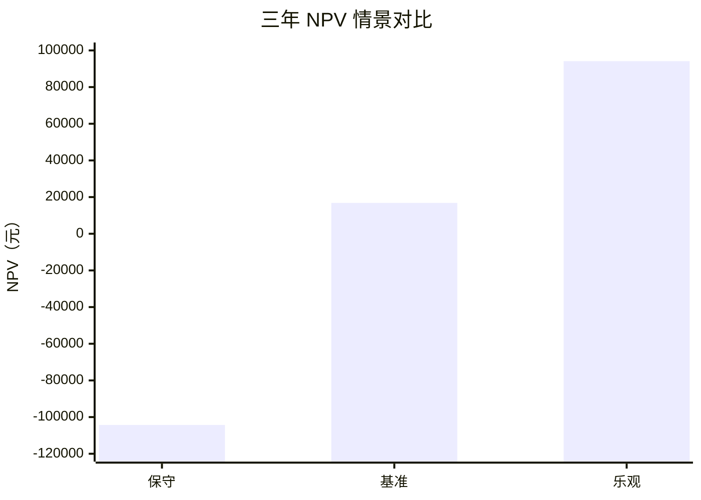
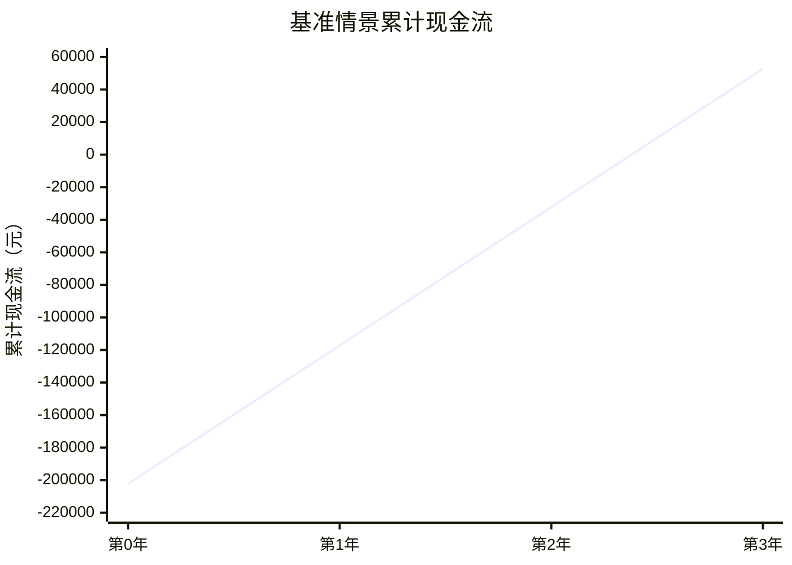

# 智慧幕墙——幕墙振动数据检测与展示系统
## 软件工程经济学文档（SEE）

**文档版本**：v1.0  
**编制日期**：2026-06-02  
**课程**：软件工程管理与经济学  
**项目类型**：既有系统基础上的增量开发项目  
**适用范围**：本文件用于从软件工程经济学角度分析智慧幕墙系统增量建设的成本、收益、可行性、投资回收、敏感性与经济风险。分析对象包括数据存储优化、服务器监控、异常预警、气象联动阈值 Agent、前后端展示与系统集成；扩展智能交互、复杂报告生成等能力不纳入本次经济分析范围。

---

## 1. 文档目的与分析范围

### 1.1 文档目的

本 SEE 文档面向课程项目交付，目标不是编制企业正式投标报价，而是以可追溯、可解释、可复核的方式说明：

1. 本项目为什么具有经济建设价值。
2. 本项目的开发成本如何估算。
3. 本项目的收益来自哪些业务改进。
4. 在不同收益情景下，项目是否具备经济可行性。
5. 哪些经济风险会影响项目收益，应如何控制。

### 1.2 分析边界

本项目是课程背景下的工程实践项目，成本与收益分析采用工程等价估算方法：

| 项目 | 分析处理方式 |
|---|---|
| 开发成本 | 使用功能点规模、生产率、人月费率进行估算 |
| 实际学生劳动报酬 | 不作为真实支付成本，而作为工程等价人力成本 |
| 硬件采购 | 默认使用既有课程和开发环境，不纳入初始开发成本 |
| 云服务器、域名、商业短信 | 若未来生产部署，应单独核算，并纳入运行成本分析 |
| 气象接口成本 | 默认使用公开或低成本气象数据源，不计入主要开发成本 |
| 项目收益 | 采用情景化估算，作为经济可行性分析依据 |

因此，本文中的金额用于课程经济分析、项目方案比较和决策论证，不等同于商业合同报价或财务审计数据。

### 1.3 依据材料

| 材料 | 用途 |
|---|---|
| 《智慧幕墙系统_SRS.md》 | 提供功能需求和业务范围依据 |
| 《智慧幕墙系统_SDS.md》 | 提供设计边界和技术范围依据 |
| 《SRS_SDS_智能Agent模块(1).md》 | 提供气象联动阈值 Agent 的需求与设计依据 |
| 《Assignment_2_Project_Charter.docx》 | 仅用于确认团队角色与人员分工 |
| 实验二：软件规模度量报告 | 提供功能点规模估算依据 |
| 实验三：软件成本估算报告 | 提供生产率、人月费率、工作量与成本估算依据 |
| 会议纪要 | 支撑项目范围演化、任务安排与过程记录 |

---

## 2. 项目经济背景

### 2.1 业务问题

智慧幕墙系统面向建筑玻璃幕墙的振动数据监测与展示场景。系统需要长期接收加速度计、应变计等监测数据，并向运维人员提供数据查询、曲线展示、异常预警、阈值管理、系统状态监控等能力。

在项目迭代过程中，主要经济问题集中在以下方面：

1. **数据持续增长导致存储与查询成本上升**  
   监测系统具有连续采集特征，历史数据如果长期无差别保存，会造成数据库体积增长、查询速度下降、备份恢复变慢，并增加后续硬件或云资源成本。

2. **人工阈值维护存在响应滞后**  
   幕墙风险与外部气象条件密切相关。在强风、台风等天气条件下，如果仍依赖人工逐项调整设备阈值，会产生响应慢、遗漏设备、配置不一致等问题。

3. **固定阈值容易造成误报或漏报**  
   阈值过低会增加误报和人工复核成本，阈值过高又可能错过需要关注的异常振动情况。单纯固定阈值难以兼顾平时运行和极端天气场景。

4. **服务器和数据库缺少统一监控会增加故障处理成本**  
   如果服务状态、数据库连接、备份压缩、磁盘空间等问题不能及时发现，故障定位和恢复会更依赖人工经验，增加停机风险和维护成本。

5. **交付材料不一致会增加管理成本**  
   需求、设计、管理和经济分析材料如果对项目范围、成本和收益描述不一致，后续验收、答辩和维护都会产生额外沟通成本。

### 2.2 经济目标

本项目的经济目标可以归纳为：

| 目标 | 经济含义 |
|---|---|
| 降低数据膨胀成本 | 通过压缩、归档、索引和清理策略延缓存储资源扩张 |
| 降低人工维护成本 | 用气象联动阈值 Agent 减少重复配置和天气场景人工干预 |
| 降低误报与漏报成本 | 让阈值策略更贴近天气和设备运行场景 |
| 降低故障恢复成本 | 通过服务器和数据库监控提升故障发现速度 |
| 提高项目交付质量 | 用统一文档减少范围争议、返工和验收风险 |

### 2.3 经济分析假设

由于本项目尚未进入真实商业运行阶段，本文在收益分析中采用可解释假设，而不是声明已经发生的实际收益。核心假设如下：

| 假设编号 | 假设内容 | 对经济分析的影响 |
|---|---|---|
| A1 | 项目按课程工程等价成本估算，不按学生实际薪酬计算 | 成本用于经济论证，不代表真实支付 |
| A2 | 系统未来可用于持续监测场景，而不是一次性演示工具 | 收益来自长期运维效率和风险降低 |
| A3 | 运维人员或工程人员等价小时成本为 173.94 元/人时 | 人力节约可折算为金额 |
| A4 | 气象接口采用公开或低成本接口，短信默认关闭 | 初期运行成本不因外部服务显著增加 |
| A5 | 数据压缩、监控和 Agent 能被实际纳入日常运维流程 | 收益取决于使用频率，不使用则收益下降 |
| A6 | 本次分析周期以三年为主 | 便于计算 ROI、NPV 和投资回收期 |

这些假设使 SEE 的结论具备边界：如果系统只作为课堂演示，直接财务收益会低于基准情景；如果系统进入真实建筑幕墙监测场景，收益将随设备数量、数据频率和运维强度增加而提高。

---

## 3. 备选方案经济比较

### 3.1 方案定义

| 方案 | 内容 | 初始成本 | 运维成本 | 主要收益 | 主要风险 |
|---|---:|---:|---:|---|---|
| A. 保持既有系统 | 不新增压缩、监控和智能阈值能力 | 低 | 高 | 短期投入最低 | 数据膨胀、阈值滞后、异常处理依赖人工 |
| B. 仅增强人工阈值与基础监控 | 增加人工阈值配置、简单服务状态展示 | 中低 | 中高 | 实现较快，技术风险低 | 无法解决天气联动和批量配置效率问题 |
| C. 数据优化 + 监控 + 气象联动阈值 Agent | 建设本项目交付的增量能力 | 中 | 中低 | 同时改善存储、监控、预警和阈值维护 | 需要控制气象数据质量和调度规则 |
| D. 完整扩展智能交互与自动报告系统 | 在方案 C 之外继续加入大范围智能交互能力 | 高 | 高 | 展示效果强，扩展空间大 | 超出课程周期，收益不确定，易造成范围失控 |

### 3.2 推荐方案

本 SEE 推荐采用 **方案 C：数据优化 + 监控 + 气象联动阈值 Agent**。

推荐理由如下：

1. 方案 C 与项目交付范围一致，范围清晰，便于验收。
2. 方案 C 能直接处理长期运行中最明显的成本来源：数据膨胀、人工阈值维护和异常响应。
3. 方案 C 避免了方案 D 的过度扩张风险，更符合课程项目周期和团队资源约束。
4. 方案 C 保留后续扩展空间，未来仍可在稳定的数据和预警基础上扩展更复杂的智能交互能力。

### 3.3 备选方案评分

为使方案选择更可复核，本文按成本、收益、风险、可验收性和扩展性进行定性评分，5 分为最佳。

| 评价维度 | 权重 | A 保持既有系统 | B 基础增强 | C 推荐方案 | D 大范围智能扩展 |
|---|---:|---:|---:|---:|---:|
| 初始成本可控 | 20% | 5 | 4 | 3 | 1 |
| 长期运维收益 | 25% | 1 | 2 | 5 | 4 |
| 技术风险可控 | 20% | 4 | 4 | 4 | 2 |
| 课程周期可验收 | 20% | 2 | 3 | 5 | 2 |
| 后续扩展空间 | 15% | 1 | 2 | 4 | 5 |
| 加权得分 | 100% | 2.55 | 3.05 | 4.20 | 2.60 |

方案 C 的优势不在于初始成本最低，而在于能在可控成本内获得较高的长期运维收益，并且与项目验收范围一致。因此，方案 C 是本项目最合理的经济选择。

---

## 4. 成本估算基础

### 4.1 软件规模

根据实验二的软件规模度量结果，本项目采用功能点分析作为规模估算基础。

| 指标 | 数值 | 说明 |
|---|---:|---|
| 未调整功能点 UFP | 150 UFP | 修订后详细功能点分析结果 |
| 价值调整因子 VAF | 1.15 | 根据系统复杂度调整 |
| 调整后功能点 AFP | 172.50 FP | 150 × 1.15 |
| 成本估算取值 | 173 FP | 四舍五入后用于成本估算 |
| NESMA 高层功能点复核 | 153 UFP | 与详细分析偏差约 2.00%，说明规模估算较稳定 |
| COSMIC 数据移动复核 | 79 CFP | 从 Entry、Exit、Read、Write 数据移动角度辅助验证 |

功能点估算体现了系统中数据输入、查询输出、内部逻辑文件、外部接口与业务处理复杂度。NESMA 与 COSMIC 的复核结果说明当前规模判断没有明显偏离。由于本项目是既有系统基础上的增量开发，因此本文不重新估算全部历史系统规模，而是以修订后的实验二形成的 173 FP 作为本次工程等价规模基准。

### 4.2 生产率与人月费率

根据实验三的软件成本估算报告，本项目采用以下参数：

| 参数 | 数值 | 说明 |
|---|---:|---|
| 生产率 | 6.72 人时/FP | 参考 2025 年中国软件行业基准数据的 P50 水平 |
| 每人月工时 | 180 人时/月 | 用于将人时换算为人月 |
| 地区人月费率 | 31,309 元/人月 | 上海地区人月成本参数 |
| 等价小时成本 | 173.94 元/人时 | 31,309 ÷ 180 |

### 4.3 成本估算假设

1. 本项目按课程项目的工程等价成本估算，不代表团队成员实际薪酬支出。
2. 本项目不额外采购专用硬件，默认使用课程开发环境、已有后端与前端仓库、开源组件和公开数据服务。
3. 若未来进入真实生产部署，应补充云服务器、带宽、短信网关、日志留存、数据备份、运维值守等成本。
4. 项目范围聚焦数据优化、服务器监控、异常预警和气象联动阈值 Agent，不把扩展智能交互、复杂自动报告生成等能力计入本次成本。

---

## 5. 开发成本估算

### 5.1 工作量估算

工作量计算公式为：

```text
工作量（人时） = 功能点规模 × 生产率
```

代入本项目参数：

```text
工作量 = 173 FP × 6.72 人时/FP = 1162.56 人时
```

人月换算公式为：

```text
人月 = 工作量 ÷ 每人月工时
```

代入本项目参数：

```text
人月 = 1162.56 ÷ 180 = 6.459 人月 ≈ 6.46 人月
```

### 5.2 成本估算

成本计算公式为：

```text
开发成本 = 人月 × 地区人月费率
```

代入本项目参数：

```text
开发成本 = 6.459 × 31,309 = 202,214.39 元
```

因此，本项目主估算开发成本为：

> **202,214 元，约 20.22 万元。**

### 5.3 阶段成本分解

根据实验三中的活动比例，工作量可分解如下：

| 阶段 | 比例 | 工作量（人时） | 经济含义 |
|---|---:|---:|---|
| 需求分析 | 14.25% | 165.66 | 明确数据压缩、监控、阈值 Agent 和预警规则 |
| 系统设计 | 12.38% | 143.92 | 形成数据库、服务监控、Agent 调度与前后端集成设计 |
| 编码实现 | 39.56% | 459.91 | 完成后端服务、前端页面、Agent 规则、数据库处理等实现 |
| 测试验证 | 23.01% | 267.51 | 验证异常预警、阈值应用、压缩策略和系统集成 |
| 实施交付 | 10.80% | 125.56 | 部署、演示、文档整合、验收材料准备 |
| **合计** | **100.00%** | **1162.56** |  |

若按 173.94 元/人时折算，各阶段成本如下：

| 阶段 | 工作量（人时） | 折算成本（元） |
|---|---:|---:|
| 需求分析 | 165.66 | 28,815 |
| 系统设计 | 143.92 | 25,034 |
| 编码实现 | 459.91 | 79,996 |
| 测试验证 | 267.51 | 46,529 |
| 实施交付 | 125.56 | 21,839 |
| **合计** | **1162.56** | **202,214** |

### 5.4 成本区间与交叉验证

实验三还提供了不同生产率百分位下的成本区间。本文将 P50 作为基准成本，P25 和 P75 用于表达估算不确定性，不替代后续 ROI、NPV 和 BCR 的主测算输入。

| 百分位 | 生产率（人时/FP） | 工作量（人时） | 人月 | 开发成本（元） | 说明 |
|---|---:|---:|---:|---:|---|
| P25 | 3.88 | 671.24 | 3.73 | 116,755 | 较顺利、复用程度较高时的低成本估计 |
| P50 | 6.72 | 1162.56 | 6.46 | 202,214 | 本文采用的基准成本 |
| P75 | 12.39 | 2143.47 | 11.91 | 372,833 | 集成、测试和文档返工较多时的高成本估计 |

据此，本项目开发成本的合理区间可表述为：

> **P25/P50/P75 成本区间为 11.68 万元 / 20.22 万元 / 37.28 万元；后续经济测算推荐采用 P50 = 20.22 万元作为基准成本。**

---

## 6. 运行与维护成本说明

### 6.1 本课程项目阶段的运行成本

在课程项目交付阶段，系统主要运行在已有开发与演示环境中，运行成本较低：

| 成本项 | 课程阶段处理方式 |
|---|---|
| 服务器 | 使用已有本地或课程环境，不新增采购 |
| 数据库 | 使用既有数据库服务，不单独计算商用授权费 |
| 气象数据 | 默认使用公开气象数据接口或低成本接口 |
| 邮件通知 | 默认使用已有邮箱或测试配置 |
| 短信通知 | 当前作为可配置能力，默认关闭，不产生持续短信费用 |
| 备份与压缩 | 主要体现为软件逻辑与任务调度成本，已计入开发成本 |

### 6.2 未来生产部署的增量成本

如果系统未来面向真实建筑幕墙长期运行，应补充核算以下成本：

| 成本项 | 可能影响 |
|---|---|
| 云服务器与数据库实例 | 取决于采集频率、设备数量、历史数据保留周期 |
| 存储与备份 | 长期监测数据会持续累积，需要设置归档策略 |
| 短信或第三方通知 | 若启用短信预警，应按发送量计费 |
| 气象商业接口 | 若公开接口不能满足稳定性和 SLA，可能需要购买商业服务 |
| 运维值守 | 生产环境需要日志巡检、备份验证、故障响应 |
| 安全与合规 | 真实场景可能需要权限审计、数据留存和安全加固 |

本项目通过数据压缩、分级存储、监控告警和阈值自动化，能够降低上述未来成本的增长速度，但不能完全消除生产运维投入。

### 6.3 运行成本分层

为了区分课程交付阶段和未来生产部署阶段，运行成本分为三层管理：

| 成本层级 | 内容 | 课程阶段处理 | 生产阶段处理 |
|---|---|---|---|
| 基础运行成本 | 本地开发环境、数据库、前后端服务 | 使用已有环境，不单独计费 | 按服务器、数据库实例和带宽计费 |
| 外部服务成本 | 天气接口、邮件、短信 | 公开接口和测试配置为主，短信默认关闭 | 按接口 SLA、调用量和短信条数计费 |
| 运维保障成本 | 日志巡检、备份恢复、安全审计、故障响应 | 作为项目功能和文档说明体现 | 需要配置专门运维预算和响应制度 |

该分层有助于解释为什么本项目开发成本可以按功能点估算，而生产部署成本需要根据设备数量、采集频率和运维等级另行核算。

---

## 7. 收益分析

### 7.1 收益来源

本项目的收益主要来自效率提升、风险降低和资源节约。

| 收益类别 | 形成机制 | 经济表现 |
|---|---|---|
| 人工阈值维护节约 | 天气变化时自动生成或应用阈值规则，减少人工逐设备配置 | 减少运维工时 |
| 预警复核成本降低 | 阈值与气象条件联动，减少明显不合理的误报 | 减少人工排查时间 |
| 存储与查询成本降低 | 通过压缩、索引、归档和清理策略控制历史数据体积 | 延缓硬件或云资源扩容 |
| 故障响应效率提升 | 服务器和数据库状态可监控，异常更早暴露 | 降低停机与恢复成本 |
| 交付协同收益 | 需求、设计、管理和经济分析材料保持一致 | 减少返工、沟通和验收争议 |

### 7.2 年度收益情景估算

由于课程项目没有真实生产环境中的长期运营数据，本文采用情景法估算年度收益。估算基于以下逻辑：

1. 人力节约按 173.94 元/人时折算。
2. 数据压缩和监控收益不直接夸大为大量现金流，只按延缓扩容、减少排查和降低返工保守估算。
3. 情景收益用于判断经济可行性，不作为真实财务收入证明。

| 收益项 | 保守情景（元/年） | 基准情景（元/年） | 乐观情景（元/年） | 说明 |
|---|---:|---:|---:|---|
| 人工阈值维护节约 | 5,000 | 10,000 | 12,000 | 气象变化、强风场景下减少重复配置 |
| 预警复核成本降低 | 12,000 | 28,000 | 40,000 | 减少误报排查和人工确认时间 |
| 存储与查询成本节约 | 8,000 | 18,000 | 25,000 | 压缩和归档延缓存储扩容，提高查询效率 |
| 故障响应成本降低 | 10,000 | 24,000 | 30,000 | 通过监控更快发现服务或数据库问题 |
| 文档与管理效率收益 | 3,000 | 5,000 | 8,000 | 减少范围解释、答辩准备和后续维护沟通 |
| **合计** | **38,000** | **85,000** | **115,000** |  |

从收益结构看，本项目不是以直接销售收入为主，而是以运维效率、风险控制和资源节约为主要经济价值。对于安全监测类系统，这种收益结构是合理的。

### 7.3 收益金额推导说明

为避免收益估算过于概括，本文将基准情景收益进一步拆解为等价工时和资源节约。等价小时成本为：

```text
31,309 元/人月 ÷ 180 人时/月 = 173.94 元/人时
```

| 收益项 | 基准金额（元/年） | 折算方式 | 等价解释 |
|---|---:|---|---|
| 人工阈值维护节约 | 10,000 | 10,000 ÷ 173.94 ≈ 57.5 人时 | 每年减少若干次强风或天气变化场景下的批量阈值配置工作 |
| 预警复核成本降低 | 28,000 | 28,000 ÷ 173.94 ≈ 161.0 人时 | 减少误报核查、异常定位和人工确认时间 |
| 存储与查询成本节约 | 18,000 | 资源节约 + 查询效率折算 | 通过压缩和索引延缓扩容、减少慢查询排查 |
| 故障响应成本降低 | 24,000 | 24,000 ÷ 173.94 ≈ 138.0 人时 | 监控提前发现服务和数据库问题，减少故障定位时间 |
| 文档与管理效率收益 | 5,000 | 5,000 ÷ 173.94 ≈ 28.7 人时 | 减少范围解释、返工、答辩准备和交接沟通成本 |

基准情景总收益 85,000 元，折算为约 489 人时的年度等价收益。对于一个持续运行的数据监测系统，该水平并不夸张；它并不要求系统产生销售收入，只要求系统每年减少一定人工维护、排查和资源浪费。

### 7.4 收益可信度分级

| 收益项 | 可信度 | 原因 |
|---|---|---|
| 人工阈值维护节约 | 中高 | Agent 一键和定时阈值应用能直接减少人工逐设备配置 |
| 预警复核成本降低 | 中 | 取决于阈值规则质量和真实异常分布，需要运行后统计验证 |
| 存储与查询成本节约 | 中高 | 数据压缩和索引优化对长期数据系统具有明确价值 |
| 故障响应成本降低 | 中 | 取决于系统是否被纳入真实运维流程 |
| 文档与管理效率收益 | 中 | 对课程项目和后续交接有效，但商业金额不宜夸大 |

因此，本文在可行性判断中不只看乐观情景，而以基准情景和敏感性分析作为主要依据。

---

## 8. 投资回收与财务指标

### 8.1 投资回收期

投资回收期计算公式为：

```text
投资回收期 = 初始开发成本 ÷ 年度收益
```

以 202,214 元作为初始开发成本：

| 情景 | 年度收益（元） | 投资回收期 |
|---|---:|---:|
| 保守情景 | 38,000 | 5.32 年 |
| 基准情景 | 85,000 | 2.38 年 |
| 乐观情景 | 115,000 | 1.76 年 |

从回收期看，基准情景下项目约 2.38 年可回收工程等价开发成本；乐观情景下约 1.76 年可回收；保守情景下回收周期较长，更适合从课程交付、风险控制和长期运维价值角度解释项目必要性。

### 8.2 三年投资收益率

三年投资收益率计算公式为：

```text
三年 ROI = （三年累计收益 - 初始开发成本） ÷ 初始开发成本
```

| 情景 | 三年累计收益（元） | 三年 ROI |
|---|---:|---:|
| 保守情景 | 114,000 | -43.6% |
| 基准情景 | 255,000 | 26.1% |
| 乐观情景 | 345,000 | 70.6% |

结论：

1. 若系统只在较小规模、较低频率数据场景下运行，直接经济回报不明显。
2. 若系统进入稳定运维并持续产生监控数据，基准情景下三年 ROI 为正，具备一定收益空间。
3. 若设备数量、数据规模或强天气场景管理需求进一步上升，智能阈值和数据优化带来的收益会更明显。

### 8.3 净现值分析

采用 8% 年折现率，并假设三年内年度收益保持不变。三年期折现因子为：

```text
1 / 1.08 + 1 / 1.08^2 + 1 / 1.08^3 = 2.577
```

净现值计算公式为：

```text
NPV = 年度收益 × 2.577 - 初始开发成本
```

| 情景 | 年度收益（元） | NPV（元） |
|---|---:|---:|
| 保守情景 | 38,000 | -104,288 |
| 基准情景 | 85,000 | 16,831 |
| 乐观情景 | 115,000 | 94,141 |

基准情景下 NPV 为正，说明在新的功能点规模口径下，项目按三年、8% 折现率和 85,000 元年度收益估算时，财务收益能够覆盖折现后的工程等价成本。保守情景为负，说明系统若只作为低频演示工具，其直接财务收益不足以覆盖工程等价成本；乐观情景为正，说明当系统进入持续监测和真实运维流程后，数据优化、监控和阈值自动化具有更充分的经济可行性。

### 8.4 基准情景现金流表

以初始开发成本 202,214 元、年度收益 85,000 元、折现率 8% 计算：

| 年度 | 未折现现金流（元） | 累计未折现现金流（元） | 折现系数 | 折现现金流（元） |
|---|---:|---:|---:|---:|
| 0 | -202,214 | -202,214 | 1.000 | -202,214 |
| 1 | 85,000 | -117,214 | 0.926 | 78,710 |
| 2 | 85,000 | -32,214 | 0.857 | 72,845 |
| 3 | 85,000 | 52,786 | 0.794 | 67,490 |
| **合计** | **52,786** |  |  | **16,831** |

基准情景下，项目在第 3 年形成正向累计未折现现金流；考虑折现后，三年期净现值约为 16,831 元。该结果说明项目在基准情景下已经越过三年折现盈亏平衡点，但收益余量仍需要通过稳定使用和范围控制来保持。

### 8.5 盈亏平衡年度收益

若以三年、8% 折现率为分析周期，则盈亏平衡年度收益为：

```text
盈亏平衡年度收益 = 初始开发成本 ÷ 三年折现因子
                = 202,214 ÷ 2.577
                ≈ 78,469 元/年
```

基准情景年度收益为 85,000 元，高于盈亏平衡年度收益约 6,531 元。因此：

1. 当年度收益低于约 7.85 万元时，三年 NPV 可能为负。
2. 当年度收益稳定达到或超过 7.85 万元时，三年 NPV 可以转正。
3. 若未来设备数量、数据规模或强天气场景增加，项目经济性会进一步增强。

### 8.6 收益/成本比

收益/成本比用于判断折现后收益是否覆盖初始投入：

```text
收益/成本比 BCR = 折现收益总额 ÷ 初始开发成本
```

| 情景 | 年度收益（元） | 三年折现收益（元） | 初始开发成本（元） | BCR |
|---|---:|---:|---:|---:|
| 保守情景 | 38,000 | 97,926 | 202,214 | 0.48 |
| 基准情景 | 85,000 | 219,045 | 202,214 | 1.08 |
| 乐观情景 | 115,000 | 296,355 | 202,214 | 1.47 |

BCR 大于 1 表示折现收益能够覆盖初始投入。基准情景下 BCR 为 1.08，说明项目在三年折现周期内可以覆盖工程等价投入；乐观情景下 BCR 高于 1，说明当系统真正进入持续监测和运维流程后，经济价值会更加充分。

### 8.7 经济指标总览

| 指标 | 保守情景 | 基准情景 | 乐观情景 |
|---|---:|---:|---:|
| 年度收益 | 38,000 元 | 85,000 元 | 115,000 元 |
| 投资回收期 | 5.32 年 | 2.38 年 | 1.76 年 |
| 三年 ROI | -43.6% | 26.1% | 70.6% |
| 三年 NPV | -104,288 元 | 16,831 元 | 94,141 元 |
| BCR | 0.48 | 1.08 | 1.47 |





---

## 9. 敏感性分析

### 9.1 成本上升敏感性

若由于调试、文档返工、外部接口变化等原因导致成本上升 20%，初始成本变为：

```text
202,214 × 1.20 = 242,657 元
```

此时基准情景回收期变为：

```text
242,657 ÷ 85,000 = 2.85 年
```

项目回收期将接近三年，收益空间明显收窄。因此，控制范围变更和文档返工对经济性有直接影响。

### 9.2 收益下降敏感性

若实际年度收益比基准情景下降 20%，年度收益变为：

```text
85,000 × 0.80 = 68,000 元
```

回收期为：

```text
202,214 ÷ 68,000 = 2.97 年
```

此时项目仍具有一定长期价值，但三年内的投资吸引力下降。收益下降的主要原因可能包括设备数量不足、数据采集频率低、运维人员实际使用频率不高、阈值 Agent 未充分融入日常流程等。

### 9.3 关键敏感因素

| 敏感因素 | 对经济性的影响 | 控制建议 |
|---|---|---|
| 设备数量与数据频率 | 数据越多，压缩和查询优化收益越高 | 在文档中明确适用场景，避免低数据量场景夸大收益 |
| 气象数据质量 | 影响阈值 Agent 的准确性和可信度 | 设置数据缺失降级策略和人工确认机制 |
| 阈值规则质量 | 影响误报、漏报和人工复核成本 | 保留人工阈值入口，记录 Agent 应用日志 |
| 运维使用频率 | 使用越充分，收益越明显 | 在交付时提供清晰的操作流程和验收场景 |
| 范围变更 | 直接推高开发成本和文档成本 | 通过变更记录控制新增功能边界 |
| 短信和商业接口费用 | 可能增加持续运行成本 | 默认关闭短信，生产环境按实际调用量核算 |

### 9.4 组合敏感性分析

仅分析单个变量不足以说明项目抗风险能力，因此本文进一步分析成本和收益同时变化的情况。

| 情况 | 初始成本（元） | 年度收益（元） | 三年 NPV（元） | 经济判断 |
|---|---:|---:|---:|---|
| 基准情况 | 202,214 | 85,000 | 16,831 | 三年折现口径下可行，但收益空间不大 |
| 成本上升 20% | 242,657 | 85,000 | -23,612 | 经济性转弱，需要控制范围和返工 |
| 收益下降 20% | 202,214 | 68,000 | -26,978 | 经济性转弱，需要提高实际使用频率 |
| 成本上升 20% 且收益下降 20% | 242,657 | 68,000 | -67,421 | 不建议继续扩张范围，应保持交付范围稳定 |
| 收益上升 20% | 202,214 | 102,000 | 60,640 | 经济性进一步增强，但仍需运行数据验证 |

敏感性分析表明，本项目经济性的关键不是继续增加功能，而是控制范围并确保核心能力被实际使用。若为了追求展示效果继续扩大 Agent 或报告能力，成本上升会迅速吞噬经济收益。

### 9.5 敏感性结论

1. 成本端最敏感因素是范围扩张和文档返工。
2. 收益端最敏感因素是系统实际使用频率和设备数据规模。
3. 气象联动阈值 Agent 的经济价值依赖真实天气场景和运维流程结合。
4. 数据压缩与监控属于更稳定的收益来源，因为它们与长期运行数据量直接相关。
5. 从经济角度，项目应保持当前交付范围，不宜在课程周期内继续扩展复杂智能交互。

---

## 10. 经济风险与应对措施

| 风险 | 影响 | 概率 | 影响程度 | 应对措施 |
|---|---|---:|---:|---|
| 外部气象接口不稳定 | 阈值 Agent 无法及时获取天气数据 | 中 | 高 | 设置超时、重试、缓存和人工阈值回退 |
| 收益估算高于真实使用情况 | 投资回收期延长 | 中 | 中 | 用保守、基准、乐观三种情景表达，不写成单点确定收益 |
| Agent 方案继续扩张 | 开发成本上升，课程周期失控 | 中 | 高 | 坚持既定交付范围，暂缓扩展智能交互等能力 |
| 数据压缩策略不当 | 查询不便或历史数据使用受限 | 低 | 高 | 设置压缩前备份、保留原始数据边界和恢复机制 |
| 交付材料信息不一致 | 验收和答辩产生争议 | 中 | 中 | 统一项目范围、团队、成本和 Agent 模块说明 |
| 团队成员时间冲突 | 进度延误，增加返工 | 中 | 中 | 项目经理跟踪里程碑，使用会议纪要记录任务状态 |
| 生产部署成本被低估 | 后续运行预算不足 | 中 | 中 | 将服务器、短信、商业接口列为未来部署成本，不混入课程开发成本 |

### 10.1 风险成本影响

| 风险 | 可能增加的成本类型 | 对策 |
|---|---|---|
| 天气接口不稳定 | 调试时间、替代接口接入、人工确认成本 | 接口超时、缓存、降级和人工阈值回退 |
| 数据压缩策略返工 | 数据库脚本修改、测试时间、文档修改 | 采用幂等脚本和可追溯压缩结果 |
| Agent 范围扩张 | 开发成本、测试成本、答辩解释成本 | 固定为气象联动阈值 Agent |
| 监控指标过多 | 实现和维护成本 | 优先保留 CPU、内存、磁盘、数据库连接、慢查询等核心指标 |
| 外部通知费用 | 短信、邮件或商业接口费用 | 默认关闭短信，生产部署另行核算 |
| 交付材料信息冲突 | 返工成本和验收风险 | 建立提交材料复核机制，统一范围、成本和收益说明 |

### 10.2 经济控制措施

1. 以 P50 口径的 20.22 万元作为开发成本基线，同时保留 P25/P75 成本区间用于风险说明，任何重大范围扩张都应重新评估成本。
2. 以 7.85 万元/年作为三年折现盈亏平衡收益门槛，用于判断收益是否足以支撑项目。
3. 对外部接口和短信服务采用可配置开关，避免课程阶段产生不必要费用。
4. 将未来生产部署成本与课程开发成本分离，避免低估真实运维预算。
5. 对收益采用保守、基准、乐观三种情景表达，避免用单点乐观数据支撑结论。

### 10.3 经济监控指标

若系统未来进入真实运行阶段，建议持续跟踪以下经济指标，用于校正本 SEE 中的情景估算：

| 指标 | 监控目的 | 建议频率 | 预警阈值 |
|---|---|---|---|
| 年度等价运维节约 | 判断收益是否达到基准情景 | 每季度 | 低于 21,250 元/季度 |
| 人工阈值配置次数 | 判断 Agent 是否真正减少人工维护 | 每月 | 强天气后仍大量人工逐设备调整 |
| 告警复核工时 | 判断误报和人工排查成本变化 | 每月 | 连续两月未下降 |
| 数据库存储增长率 | 判断压缩和归档是否有效 | 每月 | 增长率高于预期且查询变慢 |
| 故障定位时间 | 判断监控服务是否提升响应效率 | 每次故障后 | 无法在日志或监控摘要中定位原因 |
| 外部服务费用 | 控制短信、气象接口和邮件成本 | 每月 | 超出预算或测试环境误触发 |

这些指标不要求在课程阶段全部具备真实运营数据，但可以作为后续部署后的经济复核框架。

---

## 11. 经济可行性结论

### 11.1 成本结论

基于功能点规模 173 FP、生产率 6.72 人时/FP、上海地区人月费率 31,309 元/人月，本项目工程等价开发成本为：

> **202,214 元，约 20.22 万元。**

结合 P25/P50/P75 生产率区间，合理成本区间为：

> **P25/P50/P75 = 约 11.68 万元 / 20.22 万元 / 37.28 万元。**

该成本估算有明确来源、公式和 P25/P50/P75 区间，适合用于课程项目的经济论证。

### 11.2 收益结论

本项目的主要收益来自：

1. 数据压缩和存储优化带来的资源节约。
2. 气象联动阈值 Agent 带来的人工配置成本下降。
3. 动态阈值和异常记录一致性带来的预警复核成本下降。
4. 服务器和数据库监控带来的故障响应成本下降。
5. 交付协同和项目管理规范带来的维护与沟通成本下降。

在基准情景下，项目年度收益估算为 85,000 元，投资回收期约 2.38 年，三年 ROI 约 26.1%，三年净现值约 16,831 元。该结果说明项目在三年折现口径下已经具备正向经济可行性，若设备规模、数据频率或强天气运维场景增加，经济性会进一步改善。

### 11.3 定价与成本衔接

本 SEE 主要关注项目经济可行性，定价策略在《智慧幕墙系统_软件规模功能点与定价策略.md》中单独说明。两者关系如下：

| 项目 | 金额 | 用途 |
|---|---:|---|
| 工程等价开发成本 | 202,214 元 | P50 口径，用于投资成本、ROI、NPV 和回收期计算 |
| 成本合理区间 | P25/P50/P75 = 11.68 / 20.22 / 37.28 万元 | 用于说明估算不确定性 |
| 推荐工程报价 | 约 26.29 万元 | 若作为商业项目报价，应覆盖管理、质量、风险和利润 |
| 增强版报价区间 | 26 万元至 27 万元 | 与本项目交付范围相匹配 |

因此，SEE 中的投资成本不等同于商业报价。若未来按商业项目对外定价，应在开发成本基础上增加项目管理、质量保证、风险预留和利润空间。

### 11.4 可行性判断

从软件工程经济学角度，本项目具备谨慎可行性，推荐实施方案 C：

> **数据优化 + 服务器监控 + 异常预警 + 气象联动阈值 Agent。**

项目经济价值不在于短期产生销售收入，而在于降低长期监测系统的数据膨胀成本、人工维护成本、异常响应成本和范围管理成本。按修订后的功能点口径，基准情景三年折现收益已经覆盖工程等价成本，但收益余量不大，因此后续仍应通过范围控制、真实运维使用和阶段性收益复核保持项目经济性。

---

## 12. 后续经济管理建议

为保证项目在未来真实部署中继续保持经济性，建议后续管理重点如下：

1. **建立真实运行数据台账**  
   记录设备数量、采集频率、数据增长量、压缩比例、告警数量、误报数量和人工处理时间，用真实数据替代课程阶段的情景估算。

2. **定期复核阈值 Agent 收益**  
   对比人工阈值与气象联动阈值在强风、台风、普通天气下的告警效果，评估误报和漏报变化。

3. **分离课程成本与生产成本**  
   若进入生产环境，应单独估算云资源、短信、商业气象接口、日志留存、安全审计和运维人员成本。

4. **控制智能化功能扩展节奏**  
   后续可扩展智能交互、自动报告和运维建议，但应建立在稳定数据、稳定阈值和稳定监控基础上，避免一次性扩张导致成本失控。

5. **同步复核成本、范围和风险**  
   重大范围变更应同步复核管理计划、成本估算、收益假设和风险分析，保证经济论证与项目实际一致。

---

## 13. 附录：核心计算汇总

| 指标 | 数值 |
|---|---:|
| 调整后功能点 | 172.50 FP |
| 成本估算功能点 | 173 FP |
| 生产率 | 6.72 人时/FP |
| 工作量 | 1162.56 人时 |
| 每人月工时 | 180 人时/月 |
| 人月 | 6.46 人月 |
| 人月费率 | 31,309 元/人月 |
| 主估算开发成本 | 202,214 元 |
| 成本合理区间 | P25/P50/P75 = 116,755 / 202,214 / 372,833 元 |
| 基准年度收益 | 85,000 元/年 |
| 基准回收期 | 2.38 年 |
| 基准三年 ROI | 26.1% |
| 基准三年 NPV | 16,831 元 |
