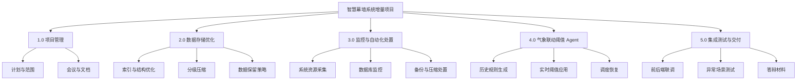
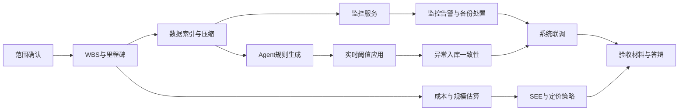
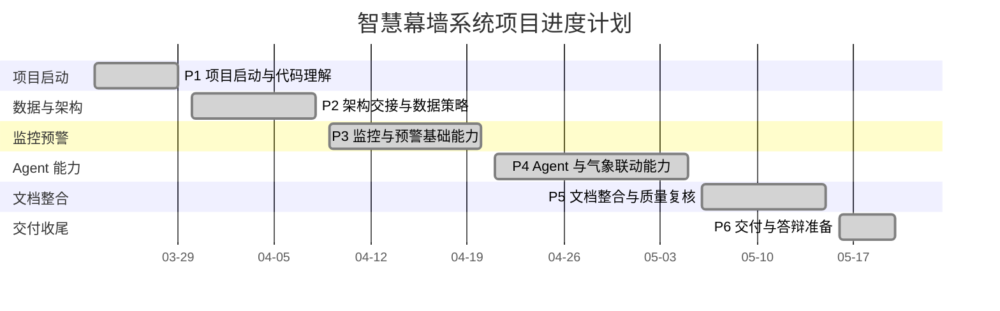
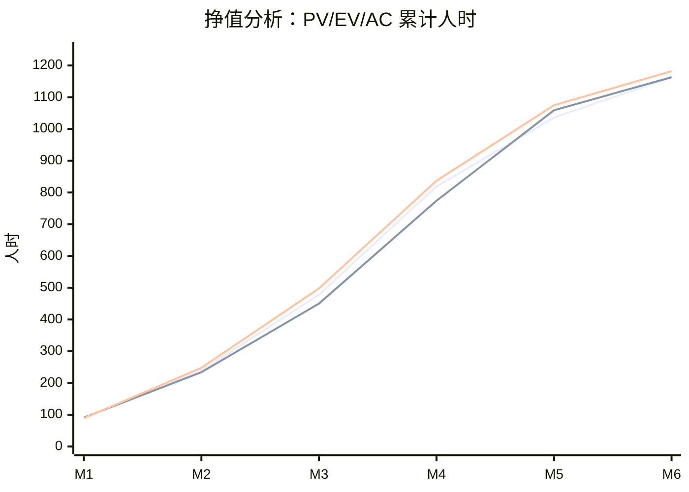
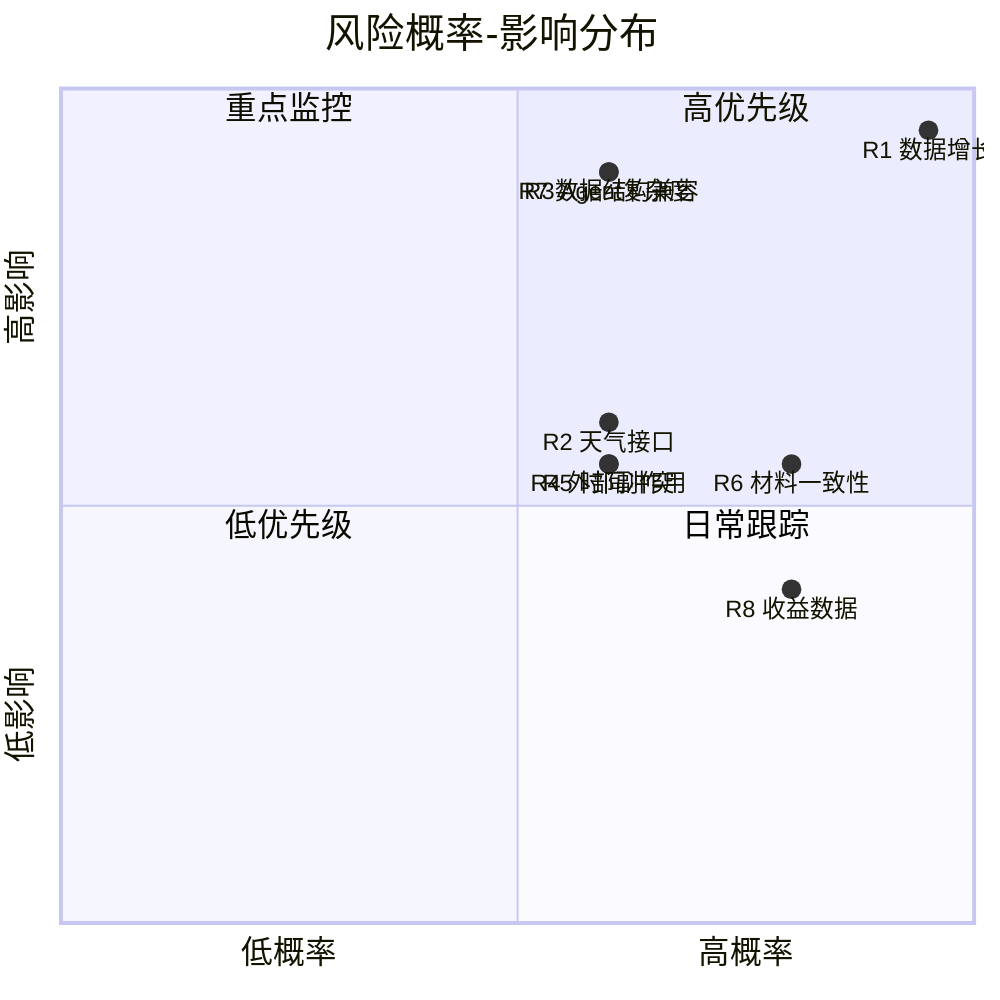

# 智慧幕墙——幕墙振动数据检测与展示系统
## 软件工程管理文档（SEM）

**文档版本**：v1.0  
**编制日期**：2026-06-02  
**课程**：软件工程管理与经济学  
**项目类型**：既有系统基础上的增量开发项目  
**适用范围**：本文档用于说明本课程项目的组织方式、范围控制、进度安排、质量管理、风险管理、沟通机制、配置与变更管理、交付与收尾安排。项目管理范围覆盖数据存储优化、服务器监控、异常预警、气象联动阈值 Agent、系统集成和课程交付材料。

---

## 1. 项目概述

### 1.1 项目背景

智慧幕墙系统面向建筑玻璃幕墙振动监测场景，持续采集加速度计与应变计数据，并为运维人员提供数据展示、异常预警、阈值配置和运行状态监控能力。系统在长期运行场景下需要重点解决以下管理与工程问题：

1. 监测数据规模持续增长，历史数据无限累积会导致查询性能下降和数据库存储压力上升。
2. 原有阈值维护依赖人工逐设备配置，在强风、台风等气象场景下响应慢、易遗漏。
3. 服务器和数据库缺少统一监控与自动处置机制，故障发现、备份和压缩处置依赖人工。
4. 预警阈值、异常记录、邮件/短信通知、数据压缩和 Agent 规则之间需要保持一致的管理规则。

因此，本项目采用增量开发方式，在保留既有业务系统的基础上，重点建设数据存储优化、服务器监控和气象联动阈值 Agent 三类能力。

### 1.2 管理目标

本项目管理目标如下：

1. **范围可控**：明确本次课程项目只覆盖增量开发范围，不重复管理既有系统全部历史功能。
2. **进度可跟踪**：通过里程碑、会议纪要和阶段性交付物管理项目推进。
3. **质量可验证**：围绕数据压缩正确性、阈值应用准确性、异常入库一致性和监控告警可用性制定验收标准。
4. **风险可响应**：识别数据规模、外部 API、人员协作、范围变更等关键风险，并制定应对措施。
5. **变更可追溯**：对 Agent 调度策略、短信开关、采集自启动等重要变更进行记录和解释。

### 1.3 管理依据

| 文档/材料 | 用途 |
|---|---|
| 《智慧幕墙系统_SRS.md》v1.1 | 确定项目需求范围 |
| 《智慧幕墙系统_SDS.md》v1.1 | 确定技术设计范围 |
| 《SRS_SDS_智能Agent模块(1).md》 | 提供 Agent 模块需求与设计依据 |
| 《Assignment_2_Project_Charter.docx》 | 仅用于提取团队成员和原始职责分工 |
| 《会议纪要(仅部分).md》 | 支撑项目过程、阶段任务和需求变更记录 |
| 实验二软件规模度量报告 | 支撑项目规模、范围边界和后续成本估算 |
| 实验三软件成本估算报告 | 支撑资源、工作量和经济管理方法 |

---

## 2. 项目组织

### 2.1 团队成员与角色

根据项目宪章中的人员分工，本项目团队规模为 4 人。

| 成员 | 项目角色 | 主要职责 |
|---|---|---|
| 徐云鹏 | 项目经理 / 管理负责人 | 制定项目计划，协调任务分工，跟踪进度与质量，组织会议和里程碑汇报，负责风险管理、资源协调与文档统筹。 |
| 陈艺龙 | 数据库与存储优化负责人 | 分析数据库性能瓶颈，负责索引优化、表结构优化、分级压缩、备份清理和数据库维护策略。 |
| 徐清鹏 | 前后端集成与测试负责人 | 负责前端界面与后端数据处理服务联调，参与告警接口集成，编写测试用例，组织系统联调和异常场景验证。 |
| 李星烁 | Agent 与智能阈值负责人 | 负责气象联动阈值 Agent、历史数据与天气 API 结合、阈值规则生成、调度策略和预警系统集成。 |

### 2.2 责任矩阵

| 工作项 | 徐云鹏 | 陈艺龙 | 徐清鹏 | 李星烁 |
|---|---|---|---|---|
| 项目计划与范围控制 | A/R | C | C | C |
| SRS/SDS 编制与复核 | A/R | C | C | C |
| 数据库索引与压缩 | C | A/R | C | I |
| 服务器监控与自动化处置 | A | R | C | I |
| 前后端联调与页面验证 | C | C | A/R | C |
| Agent 气象联动阈值 | C | C | C | A/R |
| 测试用例与验收材料 | A | C | R | C |
| SEE/SEM 管理与经济文档 | A/R | C | C | C |

说明：A 表示主责，R 表示执行负责，C 表示参与协作，I 表示知情。

### 2.3 管理职责说明

为了避免责任矩阵停留在符号层面，本项目对主要管理职责作进一步说明：

| 管理领域 | 主责人 | 执行机制 | 主要产出 |
|---|---|---|---|
| 范围管理 | 徐云鹏 | 对照 SRS/SDS 判断新增内容是否属于项目交付范围 | 范围说明、不纳入范围说明、变更记录 |
| 进度管理 | 徐云鹏 | 以阶段交付物而非单纯日期作为进度检查依据 | 里程碑计划、阶段完成记录、阻塞问题清单 |
| 数据库质量 | 陈艺龙 | 对索引、压缩、备份和数据库监控进行专项检查 | SQL 脚本、压缩结果、数据库验证记录 |
| 集成与测试 | 徐清鹏 | 按功能链路组织前后端联调和异常场景验证 | 测试用例、接口联调结果、演示材料 |
| Agent 能力 | 李星烁 | 保证规则生成、实时阈值应用、调度和异常协同可解释、可验证 | 规则文件、执行摘要、Agent 测试记录 |
| 文档管理 | 徐云鹏 | 在提交前检查 SRS、SDS、SEE、SEM 的范围、日期、术语和数字 | 交付文档包 |

### 2.4 协作边界

本项目虽然人数较少，但模块之间存在依赖，因此需要明确协作边界：

1. 数据库负责人提供稳定的数据结构、索引、压缩和规则生成所需聚合数据。
2. Agent 负责人不得绕过受控接口直接扩大阈值写入范围，阈值字段语义必须与异常入库一致。
3. 前后端集成负责人按已批准的需求和设计组织联调。
4. 项目经理负责处理跨模块冲突，例如 Agent 需要的数据粒度、监控触发压缩的时机、交付材料变更等。

---

## 3. 生命周期与过程模型

### 3.1 过程模型选择

本项目采用**阶段化增量开发模型**。原因如下：

1. 项目建立在已有智慧幕墙系统基础上，并非从零开发。
2. 增量能力之间存在依赖关系，必须先解决数据存储与监控问题，再建设智能阈值闭环。
3. 课程项目周期有限，需要通过阶段门控制范围，避免无边界扩张。
4. Agent 模块边界明确，需要通过变更管理保持范围稳定。

### 3.2 阶段划分

| 阶段 | 时间范围 | 主要目标 | 主要交付物 |
|---|---|---|---|
| P1 项目启动与代码理解 | 2026-03-23 至 2026-03-29 | 理解既有系统、明确核心问题、初步分工 | 会议纪要、初步问题清单 |
| P2 架构交接与数据策略 | 2026-03-30 至 2026-04-08 | 明确数据采集、数据库压缩、索引补齐和告警方向 | 架构交接记录、数据库优化任务 |
| P3 监控与预警基础能力 | 2026-04-09 至 2026-04-20 | 建设人工阈值设置、服务器监控、告警接口和部署基础 | 预警功能、监控服务、接口联调结果 |
| P4 Agent 与气象联动能力 | 2026-04-21 至 2026-05-05 | 将阈值规则与气象数据结合，形成一键/定时阈值应用能力 | Agent 规则文件、调度能力、异常入库协同 |
| P5 文档整合与质量复核 | 2026-05-06 至 2026-05-15 | 完成 SRS/SDS 复核，补齐 SEE/SEM 文档 | SRS、SDS、SEM、SEE |
| P6 交付与答辩准备 | 2026-05-16 至 2026-05-20 | 准备演示、答辩材料和项目收尾 | 答辩材料、交付包、项目总结 |

### 3.3 阶段门控制

每个阶段结束时设置阶段门，只有满足阶段门条件后才进入下一阶段：

| 阶段门 | 检查内容 | 通过标准 | 未通过处理 |
|---|---|---|---|
| G1 启动门 | 项目目标、团队分工、核心问题是否明确 | 能说明本项目不是从零开发，而是增量解决数据、监控和阈值问题 | 重新明确范围和分工 |
| G2 需求门 | 数据压缩、监控、Agent、异常协同是否进入 SRS | 需求有编号、边界和验收标准 | 补充需求范围说明 |
| G3 设计门 | SDS 是否能覆盖 SRS 需求 | 每个核心需求有对应设计章节 | 回到设计评审修改 |
| G4 集成门 | 前端、后端、数据库、监控服务和 Agent 是否可联调 | 关键接口和数据链路可演示 | 建立阻塞清单并缩小演示范围 |
| G5 文档门 | 交付材料是否完整 | Agent、成本、团队、范围信息一致 | 完成交付材料复核后提交 |
| G6 交付门 | 验收材料和答辩材料是否齐备 | 文档、演示、测试说明和经济分析可相互支撑 | 补齐证据材料 |

### 3.4 轻量敏捷与阶段化控制结合

本项目采用“阶段化增量 + 轻量敏捷”的过程控制方式。阶段化模型用于控制课程周期、里程碑和交付边界；轻量敏捷用于处理模块联调、问题反馈和局部需求变化。两者结合后，项目既能保持计划性，也能在数据接口、外部天气服务和 Agent 阈值规则变化时快速调整。

| 敏捷元素 | 本项目采用方式 | 管理目的 |
|---|---|---|
| Product Backlog | 以数据压缩、监控告警、Agent 阈值、异常入库、文档交付作为主要待办项 | 保证所有工作都能回到项目目标 |
| Sprint | 按阶段划分为 2 至 4 周的短周期任务包 | 便于持续交付和阶段检查 |
| Sprint Review | 在每个阶段门前检查可演示结果和文档证据 | 避免只完成代码但无法验收 |
| Sprint Retrospective | 在阶段结束后记录问题、风险和改进措施 | 形成过程改进闭环 |
| Daily/Weekly Sync | 以周会和关键节点沟通替代企业级每日站会 | 适应课程项目时间安排 |

项目待办列表按优先级组织如下：

| 优先级 | 待办项 | 价值说明 | 验收方式 |
|---|---|---|---|
| P0 | 数据索引与分级压缩 | 解决历史数据增长和查询退化问题 | 查询计划、压缩结果、数据保留策略 |
| P0 | 服务器与数据库监控 | 支撑系统运行状态可见和告警闭环 | 监控 API、健康状态文件、告警摘要 |
| P0 | 气象联动阈值 Agent | 降低强风场景人工阈值维护成本 | 规则文件、一键应用、调度状态 |
| P1 | 异常入库一致性 | 保证人工阈值和 Agent 阈值对告警判断一致 | 边界值和重复异常测试 |
| P1 | 前后端联调 | 支撑演示和用户操作闭环 | 页面展示、接口响应、联调记录 |
| P1 | 管理与经济文档 | 满足课程管理与经济学交付要求 | SRS、SDS、SEM、SEE、规模与定价说明 |

### 3.5 Sprint 计划与产出

| Sprint | 时间范围 | Sprint 目标 | 主要任务 | 产出 |
|---|---|---|---|---|
| S1 系统理解与范围确认 | 2026-03-23 至 2026-03-29 | 理解既有系统并明确增量目标 | 代码结构阅读、会议沟通、问题清单整理 | 项目范围、初始分工、会议纪要 |
| S2 数据层与监控基础 | 2026-03-30 至 2026-04-08 | 明确数据库优化和监控服务方向 | 索引设计、压缩策略、监控指标梳理 | 数据优化方案、监控任务拆解 |
| S3 预警与监控联调 | 2026-04-09 至 2026-04-20 | 完成基础告警和运行状态可见 | 阈值配置、监控摘要、备份压缩处置 | 监控 API、告警链路 |
| S4 Agent 规则与应用 | 2026-04-21 至 2026-05-05 | 完成气象联动阈值能力 | 历史规则生成、实时风速匹配、一键应用、调度 | Agent 规则文件、执行摘要 |
| S5 集成验证与文档整合 | 2026-05-06 至 2026-05-15 | 形成可提交的技术和管理材料 | SRS/SDS/SEM/SEE 整合、验收矩阵、经济分析 | 核心文档包 |
| S6 答辩准备与收尾 | 2026-05-16 至 2026-05-20 | 完成演示和答辩材料 | 演示链路、PPT、项目总结、问题复核 | 答辩材料、交付包 |

---

## 4. 范围管理

### 4.1 项目范围

本项目范围包括：

1. 对 `new_device`、`new_log_acc`、`new_log_strain`、`new_abnormal` 等核心数据表进行性能与生命周期优化。
2. 实现分钟级、小时级、日级等分级压缩策略，并保留极值、标准差和样本数等统计特征。
3. 建设服务器和数据库监控能力，支持资源指标采集、阈值配置、告警判断、备份和压缩处置。
4. 建设气象联动阈值 Agent，根据历史数据和历史风速生成规则，并根据实时风速一键或定时应用阈值。
5. 完成异常入库、邮件/短信预警和人工阈值设置之间的阈值语义统一。
6. 完成课程要求的 SRS、SDS、SEM、SEE 等文档交付。

### 4.2 不纳入范围

以下内容不纳入本次课程项目范围：

1. 传感器硬件升级、边缘设备更换和现场施工。
2. 对既有前端所有历史页面进行全面重构。
3. 商业级用户权限、计费系统、租户管理和生产运维 SLA。
4. 将 Agent 扩展为开放式通用问答系统或完整智能报告系统。
5. 对所有外部天气 API、短信服务和邮件服务进行商业采购或长期运维托管。

### 4.3 范围控制原则

1. 所有新增功能必须能对应到 SRS/SDS 中的需求或设计条目。
2. 不能仅因技术兴趣新增与课程目标无关的模块。
3. 对涉及 Agent 形态、数据库结构、告警逻辑和部署方式的变更，必须进入变更管理流程。
4. 涉及需求、设计、管理和经济分析的变更，应同步更新对应交付材料。

### 4.4 范围基线

本项目的范围基线由以下内容共同构成：

| 基线项 | 内容 | 管理要求 |
|---|---|---|
| 需求基线 | SRS 中的功能需求、接口需求、数据需求和非功能需求 | 需求变更必须说明原因和影响 |
| 设计基线 | SDS 中的数据压缩、监控服务、Agent 和接口设计 | 设计调整不得破坏需求验收 |
| 管理基线 | SEM 中的分工、里程碑、WBS、质量、风险和变更机制 | 管理计划随重大范围变化同步更新 |
| 成本基线 | SEE 中的 173 FP、1162.56 人时、6.46 人月和 P50 20.22 万元成本 | 成本变化必须能追溯到规模或范围变化，并说明是否突破 P25/P75 区间 |

### 4.5 范围验收边界

项目验收只评价本次增量范围是否完成，不评价未纳入范围的商业级能力。判断原则如下：

1. 如果某功能能直接支撑数据存储优化、服务器监控、异常预警或气象联动阈值，则属于验收范围。
2. 扩展展示效果、通用交互或商业运营能力不作为本项目验收项。
3. 文档验收重点为项目级能力、需求设计闭环和课程管理分析。

---

## 5. 工作分解结构

| WBS 编号 | 工作包 | 主要内容 | 负责人 |
|---|---|---|---|
| 1.0 | 项目管理 | 计划制定、分工协调、会议组织、风险跟踪、交付文档统筹 | 徐云鹏 |
| 1.1 | 项目启动 | 明确项目目标、课程要求、既有系统范围和交付物 | 徐云鹏 |
| 1.2 | 会议与沟通 | 周会、关键节点汇报、问题跟踪和协作协调 | 徐云鹏 |
| 1.3 | 文档管理 | SRS、SDS、SEM、SEE、答辩材料编制与复核 | 徐云鹏 |
| 2.0 | 数据存储优化 | 索引优化、分级压缩、数据保留策略、数据库维护 | 陈艺龙 |
| 2.1 | 核心表分析 | 分析设备、加速度、应变、异常表访问模式 | 陈艺龙 |
| 2.2 | 索引与结构优化 | 增加主键、复合索引和聚合统计字段 | 陈艺龙 |
| 2.3 | 分级压缩 | 设计秒级、分钟级、小时级、日级数据生命周期 | 陈艺龙 |
| 3.0 | 监控与自动化处置 | 服务器资源监控、数据库监控、备份、邮件通知 | 徐云鹏 |
| 3.1 | 指标采集 | CPU、内存、磁盘、数据库连接与慢查询采集 | 徐云鹏 |
| 3.2 | 告警判断 | 阈值配置、告警识别和监控摘要输出 | 徐云鹏 |
| 3.3 | 自动化动作 | 备份、压缩处置和邮件通知 | 徐云鹏 |
| 4.0 | Agent 气象联动阈值 | 风速规则生成、一键应用、调度恢复、异常协同 | 李星烁 |
| 4.1 | 历史规则生成 | 历史聚合数据与 NASA 风速对齐，生成规则 | 李星烁 |
| 4.2 | 实时阈值应用 | 获取实时风速、匹配风速区间、写入设备阈值 | 李星烁 |
| 4.3 | 调度管理 | 固定间隔、每日定时、停止调度和状态查询 | 李星烁 |
| 5.0 | 前后端联调与测试 | 页面联调、接口验证、异常场景测试、验收准备 | 徐清鹏 |
| 5.1 | 前端交互联调 | 数据展示、阈值设置、异常查询、监控展示 | 徐清鹏 |
| 5.2 | 系统测试 | 压缩、阈值、异常入库、监控告警和 Agent 调度测试 | 徐清鹏 |
| 5.3 | 验收准备 | 验收清单、演示流程和问题记录 | 徐清鹏 |

### 5.1 WBS 交付物与验收责任

| WBS 工作包 | 交付物 | 验收责任 | 验收依据 |
|---|---|---|---|
| 项目管理 | 项目计划、会议纪要、范围说明、风险记录 | 项目经理 | SEM、会议纪要 |
| 数据库优化 | 索引设计、压缩策略、存储过程、数据保留策略 | 数据库负责人 | SRS 3.1、SDS 3 |
| 服务器监控 | 监控 API、阈值配置、告警摘要、健康状态文件 | 项目经理、集成负责人 | SRS 3.2、SDS 4 |
| Agent 能力 | 规则文件、阈值应用、调度配置、执行摘要 | Agent 负责人 | SRS 3.3、SDS 5 |
| 集成测试 | 测试用例、异常场景记录、演示流程 | 集成负责人 | SRS 7、SDS 8 |
| 交付文档 | SRS、SDS、SEM、SEE、规模与定价说明 | 项目经理 | 课程交付要求 |

### 5.2 WBS 结构图



---

## 6. 进度管理

### 6.1 里程碑计划

| 里程碑 | 日期 | 说明 | 完成标准 |
|---|---|---|---|
| M1 项目启动 | 2026-03-23 | 确认项目主题和核心问题 | 明确预警、数据压缩和系统稳定性为核心方向 |
| M2 架构交接 | 2026-03-30 | 完成既有系统交接和数据策略讨论 | 明确数据库优化、索引补齐和压缩策略 |
| M3 监控与预警基础联通 | 2026-04-20 | 完成人工阈值设置、监控脚本和预警功能联调 | 预警功能具备真实设置逻辑，监控服务可展示资源负载 |
| M4 Agent 方案确认 | 2026-05-05 | 确定 Agent 的气象联动阈值能力 | 明确天气展示、定时获取、自动阈值学习和规则应用 |
| M5 SRS/SDS 文档整合 | 2026-05-15 | 完成 Agent 相关需求与设计补充 | SRS/SDS 完成 |
| M6 交付与收尾 | 2026-05-20 | 完成文档、答辩和项目总结 | SEM、SEE、PPT、演示材料和交付文档齐备 |

### 6.2 进度控制方法

1. 每个阶段设置可检查的交付物，而不是只记录“正在开发”。
2. 关键路径集中在数据库优化、监控服务、Agent 阈值规则和系统联调。
3. 当功能实现路径发生变化时，优先保持业务目标不变，再调整技术实现。
4. 文档工作与开发工作并行推进，避免临近答辩时才补写管理材料。

### 6.3 进度控制表

| 阶段 | 关键路径任务 | 计划控制点 | 延误影响 | 纠偏措施 |
|---|---|---|---|---|
| P1 | 项目目标确认、既有系统理解 | 完成初步问题清单 | 后续需求不聚焦 | 重新梳理项目目标和课程要求 |
| P2 | 数据库结构与压缩策略确定 | 明确索引、保留周期、压缩粒度 | Agent 缺少稳定历史数据 | 优先完成数据层设计 |
| P3 | 监控服务和告警接口联通 | 可读取系统/数据库状态 | 运维闭环不完整 | 缩小监控指标范围，保证核心 API 可用 |
| P4 | Agent 规则生成与阈值应用 | 可根据实时风速应用阈值 | 无法完成阈值应用链路 | 优先保障一键规则应用，保留人工回退 |
| P5 | 核心文档和经济分析 | SRS/SDS/SEE/SEM 信息一致 | 答辩材料冲突 | 完成交付材料复核 |
| P6 | 演示和答辩准备 | 演示链路、PPT、总结齐备 | 交付材料不完整 | 以验收项组织材料 |

### 6.4 进度偏差处理

当实际进度偏离计划时，按照以下顺序处理：

1. 判断偏差是否影响 Must 级需求。
2. 若影响核心需求，优先减少非核心展示和扩展功能。
3. 若影响外部依赖，如天气接口或短信服务，采用降级演示和日志证据。
4. 若影响文档提交，优先保证 SRS/SDS/SEM/SEE 四份核心文档一致。
5. 任何延期或范围收缩都要在变更记录中说明原因、影响和处理方式。

### 6.5 活动依赖关系

项目关键活动之间存在明显依赖关系：数据层优化为监控和 Agent 提供稳定基础；监控服务和 Agent 分别形成运行状态闭环和阈值闭环；系统联调和文档必须建立在核心链路完成之后。

| 前置活动 | 后续活动 | 依赖原因 | 依赖强度 |
|---|---|---|---|
| 项目范围确认 | WBS 与里程碑计划 | 未明确范围时无法确定工作包 | 高 |
| 数据库索引与压缩策略 | Agent 历史规则生成 | Agent 需要稳定的历史聚合数据 | 高 |
| 数据库索引与压缩策略 | 监控压缩处置 | 监控服务触发压缩需要数据库过程支持 | 高 |
| 监控服务 API | 前端监控展示 | 前端页面依赖结构化监控摘要 | 中 |
| Agent 规则文件 | 一键阈值应用 | 实时阈值应用依赖可读规则 | 高 |
| 阈值应用逻辑 | 异常入库一致性测试 | 异常判断需要读取当前阈值字段 | 高 |
| 核心联调 | 答辩演示 | 答辩演示依赖可运行链路 | 高 |
| 成本估算 | SEE 与定价策略 | 经济分析依赖功能点和工作量数据 | 高 |



### 6.6 甘特图



### 6.7 挣值分析

挣值分析用于同时观察进度和等价工作量投入。本项目采用修订后实验二与 SEE 形成的总工作量 1162.56 人时作为完工预算 BAC。由于课程项目没有企业工时系统，PV、EV、AC 均按阶段交付物和等价人时进行估算，主要用于过程复盘和管理判断。

| 指标 | 含义 | 计算方式 |
|---|---|---|
| PV | 计划价值 | 按计划到某里程碑应完成的预算工时 |
| EV | 挣值 | 到某里程碑实际完成成果对应的预算工时 |
| AC | 实际成本 | 到某里程碑实际投入的等价工时 |
| SPI | 进度绩效指数 | EV ÷ PV |
| CPI | 成本绩效指数 | EV ÷ AC |

| 里程碑 | PV（人时） | EV（人时） | AC（人时） | SPI | CPI | 过程判断 |
|---|---:|---:|---:|---:|---:|---|
| M1 项目启动 | 90.90 | 90.90 | 88.94 | 1.00 | 1.02 | 启动顺利，范围和分工基本明确 |
| M2 架构交接 | 239.46 | 233.60 | 248.26 | 0.98 | 0.94 | 数据策略和系统理解消耗略高 |
| M3 监控预警联通 | 477.95 | 449.60 | 498.47 | 0.94 | 0.90 | 监控与预警联调存在集成成本 |
| M4 Agent 方案确认 | 819.06 | 774.10 | 836.66 | 0.95 | 0.93 | Agent 规则与调度验证增加工作量 |
| M5 文档整合 | 1036.05 | 1058.53 | 1075.14 | 1.02 | 0.98 | 文档整合追回部分进度偏差 |
| M6 交付与收尾 | 1162.56 | 1162.56 | 1181.68 | 1.00 | 0.98 | 进度达成，等价投入略高于基准 |

从 SPI 看，项目中期存在轻微进度滞后，主要集中在监控预警联调和 Agent 规则验证阶段；到文档整合阶段，随着范围稳定和交付材料集中完成，SPI 回到 1 附近。从 CPI 看，项目收尾时约为 0.98，说明实际等价投入略高于基准估算，但偏差在课程项目可接受范围内。



---

## 7. 资源与成本管理

### 7.1 人力资源管理

本项目团队为 4 人课程项目小组。考虑课程项目没有真实企业人力采购过程，本文采用“实际团队协作 + 工程化等价估算”两种说明方法：

1. 实际执行方式：由 4 名学生按照职责分工完成开发、测试和文档。
2. 工程估算方式：参考修订后的实验二和 SEE 成本估算结果，本项目增量开发规模约为 173 FP，对应 1162.56 人时、6.46 人月。

### 7.2 成本控制方法

成本管理不以真实工资支付为目标，而用于支撑项目规模、资源投入和经济可行性分析。根据修订后的实验二规模口径和 SEE 成本估算，本项目采用 P50 口径作为主估算成本，约 20.22 万元；同时保留 P25/P75 成本区间，约 11.68 万元至 37.28 万元。SEE 文档中的投资成本、ROI、NPV 和 BCR 仍以 P50 作为基准输入。

| 百分位 | 工作量（人时） | 人月 | 开发成本（元） | 管理用途 |
|---|---:|---:|---:|---|
| P25 | 671.24 | 3.73 | 116,755 | 较顺利情景下的低成本参考 |
| P50 | 1162.56 | 6.46 | 202,214 | SEM/SEE 采用的成本基线 |
| P75 | 2143.47 | 11.91 | 372,833 | 范围扩张、集成返工时的风险上界 |

### 7.3 成本控制措施

1. 复用既有前后端系统和数据库结构，避免从零建设。
2. 使用开源框架和公共天气数据接口，降低工具采购成本。
3. 将 Agent 能力限定为规则化自动阈值管理，减少复杂智能交互带来的不确定成本。
4. 短信预警默认关闭，避免测试和演示阶段产生不可控外部费用。

### 7.4 工作量分配

本项目以修订后的 1162.56 人时作为工程等价工作量，并结合实际团队分工进行资源解释：

| 工作类别 | 工作量占比 | 折算人时 | 管理重点 |
|---|---:|---:|---|
| 需求分析 | 14.25% | 165.66 | 明确项目范围，避免 Agent 功能边界漂移 |
| 系统设计 | 12.38% | 143.92 | 保证数据、监控、Agent 和接口设计可追踪 |
| 编码实现 | 39.56% | 459.91 | 完成数据库、监控、前后端和 Agent 增量能力 |
| 测试验证 | 23.01% | 267.51 | 验证压缩、阈值、异常、监控和调度 |
| 实施交付 | 10.80% | 125.56 | 整合文档、演示、答辩和总结材料 |

### 7.5 成本基线与控制点

| 成本控制点 | 控制方式 | 预期效果 |
|---|---|---|
| 范围控制 | 不纳入扩展智能交互和复杂报告系统 | 控制开发和验证成本 |
| 技术复用 | 复用既有 Django、Vue、MySQL 和脚本能力 | 减少重复建设 |
| 外部接口控制 | 天气接口采用公开接口，短信默认关闭 | 控制运行费用和外部依赖风险 |
| 文档并行 | 需求、设计、管理、经济文档同步更新 | 降低后期返工成本 |
| 验收聚焦 | 以 Must/Should 需求组织演示和材料 | 避免为非核心功能消耗资源 |
| 成本区间控制 | 以 P50 为预算基线，接近 P75 时复核范围和返工原因 | 避免成本风险被单点估算掩盖 |

---

## 8. 质量管理

### 8.1 质量目标

| 质量目标 | 衡量方式 |
|---|---|
| 查询性能可接受 | 高频查询命中索引，避免全表扫描 |
| 数据压缩可追溯 | 压缩后保留均值、极值、标准差和样本数 |
| 阈值语义一致 | 人工设置、Agent 设置和异常入库均使用上下限包络 |
| 告警行为可控 | 邮件/短信开关清晰，异常不重复插入 |
| 监控服务可用 | 能输出系统概览、阈值配置、监控摘要和健康状态 |
| 交付材料一致 | SRS、SDS、SEM、SEE 对 Agent 和项目范围描述一致 |

### 8.2 质量保证活动

1. 需求评审：检查 SRS 是否覆盖项目范围和验收要求。
2. 设计评审：检查 SDS 是否与 SRS 对应，是否存在无法实现或无法验收的设计。
3. 代码与配置审查：重点审查数据库结构变更、阈值字段写入、调度配置和告警开关。
4. 联调测试：验证前端、后端、数据库、监控服务和 Agent 的协同。
5. 文档复核：统一交付文档的术语、日期、模块名称和范围边界。

### 8.3 验收标准

1. 数据压缩策略能形成多粒度历史数据，并保留趋势分析所需统计特征。
2. 监控服务能读取系统和数据库状态，并在异常场景下执行告警或自动化处置。
3. Agent 能基于实时风速匹配规则，并完成一键或定时阈值应用。
4. 异常入库严格依据当前上下限包络判断，端点值不误记异常。
5. SRS、SDS、SEM、SEE 文档能够相互支撑，不出现核心范围冲突。

### 8.4 质量指标

| 质量维度 | 指标 | 目标值或判定方式 |
|---|---|---|
| 需求完整性 | 核心功能是否均有 FR/NFR 编号 | 数据、监控、Agent、异常、接口均有需求编号 |
| 设计可追踪性 | SRS 需求是否能映射到 SDS 章节 | 核心需求均有设计覆盖 |
| 性能可验证性 | 高频查询是否命中索引 | 通过 `EXPLAIN` 或等价记录证明 |
| 数据一致性 | 压缩前后统计特征是否可解释 | 聚合记录包含均值、极值、标准差、样本数 |
| 阈值一致性 | 人工阈值、Agent 阈值、异常入库是否共享语义 | 均按 `offset ± limit` 包络判断 |
| 可观测性 | 运行状态是否可被读取 | 健康状态文件、监控摘要和结构化日志可用 |
| 交付材料一致性 | 四份核心文档关键信息是否一致 | 团队人数、Agent 形态、成本数字一致 |

### 8.5 质量保证流程

1. **需求检查**：项目经理检查 SRS 是否覆盖项目范围，并明确不纳入范围的内容。
2. **设计检查**：相关负责人检查 SDS 是否能解释每项核心需求的实现路径和降级策略。
3. **联调检查**：测试负责人按验收矩阵验证数据压缩、监控、Agent、异常入库和配置开关。
4. **文档检查**：提交前检查术语、成员、日期、功能点、成本和 Agent 形态是否一致。
5. **证据检查**：对无法现场长期运行验证的内容，保留接口响应、日志、规则文件、截图或说明作为证据。

---

## 9. 风险管理

### 9.1 风险矩阵

| 编号 | 风险 | 概率 | 影响 | 风险等级 | 应对策略 |
|---|---|---:|---:|---|---|
| R1 | 监测数据量持续增长导致数据库性能下降 | 高 | 高 | 高 | 建立索引优化、分级压缩和数据生命周期管理 |
| R2 | 外部天气 API 不可用或返回延迟 | 中 | 中 | 中 | 设置超时、降级风速、记录日志，保证核心预警链路可用 |
| R3 | Agent 方案过度复杂导致课程周期内难以落地 | 中 | 高 | 高 | 将 Agent 能力限定为气象联动阈值 Agent |
| R4 | 短信或采集线程在测试环境误触发 | 中 | 中 | 中 | 使用显式开关，默认关闭外部副作用 |
| R5 | 成员课程任务冲突影响进度 | 中 | 中 | 中 | 明确负责人和备份协作，采用周会同步和任务重排 |
| R6 | 交付材料关键信息不一致 | 高 | 中 | 高 | 通过版本管理和提交前复核保持一致 |
| R7 | 数据库结构变更影响既有查询接口 | 中 | 高 | 高 | 采用原表增量字段和兼容性设计，避免大范围改造 |
| R8 | 成本收益缺少真实运营数据 | 高 | 中 | 中 | 在 SEE 中采用课程估算假设，并明确标注估算边界 |

### 9.2 风险评分方法

风险等级采用概率和影响二维评分。概率和影响均按 1 至 5 分评价，风险分值为二者乘积。

```text
风险分值 = 概率评分 × 影响评分
```

| 分值范围 | 风险等级 | 管理动作 |
|---|---|---|
| 1-4 | 低 | 记录并定期观察 |
| 5-9 | 中 | 指定负责人跟踪，阶段门复核 |
| 10-16 | 高 | 制定缓解措施，纳入项目经理跟踪 |
| 17-25 | 极高 | 启动应急计划，必要时调整范围或计划 |

| 风险 | 概率评分 | 影响评分 | 风险分值 | 排序 | 控制重点 |
|---|---:|---:|---:|---:|---|
| R1 数据量增长导致性能下降 | 5 | 5 | 25 | 1 | 索引、压缩、数据生命周期 |
| R7 数据库结构变更影响既有查询 | 3 | 5 | 15 | 2 | 兼容性设计、回归测试 |
| R3 Agent 方案过度复杂 | 3 | 5 | 15 | 3 | 功能边界、可验收规则 |
| R6 交付材料关键信息不一致 | 4 | 3 | 12 | 4 | 文档复核、提交清单 |
| R2 外部天气 API 不可用 | 3 | 3 | 9 | 5 | 超时、降级、人工回退 |
| R4 外部短信或采集误触发 | 3 | 3 | 9 | 6 | 配置开关、默认关闭 |
| R5 成员课程任务冲突 | 3 | 3 | 9 | 7 | 周会、任务重排 |
| R8 成本收益缺少真实运营数据 | 4 | 2 | 8 | 8 | 情景法、假设说明 |



### 9.3 重点风险说明

本项目最大的管理风险不是单一功能无法实现，而是**范围扩张和交付材料信息不一致**。项目通过范围控制，将核心交付聚焦到数据压缩、监控告警和气象联动阈值，使项目在课程周期内具备可验收性。

### 9.4 风险触发条件与应急计划

| 风险编号 | 触发条件 | 监控方式 | 应急计划 |
|---|---|---|---|
| R1 | 高频查询响应明显变慢或出现全表扫描 | 查询计划、数据量、压缩执行结果 | 优先补索引和压缩策略，必要时缩小演示查询范围 |
| R2 | 天气接口超时、返回空值或格式变化 | Agent 执行日志、接口响应摘要 | 返回降级摘要，保留人工阈值，不阻塞系统其他功能 |
| R3 | 新增智能功能无法形成可验收结果 | 阶段门检查、任务完成度 | 停止扩展，回到气象联动阈值 Agent |
| R4 | 测试环境出现外部短信或采集误触发迹象 | 配置检查、日志检查 | 立即关闭开关，复核默认配置和文档说明 |
| R5 | 成员任务冲突导致关键任务无人推进 | 周会同步、阻塞清单 | 项目经理重新分配任务，优先保障核心验收链路 |
| R6 | 交付材料中的 Agent、团队或成本信息不一致 | 文档复核 | 按提交材料清单逐项复核 |
| R7 | 数据结构变更影响既有查询 | 前后端联调、回归测试 | 保持原表兼容，避免接口大范围改造 |
| R8 | 收益数据缺少真实运营依据 | SEE 复核 | 使用情景法并明确假设边界 |

### 9.5 过程改进措施

结合本项目的实际风险来源，过程改进重点放在外部依赖、技术债务和变更控制三个方面。

| 改进方向 | 问题来源 | 改进措施 | 预期效果 |
|---|---|---|---|
| 外部依赖可降级 | 天气 API、邮件、短信等外部服务不可完全控制 | 为外部接口设置超时、重试、缓存和降级摘要；短信默认关闭 | 降低外部服务失败对核心演示和业务链路的影响 |
| 数据层稳定优先 | 历史数据规模增长影响查询和 Agent 规则生成 | 优先完成索引、压缩、聚合特征和数据保留策略 | 为监控、Agent 和异常判断提供稳定数据基础 |
| 配置开关前置 | 采集线程、短信、邮件等功能存在副作用 | 关键副作用功能必须通过显式配置启用 | 降低测试环境误触发和外部费用风险 |
| 规则可解释 | Agent 若过度智能化会增加验证成本 | 使用风速区间、历史数据和可审阅规则文件驱动阈值应用 | 提升可验收性和可审计性 |
| 文档并行复核 | 技术实现和管理经济材料容易脱节 | 每个阶段门检查交付材料是否跟随范围变化更新 | 降低提交阶段返工成本 |

---

## 10. 沟通管理

### 10.1 沟通机制

| 沟通对象 | 沟通内容 | 渠道 | 频率 |
|---|---|---|---|
| 项目组全体成员 | 任务进度、阻塞问题、分工调整 | 会议、即时通信工具 | 每周或关键节点 |
| 技术负责人之间 | 数据库、前后端、Agent、监控服务联调问题 | GitHub、代码评审、即时通信 | 按需 |
| 项目经理与成员 | 里程碑达成情况、风险和文档进度 | 周会、文档同步 | 每周 |
| 课程/评审对象 | 项目范围、阶段成果、交付材料 | 课堂汇报、PPT、交付文档 | 里程碑节点 |

### 10.2 沟通原则

1. 日常沟通用于快速同步，正式决策应落入会议纪要或文档。
2. 技术争议先回到 SRS/SDS 范围，不因临时想法扩大项目边界。
3. 关键变更必须说明原因、影响和采用方案。
4. 答辩材料以管理过程、范围控制、风险处理和经济分析为重点，而不是堆砌代码细节。

### 10.3 沟通升级机制

| 问题类型 | 首次处理人 | 升级条件 | 决策依据 |
|---|---|---|---|
| 模块内实现问题 | 对应模块负责人 | 影响其他模块或里程碑 | SDS 设计目标和验收标准 |
| 跨模块接口问题 | 前后端集成负责人 | 数据库、Agent 或监控接口无法协同 | SRS 接口需求和 SDS 接口设计 |
| 范围争议 | 项目经理 | 是否纳入交付范围无法判断 | 已批准需求和课程要求 |
| 成本收益争议 | 项目经理 | 影响 SEE 结论或报价策略 | 实验二、实验三和 SEE 假设 |
| 答辩材料争议 | 项目经理 | 不同材料表述不一致 | 提交文档包 |

### 10.4 会议记录要求

每次关键会议至少记录以下内容：

1. 会议时间、参与成员和讨论主题。
2. 已完成事项、未完成事项和阻塞问题。
3. 新增或变更的任务及负责人。
4. 对范围、设计、进度、风险或交付材料的决策。
5. 下一次检查的交付物和时间节点。

---

## 11. 配置与版本管理

### 11.1 配置项

| 配置项 | 管理方式 |
|---|---|
| 源代码 | Git 仓库管理，按模块提交 |
| SRS/SDS/SEM/SEE | Markdown 文档管理，版本号和日期明确 |
| 阈值规则文件 | 由离线脚本生成，需保留生成时间和规则来源 |
| 监控阈值配置 | 通过配置文件或环境变量管理 |
| Agent 调度配置 | 通过持久化配置文件管理 |
| 部署参数 | 环境变量和部署说明集中记录 |

### 11.2 文档版本规则

1. 技术范围发生变化时，SRS/SDS 同步更新版本。
2. 管理和经济文档应与技术范围保持一致。
3. 交付材料中的团队、成本、Agent 模块和项目范围信息应保持一致。

### 11.3 配置基线

| 基线 | 内容 | 建立时机 | 变更条件 |
|---|---|---|---|
| 需求基线 | SRS 中的需求编号、优先级和验收项 | SRS 整理完成后 | 范围发生变化 |
| 设计基线 | SDS 中的数据、监控、Agent、接口和部署设计 | SDS 整合完成后 | 设计方案影响验收 |
| 成本基线 | SEE 中的功能点、工作量、人月、P50 成本和 P25/P75 区间 | SEE 完成后 | 功能规模、估算参数或成本区间变化 |
| 文档基线 | SRS、SDS、SEM、SEE、规模与定价说明 | 提交前 | 发现关键信息不一致或课程要求变化 |

### 11.4 配置审查要求

1. 提交前检查文件名、版本号、日期和项目名称是否一致。
2. 检查 Agent 模块是否统一表述为气象联动阈值 Agent。
3. 检查团队规模是否统一为 4 人。
4. 检查 SEE、SEM、规模与定价文档中的功能点和成本数字是否一致。
5. 检查扩展功能是否被正确列入不纳入范围或后续改进。

---

## 12. 变更管理

### 12.1 变更流程

1. **提出变更**：成员在会议或任务沟通中提出范围、设计或实现变更。
2. **影响评估**：项目经理组织相关负责人评估对进度、质量、成本和风险的影响。
3. **决策确认**：小范围技术优化由负责人确认，涉及范围变化的重大变更需全组确认。
4. **实施记录**：变更进入开发或文档更新，并在会议纪要或交付文档中保留说明。
5. **验证关闭**：通过测试或文档复核确认变更已完成。

### 12.2 关键变更记录

| 变更 | 原设想 | 采用方案 | 变更原因 | 管理评价 |
|---|---|---|---|---|
| Agent 功能边界确认 | 智能交互范围较大 | 气象联动阈值 Agent、一键/定时应用规则 | 扩展智能交互验证成本高，课程周期内难以保证稳定性和可审计性 | 正向变更，提升可验收性 |
| 阈值来源调整 | 固定人工阈值为主 | 历史数据 + 风速区间规则 + 人工可配置 | 强风场景下固定阈值不够适应环境变化 | 正向变更，提升业务合理性 |
| 短信预警控制 | 默认可调用短信 | 默认关闭，显式启用 | 避免测试环境误触发费用和外部依赖 | 正向变更，降低运行风险 |
| 采集线程控制 | 服务启动自动采集 | 通过配置开关控制 | 降低开发和演示环境资源占用 | 正向变更，提升可控性 |

### 12.3 变更影响评估表

| 评估维度 | 评估问题 | 记录要求 |
|---|---|---|
| 范围影响 | 是否新增或删除 SRS 中的需求 | 说明对应需求编号或新增理由 |
| 设计影响 | 是否改变 SDS 中的数据、接口、调度或部署设计 | 说明受影响章节 |
| 进度影响 | 是否影响里程碑或阶段门 | 说明延期、压缩或替代方案 |
| 成本影响 | 是否改变功能点、工作量或外部费用 | 说明是否需要更新 SEE |
| 质量影响 | 是否影响性能、可靠性、安全或可维护性 | 说明新增测试或验证方式 |
| 风险影响 | 是否引入新的外部依赖或不确定性 | 更新风险登记册 |
| 文档影响 | 是否需要同步修改 SRS/SDS/SEM/SEE | 明确修改责任人 |

### 12.4 变更关闭标准

变更只有同时满足以下条件才视为关闭：

1. 变更内容已在实现或文档中落地。
2. 受影响的测试或验收项已经通过。
3. 相关文档已经同步更新。
4. 变更引入的风险已有应对措施。
5. 项目经理确认该变更不再影响交付范围。

---

## 13. 测试与验收管理

### 13.1 测试范围

| 测试类型 | 测试重点 |
|---|---|
| 功能测试 | 数据查询、阈值设置、异常查询、Agent 执行、调度配置 |
| 数据测试 | 压缩前后数据粒度、极值保留、样本数一致性 |
| 接口测试 | 监控 API、Agent API、阈值读取/更新、异常记录查询 |
| 异常场景测试 | 天气接口失败、规则缺失、设备不存在、短信关闭、重复异常 |
| 集成测试 | 前端、Django 后端、数据库、监控服务和外部接口协同 |

### 13.2 验收材料

1. SRS 和 SDS。
2. SEM 和 SEE。
3. 关键会议纪要。
4. 功能演示材料或截图。
5. 测试用例和联调记录。
6. 答辩 PPT 与项目总结。

### 13.3 验收责任矩阵

| 验收项 | 责任人 | 协作人 | 通过依据 |
|---|---|---|---|
| 数据索引与压缩 | 陈艺龙 | 徐清鹏 | 查询计划、压缩结果、数据保留策略 |
| 服务器和数据库监控 | 徐云鹏 | 徐清鹏 | 监控 API、健康状态、告警摘要 |
| Agent 规则生成与阈值应用 | 李星烁 | 陈艺龙、徐清鹏 | 规则文件、执行摘要、阈值写入结果 |
| 异常入库一致性 | 徐清鹏 | 李星烁 | 边界值测试、重复异常测试 |
| 交付材料一致性 | 徐云鹏 | 全体成员 | SRS/SDS/SEM/SEE 关键信息检查 |
| 答辩材料 | 徐云鹏 | 全体成员 | PPT、演示流程、项目总结 |

### 13.4 验收问题处理

1. 若验收问题属于核心功能缺失，应优先修复功能或调整演示路径。
2. 若验收问题属于外部接口不可用，应提供降级说明、日志和替代证据。
3. 若验收问题属于交付材料信息不一致，应统一修改相关材料。
4. 若验收问题属于非核心扩展能力，应说明该能力不属于项目交付范围或作为后续改进。

---

## 14. 项目收尾

### 14.1 收尾条件

项目满足以下条件后进入收尾：

1. 技术文档已完整覆盖气象联动阈值 Agent。
2. 核心功能能支撑课堂演示和验收说明。
3. 管理文档和经济文档能解释项目如何被计划、控制和评估。
4. 风险、变更和经验教训已经形成书面记录。

### 14.2 经验总结

1. 课程项目中，范围控制比盲目扩展功能更重要。
2. 需求与设计的对应关系直接影响后续规模度量、成本估算和答辩表达。
3. Agent 类功能必须从可验证性和可控性出发设计，不能只追求概念先进。
4. 数据量、告警和运维自动化是本项目真正的工程管理核心。
5. SEE 和 SEM 不应脱离技术文档，而应把技术选择转化为成本、进度、风险和收益的管理语言。

### 14.3 收尾交付清单

| 交付物 | 状态要求 | 说明 |
|---|---|---|
| SRS | 完成 | 需求、用例、验收和追踪矩阵完整 |
| SDS | 完成 | 架构、设计决策、接口、部署和验证矩阵完整 |
| SEM | 完成 | 组织、进度、范围、质量、风险、变更、验收和收尾完整 |
| SEE | 完成 | 成本、收益、现金流、敏感性和经济可行性完整 |
| 规模与定价说明 | 完成 | 软件规模、功能点和定价策略完整 |
| 答辩材料 | 待提交 | 与提交文档信息一致 |

### 14.4 后续改进建议

1. 如果项目进入真实生产环境，应补充权限管理、审计日志、运维 SLA 和云资源预算。
2. 如果监测设备规模扩大，应继续验证分级压缩策略在更大数据量下的性能。
3. 如果气象联动阈值长期运行，应建立误报率、漏报率和人工复核时间的真实统计。
4. 如果后续扩展智能交互能力，应先保证规则数据、异常记录和阈值审计足够稳定。
